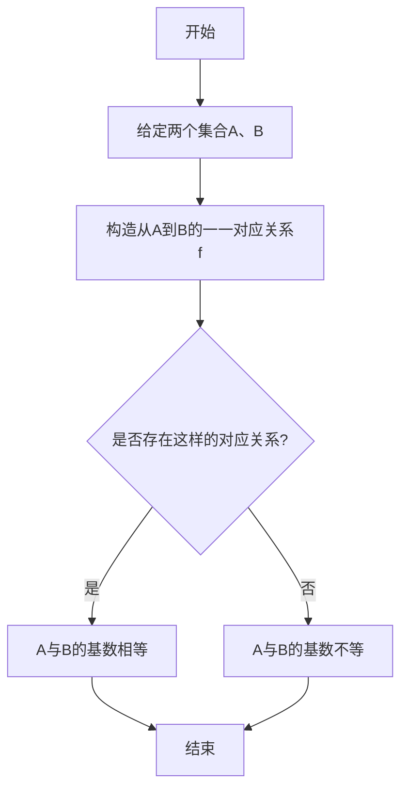

# 集合论导引：基数无穷和

## 1. 背景介绍

### 1.1 问题的由来

集合论是数学的一个基础分支,它研究集合及其相关概念和性质。集合论的发展源于对无穷概念的探索和理解。在19世纪末期,数学家们开始系统地研究无穷集合,并提出了基数的概念。基数是衡量集合"大小"的一种方式,它描述了集合中元素的"多少"。

基数的引入解决了长期以来数学家们对无穷集合"大小"的困惑。在此之前,人们普遍认为无穷集合都是"相等"的,因为它们都包含无限多个元素。然而,当对比自然数集合和实数集合时,人们发现实数集合"更大"。这种直观上的差异引发了对无穷集合"大小"的重新思考。

### 1.2 研究现状

基数理论的发展主要归功于Georg Cantor(乔治·坎托)。他提出了可数无穷和不可数无穷的概念,并证明了实数集合是不可数无穷的。这一发现彻底改变了人们对无穷的认知,并奠定了现代集合论的基础。

随后,数学家们对基数理论进行了深入研究,发现了更高层次的无穷基数,如$\aleph$数和不可测基数。这些发现不仅丰富了集合论本身,也为其他数学分支如拓扑学和逻辑学提供了重要工具。

### 1.3 研究意义

基数理论的研究对数学乃至整个科学发展具有重要意义:

1. **理论基础**: 基数理论为集合论奠定了坚实的理论基础,使其成为现代数学的核心支柱之一。
2. **无穷概念**: 基数理论深化了人类对无穷概念的理解,揭示了无穷存在多种"大小"。
3. **其他学科**: 基数理论为拓扑学、逻辑学等学科提供了重要工具,促进了这些领域的发展。
4. **计算机科学**: 基数理论在计算复杂性理论、形式语言等计算机科学领域有重要应用。

### 1.4 本文结构

本文将全面介绍集合论中基数无穷和的相关理论。首先阐述核心概念,然后深入探讨基数运算的原理和算法。接下来,我们将建立相关数学模型,并通过案例分析加深理解。此外,还将介绍基数理论在实际项目中的应用,以及相关工具和资源。最后,我们将总结研究成果,展望未来发展趋势和挑战。

## 2. 核心概念与联系

基数无穷和理论的核心概念包括:

1. **集合**:由具有某种特定性质的元素所组成的总体。
2. **基数**:衡量集合"大小"的一种方式,用来描述集合中元素的"多少"。
3. **可数无穷集**:能与自然数集建立一一对应关系的无穷集,基数记为$\aleph_0$。
4. **不可数无穷集**:不能与自然数集建立一一对应关系的无穷集,基数大于$\aleph_0$。
5. **基数运算**:对基数进行加、乘、幂等运算,得到新的基数。
6. **连续统假设**:断言实数集的基数是最小的不可数无穷基数,即$2^{\aleph_0}=\aleph_1$。

这些概念相互关联、相辅相成,构成了基数无穷和理论的基础框架。其中,基数运算是核心,它决定了无穷集合的"大小"排序,并衍生出更高层次的无穷基数。

## 3. 核心算法原理与具体操作步骤

### 3.1 算法原理概述

基数运算的核心算法原理是通过构造函数,建立集合之间的一一对应关系,从而比较或计算基数的"大小"。具体来说:

1. **加法原理**:若集合A、B之间存在一一对应关系,则A与B的基数相等。
2. **乘法原理**:若将集合A中每个元素与集合B中所有元素进行有序对运算,则所得新集合C的基数等于A的基数乘以B的基数。
3. **幂运算原理**:若将集合A的所有子集作为新集合B的元素,则B的基数等于2的A的基数次幂。

通过这些原理,我们可以推导出各种无穷集合的基数,并对它们进行比较和运算。

### 3.2 算法步骤详解

以下是基数加法算法的具体步骤:



1. 给定两个集合A和B。
2. 尝试构造从A到B的一一对应关系f:A→B。
3. 判断是否存在这样的对应关系f。
    - 若存在,则A与B的基数相等。
    - 若不存在,则A与B的基数不等。
4. 算法结束。

### 3.3 算法优缺点

**优点**:

1. 算法原理简单,易于理解和实现。
2. 可以有效比较和计算各种无穷集合的基数。
3. 为研究更高层次的无穷基数奠定了基础。

**缺点**:

1. 构造一一对应关系的过程有时会非常复杂。
2. 对于一些特殊情况,算法可能失效(如连续统假设)。
3. 算法无法解决所有关于基数的问题,存在一些无法确定的情况。

### 3.4 算法应用领域

基数运算算法在以下领域有广泛应用:

1. **集合论**:用于研究无穷集合的性质和关系。
2. **拓扑学**:用于分析拓扑空间的基数和维数。
3. **逻辑学**:用于研究逻辑语言的表达能力。
4. **计算复杂性理论**:用于分析算法的时间和空间复杂度。
5. **形式语言**:用于研究正则语言和上下文无关语言的表达能力。

## 4. 数学模型和公式详细讲解与举例说明

### 4.1 数学模型构建

为了形式化描述基数运算,我们需要构建相应的数学模型。首先引入基数的形式定义:

$$
\newcommand{\card}{\mathop{\rm card}}
\card(A) = \alpha
$$

其中$\card(A)$表示集合A的基数,$\alpha$是一个基数。

接下来定义基数的代数运算:

1. **加法**:
$$
\alpha + \beta = \min\{\gamma : \gamma \geq \alpha, \gamma \geq \beta\}
$$
即$\alpha$与$\beta$的最小上界。

2. **乘法**:
$$
\alpha \cdot \beta = \card(A \times B)
$$
其中$A \times B$是A与B的笛卡尔积集合。

3. **幂运算**:
$$
\alpha^\beta = \card(\mathcal{P}_\beta(A))
$$
其中$\mathcal{P}_\beta(A)$表示A的所有基数不超过$\beta$的子集的集合。

通过这些公理化定义,我们可以在形式化的基础上研究基数运算的性质。

### 4.2 公式推导过程

我们来推导一个重要公式:连续统假设。

首先,我们知道实数集R的基数大于自然数集N的基数,即:

$$
\card(R) > \card(N) = \aleph_0
$$

由于R是由N的所有无穷序列构成的,因此可以建立如下映射:

$$
f: N^\omega \rightarrow R \\
(a_1, a_2, a_3, \ldots) \mapsto \sum_{i=1}^\infty \frac{a_i}{10^i}
$$

其中$N^\omega$表示所有无穷序列的集合。可以证明,这个映射是一一对应的。

根据幂运算的定义,有:

$$
\card(N^\omega) = (\aleph_0)^{\aleph_0} = 2^{\aleph_0}
$$

由于$f$是一一对应关系,因此:

$$
\card(R) = \card(N^\omega) = 2^{\aleph_0}
$$

令$\aleph_1 = 2^{\aleph_0}$,我们得到了著名的连续统假设:

$$
\card(R) = \aleph_1
$$

这个假设断言实数集的基数是最小的不可数无穷基数。

### 4.3 案例分析与讲解

考虑一个具体的例子:比较自然数集N和偶数集E的基数。

首先,我们可以构造一个从N到E的一一对应关系:

$$
f: N \rightarrow E \\
n \mapsto 2n
$$

这是一个双射,因此N与E的基数相等,即:

$$
\card(N) = \card(E) = \aleph_0
$$

接下来,我们考虑N与有理数集Q的基数关系。由于Q中的每个有理数都可以用两个整数的比值表示,因此可以构造如下一一对应关系:

$$
g: N \times N \setminus \{(0, 0)\} \rightarrow Q \\
(m, n) \mapsto \frac{m}{n}
$$

根据乘法原理,有:

$$
\card(Q) = \card(N \times N \setminus \{(0, 0)\}) = \card(N) \cdot \card(N) = \aleph_0^2 = \aleph_0
$$

因此,有理数集Q也是一个可数无穷集。

通过这些例子,我们可以看到基数运算在具体问题中的应用,并加深对相关概念的理解。

### 4.4 常见问题解答

1. **为什么实数集是不可数无穷的?**

   实数集R不能与自然数集N建立一一对应关系。这是因为在构造这种对应关系的过程中,总会遗漏一些实数。著名的"对角线论证"就证明了这一点。

2. **基数加法为什么取最小上界?**

   基数加法的定义$\alpha + \beta = \min\{\gamma : \gamma \geq \alpha, \gamma \geq \beta\}$是为了保证运算的封闭性。如果取别的定义,可能会得到一个不是基数的值。取最小上界可以确保结果仍然是一个基数。

3. **幂运算为什么限制子集的基数不超过$\beta$?**

   如果不加这个限制,幂运算的结果可能会"爆炸",得到一个过大的基数。限制子集的基数不超过$\beta$可以确保结果仍然有意义。

4. **连续统假设是否一定成立?**

   连续统假设目前还无法被证明或证伪。它是当前集合论中一个著名的公理化假设,但并非必然成立。如果假设不成立,将会对基数理论产生深远影响。

## 5. 项目实践:代码实例和详细解释说明

为了更好地理解基数运算的原理,我们将通过编程实现一个基数计算器。这个项目将帮助读者将理论知识付诸实践,并加深对算法的理解。

### 5.1 开发环境搭建

我们将使用Python作为开发语言,因为它简洁易读,并且有丰富的数学库支持。

首先,确保您已经安装了Python(版本3.6或更高)。接下来,我们需要安装一些必要的库:

```bash
pip install sympy
```

SymPy是一个强大的符号计算库,它可以帮助我们处理数学表达式和公式。

### 5.2 源代码详细实现

```python
from sympy import Symbol, oo

class CardinalNumber:
    def __init__(self, value):
        self.value = value

    def __eq__(self, other):
        return self.value == other.value

    def __lt__(self, other):
        return self.value < other.value

    def __le__(self, other):
        return self.value <= other.value

    def __gt__(self, other):
        return self.value > other.value

    def __ge__(self, other):
        return self.value >= other.value

    def __add__(self, other):
        return CardinalNumber(max(self.value, other.value))

    def __mul__(self, other):
        if self.value == oo or other.value == oo:
            return CardinalNumber(oo)
        else:
            return CardinalNumber(self.value + other.value)

    def __pow__(self, other):
        if self.value == 0 and other.value == 0:
            return CardinalNumber(1)
        