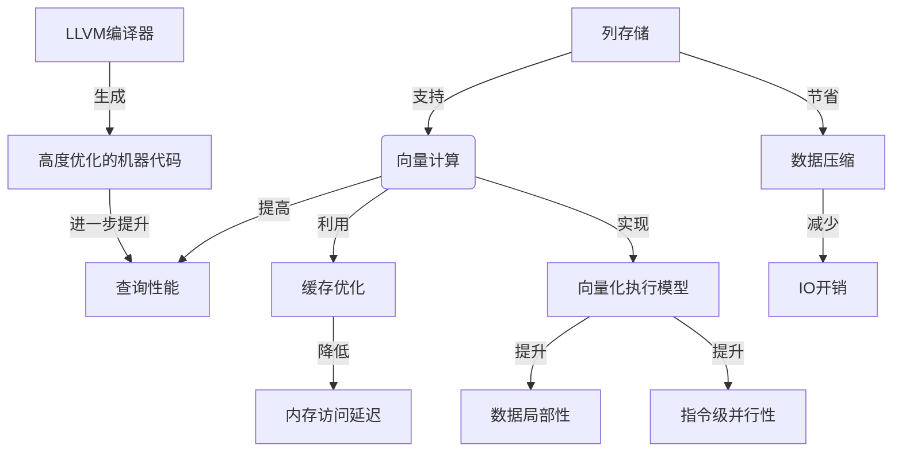

# 高性能向量数据库在科学研究中的角色

## 1. 背景介绍

### 1.1 问题的由来

在当今的数据密集型时代，科学研究领域正面临着海量数据的挑战。无论是天文学、基因组学、气候模拟还是粒子物理学等领域,都产生了大规模的数据集,这些数据集不仅体积庞大,而且结构复杂、维度高。传统的关系数据库系统由于其行存储结构和基于磁盘的架构,在处理这些大规模科学数据时往往效率低下,无法满足科研人员对高性能数据分析的迫切需求。

### 1.2 研究现状

为了应对这一挑战,近年来出现了一种新型数据库系统——向量数据库(Vector Database)。与传统的行存储相比,向量数据库采用列存储(Column-Oriented)的方式,能够更高效地处理分析型工作负载。此外,向量数据库还融合了多种创新技术,如向量计算、数据压缩、缓存优化等,从而在数据查询和分析方面展现出卓越的性能表现。

目前,一些知名的开源向量数据库系统已经问世,如Apache Arrow、Apache Parquet、ClickHouse等。这些系统已经在科学计算、物联网、金融分析等领域得到了广泛应用。然而,由于向量数据库仍属于一个相对新兴的领域,其在科学研究中的潜力和应用场景尚未被充分探索和挖掘。

### 1.3 研究意义

高性能向量数据库在科学研究中的应用具有重要意义:

1. **提高数据处理效率**:科学研究中产生的大规模数据集需要高效的数据管理和分析能力,向量数据库可以显著加快数据查询和处理速度,缩短科研人员的分析周期。

2. **支持复杂数据分析**:向量数据库通常支持向量运算和复杂的数据转换,能够满足科研领域中对高级分析功能的需求,如机器学习、统计建模等。

3. **促进跨学科协作**:许多科学研究项目需要来自不同领域的专家协作,向量数据库可以提供统一的数据平台,促进数据共享和协作分析。

4. **降低科研成本**:高性能的数据基础设施可以减少科研人员在数据管理和处理上的时间和精力投入,从而降低整体科研成本。

综上所述,探索向量数据库在科学研究中的应用潜力和最佳实践,对于推动科技创新和促进科研生产力具有重要意义。

### 1.4 本文结构

本文将全面探讨高性能向量数据库在科学研究中的角色和应用。首先介绍向量数据库的核心概念和基本原理,然后深入分析其核心算法和数学模型,并通过实际案例详细说明其在科研领域的应用场景。此外,本文还将分享相关的工具和学习资源,并对未来的发展趋势和挑战进行展望和讨论。

## 2. 核心概念与联系

向量数据库(Vector Database)是一种专门为分析型工作负载而设计的数据库系统。它的核心概念和关键技术包括:

1. **列存储(Column-Oriented Storage)**:与传统的行存储不同,向量数据库按列存储数据,这种存储方式能够更高效地处理分析型查询,如聚合、过滤和向量运算等。

2. **向量计算(Vectorized Processing)**:向量数据库利用现代CPU的SIMD(单指令多数据)指令集,将多个数据元素打包成向量进行并行计算,从而提高计算性能。

3. **数据压缩(Data Compression)**:为了节省存储空间和减少I/O开销,向量数据库通常采用高效的列式压缩算法,如Run-Length Encoding、Dictionary Encoding等。

4. **缓存优化(Cache-Conscious Processing)**:向量数据库的查询执行引擎经过精心优化,能够充分利用CPU缓存,减少内存访问延迟。

5. **向量化执行模型(Vectorized Execution Model)**:向量数据库采用基于向量的执行模型,将查询计划转换为一系列向量操作,从而实现高度的数据局部性和指令级并行性。

6. **LLVM编译器(LLVM Compiler)**:一些先进的向量数据库系统使用LLVM编译器技术,将查询计划在运行时编译为高度优化的机器代码,进一步提升查询性能。

这些核心概念和技术相互关联、相辅相成,共同构建了高性能向量数据库的基础架构。下面的Mermaid流程图展示了它们之间的关系:



通过这些创新技术的融合应用,向量数据库在处理分析型工作负载时展现出卓越的性能,成为科学研究中高效处理和分析大规模数据的重要工具。

## 3. 核心算法原理 & 具体操作步骤

### 3.1 算法原理概述

向量数据库的核心算法主要包括两个方面:列式存储和向量化查询执行。

**列式存储**

列式存储是向量数据库区别于传统行式存储的关键特征。在列式存储中,数据按列进行组织和存储,而不是按行。这种存储方式具有以下优势:

1. **高数据局部性**:由于同一列中的数据值通常具有相似的数据分布特征,因此可以更高效地进行压缩和向量化计算。

2. **减少I/O开销**:分析型查询通常只需要访问部分列,列式存储可以避免读取不需要的列数据,从而减少I/O开销。

3. **支持向量化执行**:列式存储为向量化执行提供了天然的支持,因为同一列中的数据可以被视为一个向量进行并行计算。

**向量化查询执行**

向量化查询执行是向量数据库提升查询性能的另一个关键技术。它的核心思想是将查询计划转换为一系列向量操作,并利用现代CPU的SIMD指令集对这些向量操作进行并行计算。具体来说,它包括以下几个步骤:

1. **查询计划向量化**:将查询计划中的各个操作符(如扫描、过滤、聚合等)转换为相应的向量操作。

2. **数据向量化**:从列式存储中读取数据,并将其转换为向量形式,以便进行向量计算。

3. **向量运算**:利用CPU的SIMD指令集对向量数据执行并行计算,如向量加法、向量乘法等。

4. **结果收集**:将向量计算的结果收集和组合,形成最终的查询结果。

通过这种向量化执行模型,向量数据库能够充分利用现代CPU的并行计算能力,显著提升查询性能。

### 3.2 算法步骤详解

为了更好地理解向量数据库的核心算法原理,我们将以一个简单的SELECT查询为例,详细解释其执行过程。假设我们有一个存储天文观测数据的表`astronomical_observations`,其中包含以下几列:

- `id`: 观测记录的唯一标识符
- `ra`: 右ascension(赤经)
- `dec`: declination(赤纬)
- `redshift`: 红移值
- `magnitude`: 视星等

我们想要查询红移值(`redshift`)大于0.5且视星等(`magnitude`)小于20的所有观测记录的右ascension和declination。SQL查询语句如下:

```sql
SELECT ra, dec 
FROM astronomical_observations
WHERE redshift > 0.5 AND magnitude < 20;
```

在向量数据库中,该查询的执行步骤如下:

1. **查询计划向量化**:查询优化器将查询计划转换为一系列向量操作,包括列扫描、向量过滤和投影(选择列)等。

2. **数据向量化**:从列式存储中读取`redshift`、`magnitude`、`ra`和`dec`列的数据,并将它们转换为向量形式,例如`redshift_vec`、`magnitude_vec`、`ra_vec`和`dec_vec`。

3. **向量过滤**:利用SIMD指令集,对`redshift_vec`和`magnitude_vec`进行并行过滤,生成一个掩码向量`mask_vec`。`mask_vec`中的每个元素表示对应的数据行是否满足过滤条件。

   ```c++
   mask_vec = (redshift_vec > 0.5) & (magnitude_vec < 20);
   ```

4. **向量投影**:根据`mask_vec`,从`ra_vec`和`dec_vec`中选择满足条件的元素,形成最终的结果向量`result_ra_vec`和`result_dec_vec`。

   ```c++
   result_ra_vec = ra_vec[mask_vec];
   result_dec_vec = dec_vec[mask_vec];
   ```

5. **结果收集**:将`result_ra_vec`和`result_dec_vec`中的数据收集并返回给客户端。

通过这种向量化执行模型,向量数据库能够充分利用CPU的并行计算能力,大大提高了查询性能。同时,由于列式存储和数据压缩技术,I/O开销也得到了显著降低。

### 3.3 算法优缺点

向量数据库的核心算法具有以下优点:

1. **高度并行化**:利用SIMD指令集对向量数据进行并行计算,能够充分发挥现代CPU的计算能力。

2. **高数据局部性**:列式存储和向量化执行模型能够提高数据局部性,减少CPU缓存未命中,从而提升内存访问效率。

3. **减少I/O开销**:列式存储和数据压缩技术可以显著降低I/O开销,特别是对于只需访问部分列的分析型查询。

4. **支持复杂分析**:向量数据库通常支持向量运算和复杂的数据转换,能够满足科研领域中对高级分析功能的需求。

然而,向量数据库的算法也存在一些潜在的缺点和限制:

1. **写入性能较差**:由于列式存储的特性,向量数据库在处理写入操作时往往效率较低,不太适合写密集型工作负载。

2. **更新开销较大**:对于已有数据的更新操作,向量数据库通常需要重新写入整个列,开销较大。

3. **查询复杂度限制**:虽然支持复杂分析,但是对于非常复杂的查询,向量化执行可能会受到一定限制,无法完全发挥优势。

4. **硬件依赖性**:向量数据库的性能优化在很大程度上依赖于硬件的SIMD指令集支持,不同硬件平台的性能表现可能存在差异。

### 3.4 算法应用领域

由于其卓越的查询性能和对复杂分析的支持,向量数据库在以下领域具有广泛的应用前景:

1. **科学计算**:天文学、基因组学、气候模拟等领域产生了大量的科学数据,向量数据库可以高效地存储和分析这些数据。

2. **物联网(IoT)数据分析**:物联网设备会持续产生海量的时序数据,向量数据库能够快速地对这些数据进行实时分析和建模。

3. **金融分析**:金融行业需要对大量的交易数据和市场数据进行复杂的分析和风险建模,向量数据库可以提供高性能的数据处理能力。

4. **网络安全分析**:网络流量数据和安全日志数据的分析对于检测和防御网络攻击至关重要,向量数据库可以支持这些分析任务。

5. **商业智能(BI)和数据仓库**:向量数据库可以作为数据仓库的高性能分析层,加速商业智能和决策支持系统中的数据查询和分析。

总的来说,任何需要对大规模数据进行快速分析和复杂建模的领域,都可以从向量数据库的高性能和分析能力中获益。

## 4. 数学模型和公式 &