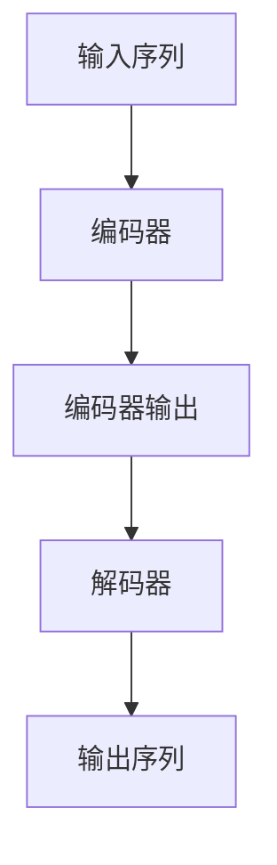

# AI LLM 大型语言模型不只是预测下一个token

## 1. 背景介绍

### 1.1 问题的由来

自然语言处理(NLP)是人工智能领域的一个重要分支,旨在使计算机能够理解和生成人类语言。传统的NLP系统主要依赖于规则、统计模型和特征工程,需要大量的人工设计和领域知识。然而,近年来,预训练语言模型(PLM)的出现彻底改变了这一格局。

预训练语言模型通过在大规模无标注语料库上进行自监督学习,学习语言的通用表示,然后在下游任务上进行微调,取得了令人瞩目的成绩。尤其是大型语言模型(LLM),如GPT-3、PaLM、ChatGPT等,展现出了惊人的语言理解和生成能力,在多个NLP任务上超过了人类水平。

然而,这些模型的内在机理并不完全清晰,它们是如何获得这种强大的语言能力的?它们真的"理解"语言了吗?还是只是在高度拟合训练数据?此外,这些模型存在着一些明显的缺陷,如产生不一致、不合理或有偏见的输出。因此,深入探究大型语言模型的本质,揭示其工作原理和局限性,对于更好地利用和发展这一技术至关重要。

### 1.2 研究现状

目前,对于大型语言模型的研究主要集中在以下几个方面:

1. **模型架构**:探索不同的模型架构,如Transformer、Sparse Transformer等,以提高模型的计算效率和扩展性。

2. **训练策略**:研究有效的预训练目标和训练策略,如自回归语言模型(Causal LM)、蒸馏(Distillation)、对比学习(Contrastive Learning)等,以提高模型的泛化能力。

3. **解释性**:通过可视化注意力(Attention)、语义探索(Semantic Probing)等方法,试图解释模型内部的表示和决策过程。

4. **鲁棒性**:研究模型对于adversarial example、出现distribution shift等情况的鲁棒性,并提出相应的缓解措施。

5. **知识注入**:通过知识蒸馏、前馈注入(Prefix Tuning)等方式,将外部知识注入到语言模型中,以增强其推理和常识推理能力。

6. **多模态**:探索将视觉、音频等其他模态信息融入语言模型,发展多模态大型语言模型。

7. **评估**:设计更加全面和客观的评估指标,评估模型在不同任务和场景下的表现。

8. **应用**:探索大型语言模型在机器翻译、问答系统、对话系统、写作辅助等领域的应用。

然而,现有研究还存在一些不足,如缺乏对模型内在机理的深入理解、评估指标的局限性、模型的不确定性和偏差等,需要进一步的探索和突破。

### 1.3 研究意义

深入研究大型语言模型的本质和工作机制,具有重要的理论意义和应用价值:

1. **理论意义**:有助于我们更好地理解人类语言的本质特征,揭示语言获取和理解的认知过程,推动人工智能、认知科学等学科的发展。

2. **应用价值**:语言是人类获取和交换信息的主要载体,大型语言模型的进步将极大推动自然语言处理技术的发展,促进人机交互、知识获取、内容生成等领域的创新应用。

3. **社会影响**:语言技术的进步将深刻影响人类的生活、工作和学习方式,但也可能带来潜在的风险和挑战,如信息操纵、隐私泄露等,需要我们高度重视并采取相应的治理措施。

总之,深入探索大型语言模型的奥秘,不仅是人工智能领域的前沿课题,也是一个具有重大意义的跨学科研究方向。

### 1.4 本文结构

本文将从以下几个方面深入探讨大型语言模型的本质和工作机制:

1. 核心概念与联系
2. 核心算法原理与具体操作步骤
3. 数学模型和公式推导
4. 项目实践:代码实例和详细解释
5. 实际应用场景
6. 工具和资源推荐
7. 总结:未来发展趋势与挑战

通过全面、深入的分析和讨论,旨在为读者提供对大型语言模型的深刻理解,并展望其未来的发展方向和挑战。

## 2. 核心概念与联系

要理解大型语言模型的本质,我们需要先了解一些核心概念及其内在联系。

### 2.1 自然语言处理(NLP)

自然语言处理(Natural Language Processing, NLP)是人工智能领域的一个分支,旨在使计算机能够理解和生成人类语言。NLP涉及多个子领域,包括词法分析、句法分析、语义分析、discourse分析、自动摘要、机器翻译、问答系统、对话系统等。

NLP的核心挑战在于自然语言的高度复杂性和多义性。语言不仅包含词汇和语法规则,还蕴含着丰富的语义、语用和背景知识。因此,NLP需要综合利用多种技术,如统计建模、规则系统、知识库等,来捕捉语言的多层次结构和内涵。

### 2.2 语言模型(Language Model)

语言模型是NLP中的一个基础模块,旨在为给定的文本序列估计概率。形式上,语言模型可以表示为:

$$P(w_1, w_2, ..., w_n) = \prod_{i=1}^{n}P(w_i|w_1, ..., w_{i-1})$$

其中$w_i$表示第i个token(词或子词)。语言模型的目标是估计在给定历史上下文$w_1, ..., w_{i-1}$的条件下,下一个token $w_i$出现的概率$P(w_i|w_1, ..., w_{i-1})$。

语言模型广泛应用于多个NLP任务,如机器翻译、语音识别、写作辅助等,为这些任务提供了基础的语言建模能力。

### 2.3 自编码器(Autoencoder)

自编码器是一种无监督学习模型,通过重构输入数据来学习其潜在表示。自编码器由两部分组成:编码器(Encoder)和解码器(Decoder)。编码器将输入数据映射到潜在表示空间,解码器则试图从该潜在表示重构原始输入。

自编码器的目标是最小化输入数据与重构数据之间的差异,从而学习输入数据的紧凑表示。自编码器可以用于降维、去噪、数据压缩等任务,也可以作为预训练的方式,为下游任务提供有用的初始化权重。

### 2.4 自注意力机制(Self-Attention)

自注意力机制是Transformer模型的核心组件,它允许模型捕捉输入序列中任意两个位置之间的依赖关系。与RNN等序列模型不同,自注意力机制不需要按顺序处理序列,而是通过计算每个位置与所有其他位置的注意力权重来建模长程依赖。

自注意力机制极大地提高了并行计算能力,也使得模型能够更好地捕捉全局信息,因此被广泛应用于大型语言模型和多模态模型中。

### 2.5 迁移学习(Transfer Learning)

迁移学习指的是将在源领域学习到的知识迁移到目标领域的过程。在NLP中,迁移学习通常体现为预训练与微调(Pre-training and Fine-tuning)范式。

首先,在大规模无标注语料库上预训练一个通用的语言模型,使其学习到语言的基本知识和规律。然后,将该预训练模型在特定的下游任务上进行微调,使其适应任务的特殊需求。

迁移学习使模型能够从大量无标注数据中学习通用知识,从而在下游任务上取得更好的表现,同时大幅减少了标注数据的需求。这种范式在大型语言模型的发展中扮演着关键作用。

### 2.6 大型语言模型(LLM)

大型语言模型(Large Language Model, LLM)指具有数十亿甚至上万亿参数的巨型语言模型,如GPT-3、PaLM、ChatGPT等。这些模型通过在海量文本数据上预训练,学习到了丰富的语言知识,展现出了惊人的语言理解和生成能力。

大型语言模型的出现,极大地推动了NLP技术的发展,使得人机交互、内容生成、知识获取等应用成为可能。但同时,这些模型也存在一些明显的缺陷,如产生不一致、不合理或有偏见的输出,缺乏对语义的真正理解等,仍需要进一步的研究和完善。

### 2.7 多模态(Multimodal)

多模态指的是将不同模态(如文本、图像、视频、音频等)的信息融合到同一个模型中进行建模和推理。多模态模型能够更好地捕捉和利用不同模态之间的相关性,从而提高模型的表现。

随着视觉语言预训练(VLP)等技术的发展,多模态大型语言模型(如Flamingo、Kosmos-1等)开始崭露头角,展现出了强大的跨模态理解和生成能力,为多模态人机交互、多模态内容生成等应用铺平了道路。

这些核心概念密切相关,共同构成了大型语言模型的理论基础和技术支撑。下面我们将深入探讨大型语言模型的核心算法原理和工作机制。

## 3. 核心算法原理 & 具体操作步骤

### 3.1 算法原理概述

大型语言模型的核心算法原理可以概括为:基于Transformer的自注意力架构,通过自回归语言模型(Causal LM)的预训练目标,在海量文本数据上进行自监督学习,获得通用的语言表示能力。

具体来说,主要包括以下几个关键环节:

1. **模型架构**:采用Transformer的编码器-解码器架构,其中编码器用于捕捉输入序列的表示,解码器则根据编码器的输出生成目标序列。自注意力机制允许模型捕捉长程依赖关系,提高了并行计算能力。

2. **预训练目标**:自回归语言模型(Causal LM)是大型语言模型预训练的主要目标,即最大化给定历史上下文的条件下,预测正确的下一个token的概率。这种无监督的目标使模型能够从大规模无标注语料中学习语言的统计规律。

3. **预训练过程**:在海量文本数据(如网页、书籍、论文等)上进行自监督预训练,使用自回归语言模型目标和掩码语言模型(Masked LM)等辅助目标,迭代优化模型参数。预训练过程通常需要消耗大量的计算资源。

4. **微调阶段**:将预训练模型在特定的下游任务上进行微调,使其适应任务的特殊需求。微调过程相对高效,只需少量的标注数据。

5. **生成过程**:在推理阶段,给定一个起始序列(如问题或上文),模型根据自回归语言模型的概率分布,自回归地生成下一个token,直至生成完整的序列(如答案或续写内容)。

通过上述过程,大型语言模型学习到了通用的语言表示,并获得了强大的语言理解和生成能力,可以应用于多种NLP任务。下面我们将详细解释这一算法的具体步骤。

### 3.2 算法步骤详解

1. **模型架构**

大型语言模型通常采用Transformer的编码器-解码器架构,如下图所示:

编码器将输入序列(如问题)映射到一个连续的表示空间,解码器则根据该表示自回归地生成输出序列(如答案)。

编码器和解码器内部都由多个相同的层组成,每一层包含以下几个主要子层:

- 多头自注意力(Multi-Head Self-Attention)
- 前馈神经网络(Feed-Forward Neural Network