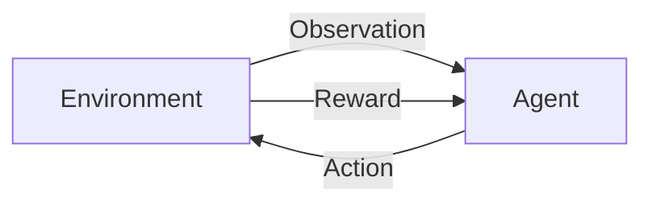

# AI人工智能 Agent：智能体的动作选择策略

## 1. 背景介绍

### 1.1 问题的由来

在人工智能领域中,智能体(Agent)是一个关键概念。智能体是指能够感知环境,并根据感知信息做出决策和采取行动的自主系统。智能体的核心挑战之一是如何选择合适的动作,以达成特定目标。这个问题被称为"动作选择问题"(Action Selection Problem)。

动作选择问题源于智能体需要在复杂、动态和不确定的环境中做出决策。智能体需要权衡各种因素,如当前状态、可用资源、目标优先级等,并选择最佳动作以最大化预期收益或最小化预期成本。这个过程涉及感知、决策和执行,是智能体展现智能行为的关键。

### 1.2 研究现状

动作选择问题一直是人工智能研究的核心课题之一。早期的研究主要集中在经典规划算法、有限状态机和行为树等方法上。近年来,随着机器学习和深度学习技术的快速发展,基于强化学习的动作选择方法也受到广泛关注。

目前,常见的动作选择策略包括:

- **规则基础系统**(Rule-Based Systems):根据预定义的规则集合进行决策。
- **实用函数方法**(Utility Functions):根据评估动作效用的函数值选择动作。
- **决策理论方法**(Decision Theory Methods):基于概率模型和期望效用理论进行决策。
- **机器学习方法**(Machine Learning Methods):利用数据训练模型,学习动作选择策略。
- **强化学习方法**(Reinforcement Learning Methods):通过与环境交互,学习获取最大化奖励的策略。

### 1.3 研究意义

合理的动作选择策略对于构建高效、鲁棒的智能系统至关重要。优秀的动作选择能力可以帮助智能体:

1. **提高决策质量**:选择最优动作,实现预期目标。
2. **适应环境变化**:根据环境动态调整决策策略。 
3. **高效利用资源**:权衡成本和收益,合理分配资源。
4. **展现智能行为**:模拟人类决策过程,体现人工智能。

因此,研究动作选择问题对于推动人工智能技术发展、提高智能系统性能、扩展应用场景等方面都具有重要意义。

### 1.4 本文结构  

本文将全面介绍智能体动作选择策略的相关理论和实践。主要内容包括:

1. 核心概念与联系
2. 核心算法原理与具体操作步骤  
3. 数学模型和公式推导
4. 项目实践:代码实例和详细解释
5. 实际应用场景分析
6. 工具和资源推荐
7. 未来发展趋势与挑战总结

## 2. 核心概念与联系

在探讨动作选择策略之前,我们需要理解以下几个核心概念:

1. **智能体(Agent)**: 能够感知环境、做出决策并采取行动的自主系统。
2. **环境(Environment)**: 智能体所处的外部世界,包括状态和动态变化。
3. **状态(State)**: 描述环境当前情况的一组观测值。
4. **动作(Action)**: 智能体可执行的操作,用于影响环境状态。
5. **奖励(Reward)**: 衡量智能体行为是否符合目标的反馈信号。
6. **策略(Policy)**: 智能体根据当前状态选择动作的规则或函数映射。

这些概念之间的关系如下:

智能体根据对环境的观测,选择合适的动作执行。环境根据智能体的动作转移到新状态,并给出相应的奖励反馈。智能体的目标是学习一个最优策略,在环境中获得最大化的累积奖励。

动作选择策略决定了智能体如何根据当前状态选择动作。不同的策略可能会产生不同的行为和决策结果。因此,设计合理的动作选择策略对于构建高效智能体至关重要。

## 3. 核心算法原理 & 具体操作步骤

### 3.1 算法原理概述

智能体动作选择策略通常可分为两大类:

1. **基于模型的方法**(Model-Based Methods)
2. **无模型方法**(Model-Free Methods)

**基于模型的方法**假设智能体已经了解环境的转移模型(状态转移概率)和奖励模型。在此基础上,智能体可以通过规划或者搜索等方式,推导出在当前状态下执行每个可能动作所能获得的预期累积奖励,并选择具有最大预期奖励的动作。

**无模型方法**则不假设已知环境模型,而是通过与环境交互并学习从经验数据中获取最优策略。其中,强化学习是一种常用的无模型方法,可以通过试错和调整策略参数,逐步优化动作选择策略。

无论采用何种方法,动作选择策略的目标都是找到一个最优策略π*,使得在该策略指导下,智能体能够获得最大化的预期累积奖励。数学上可以表示为:

$$
\pi^* = \arg\max_\pi \mathbb{E}\left[\sum_{t=0}^\infty \gamma^t r_t | \pi\right]
$$

其中,γ是折现因子,用于权衡即时奖励和长期奖励的重要性。

接下来,我们将介绍几种常见的动作选择算法,包括它们的原理、优缺点和适用场景。

### 3.2 算法步骤详解

#### 3.2.1 值函数方法(Value Function Methods)

值函数方法是基于模型的一种动作选择策略,其核心思想是估计每个状态或状态-动作对的长期价值(累积奖励),并选择能够最大化该值的动作。

**算法步骤**:

1. 对于给定的环境模型(状态转移概率和奖励函数),定义状态值函数 V(s) 或状态-动作值函数 Q(s,a)。
2. 使用动态规划方法(如价值迭代或策略迭代)求解最优值函数 V*(s) 或 Q*(s,a)。
3. 根据最优值函数,选择在当前状态 s 下能够最大化 V*(s) 或 Q*(s,a) 的动作 a。

其中,状态值函数 V(s) 表示在状态 s 下遵循策略 π 所能获得的预期累积奖励:

$$
V^\pi(s) = \mathbb{E}_\pi\left[\sum_{t=0}^\infty \gamma^t r_t | s_0=s\right]
$$

状态-动作值函数 Q(s,a) 表示在状态 s 下执行动作 a,之后遵循策略 π 所能获得的预期累积奖励:

$$
Q^\pi(s,a) = \mathbb{E}_\pi\left[\sum_{t=0}^\infty \gamma^t r_t | s_0=s, a_0=a\right]
$$

求解最优值函数的常用方法包括价值迭代和策略迭代等动态规划算法。

**优缺点**:

- 优点:有理论保证能够找到最优策略;适用于完全可观测、确定性环境。
- 缺点:需要事先知道环境模型;在大规模状态空间下计算代价高。

**适用场景**:离散、确定性环境;小规模问题;已知环境模型。

#### 3.2.2 策略搜索方法(Policy Search Methods)

策略搜索方法属于无模型方法,直接在策略空间中搜索,试图找到能够最大化预期累积奖励的最优策略。常见的策略搜索算法包括遗传算法、交叉熵方法等。

**算法步骤**:

1. 参数化策略 π(a|s;θ),其中 θ 为策略参数。
2. 定义目标函数 J(θ),表示在策略 π 指导下的预期累积奖励。
3. 使用策略优化算法(如梯度上升、进化策略等)在策略空间中搜索,找到能够最大化 J(θ) 的最优参数 θ*。
4. 根据最优策略 π(a|s;θ*) 选择动作。

目标函数 J(θ) 通常定义为:

$$
J(\theta) = \mathbb{E}_{\pi_\theta}\left[\sum_{t=0}^\infty \gamma^t r_t\right]
$$

策略优化算法的目标是找到能够最大化 J(θ) 的参数 θ*:

$$
\theta^* = \arg\max_\theta J(\theta)
$$

**优缺点**:

- 优点:无需事先了解环境模型;可直接在策略空间中搜索;适用于连续动作空间。
- 缺点:无法保证收敛到全局最优;存在局部最优陷阱;收敛速度较慢。

**适用场景**:连续动作空间;无法获取环境模型;大规模复杂问题。

#### 3.2.3 Q-Learning

Q-Learning 是一种常用的基于价值函数的强化学习算法,可以在线更新状态-动作值函数,无需事先知道环境模型。

**算法步骤**:

1. 初始化 Q(s,a) 表格,所有状态-动作对的值设为任意值(如 0)。
2. 对于每个状态-动作对 (s,a):
    - 执行动作 a,观测奖励 r 和下一状态 s'
    - 更新 Q(s,a) 的估计值:
        
        $$Q(s,a) \leftarrow Q(s,a) + \alpha\left[r + \gamma\max_{a'}Q(s',a') - Q(s,a)\right]$$
        
        其中,α 为学习率,γ 为折现因子。
3. 重复步骤 2,直到 Q 值收敛。
4. 根据收敛后的 Q 表,选择在当前状态 s 下能够最大化 Q(s,a) 的动作 a。

Q-Learning 算法的关键在于通过探索和利用的方式,逐步更新 Q 表,使得 Q(s,a) 逼近最优 Q* 值。

**优缺点**:

- 优点:无需事先知道环境模型;可在线学习;理论收敛性保证。
- 缺点:收敛速度较慢;存在维数灾难问题(状态-动作空间过大)。

**适用场景**:离散状态-动作空间;在线学习环境模型;中小规模问题。

#### 3.2.4 策略梯度算法(Policy Gradient Methods)

策略梯度方法是一种常用的基于策略搜索的强化学习算法,通过计算累积奖励的梯度来更新策略参数。

**算法步骤**:

1. 参数化策略 π(a|s;θ),其中 θ 为可学习的策略参数。
2. 采样生成一批状态-动作-奖励序列 {(s_t,a_t,r_t)}。
3. 计算累积奖励的期望梯度:
    
    $$\nabla_\theta J(\theta) \approx \frac{1}{N}\sum_{i=1}^N\left(\sum_{t=0}^\infty\gamma^tr_t^{(i)}\right)\nabla_\theta\log\pi(a_t^{(i)}|s_t^{(i)};\theta)$$

4. 使用梯度上升法更新策略参数:
    
    $$\theta \leftarrow \theta + \alpha\nabla_\theta J(\theta)$$
    
    其中,α 为学习率。
5. 重复步骤 2-4,直到策略收敛。
6. 根据最终策略 π(a|s;θ) 选择动作。

策略梯度方法直接在策略空间中搜索,通过最大化累积奖励的期望来学习最优策略。

**优缺点**:

- 优点:可直接优化策略;适用于连续动作空间;无需学习值函数。
- 缺点:梯度估计存在高方差;收敛慢;需要大量样本。

**适用场景**:连续状态-动作空间;大规模复杂问题;无法获取环境模型。

#### 3.2.5 Actor-Critic 算法

Actor-Critic 算法是一种结合了价值函数方法和策略搜索方法的强化学习算法,由两个模块组成:Actor(行为模块)和Critic(评估模块)。

**算法步骤**:

1. Actor: 参数化策略 π(a|s;θ),用于选择动作。
2. Critic: 学习状态值函数 