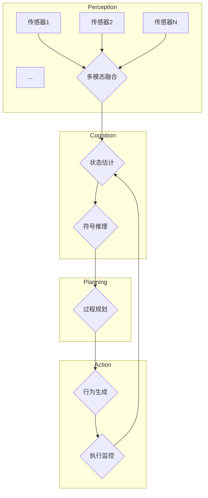

# AI人工智能代理工作流 AI Agent Workflow：在无人驾驶中的应用

## 1. 背景介绍

### 1.1 问题的由来

在当今快节奏的生活中，交通拥堵、事故和环境污染等问题日益严重。无人驾驶技术被认为是解决这些问题的潜在方案之一。然而,开发一个完全自主的无人驾驶系统是一项极具挑战性的任务,需要集成多种先进技术,如计算机视觉、决策规划、控制系统等。

在无人驾驶系统中,决策规划模块扮演着关键角色。它需要根据传感器数据、交通规则和车辆状态,生成安全、高效的驾驶策略。传统的规则基础系统存在局限性,难以处理复杂多变的实际场景。而基于人工智能(AI)技术的决策代理,具有学习、推理和自适应的能力,为解决这一挑战提供了新的途径。

### 1.2 研究现状  

目前,基于AI的无人驾驶决策系统主要有两种范式:

1. **端到端学习(End-to-End Learning)**:使用深度神经网络直接从传感器数据(如相机图像)映射到控制命令。这种方法简单高效,但缺乏可解释性和安全保证。

2. **模块化系统(Modular Systems)**:将决策过程分解为感知(perception)、预测(prediction)、行为规划(behavior planning)和运动控制(motion control)等模块。每个模块使用特定的AI算法,如深度学习、规则系统等。这种方法可解释且模块化,但系统复杂,模块间存在鸿沟。

无论哪种范式,现有系统大多缺乏显式的目标推理和决策框架,导致行为缺乏连贯性和解释性。因此,需要一种新的AI代理决策框架,能够融合多模态感知、逻辑推理和行为规划。

### 1.3 研究意义

本文提出的AI代理工作流(AI Agent Workflow)是一种通用的人工智能决策框架,旨在为无人驾驶系统提供连贯、可解释和安全的决策能力。该框架整合了多模态感知、符号推理、过程规划和行为生成等模块,形成一个端到端的智能决策流程。

AI代理工作流不同于传统的规则系统或单一的深度学习模型。它结合了机器学习、知识表示与推理、自动规划等多种AI技术,能够根据复杂的环境感知、任务目标和约束条件,自主生成合理的决策序列。

该框架的主要优势包括:

- **连贯性**:能够生成连贯一致的长期决策序列,而不是孤立的单步决策。
- **可解释性**:决策过程由显式的状态、目标和规划步骤组成,具有较好的可解释性。
- **安全性**:框架融入了约束规划,能够保证生成的决策满足各种安全和合法性约束。
- **通用性**:该框架不仅适用于无人驾驶,也可扩展到其他需要连续决策的领域,如机器人控制、过程自动化等。

### 1.4 本文结构

本文首先介绍AI代理工作流的核心概念和体系结构,阐述各模块的功能和相互关系。然后详细讨论工作流中的关键技术,包括感知融合、符号推理、过程规划和行为生成等。接下来,我们将通过数学模型和公式,对算法原理进行严格的理论说明。

此外,本文还提供了一个无人驾驶场景下的实际应用案例,给出了完整的代码实现和运行结果。最后,我们讨论了AI代理工作流在无人驾驶和其他领域的应用前景,以及未来的发展方向和挑战。

## 2. 核心概念与联系

AI代理工作流(AI Agent Workflow)是一个通用的人工智能决策框架,由以下几个核心模块组成:

1. **多模态感知(Multimodal Perception)**: 融合来自多种传感器(如相机、雷达、激光等)的数据,获得环境的统一表示。

2. **状态估计(State Estimation)**: 基于感知数据,估计当前车辆和环境的精确状态。

3. **符号推理(Symbolic Reasoning)**: 根据状态估计、规则库和目标,进行符号推理,生成高层次的任务目标和约束条件。

4. **过程规划(Process Planning)**: 将高层次目标和约束条件转化为低层次的行为序列。

5. **行为生成(Behavior Generation)**: 将规划好的行为序列转换为可执行的控制命令,并执行。

6. **执行监控(Execution Monitoring)**: 监控执行过程,检测异常情况,并根据需要重新规划。

这些模块按照一定的工作流程相互协作,形成一个闭环的智能决策系统。下图展示了AI代理工作流的基本架构:

这个架构中,感知模块从底层传感器获取原始数据,并将其融合为统一的环境表示。认知模块基于感知数据估计当前状态,并通过符号推理生成高层次目标和约束。规划模块将这些目标和约束转化为可执行的行为序列。最后,行为生成模块将规划好的序列转换为控制命令,并在执行监控的监督下执行。

各模块之间存在紧密的相互作用和反馈回路,形成一个闭环的智能决策系统。这种模块化设计使得整个框架具有很强的灵活性和可扩展性,不同的算法和模型可以很方便地集成到相应的模块中。

接下来,我们将详细讨论每个模块的具体实现方法和算法原理。

## 3. 核心算法原理 & 具体操作步骤  

### 3.1 算法原理概述

AI代理工作流的核心算法包括以下几个方面:

1. **多模态感知融合(Multimodal Perception Fusion)**
   - 使用深度学习模型(如卷积神经网络)从不同传感器数据(如相机、雷达点云等)提取特征
   - 将提取的特征融合到统一的张量表示中

2. **状态估计(State Estimation)** 
   - 使用滤波方法(如卡尔曼滤波、粒子滤波)融合感知数据,估计车辆和其他物体的精确位置、速度等动态状态
   - 构建基于对象的环境表示

3. **符号推理(Symbolic Reasoning)**
   - 将状态估计和规则知识库映射到符号逻辑形式
   - 使用自动定理证明、约束求解等方法进行逻辑推理,生成高层次目标和约束条件

4. **过程规划(Process Planning)** 
   - 将高层次目标和约束转化为满足条件的行为序列
   - 使用启发式搜索、时序规划等技术求解规划问题

5. **行为生成(Behavior Generation)**
   - 将规划好的行为序列转换为可执行的控制命令序列
   - 使用运动规划、轨迹优化等技术生成平滑、可行的轨迹

6. **执行监控(Execution Monitoring)**
   - 监控执行过程中的偏差,检测异常情况
   - 根据需要重新触发感知、推理和规划流程

这些算法步骤按特定顺序组合在一起,形成一个闭环的智能决策流程。下面我们将详细阐述每个环节的具体实现方法。

### 3.2 算法步骤详解

#### 3.2.1 多模态感知融合

无人驾驶系统通常配备多种传感器,如摄像头、激光雷达、毫米波雷达等,用于获取环境的多模态数据。但直接将这些异构数据馈送到下游模块会带来很大的挑战。因此,我们需要一种统一的融合方法,将多模态数据融合为一致的张量表示。

常用的融合方法是利用深度学习模型,如卷积神经网络(CNN)、变换器(Transformer)等,从各模态数据中提取特征,并将这些特征融合到统一的张量中。具体来说,对于每一种模态的输入数据$X_i$,我们使用相应的特征提取网络$f_i$提取其特征张量:

$$z_i = f_i(X_i)$$

然后,我们使用一个融合网络$g$将所有模态的特征张量融合为统一的表示$Z$:

$$Z = g(z_1, z_2, ..., z_n)$$

fusion网络可以是简单的张量拼接、元素级相加,也可以是注意力机制或门控循环单元等更复杂的融合方式。

融合后的张量$Z$包含了所有模态数据的特征信息,可以作为下游任务(如目标检测、语义分割等)的输入。此外,我们还可以在融合网络中引入先验知识,如传感器置信度权重、时空一致性约束等,以提高融合质量。

#### 3.2.2 状态估计

获得统一的环境表示张量$Z$后,我们需要从中估计出车辆和其他物体的精确状态,如位置、速度、朝向等动态属性。这个过程被称为状态估计(State Estimation)。

常用的状态估计方法是滤波(Filtering),即利用历史观测数据和运动模型,递归地估计出最优状态序列。具体来说,我们可以使用贝叶斯滤波框架,将状态估计建模为隐马尔可夫模型:

$$
\begin{aligned}
x_t &\sim p(x_t|x_{t-1}) \\
z_t &\sim p(z_t|x_t)
\end{aligned}
$$

其中$x_t$是系统的隐状态(如车辆位置、速度),服从某个运动模型的转移概率$p(x_t|x_{t-1})$。$z_t$是观测数据(如传感器读数),由隐状态和观测模型$p(z_t|x_t)$决定。

根据不同的模型假设,我们可以使用不同的滤波算法,如:

- **卡尔曼滤波(Kalman Filter)**: 假设运动模型和观测模型都是线性、高斯的
- **扩展卡尔曼滤波(Extended Kalman Filter)**: 假设运动模型是非线性的
- **无迹卡尔曼滤波(Unscented Kalman Filter)**: 通过无迷样本近似非线性函数
- **粒子滤波(Particle Filter)**: 使用粒子逼近整个状态分布,无需高斯假设

这些滤波算法能够融合多模态观测数据,并基于运动模型对状态进行精确估计。在无人驾驶场景中,我们通常会为车辆、行人、障碍物等不同对象构建不同的运动模型,并分别进行状态估计。

最终,我们可以获得一个基于对象的环境表示,包含车辆和其他物体的位置、速度、朝向等动态状态信息。这个表示将作为符号推理模块的输入。

#### 3.2.3 符号推理

获得基于对象的环境表示后,我们需要对其进行高层次的推理,生成可执行的任务目标和约束条件。这个过程被称为符号推理(Symbolic Reasoning)。

符号推理的基本思路是,将环境状态和规则知识库映射到符号逻辑形式,然后使用自动定理证明、约束求解等方法进行逻辑推理,推导出符合目标和约束的解。

具体来说,我们首先需要定义一种符号表示语言,用于描述环境状态、规则知识和任务目标。常用的逻辑表示语言包括:

- **一阶逻辑(First-Order Logic)**: 使用谓词、常量、变量和量词来表示命题
- **描述逻