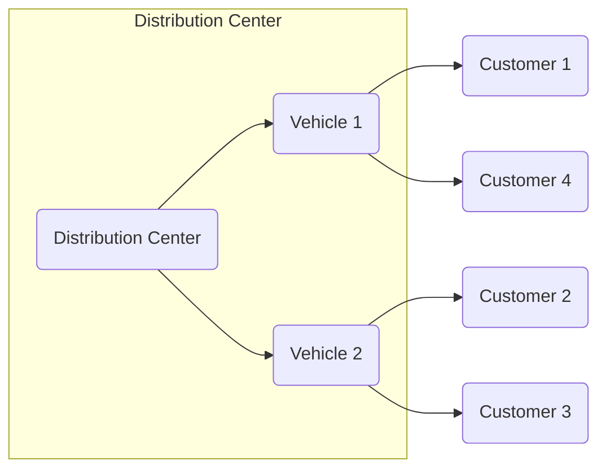

# AI人工智能代理工作流 AI Agent WorkFlow：在物流与供应链中的应用

## 1. 背景介绍

### 1.1 问题的由来

在当今快节奏的商业环境中，物流和供应链管理扮演着至关重要的角色。它们确保货物和服务能够高效、可靠地从供应商传递到最终用户手中。然而,随着全球化和电子商务的不断发展,供应链变得越来越复杂,管理难度也与日俱增。传统的供应链管理方式已经无法满足当前的需求,迫切需要新的解决方案来提高效率、降低成本并提供更好的客户体验。

### 1.2 研究现状  

近年来,人工智能(AI)技术在各个领域的应用越来越广泛,供应链管理也不例外。人工智能代理(AI Agent)是一种基于人工智能技术的软件系统,能够自主地感知环境、做出决策并执行行动,从而协助或代替人类完成特定任务。在供应链管理中,AI代理可以通过分析大量数据,预测需求、优化路线、管理库存等,从而提高供应链的效率和灵活性。

目前,已有一些公司和研究机构开始探索在供应链管理中应用AI代理技术。例如,亚马逊利用AI代理优化仓库管理和配送路线;联邦快递(FedEx)使用AI代理进行包裹分拣和车辆调度;宝洁(P&G)则通过AI代理预测消费者需求并调整生产计划。但总的来说,AI代理在供应链管理领域的应用还处于初级阶段,仍有大量的挑战有待解决。

### 1.3 研究意义

AI代理工作流在供应链管理中的应用,可以带来诸多益处:

1. 提高效率:AI代理能够快速处理大量数据,做出精确决策,从而优化物流路线、加快货物流转速度。

2. 降低成本:通过预测需求、管理库存等,AI代理可以减少浪费,降低运营成本。

3. 改善客户体验:AI代理能够实时跟踪货物状态,为客户提供透明、可靠的服务。

4. 增强灵活性:AI代理可以根据市场变化及时调整策略,使供应链更加敏捷。

5. 降低人为错误:AI代理决策过程中减少了人为干预,从而降低了错误发生的可能性。

因此,研究AI代理在供应链管理中的应用前景,对于提高物流效率、降低成本、改善客户体验等具有重要意义。

### 1.4 本文结构

本文将全面介绍AI人工智能代理在物流与供应链管理中的应用。首先阐述AI代理的核心概念及其与供应链管理的关系。接着详细解释AI代理工作流中的关键算法原理和数学模型。然后通过实际案例分析其具体实施过程。最后探讨AI代理在供应链领域的发展趋势、面临的挑战及未来展望。

## 2. 核心概念与联系

AI代理(Agent)是一种基于人工智能技术的自主软件实体,能够感知环境、处理信息、做出决策并执行相应行为,以完成特定目标。AI代理通常由以下几个核心组件组成:

- **感知器(Sensor)**: 用于获取环境信息,如货物状态、库存量、天气等数据。

- **决策核心(Decision Core)**: 基于感知器获取的信息,运用各种算法做出判断和决策。

- **执行器(Actuator)**: 根据决策核心的指令,执行相应的行动,如调度车辆、更新库存等。

- **知识库(Knowledge Base)**: 存储AI代理所需的规则、策略、历史数据等知识。

- **学习模块(Learning Module)**: 使AI代理能够从过去的经验中学习,持续优化决策过程。

在供应链管理中,AI代理可以承担多种角色,例如:

- **需求预测代理**: 分析历史销售数据、市场趋势等,预测未来的需求量。

- **库存管理代理**: 根据需求预测,合理调配库存,避免积压或断货。

- **运输调度代理**: 规划最优路线,高效调度车辆,确保货物按时送达。

- **客户服务代理**: 自动处理客户询问,提供实时物流跟踪信息。

多个AI代理可以协同工作,构成一个AI代理工作流系统,高效管理整个供应链。该系统能够自主感知、决策和执行,大幅提高供应链的智能化和自动化水平。

## 3. 核心算法原理与具体操作步骤

### 3.1 算法原理概述

AI代理工作流在供应链管理中的核心算法主要包括:

1. **需求预测算法**: 基于时间序列分析、机器学习等技术,预测未来的货物需求量。

2. **库存优化算法**: 运用优化理论,在满足服务水平的前提下,最小化库存成本。

3. **车辆路径规划算法**: 通过组合优化等方法,规划出最优的运输路线。

4. **多智能体协作算法**: 协调多个AI代理之间的行为,实现高效协同。

此外,还涉及数据处理、模式识别、规则推理、约束求解等多种算法。

### 3.2 算法步骤详解  

以需求预测算法为例,具体步骤如下:

1. **数据采集**: 收集历史销售数据、节假日信息、促销活动等相关数据。

2. **数据预处理**: 对数据进行清洗、转换、归一化等预处理,确保数据质量。

3. **特征工程**: 从原始数据中提取对需求预测有影响的特征,如时间、地理位置等。

4. **算法选择**: 根据数据特点,选择合适的机器学习算法,如ARIMA、SVR等。

5. **模型训练**: 使用训练数据训练模型,通过交叉验证调整超参数。

6. **模型评估**: 在测试集上评估模型的预测性能,如MAE、RMSE等指标。

7. **模型更新**: 定期使用新数据对模型进行再训练,以提高预测准确性。

8. **需求预测**: 输入特征数据,由模型预测未来一段时间的需求量。

9. **结果应用**: 将预测结果输入到库存优化、运输调度等其他模块。

### 3.3 算法优缺点

上述算法的优点包括:

- 高效性:能快速处理大量数据,做出实时决策。
- 准确性:通过机器学习等技术提高预测和优化的精度。 
- 自适应性:可根据新数据持续学习,不断优化决策过程。
- 可解释性:部分算法具有一定可解释性,便于人类理解和干预。

但也存在一些缺点:

- 数据质量依赖:算法性能很大程度上依赖于数据的质量和量。
- 算法偏差:部分算法可能存在偏差,导致决策不够公平合理。
- 可解释性不足:一些算法如深度学习,缺乏可解释性。
- 成本高昂:构建AI系统需要大量算力、存储和人力投入。

### 3.4 算法应用领域

除了供应链管理,上述算法还可应用于其他领域:

- 需求预测算法可用于电力负荷、旅游等领域的需求预测。
- 库存优化算法可应用于制造业的物料管理。
- 车辆路径规划算法可用于公交、网约车的智能调度。
- 多智能体协作算法可应用于机器人系统的协同控制。

## 4. 数学模型和公式及详细讲解

### 4.1 数学模型构建

在AI代理工作流中,数学模型扮演着至关重要的角色。以车辆路径规划为例,我们可以构建如下数学模型:

设有n个配送点,m辆运输车辆,车辆i的载重量为$q_i$,配送点j的需求量为$d_j$,任意两点i和j之间的距离为$c_{ij}$。目标是找到一组路径,使得总行驶距离最小,同时满足所有需求和载重约束。

该问题可以建模为一个整数线性规划模型:

$$
\begin{aligned}
\min \quad & \sum_{i=1}^{m}\sum_{j=1}^{n}c_{ij}x_{ij}\\
\text{s.t.}\quad & \sum_{i=1}^{m}x_{ij}=1,\quad \forall j\\
& \sum_{j=1}^{n}d_jx_{ij}\leq q_i,\quad \forall i\\
& \sum_{i=1}^{m}\sum_{j=1}^{n}x_{ij}\leq |S|-1,\quad \forall S\subset \{1,\ldots,n\}\\
& x_{ij}\in\{0,1\},\quad \forall i,j
\end{aligned}
$$

其中,$x_{ij}$是决策变量,当车辆i配送点j时取1,否则为0。

### 4.2 公式推导过程

对于上述车辆路径规划问题,我们可以使用整数规划的切割平面算法(Cutting Plane Algorithm)求解。算法的基本思路是:先放宽整数约束求解线性规划的连续松弛,然后根据违反整数约束的解,不断加入新的切割平面约束,最终得到整数最优解。

具体做法是:首先求解线性规划的连续松弛问题,得到最优解$\bar{x}$。如果$\bar{x}$满足整数约束,则停止;否则,构造一个新的约束(切割平面),加入到原问题中,重新求解。切割平面的构造方法之一是:

$$
\sum_{i,j\in S}\left(x_{ij}-\lfloor\bar{x}_{ij}\rfloor\right)\geq 1
$$

其中,S是指$\bar{x}$中非整数分量的集合。重复上述过程,直到得到整数最优解。

### 4.3 案例分析与讲解

现以一个简单的4个配送点、2辆车的实例进行说明。相关数据如下:

- 配送点需求量: $d_1=7,d_2=4,d_3=6,d_4=5$
- 车辆载重量: $q_1=10,q_2=15$
- 距离矩阵:

$$
C=\begin{bmatrix}
0&6&8&10\\
6&0&5&8\\
8&5&0&6\\
10&8&6&0
\end{bmatrix}
$$

我们用CPLEX求解器求解该整数规划问题,算法过程如下:

1. 求解连续松弛问题,得到最优解:

$$
\bar{x}=\begin{bmatrix}
1&0&0&0.5\\
0&1&0&0.5\\
0&0&1&0\\
0&0&0&1
\end{bmatrix}
$$

2. 构造切割平面约束:$x_{14}+x_{24}\geq1$,加入原问题。

3. 重新求解,得到整数最优解:

$$
x^*=\begin{bmatrix}
1&0&0&1\\
0&1&0&0\\
0&0&1&0\\
0&0&0&1
\end{bmatrix}
$$

最优总行驶距离为:$6+8+10+6=30$。

该解表示:车辆1负责配送点1和4,车辆2负责配送点2和3。可视化结果如下:

### 4.4 常见问题解答

1. **如何处理动态需求变化?**

可以定期重新运行优化算法,根据最新需求数据调整配送计划。也可以在模型中增加弹性约束,使方案对需求变化更加鲁棒。

2. **如何考虑交通拥堵等不确定因素?**

可以将历史交通数据纳入模型,将行驶时间视为随机变量。或使用强化学习等技术,让AI代理从环境中学习如何规避拥堵。

3. **如何平衡配送效率和成本?** 

可以在目标函数中加入成本项,如车辆使用成本、人工成本等,与行驶距离一起最小化。也可以设置阈值约束,确保成本在可接受范围内。

4. **如何确保公平分配?**

可以在模型中增加公平