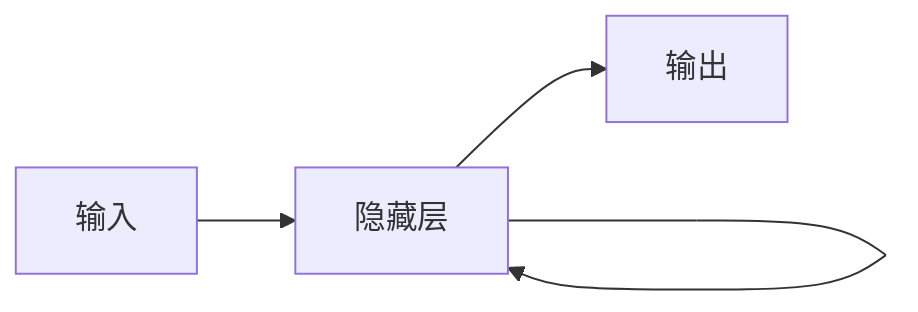
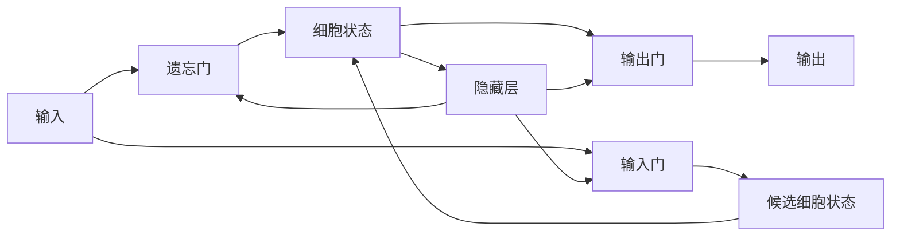

# AI人工智能核心算法原理与代码实例讲解：语言生成

## 1. 背景介绍

### 1.1 问题的由来

语言是人类区别于其他物种的重要特征之一，是人类思维和交流的工具。让机器能够理解和生成人类语言，一直是人工智能领域的重要目标之一。随着深度学习技术的快速发展，近年来自然语言处理（NLP）领域取得了突破性进展，特别是语言生成技术，已经在机器翻译、文本摘要、对话系统、诗歌创作等领域展现出巨大的应用潜力。

### 1.2 研究现状

目前，语言生成技术主要基于深度学习模型，例如循环神经网络（RNN）、长短期记忆网络（LSTM）、Transformer等。这些模型能够学习语言的复杂结构和语义信息，并生成流畅、自然的文本。近年来，预训练语言模型（Pre-trained Language Model, PLM）的出现，例如BERT、GPT-3等，进一步提升了语言生成技术的性能。

### 1.3 研究意义

语言生成技术的研究具有重要的理论意义和现实意义。

- **理论意义:**  语言生成技术的研究有助于我们更好地理解人类语言的本质和规律，推动人工智能的发展。
- **现实意义:** 语言生成技术可以应用于众多领域，例如：
    - **机器翻译：** 自动将一种语言翻译成另一种语言。
    - **文本摘要：** 自动生成文本的简短概括。
    - **对话系统：**  构建能够与人类进行自然对话的智能系统。
    - **诗歌创作：**  自动生成诗歌等文学作品。

### 1.4 本文结构

本文将深入浅出地介绍语言生成技术的核心算法原理，并结合代码实例进行讲解。文章结构如下：

- **第二章：核心概念与联系**：介绍语言生成任务、评价指标、常用数据集等核心概念，并阐述它们之间的联系。
- **第三章：核心算法原理 & 具体操作步骤**：详细介绍循环神经网络（RNN）、长短期记忆网络（LSTM）、Transformer等核心算法的原理，并结合代码实例讲解如何使用这些算法构建语言生成模型。
- **第四章：数学模型和公式 & 详细讲解 & 举例说明**：介绍语言生成模型中常用的数学模型和公式，例如语言模型、条件概率、注意力机制等，并结合实例进行详细讲解。
- **第五章：项目实践：代码实例和详细解释说明**：以一个具体的语言生成任务为例，展示如何使用Python和深度学习框架（例如TensorFlow、PyTorch）构建一个完整的语言生成模型，并对代码进行详细解读。
- **第六章：实际应用场景**：介绍语言生成技术在机器翻译、文本摘要、对话系统等领域的实际应用场景。
- **第七章：工具和资源推荐**：推荐一些学习语言生成技术的书籍、课程、开源工具和数据集。
- **第八章：总结：未来发展趋势与挑战**：总结语言生成技术的发展现状、未来趋势以及面临的挑战。
- **第九章：附录：常见问题与解答**：解答一些读者在学习语言生成技术过程中可能会遇到的常见问题。


## 2. 核心概念与联系

### 2.1 语言生成任务

语言生成任务可以分为以下几类：

- **机器翻译：** 将一种语言的文本自动翻译成另一种语言的文本。
- **文本摘要：**  从一篇较长的文本中提取出主要内容，生成一篇简短的摘要。
- **对话系统：**  构建能够与人类进行自然对话的智能系统。
- **故事生成：**  根据给定的情景或关键词，自动生成一个完整的故事。
- **诗歌创作：**  自动生成诗歌等文学作品。

### 2.2 评价指标

评价语言生成模型的性能通常使用以下指标：

- **BLEU (Bilingual Evaluation Understudy)**：衡量机器翻译结果与人工翻译结果之间的相似度。
- **ROUGE (Recall-Oriented Understudy for Gisting Evaluation)**：衡量文本摘要结果与参考摘要之间的重叠度。
- **METEOR (Metric for Evaluation of Translation with Explicit ORdering)**：综合考虑机器翻译结果与人工翻译结果之间的准确率、召回率和词序。
- **CIDEr (Consensus-based Image Description Evaluation)**：用于评价图像描述生成模型的性能。

### 2.3 常用数据集

以下是一些常用的语言生成数据集：

- **机器翻译：** WMT、IWSLT
- **文本摘要：** CNN/Daily Mail、Gigaword
- **对话系统：**  Cornell Movie Dialog Corpus、Ubuntu Dialogue Corpus
- **故事生成：**  ROCStories、WritingPrompts
- **诗歌创作：**  Poetry Foundation

### 2.4 核心概念之间的联系

语言生成任务是自然语言处理领域的重要研究方向，其目标是让机器能够生成流畅、自然的文本。评价指标用于衡量语言生成模型的性能，常用数据集为语言生成模型的训练和测试提供了数据基础。


## 3. 核心算法原理 & 具体操作步骤

### 3.1 循环神经网络（RNN）

#### 3.1.1 算法原理概述

循环神经网络（Recurrent Neural Network, RNN）是一种专门用于处理序列数据的神经网络。与传统的前馈神经网络不同，RNN可以记住之前的信息，并将这些信息用于当前的输出。

#### 3.1.2  算法步骤详解

RNN 的基本结构如下：



其中：

- **输入**：表示当前时刻的输入数据。
- **隐藏层**：存储网络的记忆信息。
- **输出**：表示当前时刻的输出数据。

RNN 的工作流程如下：

1.  在每个时间步，RNN 接收当前时刻的输入数据和上一时刻的隐藏层状态作为输入。
2.  RNN 根据输入数据和隐藏层状态计算当前时刻的隐藏层状态。
3.  RNN 根据当前时刻的隐藏层状态计算当前时刻的输出数据。
4.  RNN 将当前时刻的隐藏层状态传递给下一时刻。

#### 3.1.3 算法优缺点

**优点:**

-  能够处理任意长度的序列数据。
-  能够学习序列数据中的长期依赖关系。

**缺点:**

-  容易出现梯度消失或梯度爆炸问题。
-  训练速度较慢。

#### 3.1.4 算法应用领域

RNN 广泛应用于自然语言处理、语音识别、机器翻译等领域。

### 3.2 长短期记忆网络（LSTM）

#### 3.2.1 算法原理概述

长短期记忆网络（Long Short-Term Memory, LSTM）是一种特殊的 RNN，它能够解决 RNN 中的梯度消失和梯度爆炸问题。

#### 3.2.2 算法步骤详解

LSTM 的基本结构如下：



其中：

- **遗忘门**：决定从细胞状态中丢弃哪些信息。
- **输入门**：决定将哪些新信息存储到细胞状态中。
- **候选细胞状态**：表示 LSTM 计算出的新的候选细胞状态。
- **细胞状态**：存储 LSTM 的长期记忆信息。
- **输出门**：决定从细胞状态中输出哪些信息。

LSTM 的工作流程如下：

1.  **遗忘阶段:** LSTM 根据当前时刻的输入数据和上一时刻的隐藏层状态计算遗忘门的值，并根据遗忘门的值选择性地丢弃细胞状态中的一些信息。
2.  **输入阶段:** LSTM 根据当前时刻的输入数据和上一时刻的隐藏层状态计算输入门的值，并根据输入门的值选择性地将新的信息存储到细胞状态中。
3.  **更新阶段:** LSTM 根据当前时刻的输入数据、上一时刻的隐藏层状态和更新后的细胞状态计算当前时刻的隐藏层状态。
4.  **输出阶段:** LSTM 根据当前时刻的隐藏层状态计算输出门的值，并根据输出门的值选择性地从细胞状态中输出信息，作为当前时刻的输出数据。

#### 3.2.3 算法优缺点

**优点:**

- 能够解决 RNN 中的梯度消失和梯度爆炸问题。
- 能够学习序列数据中的长期依赖关系。

**缺点:**

- 结构较为复杂。
- 训练速度较慢。

#### 3.2.4 算法应用领域

LSTM 广泛应用于自然语言处理、语音识别、机器翻译等领域。

### 3.3 Transformer

#### 3.3.1 算法原理概述

Transformer 是一种基于注意力机制（Attention Mechanism）的神经网络架构，它不需要像 RNN 和 LSTM 那样按顺序处理序列数据，因此可以并行计算，训练速度更快。

#### 3.3.2 算法步骤详解

Transformer 的基本结构如下：


其中：

- **编码器**：将输入序列编码成一个上下文向量。
- **解码器**：根据上下文向量生成输出序列。

Transformer 的核心组件是**注意力机制**，它可以让模型在生成每个输出词时，关注输入序列中与之相关的部分。

#### 3.3.3 算法优缺点

**优点:**

-  可以并行计算，训练速度快。
-  能够学习序列数据中的长期依赖关系。

**缺点:**

-  模型复杂度较高。
-  对计算资源的要求较高。

#### 3.3.4 算法应用领域

Transformer 广泛应用于自然语言处理、机器翻译、文本摘要等领域。


## 4. 数学模型和公式 & 详细讲解 & 举例说明

### 4.1 语言模型

#### 4.1.1 数学模型构建

语言模型（Language Model, LM）用于计算一个句子出现的概率。给定一个句子 $w_1, w_2, ..., w_n$，其概率可以表示为：

$$
P(w_1, w_2, ..., w_n) = P(w_1)P(w_2|w_1)P(w_3|w_1, w_2)...P(w_n|w_1, w_2, ..., w_{n-1})
$$

其中：

-  $P(w_1)$ 表示第一个词 $w_1$ 出现的概率。
-  $P(w_i|w_1, w_2, ..., w_{i-1})$ 表示在已知前面 $i-1$ 个词的情况下，第 $i$ 个词 $w_i$ 出现的概率。

#### 4.1.2 公式推导过程

为了简化计算，通常使用马尔可夫假设，即假设当前词出现的概率只与前面 k 个词相关，这种模型称为 k 元语言模型（k-gram Language Model）。例如，2 元语言模型的概率公式为：

$$
P(w_1, w_2, ..., w_n) \approx \prod_{i=1}^n P(w_i|w_{i-1})
$$

#### 4.1.3 案例分析与讲解

假设我们有一个语料库，包含以下三个句子：

-  我喜欢吃苹果。
-  我喜欢吃香蕉。
-  我喜欢喝牛奶。

我们可以使用 2 元语言模型来计算句子 "我喜欢吃苹果" 出现的概率：

$$
\begin{aligned}
P(我喜欢吃苹果) &\approx P(我|start)P(喜欢|我)P(吃|喜欢)P(苹果|吃)P(end|苹果) \\
&= (1/3) * (1/1) * (1/2) * (1/1) * (1/3) \\
&= 1/18
\end{aligned}
$$

其中：

-  $start$ 和 $end$ 分别表示句子的开始和结束标记。
-  每个词的概率可以通过统计语料库中该词出现的频率来估计。

### 4.2 条件概率

#### 4.2.1 数学模型构建

条件概率（Conditional Probability）是指在已知事件 B 发生的条件下，事件 A 发生的概率，记作 $P(A|B)$。

#### 4.2.2 公式推导过程

条件概率的计算公式为：

$$
P(A|B) = \frac{P(A \cap B)}{P(B)}
$$

其中：

-  $P(A \cap B)$ 表示事件 A 和事件 B 同时发生的概率。
-  $P(B)$ 表示事件 B 发生的概率。

#### 4.2.3 案例分析与讲解

假设我们有一个包含 100 个学生的班级，其中 60 个学生喜欢数学，40 个学生喜欢英语，20 个学生同时喜欢数学和英语。

-  事件 A：学生喜欢数学。
-  事件 B：学生喜欢英语。

那么，在已知一个学生喜欢英语的条件下，该学生也喜欢数学的概率为：

$$
\begin{aligned}
P(A|B) &= \frac{P(A \cap B)}{P(B)} \\
&= \frac{20/100}{40/100} \\
&= 0.5
\end{aligned}
$$

### 4.3 注意力机制

#### 4.3.1 数学模型构建

注意力机制（Attention Mechanism）可以让模型在处理序列数据时，关注输入序列中与当前输出相关的部分。

#### 4.3.2 公式推导过程

假设我们有一个输入序列 $x_1, x_2, ..., x_n$ 和一个输出序列 $y_1, y_2, ..., y_m$。在生成第 $i$ 个输出词 $y_i$ 时，注意力机制会计算一个权重向量 $\alpha_i = (\alpha_{i1}, \alpha_{i2}, ..., \alpha_{in})$，表示输入序列中每个词对 $y_i$ 的重要程度。

权重向量 $\alpha_i$ 的计算公式为：

$$
\alpha_{ij} = \frac{exp(e_{ij})}{\sum_{k=1}^n exp(e_{ik})}
$$

其中：

-  $e_{ij}$ 表示输入序列中第 $j$ 个词 $x_j$ 对输出序列中第 $i$ 个词 $y_i$ 的贡献度，可以使用神经网络来计算。

#### 4.3.3 案例分析与讲解

假设我们有一个机器翻译任务，将英文句子 "I love you" 翻译成中文句子 "我爱你"。在生成中文句子中的 "爱" 字时，注意力机制会计算一个权重向量，表示英文句子中每个词对 "爱" 字的重要程度。由于 "love" 对 "爱" 的贡献度最大，因此 "love" 对应的权重会比较大。

### 4.4 常见问题解答

#### 4.4.1 什么是过拟合？

过拟合是指模型在训练数据上表现很好，但在测试数据上表现很差的现象。

#### 4.4.2 如何解决过拟合问题？

解决过拟合问题的方法有很多，例如：

-  增加训练数据。
-  使用正则化技术。
-  使用 Dropout 技术。
-  早停法。

## 5. 项目实践：代码实例和详细解释说明

### 5.1 开发环境搭建

本项目使用 Python 3.7 和 TensorFlow 2.0 框架实现。

首先，我们需要安装 TensorFlow 2.0：

```
pip install tensorflow==2.0
```

### 5.2 源代码详细实现

本项目实现一个简单的基于 RNN 的语言模型，用于生成文本。

```python
import tensorflow as tf

# 定义模型参数
vocab_size = 10000  # 词汇表大小
embedding_dim = 128  # 词嵌入维度
rnn_units = 1024  # RNN 隐藏层单元数

# 定义模型
class RNNModel(tf.keras.Model):
    def __init__(self, vocab_size, embedding_dim, rnn_units):
        super(RNNModel, self).__init__(self)
        self.embedding = tf.keras.layers.Embedding(vocab_size, embedding_dim)
        self.gru = tf.keras