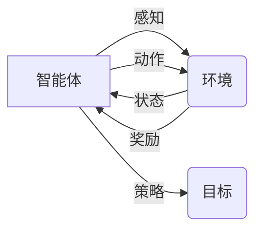

# AI智能体与数字世界的交互

## 1. 背景介绍

### 1.1 问题的由来

近年来，人工智能(AI)技术发展迅猛，各种类型的AI智能体如雨后春笋般涌现。从能够进行自然语言对话的聊天机器人，到能够自主驾驶的无人驾驶汽车，AI智能体正在越来越多地参与到人类的日常生活和工作中。然而，随着AI智能体能力的不断增强，一个重要的问题也随之而来：AI智能体如何与我们所处的数字世界进行有效交互？

这个问题的答案，不仅关系到AI智能体能否更好地为人类服务，也关系到人类能否与AI和谐共处。

### 1.2 研究现状

目前，AI智能体与数字世界的交互主要依赖于以下几种方式：

* **API调用：** 这是最常见的一种交互方式，AI智能体通过调用预先定义好的API接口，来获取或修改数字世界中的数据和服务。例如，一个天气预报机器人可以通过调用气象数据API来获取最新的天气信息。
* **数据驱动：** 这种方式是指AI智能体通过分析大量的历史数据，来学习如何与数字世界进行交互。例如，一个推荐系统可以通过分析用户的历史购买记录，来预测用户可能感兴趣的商品。
* **强化学习：** 这种方式是指AI智能体通过不断地与数字世界进行交互，并根据交互结果来调整自己的行为策略，从而逐渐学习到如何更好地与数字世界进行交互。例如，一个游戏AI可以通过不断地与游戏环境进行交互，来学习如何赢得游戏。

### 1.3 研究意义

研究AI智能体与数字世界的交互具有重要的理论和现实意义。

从理论上讲，研究AI智能体与数字世界的交互，有助于我们更好地理解智能的本质。因为智能的一个重要体现就是能够与环境进行有效交互。

从现实意义上讲，研究AI智能体与数字世界的交互，有助于我们开发出更加智能、更加人性化的AI应用。例如，我们可以开发出能够更好地理解人类语言的聊天机器人，能够更加安全可靠地驾驶汽车的无人驾驶系统，等等。

### 1.4 本文结构

本文将从以下几个方面对AI智能体与数字世界的交互进行深入探讨：

* 核心概念与联系
* 核心算法原理 & 具体操作步骤
* 数学模型和公式 & 详细讲解 & 举例说明
* 项目实践：代码实例和详细解释说明
* 实际应用场景
* 工具和资源推荐
* 总结：未来发展趋势与挑战
* 附录：常见问题与解答


## 2. 核心概念与联系

在深入探讨AI智能体与数字世界的交互之前，我们首先需要明确一些核心概念及其之间的联系。

* **智能体(Agent):**  智能体是指能够感知环境并采取行动以实现目标的任何实体。在AI领域，智能体通常是指一个软件程序，它可以是简单的脚本，也可以是复杂的深度学习模型。
* **环境(Environment):** 环境是指智能体所处的外部世界，它可以是物理世界，也可以是数字世界。
* **状态(State):** 状态是指环境在某个特定时刻的状况。
* **动作(Action):** 动作是指智能体可以采取的行动，例如移动、说话、发送网络请求等。
* **奖励(Reward):** 奖励是指智能体在采取某个动作后，从环境中获得的反馈信号，它可以是正面的，也可以是负面的。
* **策略(Policy):** 策略是指智能体根据当前状态选择动作的规则。
* **目标(Goal):** 目标是指智能体希望达成的最终状态。

下图展示了这些核心概念之间的关系：



## 3. 核心算法原理 & 具体操作步骤

### 3.1 算法原理概述

目前，用于实现AI智能体与数字世界交互的算法主要有以下几种：

* **基于规则的算法：** 这种算法是指根据预先定义好的规则，来决定智能体在不同状态下应该采取什么动作。例如，一个简单的聊天机器人可以使用基于规则的算法来根据用户的输入，选择合适的回复。
* **搜索算法：** 这种算法是指通过搜索所有可能的动作序列，来找到能够使智能体达到目标的最优动作序列。例如，一个棋类游戏AI可以使用搜索算法来找到能够赢得比赛的最优走法。
* **强化学习算法：** 这种算法是指智能体通过不断地与环境进行交互，并根据交互结果来调整自己的行为策略，从而逐渐学习到如何更好地与环境进行交互。例如，一个游戏AI可以使用强化学习算法来学习如何玩游戏。

### 3.2 算法步骤详解

下面以强化学习算法为例，详细介绍AI智能体与数字世界交互的具体操作步骤：

1. **初始化：** 首先，需要初始化智能体的策略，以及用于评估策略的价值函数。
2. **与环境交互：** 智能体根据当前策略选择动作，并与环境进行交互。
3. **获取奖励：** 环境根据智能体的动作，返回一个奖励信号给智能体。
4. **更新策略：** 智能体根据获得的奖励，更新自己的策略，使得自己更有可能在未来获得更高的奖励。
5. **重复步骤2-4：** 重复步骤2-4，直到智能体的策略收敛。

### 3.3 算法优缺点

不同类型的算法具有不同的优缺点：

* **基于规则的算法：** 优点是简单易实现，缺点是难以处理复杂的环境和任务。
* **搜索算法：** 优点是可以找到最优解，缺点是计算复杂度高，难以应用于实时性要求高的场景。
* **强化学习算法：** 优点是可以处理复杂的环境和任务，缺点是训练时间长，需要大量的训练数据。

### 3.4 算法应用领域

AI智能体与数字世界的交互技术已广泛应用于各个领域，例如：

* **自然语言处理：** 例如聊天机器人、机器翻译、文本摘要等。
* **计算机视觉：** 例如图像识别、目标检测、视频分析等。
* **机器人控制：** 例如工业机器人、服务机器人、无人驾驶等。
* **游戏AI：** 例如游戏中的NPC、游戏AI对战平台等。
* **金融科技：** 例如量化交易、风险控制、智能客服等。


## 4. 数学模型和公式 & 详细讲解 & 举例说明

### 4.1 数学模型构建

马尔可夫决策过程(Markov Decision Process, MDP)是描述AI智能体与环境交互的一种常用数学模型。

一个MDP可以表示为一个五元组：<S, A, P, R, γ>，其中：

* **S:** 状态空间，表示环境所有可能的状态的集合。
* **A:** 动作空间，表示智能体所有可能采取的动作的集合。
* **P:** 状态转移概率矩阵，表示智能体在状态s采取动作a后，转移到状态s'的概率。
* **R:** 奖励函数，表示智能体在状态s采取动作a后，获得的奖励。
* **γ:** 折扣因子，表示未来奖励的价值对当前决策的影响程度。

### 4.2 公式推导过程

强化学习的目标是找到一个最优策略π，使得智能体在与环境交互的过程中，能够获得最大的累积奖励。

常用的强化学习算法包括：

* **价值迭代算法:**  该算法通过迭代计算每个状态的价值函数，来找到最优策略。
* **策略迭代算法:**  该算法通过迭代更新策略，来找到最优策略。
* **Q学习算法:**  该算法通过学习状态-动作价值函数，来找到最优策略。

### 4.3 案例分析与讲解

以一个简单的游戏为例，说明如何使用MDP模型来描述AI智能体与环境的交互。

假设有一个迷宫游戏，迷宫中有一个机器人，机器人可以向上、下、左、右四个方向移动。机器人的目标是找到迷宫中的出口。

我们可以使用MDP模型来描述这个游戏：

* **状态空间S:** 迷宫中所有可能的机器人位置的集合。
* **动作空间A:** {上，下，左，右}。
* **状态转移概率矩阵P:**  如果机器人撞到墙壁，则停留在原地；否则，以1的概率移动到目标位置。
* **奖励函数R:**  如果机器人到达出口，则获得100的奖励；否则，每移动一步获得-1的奖励。
* **折扣因子γ:**  设置为0.9。

### 4.4 常见问题解答

**问：如何选择合适的强化学习算法？**

答：选择合适的强化学习算法需要考虑以下因素：

* **问题的复杂度：**  对于简单的问题，可以使用价值迭代或策略迭代算法；对于复杂的问题，可以使用Q学习算法。
* **训练数据的规模：**  如果训练数据量较小，可以使用价值迭代或策略迭代算法；如果训练数据量较大，可以使用Q学习算法。
* **实时性要求：**  如果对实时性要求较高，可以使用价值迭代或策略迭代算法；如果对实时性要求不高，可以使用Q学习算法。

## 5. 项目实践：代码实例和详细解释说明

### 5.1 开发环境搭建

本节将以Python语言为例，介绍如何搭建强化学习的开发环境。

首先，需要安装以下Python库：

```
pip install gym numpy matplotlib
```

### 5.2 源代码详细实现

下面是一个使用Q学习算法玩迷宫游戏的示例代码：

```python
import gym
import numpy as np
import matplotlib.pyplot as plt

# 创建迷宫环境
env = gym.make('FrozenLake-v1')

# 初始化Q表
q_table = np.zeros([env.observation_space.n, env.action_space.n])

# 设置学习参数
learning_rate = 0.8
discount_factor = 0.95
episodes = 2000

# 训练Q学习模型
for i in range(episodes):
    # 初始化状态
    state = env.reset()

    # 循环直到游戏结束
    while True:
        # 选择动作
        action = np.argmax(q_table[state, :] + np.random.randn(1, env.action_space.n) * (1. / (i + 1)))

        # 执行动作
        next_state, reward, done, info = env.step(action)

        # 更新Q表
        q_table[state, action] = q_table[state, action] + learning_rate * (reward + discount_factor * np.max(q_table[next_state, :]) - q_table[state, action])

        # 更新状态
        state = next_state

        # 如果游戏结束，则退出循环
        if done:
            break

# 测试训练好的模型
state = env.reset()
env.render()

while True:
    # 选择动作
    action = np.argmax(q_table[state, :])

    # 执行动作
    next_state, reward, done, info = env.step(action)

    # 更新状态
    state = next_state

    # 渲染环境
    env.render()

    # 如果游戏结束，则退出循环
    if done:
        break

# 关闭环境
env.close()
```

### 5.3 代码解读与分析

* 首先，使用`gym.make('FrozenLake-v1')`创建了一个迷宫环境。
* 然后，初始化了一个Q表，用于存储每个状态-动作对的价值。
* 接下来，使用一个循环来训练Q学习模型。
* 在每个循环中，首先初始化状态，然后循环直到游戏结束。
* 在每个时间步，首先选择一个动作，然后执行该动作，并获得奖励。
* 然后，使用Q学习算法更新Q表。
* 最后，更新状态。
* 训练完成后，可以使用训练好的模型来玩游戏。

### 5.4 运行结果展示

运行上述代码，可以看到机器人成功地找到了迷宫的出口。

## 6. 实际应用场景

### 6.1 自然语言处理

* **聊天机器人：** 通过与用户进行对话，理解用户的意图，并提供相应的服务。
* **机器翻译：** 将一种语言的文本翻译成另一种语言的文本。
* **文本摘要：** 从一篇长文本中提取出关键信息。

### 6.2 计算机视觉

* **图像识别：** 识别图像中的物体、场景、人脸等。
* **目标检测：** 在图像或视频中定位和识别特定类型的物体。
* **视频分析：** 分析视频内容，例如识别视频中的人物、动作、事件等。

### 6.3 机器人控制

* **工业机器人：** 在工厂中执行重复性任务，例如焊接、喷漆、装配等。
* **服务机器人：** 为人类提供服务，例如清洁、送餐、导购等。
* **无人驾驶：** 自动驾驶汽车、无人机等。

### 6.4 未来应用展望

随着AI技术的不断发展，AI智能体与数字世界的交互将会更加智能化、人性化、高效化，应用场景也将更加广泛。

## 7. 工具和资源推荐

### 7.1 学习资源推荐

* **强化学习导论：** Sutton & Barto
* **深度学习：** Ian Goodfellow, Yoshua Bengio, Aaron Courville

### 7.2 开发工具推荐

* **TensorFlow：** Google开发的开源机器学习平台。
* **PyTorch：** Facebook开发的开源机器学习平台。
* **OpenAI Gym：** 用于开发和比较强化学习算法的工具包。

### 7.3 相关论文推荐

* **Playing Atari with Deep Reinforcement Learning：**  Volodymyr Mnih et al.
* **Mastering the game of Go with deep neural networks and tree search：**  David Silver et al.

### 7.4 其他资源推荐

* **OpenAI：** 人工智能研究公司，致力于推动人工智能技术的发展。
* **DeepMind：** Google旗下的人工智能公司，致力于开发通用人工智能。

## 8. 总结：未来发展趋势与挑战

### 8.1 研究成果总结

AI智能体与数字世界的交互技术取得了显著的进展，并在各个领域得到了广泛应用。

### 8.2 未来发展趋势

* **更加智能化：** AI智能体将能够更好地理解环境、学习知识、做出决策。
* **更加人性化：** AI智能体将能够更好地理解人类的语言、情感、意图。
* **更加高效化：** AI智能体将能够更加高效地与环境进行交互，完成任务。

### 8.3 面临的挑战

* **安全性：** 如何保证AI智能体的安全性，防止其被恶意利用？
* **可解释性：** 如何解释AI智能体的决策过程，使其更加透明？
* **伦理道德：** 如何确保AI智能体的行为符合人类的伦理道德标准？

### 8.4 研究展望

AI智能体与数字世界的交互技术仍处于发展初期，未来还有很多挑战需要克服，但也充满了机遇。相信随着技术的不断进步，AI智能体将能够更好地为人类服务，创造更加美好的未来。

## 9. 附录：常见问题与解答

**问：什么是AI智能体？**

答：AI智能体是指能够感知环境并采取行动以实现目标的任何实体。在AI领域，智能体通常是指一个软件程序，它可以是简单的脚本，也可以是复杂的深度学习模型。

**问：AI智能体如何与数字世界进行交互？**

答：AI智能体与数字世界的交互主要依赖于API调用、数据驱动、强化学习等方式。

**问：AI智能体与数字世界的交互技术有哪些应用场景？**

答：AI智能体与数字世界的交互技术已广泛应用于自然语言处理、计算机视觉、机器人控制、游戏AI、金融科技等领域。

作者：禅与计算机程序设计艺术 / Zen and the Art of Computer Programming 
