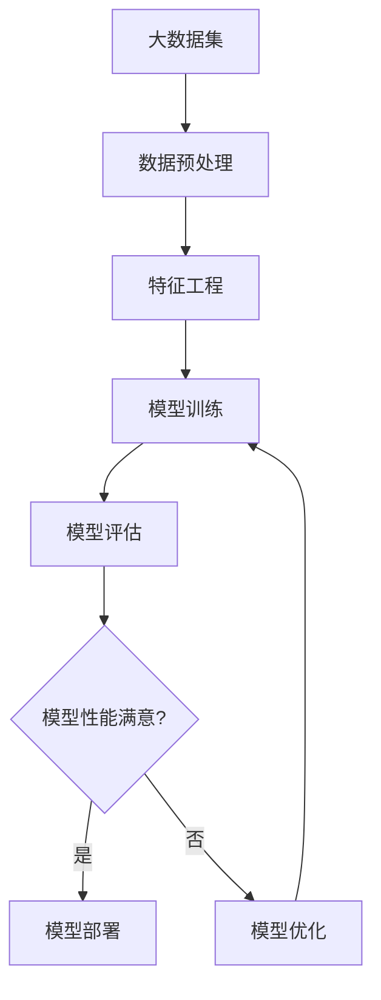

# AI算法、算力与大数据的结合

## 1. 背景介绍

### 1.1 问题的由来

在当今时代,数据已经成为了推动科技创新和商业发展的核心动力。大数据时代的到来,给我们带来了前所未有的机遇和挑战。海量的数据需要被高效地存储、处理和分析,以从中提取有价值的信息和见解。然而,传统的数据处理方法已经无法满足当前的需求,因此亟需新的解决方案。

在这种背景下,人工智能(AI)算法和算力(Computing Power)的结合应运而生。AI算法能够从大数据中发现隐藏的模式和规律,而算力则为运行这些算法提供了必要的计算资源。通过将二者结合,我们可以更好地利用大数据,推动各个领域的创新和发展。

### 1.2 研究现状

目前,AI算法、算力和大数据的结合已经在多个领域取得了令人瞩目的成就。例如,在计算机视觉领域,深度学习算法结合强大的GPU算力,使得图像识别、目标检测等任务的性能大幅提高。在自然语言处理领域,transformer模型结合大规模语料库和TPU算力,实现了突破性的语言理解和生成能力。

然而,尽管取得了重大进展,但AI算法、算力和大数据的结合仍然面临着诸多挑战。例如,如何高效地处理海量数据、如何设计更加精准和可解释的算法、如何提高算力利用率等,都是亟待解决的问题。

### 1.3 研究意义

AI算法、算力和大数据的结合,对于推动科技创新和社会发展具有重大意义。它不仅可以帮助我们更好地理解和利用数据,还可以为各个领域带来全新的解决方案和应用场景。例如,在医疗领域,我们可以利用这一技术来分析患者数据,提高疾病诊断和治疗的精准度;在交通领域,我们可以优化交通规划和管理,缓解拥堵问题;在金融领域,我们可以更好地预测市场趋势,降低投资风险。

总的来说,AI算法、算力和大数据的结合,将为我们开启一个全新的数字化时代,推动科技和社会的持续进步。

### 1.4 本文结构

本文将全面探讨AI算法、算力和大数据的结合。我们将首先介绍相关的核心概念和它们之间的联系,然后深入探讨核心算法原理和具体操作步骤。接下来,我们将构建数学模型并推导相关公式,并通过案例分析加深理解。此外,我们还将提供代码实例和详细解释,帮助读者更好地掌握实践技能。最后,我们将讨论实际应用场景、未来发展趋势和面临的挑战,并推荐相关的工具和资源。

## 2. 核心概念与联系

在探讨AI算法、算力和大数据的结合之前,我们需要先了解这三个核心概念及它们之间的联系。

**AI算法**是指用于解决人工智能相关任务的各种算法,例如机器学习算法(如决策树、支持向量机、神经网络等)和深度学习算法(如卷积神经网络、递归神经网络、transformer等)。这些算法能够从数据中学习模式和规律,并对新的输入数据进行预测或决策。

**算力**指的是计算机系统执行计算任务的能力,通常用CPU、GPU、TPU等硬件的计算性能来衡量。强大的算力对于运行复杂的AI算法至关重要,因为这些算法通常需要大量的计算资源。

**大数据**是指规模巨大、种类繁多、增长迅速的数据集合。在当今时代,来自互联网、移动设备、物联网等各种来源的海量数据不断涌现。大数据为AI算法提供了丰富的训练数据,是实现智能化的基础。

AI算法、算力和大数据之间存在着紧密的联系。AI算法需要大数据作为训练数据集,并依赖算力来执行复杂的计算过程。同时,算力的发展也推动了AI算法的进步,使得我们能够训练更大规模、更复杂的模型。另一方面,大数据的存在也促进了算力的发展,因为我们需要更强大的计算能力来存储和处理海量数据。

通过将这三者结合,我们可以充分利用大数据的价值,开发出更加智能和高效的应用程序。下面,我们将深入探讨AI算法、算力和大数据结合的核心算法原理和具体操作步骤。

## 3. 核心算法原理 & 具体操作步骤

### 3.1 算法原理概述

在AI算法、算力和大数据的结合中,核心算法原理主要包括以下几个方面:

1. **数据预处理**:由于原始数据通常存在噪声、缺失值、不平衡等问题,因此需要进行数据清洗、标准化、采样等预处理操作,以确保数据质量。

2. **特征工程**:从原始数据中提取有意义的特征,是机器学习算法取得良好性能的关键。常见的特征工程技术包括one-hot编码、TF-IDF、Word2Vec等。

3. **模型训练**:利用预处理后的数据和提取的特征,训练机器学习或深度学习模型。常见的训练算法包括梯度下降、随机梯度下降、Adam优化器等。

4. **模型评估**:使用holdout数据集或交叉验证等方法,评估模型的性能指标,如准确率、精确率、召回率等。

5. **模型优化**:根据评估结果,通过调整超参数、特征选择、集成学习等方法,优化模型性能。

6. **模型部署**:将训练好的模型部署到生产环境中,提供实时预测或决策服务。

在具体操作步骤方面,一个典型的AI算法、算力和大数据结合的流程如下:

### 3.2 算法步骤详解

接下来,我们将详细解释上述算法流程中的每一个步骤。

#### 3.2.1 数据预处理

数据预处理是确保数据质量的关键步骤,包括以下操作:

1. **数据清洗**:处理缺失值、异常值、重复数据等问题。
2. **数据标准化**:将数据转换到相同的范围或尺度,以避免某些特征对模型的影响过大。
3. **数据采样**:对于不平衡数据集,可以进行过采样或欠采样,以平衡不同类别的样本数量。

#### 3.2.2 特征工程

特征工程旨在从原始数据中提取有意义的特征,以提高模型的性能。常见的特征工程技术包括:

1. **One-hot编码**:将分类特征转换为一组二进制向量。
2. **TF-IDF**:计算文本数据中每个词项的重要性,常用于文本分类和聚类任务。
3. **Word2Vec**:将词项映射到连续的向量空间,捕捉词与词之间的语义关系。

#### 3.2.3 模型训练

模型训练是机器学习和深度学习算法的核心步骤,通过优化目标函数,学习数据中隐藏的模式和规律。常见的训练算法包括:

1. **梯度下降**:通过计算目标函数关于模型参数的梯度,沿着梯度的反方向更新参数。
2. **随机梯度下降**:每次只使用一个或一小批数据样本来计算梯度,可以加快收敛速度。
3. **Adam优化器**:结合了动量和自适应学习率调整的优化算法,在许多任务上表现出色。

#### 3.2.4 模型评估

模型评估是评判模型性能的关键步骤,常见的评估指标包括:

1. **准确率**:正确预测的样本数占总样本数的比例。
2. **精确率**:正确预测的正样本数占所有预测为正样本的比例。
3. **召回率**:正确预测的正样本数占所有真实正样本的比例。

常见的评估方法包括holdout和交叉验证。holdout方法将数据集分为训练集和测试集,而交叉验证则将数据集分为多个折,依次使用不同的折作为测试集。

#### 3.2.5 模型优化

如果模型性能不满意,我们可以通过以下方法进行优化:

1. **超参数调整**:调整模型的超参数,如学习率、正则化强度等,以提高性能。
2. **特征选择**:从原始特征集中选择最有区分能力的特征子集,降低模型复杂度。
3. **集成学习**:将多个基础模型组合成一个强大的集成模型,提高预测的准确性和鲁棒性。

#### 3.2.6 模型部署

经过上述步骤的训练和优化,我们可以将模型部署到生产环境中,为用户提供实时的预测或决策服务。常见的部署方式包括:

1. **Web服务**:将模型封装为RESTful API,供其他应用程序调用。
2. **Docker容器**:将模型及其依赖打包到Docker容器中,方便部署和管理。
3. **云服务**:在云平台上部署模型,利用云计算的弹性扩展能力。

### 3.3 算法优缺点

AI算法、算力和大数据的结合具有以下优点:

1. **强大的预测能力**:利用大数据训练的AI模型能够发现隐藏的模式和规律,提高预测的准确性。
2. **高效的计算能力**:借助算力的支持,我们可以训练和运行复杂的AI模型,解决更加困难的问题。
3. **广泛的应用场景**:该技术可以应用于计算机视觉、自然语言处理、推荐系统等多个领域。

同时,它也存在一些缺点和挑战:

1. **数据质量问题**:低质量的数据会严重影响模型的性能,因此数据预处理和特征工程至关重要。
2. **黑盒模型解释性差**:一些复杂的AI模型(如深度神经网络)往往难以解释,缺乏可解释性。
3. **算力需求高昂**:训练大规模AI模型需要大量的计算资源,导致成本和能耗较高。
4. **隐私和安全风险**:大数据中可能包含敏感信息,如何保护隐私和数据安全是一大挑战。

### 3.4 算法应用领域

AI算法、算力和大数据的结合技术在多个领域都有广泛的应用,包括但不限于:

1. **计算机视觉**:图像分类、目标检测、人脸识别、自动驾驶等。
2. **自然语言处理**:机器翻译、文本摘要、情感分析、问答系统等。
3. **推荐系统**:个性化推荐、协同过滤、内容过滤等。
4. **金融**:风险管理、欺诈检测、量化交易等。
5. **医疗**:疾病诊断、药物开发、医疗影像分析等。
6. **制造业**:预测性维护、质量控制、工艺优化等。

随着技术的不断发展,AI算法、算力和大数据的结合将在更多领域发挥重要作用,推动各行各业的创新和发展。

## 4. 数学模型和公式 & 详细讲解 & 举例说明

### 4.1 数学模型构建

在AI算法、算力和大数据的结合中,我们通常需要构建数学模型来描述问题,并使用公式进行求解。下面我们以线性回归为例,介绍数学模型的构建过程。

线性回归是一种常见的监督学习算法,用于预测连续型目标变量。我们假设目标变量 $y$ 和特征向量 $\mathbf{x}$ 之间存在线性关系,可以用以下公式表示:

$$y = \mathbf{w}^T\mathbf{x} + b$$

其中, $\mathbf{w}$ 是权重向量, $b$ 是偏置项。我们的目标是找到最优