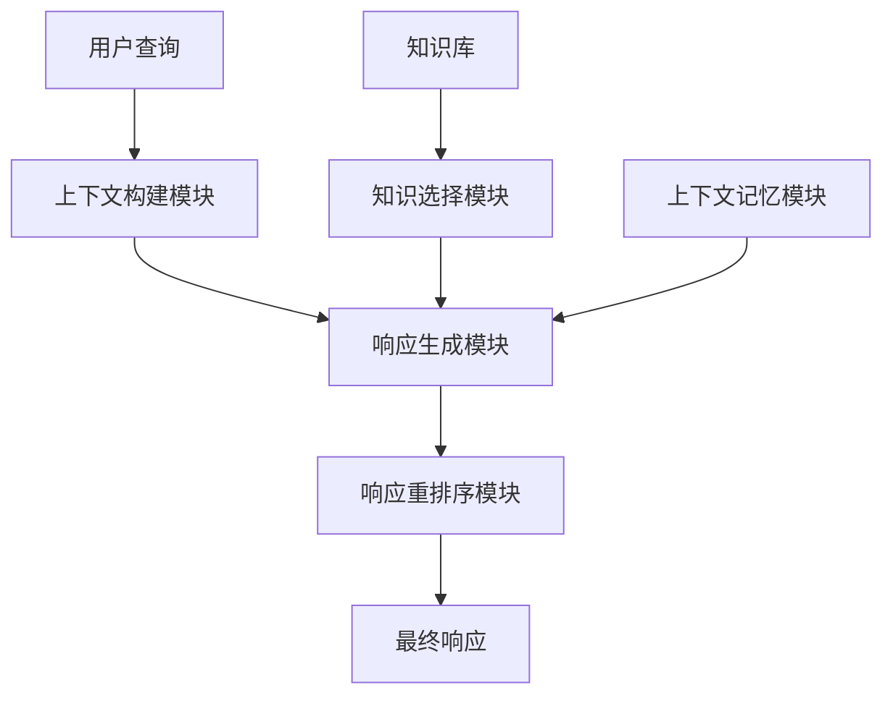

# CUI的上下文记忆与智能化回应

## 1. 背景介绍

### 1.1 问题的由来

在人机交互领域,命令行界面(Command-Line Interface,CLI)和图形用户界面(Graphical User Interface,GUI)长期占据主导地位。然而,随着人工智能技术的不断发展,一种新型的人机交互方式——对话式用户界面(Conversational User Interface,CUI)正在兴起。

CUI旨在通过自然语言对话的方式,让用户以更加自然、高效的方式与计算机系统进行交互。与CLI和GUI相比,CUI具有以下优势:

1. 交互方式自然,无需学习复杂的命令或图形操作。
2. 支持上下文理解,可根据对话历史做出智能响应。
3. 支持多模态输入(语音、文本等),交互更加便捷。
4. 支持个性化定制,可根据用户习惯调整对话风格。

然而,要实现真正智能化的CUI系统并非易事。其中,如何实现对话上下文的记忆和智能化回应是关键挑战之一。

### 1.2 研究现状  

目前,主流的CUI系统大多采用基于检索(Retrieval-Based)的方式进行上下文理解和响应生成。这种方法的核心思想是:将用户的查询映射到预先构建的问答对知识库中,从中检索出最匹配的回复。这种方法的优点是响应质量较高,但也存在一些明显缺陷:

1. 知识库构建成本高,且覆盖面有限。
2. 无法很好地理解和利用对话上下文信息。
3. 响应缺乏连贯性,难以支持多轮对话。

为了解决上述问题,近年来兴起了基于生成(Generation-Based)的CUI系统。这种方法利用大规模语料训练序列到序列(Seq2Seq)模型,根据对话历史动态生成回复。代表性工作包括:

- **转移交替神经网络(Transformer)**:使用自注意力机制建模长距离依赖,显著提高了上下文理解能力。
- **预训练语言模型(PLM)**:在大规模无监督语料上预训练,再通过有监督微调获得出色的对话生成能力。
- **记忆增强模型**:融合外部记忆模块,显式存储和利用对话历史信息。

尽管取得了长足进展,但现有的生成式CUI系统在上下文记忆和智能化回应方面仍存在不足,主要体现在以下几个方面:

1. **上下文利用不足**:虽然模型具备一定的上下文理解能力,但往往只关注局部上下文,难以把握全局对话主题。
2. **知识库孤立**:缺乏有效机制将外部知识库与对话模型相结合,知识利用率低。  
3. **响应质量参差**:生成的响应质量参差不齐,缺乏连贯性、信息丰富度和交互吸引力。
4. **可解释性差**:作为黑盒模型,其决策过程缺乏透明度,难以被人类理解和控制。

### 1.3 研究意义

设计一种能够高效利用上下文信息、外部知识,并生成高质量、可解释响应的CUI系统,将极大提升人机对话的自然性和智能化水平,为众多应用场景带来变革,包括:

- **智能助手**:可以作为个人助理,高效、友好地协助完成各种日常任务。
- **客户服务**:能够为企业提供7*24小时的智能化客户服务和咨询解答。
- **教育领域**:辅助教学、答疑解惑,提供个性化的交互式学习体验。  
- **医疗保健**:为患者提供智能问诊服务,辅助医生工作。
- **旅游导览**:基于位置和上下文,提供个性化的智能导游服务。

总之,构建一个上下文记忆和响应生成能力出众的CUI系统,将为人工智能系统赋予真正的"智能",是当前人机交互领域的重要研究方向。

### 1.4 本文结构

本文将围绕CUI的上下文记忆与智能化回应这一主题,首先介绍相关核心概念及其内在联系,接着深入探讨核心算法原理和数学模型,并结合实际项目实践给出详细的代码实例说明。之后,我们将讨论CUI的实际应用场景,以及未来的发展趋势和面临的挑战。最后,为读者推荐了相关的学习资源和开发工具。

通过本文的学习,您将全面了解CUI上下文记忆与智能化回应的方方面面,为开发下一代人机对话系统夯实理论和实践基础。

## 2. 核心概念与联系

要理解CUI的上下文记忆与智能化回应,我们首先需要掌握以下几个核心概念:

1. **上下文(Context)**
2. **对话管理(Dialogue Management)** 
3. **知识库(Knowledge Base)**
4. **响应生成(Response Generation)**

### 2.1 上下文(Context)

上下文是指对话过程中的相关背景信息,包括:

- **语境(Linguistic Context)**:对话的文字内容和语义信息。
- **场景(Scenario Context)**:对话发生的时间、地点、参与者等情境信息。
- **任务(Task Context)**:对话所围绕的目标或待完成的任务。
- **个人(Personal Context)**:对话参与者的个人信息、喜好等。

准确把握上下文对于生成恰当的响应至关重要。例如,对于"下周天气如何?"这个查询,如果上下文是"我要去旅行",系统就应该返回目的地的天气预报;如果上下文是"我有个户外活动",则应返回本地的天气情况。

### 2.2 对话管理(Dialogue Management)

对话管理模块负责维护对话状态,协调各模块的工作流程,并根据上下文信息决策下一步的对话行为。

在传统的基于检索的CUI系统中,对话管理主要包括以下几个步骤:

1. **语义解析**:将自然语言查询转换为结构化的语义表示。
2. **状态更新**:根据语义和对话历史,更新对话状态。
3. **行为决策**:基于对话状态,从候选响应中选择一个合适的行为。
4. **响应生成**:将选定的行为转换为自然语言响应。

而在新兴的基于生成的CUI系统中,对话管理的核心是上下文构建,即如何将多modalitye的上下文信息融合编码,为响应生成模块提供高质量的上下文表示。

### 2.3 知识库(Knowledge Base)

知识库存储了各种领域的知识facts,是CUI系统的重要知识源。将知识库与对话模型相结合,可以增强系统的理解和响应能力。

常见的知识库类型包括:

- **问答知识库**:存储问题及其对应的答案,常用于检索式QA系统。
- **三元组知识库**:以(主语,关系,宾语)的形式存储事实三元组。
- **知识图谱**:将实体及其关系以图的形式表示和存储。

知识库的构建和更新是一个永恒的话题。除了人工构建外,知识库也可以通过自动知识提取技术(如开放关系抽取、知识图谱自动构建等)从大规模语料中获取。

### 2.4 响应生成(Response Generation)

响应生成是CUI系统的核心模块,负责根据用户查询和上下文信息,生成自然、连贯、信息丰富的语言响应。

在基于检索的系统中,响应生成往往通过模板或规则的方式实现。而在基于生成的系统中,响应生成被建模为一个序列到序列(Seq2Seq)的生成任务,通常采用编码器-解码器的框架:

1. **编码器(Encoder)**:将查询和上下文信息编码为向量表示。
2. **解码器(Decoder)**:根据编码器的输出,自回归地生成响应序列。

近年来,受transformer和预训练语言模型的影响,基于生成的响应生成模型取得了长足进展,但仍面临信息质量、连贯性、多样性、可解释性等诸多挑战。

## 3. 核心算法原理 & 具体操作步骤  

### 3.1 算法原理概述

为了实现上下文记忆和智能化回应,我们提出了一种新颖的混合式框架,有机结合了基于生成和基于检索的方法,并融入了显式的上下文记忆和知识库引入机制。该框架的总体流程如下所示:

我们将详细介绍框架中每个模块的设计原理和实现细节。

### 3.2 算法步骤详解  

#### 3.2.1 上下文构建模块

上下文构建模块的目标是将多模态的上下文信息(如对话历史、场景信息等)融合编码,为后续的响应生成提供高质量的上下文表示。

我们采用了一种新颖的层次上下文编码器(Hierarchical Context Encoder)结构,能够同时捕获局部细节和全局主题信息:

1. **Token Encoder**:使用Transformer编码器对每个utterance进行编码,获取其词级特征表示。
2. **Utterance Encoder**:使用Transformer编码器对utterance级别的特征序列进行编码,获取utterance级别的表示。
3. **Context Encoder**:使用Transformer编码器对整个对话上下文的utterance级表示序列进行编码,获取全局上下文表示。

该层次结构不仅能够高效地建模长期上下文依赖,还能够灵活地融合其他模态信息(如视觉、音频等),为响应生成提供信息丰富的上下文表示。

#### 3.2.2 知识选择模块

知识选择模块的目标是从知识库中检索与当前对话上下文相关的知识facts,为响应生成提供所需的知识增强。

我们采用了一种新颖的知识选择策略,能够基于上下文对知识facts进行有效甄别:

1. **知识编码**:使用编码器模型(如BERT)对知识库中的facts进行编码,获取其语义向量表示。
2. **上下文匹配**:计算上下文表示与每个知识fact表示的相关性分数。
3. **排序和选择**:根据相关性分数,从知识库中选取Top-K相关的facts。

该模块可以高效地从大规模知识库中检索出与当前对话相关的知识,为响应生成提供所需的知识支持。

#### 3.2.3 响应生成模块  

响应生成模块的目标是根据上下文表示和选择的知识facts,生成自然、连贯、信息丰富的语言响应。

我们采用了一种新颖的知识增强响应生成器(Knowledge-Enhanced Response Generator)结构:

1. **编码器**:使用Transformer编码器对上下文表示和知识facts进行融合编码。
2. **解码器**:使用Transformer解码器根据编码器的输出,自回归地生成响应序列。
3. **知识注入**:在解码过程中,将相关知识facts的表示注入到解码器的注意力机制中,实现显式的知识利用。

该生成器能够充分利用上下文信息和外部知识,生成高质量、信息丰富的响应,显著提升了CUI系统的智能化水平。

#### 3.2.4 上下文记忆模块

上下文记忆模块的目标是跟踪和存储对话过程中的关键信息,为响应生成提供长期上下文依赖的支持。

我们采用了一种新颖的基于注意力的记忆编码机制:

1. **记忆初始化**:在对话开始时,将一个全零向量作为初始记忆状态。
2. **记忆更新**:在每一轮对话后,将当前utterance的表示与记忆状态进行注意力融合,获得更新后的记忆状态。
3. **记忆读取**:在生成响应时,将当前记忆状态作为额外的上下文输入,为响应生成提供长期依赖信息。

该机制能够显式地建模和存储对话过程中的关键信息,有效缓解了长期上下文遗忘的问题,提