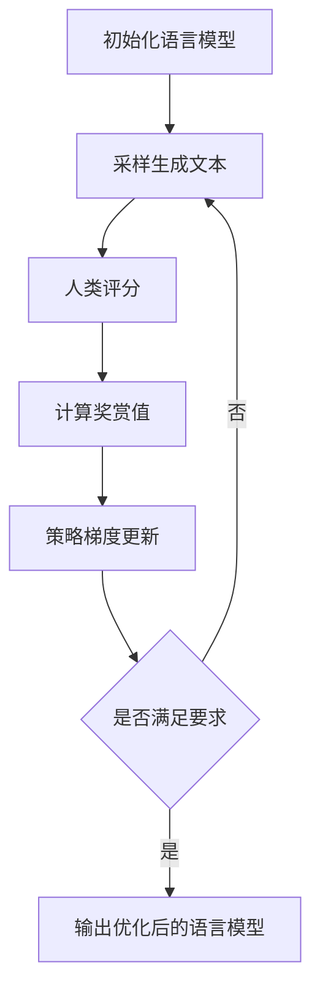

# ChatGPT的RLHF实战

## 1. 背景介绍

### 1.1 问题的由来

近年来,人工智能技术取得了长足的进步,尤其是自然语言处理(NLP)领域。大型语言模型(LLM)凭借其强大的生成能力,在很多领域展现出了巨大的潜力。然而,这些模型在训练过程中仅优化了令牌预测的目标,缺乏对输出质量的直接优化,因此可能会产生不合理、不安全或有害的输出。

为了解决这一问题,人们提出了一种新的训练范式——构建对齐的人工智能(Constitional AI),旨在使模型的行为与人类价值观相一致。其中,Reinforcement Learning from Human Feedback (RLHF)作为一种有前景的方法备受关注。

### 1.2 研究现状  

RLHF最早由Anthropic公司提出,并被应用于训练其ChatGPT模型。该方法的核心思想是利用人类反馈作为奖赏信号,通过强化学习算法优化语言模型,使其生成的输出更加符合人类偏好。

目前,RLHF已经成为训练对齐语言模型的主流方法之一。OpenAI在其发布的InstructGPT论文中,也采用了类似的方法来指导模型生成符合指令的输出。此外,还有一些公司和研究机构在探索RLHF及其变体,以期获得更好的对齐效果。

### 1.3 研究意义

RLHF作为一种有前景的对齐技术,对于构建可信赖的人工智能系统具有重要意义。通过RLHF训练,语言模型不仅能够生成高质量的文本输出,而且这些输出更加符合人类价值观,避免产生有害或不当的内容。这为人工智能系统在现实世界中的安全部署奠定了基础。

此外,RLHF过程中产生的人类反馈数据也是一种宝贵的资源,可用于分析和理解人类价值观,从而为构建对齐的人工智能系统提供理论支持。

### 1.4 本文结构

本文将全面介绍RLHF在ChatGPT训练中的实战应用。我们将从核心概念出发,阐述RLHF的原理和算法细节,并通过数学模型和公式予以理论支撑。接下来,我们将提供一个基于PyTorch的RLHF实现示例,并对代码进行详细解释。最后,我们将讨论RLHF在实际应用场景中的作用,以及未来的发展趋势和挑战。

## 2. 核心概念与联系

RLHF融合了强化学习(Reinforcement Learning)和人类反馈(Human Feedback)两个核心概念。我们先来理解这两个概念,以及它们在RLHF中的作用。

**强化学习**是一种基于环境交互的机器学习范式。在强化学习中,智能体(Agent)通过与环境(Environment)交互,获取状态(State)信息,并根据策略(Policy)选择行动(Action)。环境会根据行动给出奖赏(Reward)和转移到新的状态。智能体的目标是最大化长期累计奖赏。

在RLHF中,语言模型就是智能体,生成文本就是在与环境交互的过程。人类反馈被用作奖赏信号,语言模型的目标是最大化人类反馈的奖赏。

**人类反馈**是指人类对模型输出的评价或评分。这些反馈可以是明确的分数,也可以是对输出质量的文字描述。RLHF利用这些反馈作为奖赏信号,引导模型朝着符合人类价值观的方向优化。

将强化学习与人类反馈相结合,RLHF能够直接优化语言模型的输出质量,使其生成的文本更加符合人类期望。这种方法克服了传统语言模型训练中仅优化令牌预测目标的缺陷,有望产生更加可靠和对齐的人工智能系统。

## 3. 核心算法原理及具体操作步骤

### 3.1 算法原理概述

RLHF的核心思想是将语言模型的生成过程建模为一个马尔可夫决策过程(Markov Decision Process, MDP),并使用强化学习算法优化模型的策略,使其生成的输出能够最大化人类反馈的奖赏。

具体来说,RLHF将语言模型视为一个智能体,生成文本的过程就是与环境交互的过程。在每一个时间步,模型根据当前的状态(已生成的文本)和策略(语言模型的参数),选择一个行动(生成下一个词)。环境(人类评分者)会根据生成的文本给出奖赏(人类反馈分数)。模型的目标是通过调整策略(优化语言模型参数),最大化长期累计奖赏(生成高质量、符合人类期望的文本)。

为了实现这一目标,RLHF采用了一种叫做策略梯度(Policy Gradient)的强化学习算法。策略梯度算法通过估计策略的梯度,并沿着梯度方向更新策略参数,从而使长期累计奖赏最大化。

在RLHF的具体实现中,我们首先需要收集一个包含人类反馈的数据集。然后,我们使用策略梯度算法,将这些人类反馈作为奖赏信号,对语言模型的参数进行优化。优化过程中,我们不断生成文本、获取人类反馈,并根据反馈调整模型参数,直到模型能够生成符合人类期望的高质量输出。

### 3.2 算法步骤详解

RLHF算法的具体步骤如下:

1. **数据收集**:首先,我们需要收集一个包含人类反馈的数据集。这个数据集由一系列(文本、反馈分数)对组成,其中文本是语言模型生成的输出,反馈分数是人类对该输出的评价。

2. **初始化**:初始化一个预训练的语言模型,该模型将作为RLHF的初始策略。

3. **采样**:使用当前的语言模型(策略)生成一批文本样本。

4. **人类评分**:将生成的文本样本提交给人类评分者,获取每个样本的反馈分数。

5. **奖赏计算**:根据人类反馈分数计算每个样本的奖赏值。一种常见的方法是将反馈分数归一化到[0,1]区间,作为奖赏值。

6. **策略梯度更新**:使用策略梯度算法,根据奖赏值计算策略梯度,并沿着梯度方向更新语言模型(策略)的参数。

7. **迭代**:重复步骤3-6,直到模型的性能满足要求或达到预设的迭代次数。

在实际实现中,我们还需要考虑一些细节问题,如奖赏函数的设计、基线奖赏的引入、策略梯度估计的方法等。这些细节将在后面的章节中详细讨论。

### 3.3 算法优缺点

RLHF算法具有以下优点:

1. **直接优化输出质量**:与传统的语言模型训练方式不同,RLHF直接优化模型生成的文本输出,使其更加符合人类期望。

2. **灵活的奖赏函数**:RLHF可以使用各种形式的人类反馈作为奖赏信号,如数值分数、文字描述等,具有很强的灵活性。

3. **可解释性**:通过分析RLHF过程中产生的人类反馈数据,我们可以更好地理解人类价值观,提高模型的可解释性。

4. **通用性**:RLHF算法不仅可以应用于语言模型,也可以推广到其他类型的人工智能系统,如机器人控制、推荐系统等。

然而,RLHF算法也存在一些缺点和挑战:

1. **人力成本高**:RLHF需要大量的人类反馈数据,收集这些数据的人力成本非常高昂。

2. **样本效率低**:由于人类反馈的稀疏性,RLHF算法的样本效率较低,需要大量的样本才能有效优化模型。

3. **奖赏函数设计困难**:设计一个合理的奖赏函数并非trivial,需要平衡多个因素,如输出质量、一致性、安全性等。

4. **策略梯度不稳定**:策略梯度算法本身存在一些不稳定性,如高方差问题,需要采取一些技巧来缓解。

5. **局部最优陷阱**:RLHF的优化过程可能会陷入局部最优,无法找到全局最优解。

6. **偏差和公平性**:人类反馈本身可能存在偏差和不公平性,这可能会影响RLHF的优化结果。

### 3.4 算法应用领域

RLHF算法最初是为了训练对齐的语言模型而提出的,但它的应用范围远不止于此。事实上,任何需要将人类偏好或价值观纳入决策过程的人工智能系统,都可以考虑采用RLHF或类似的方法。

以下是RLHF算法的一些潜在应用领域:

1. **自然语言处理**:除了语言模型之外,RLHF也可以应用于其他NLP任务,如机器翻译、文本摘要、对话系统等。

2. **机器人控制**:在机器人控制领域,我们可以使用RLHF来优化机器人的行为策略,使其更加符合人类期望。

3. **推荐系统**:将RLHF应用于推荐系统,可以根据用户反馈优化推荐算法,提供更加个性化和符合用户偏好的推荐结果。

4. **游戏AI**:在游戏AI领域,RLHF可以用于训练更加人性化的游戏AI代理,使其行为更加符合人类玩家的期望。

5. **医疗决策支持**:在医疗领域,我们可以利用RLHF将医生的专业知识和经验纳入决策过程,提高医疗决策的质量和可靠性。

6. **教育智能辅助**:RLHF可以应用于教育智能辅助系统,根据学生的反馈优化教学策略,提供更加个性化和高效的教学服务。

总的来说,RLHF算法为构建对齐的人工智能系统提供了一种有前景的方法,有望在各个领域发挥重要作用。

## 4. 数学模型和公式及详细讲解与举例说明

在上一节中,我们介绍了RLHF算法的原理和步骤。现在,我们将使用数学模型和公式对其进行理论支撑,并通过具体案例进行详细讲解。

### 4.1 数学模型构建

在RLHF中,我们将语言模型的生成过程建模为一个马尔可夫决策过程(MDP)。MDP是一种用于描述序列决策问题的数学框架,由以下几个要素组成:

- 状态集合 $\mathcal{S}$
- 行动集合 $\mathcal{A}$
- 转移概率 $\mathcal{P}_{ss'}^a = \mathbb{P}(s_{t+1}=s'|s_t=s, a_t=a)$
- 奖赏函数 $\mathcal{R}: \mathcal{S} \times \mathcal{A} \rightarrow \mathbb{R}$
- 折扣因子 $\gamma \in [0, 1]$

对于语言模型生成过程,我们可以将状态 $s_t$ 定义为已生成的文本前缀,行动 $a_t$ 定义为生成的下一个词。转移概率 $\mathcal{P}_{ss'}^a$ 由语言模型的条件概率分布给出,即 $\mathcal{P}_{ss'}^a = P(w_{t+1}|s_t, a_t)$,其中 $w_{t+1}$ 是生成的下一个词。

奖赏函数 $\mathcal{R}$ 是RLHF中最关键的部分