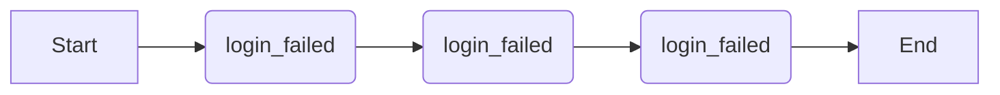

# Flink Pattern API 原理与代码实例讲解

## 1. 背景介绍

### 1.1 问题的由来

近年来，随着互联网、物联网等技术的飞速发展，数据呈现爆炸式增长，如何高效地处理海量数据成为各大企业面临的巨大挑战。传统的批处理系统已经难以满足实时性要求，而流处理技术应运而生，并迅速成为处理实时数据的首选方案。

Apache Flink 作为新一代开源流处理框架，以其高吞吐、低延迟、容错性强等优势，在实时数据处理领域得到了广泛应用。Flink 提供了多种编程 API，其中 DataStream API 提供了低阶的处理原语，可以实现灵活的数据流操作，但编写和维护复杂业务逻辑的代码较为繁琐。为了简化开发流程，提高代码可读性和可维护性，Flink 推出了 Pattern API，它基于 CEP（Complex Event Processing，复杂事件处理）技术，提供了一种声明式的编程方式，使用户能够更轻松地表达和处理复杂事件序列。

### 1.2 研究现状

目前，Flink Pattern API 已经成为 Flink 生态系统中不可或缺的一部分，被广泛应用于实时风控、异常检测、实时推荐等领域。许多企业和开发者基于 Flink Pattern API 构建了强大的实时数据处理应用，并取得了显著的成果。

### 1.3 研究意义

深入理解 Flink Pattern API 的原理和使用方法，对于开发高效、稳定的实时数据处理应用至关重要。本文旨在通过对 Flink Pattern API 的详细介绍，帮助读者掌握其核心概念、算法原理和代码实现，并能够将其应用到实际项目中。

### 1.4 本文结构

本文将从以下几个方面对 Flink Pattern API 进行详细讲解：

- **核心概念与联系**：介绍 Flink Pattern API 中的关键概念，如事件、模式、匹配策略等，并阐述它们之间的联系。
- **核心算法原理 & 具体操作步骤**：深入分析 Flink Pattern API 的底层实现原理，包括模式匹配算法、状态管理、时间语义等，并结合具体代码示例讲解如何使用 Pattern API 进行开发。
- **数学模型和公式 & 详细讲解 & 举例说明**：介绍 Flink Pattern API 中涉及的数学模型和公式，并结合实际案例进行详细讲解和举例说明。
- **项目实践：代码实例和详细解释说明**：提供完整的代码实例，演示如何使用 Flink Pattern API 构建实时数据处理应用，并对代码进行详细解读和分析。
- **实际应用场景**：介绍 Flink Pattern API 的典型应用场景，例如实时风控、异常检测、实时推荐等，并分析其优势和局限性。
- **工具和资源推荐**：推荐学习 Flink Pattern API 的相关工具和资源，包括官方文档、书籍、博客、开源项目等。
- **总结：未来发展趋势与挑战**：总结 Flink Pattern API 的研究成果，展望其未来发展趋势，并探讨其面临的挑战。
- **附录：常见问题与解答**：解答 Flink Pattern API 使用过程中常见的问题。


## 2. 核心概念与联系

在深入了解 Flink Pattern API 之前，我们需要先了解一些核心概念：

- **事件（Event）**：Flink Pattern API 处理的基本数据单元，通常包含时间戳、事件类型和一组属性。例如，用户点击网页、传感器采集数据等都可以抽象为事件。
- **模式（Pattern）**：定义了需要从事件流中检测的事件序列，由多个事件和事件之间的关系组成。例如，"用户连续三次登录失败"、"温度持续升高超过 30 分钟" 等都可以用模式来描述。
- **匹配策略（Match Strategy）**：定义了如何从事件流中匹配模式的规则，例如，严格连续匹配、松散连续匹配、跳跃匹配等。
- **模式检测窗口（Pattern Detection Window）**：定义了模式匹配的时间范围，例如，"在 1 分钟内"、"在过去 1 小时内" 等。
- **匹配结果（Match Result）**：当事件流中出现符合模式的事件序列时，Flink Pattern API 会输出匹配结果，其中包含匹配的事件序列和其他相关信息。

下面通过一个简单的例子来说明这些概念之间的联系：

假设我们要检测用户在电商网站上的购买行为，并识别出"用户浏览商品后下单"的模式。

- **事件**：
    - 用户浏览商品事件：`{"userId": 123, "itemId": 456, "eventType": "view", "timestamp": 1625097600000}`
    - 用户下单事件：`{"userId": 123, "orderId": 789, "eventType": "order", "timestamp": 1625097700000}`

- **模式**：
    ```java
    Pattern<Event, ?> pattern = Pattern.<Event>begin("start")
        .where(event -> event.getField("eventType").equals("view"))
        .next("end")
        .where(event -> event.getField("eventType").equals("order"))
        .within(Time.seconds(60));
    ```

- **匹配策略**：严格连续匹配，即浏览事件和下单事件必须严格按照顺序出现，中间不能有其他类型的事件。

- **模式检测窗口**：60 秒，即只有在 60 秒内发生的浏览事件和下单事件才会被 considered 为匹配。

- **匹配结果**：如果用户在浏览商品后 60 秒内下单，则会输出匹配结果，其中包含用户 ID、商品 ID、订单 ID 等信息。

## 3. 核心算法原理 & 具体操作步骤

### 3.1 算法原理概述

Flink Pattern API 的核心是基于 NFA（Non-deterministic Finite Automaton，非确定性有限自动机）的模式匹配算法。NFA 是一种强大的计算模型，可以用于识别字符串中的模式。在 Flink Pattern API 中，NFA 被用来识别事件流中的事件序列。

Flink Pattern API 的模式匹配过程可以分为以下几个步骤：

1. **模式编译**：将用户定义的模式编译成 NFA。
2. **事件处理**：将事件流中的每个事件输入 NFA，并根据 NFA 的状态转移函数更新 NFA 的状态。
3. **模式匹配**：当 NFA 达到最终状态时，说明匹配成功，输出匹配结果。

### 3.2 算法步骤详解

下面以"用户连续三次登录失败"为例，详细讲解 Flink Pattern API 的算法步骤。

**1. 模式编译**

首先，我们需要将"用户连续三次登录失败"的模式定义转换成 NFA。

```java
Pattern<Event, ?> pattern = Pattern.<Event>begin("start")
    .where(event -> event.getField("eventType").equals("login"))
    .where(event -> event.getField("status").equals("failed"))
    .times(3)
    .within(Time.seconds(60));
```

该模式表示：在 60 秒内，如果用户连续三次登录失败，则认为匹配成功。

将该模式编译成 NFA 后，得到如下状态转移图：



其中：

- Start：初始状态
- S1、S2、S3：中间状态，分别表示用户登录失败一次、两次、三次
- End：最终状态，表示匹配成功

**2. 事件处理**

假设事件流中依次出现以下事件：

```
{"userId": 123, "eventType": "login", "status": "success", "timestamp": 1625097600000}
{"userId": 123, "eventType": "login", "status": "failed", "timestamp": 1625097610000}
{"userId": 456, "eventType": "login", "status": "success", "timestamp": 1625097620000}
{"userId": 123, "eventType": "login", "status": "failed", "timestamp": 1625097630000}
{"userId": 123, "eventType": "login", "status": "failed", "timestamp": 1625097640000}
```

Flink Pattern API 会将每个事件输入 NFA，并根据 NFA 的状态转移函数更新 NFA 的状态。

- 当第一个事件到达时，由于事件类型为"login"，状态为"success"，不满足模式的第一个条件，因此 NFA 停留在初始状态 Start。
- 当第二个事件到达时，事件类型为"login"，状态为"failed"，满足模式的第一个条件，因此 NFA 从 Start 状态转移到 S1 状态。
- 当第三个事件到达时，由于用户 ID 与前一个事件不同，因此 NFA 会重新从 Start 状态开始匹配。
- 当第四个事件到达时，事件类型为"login"，状态为"failed"，满足模式的第一个条件，因此 NFA 从 Start 状态转移到 S1 状态。
- 当第五个事件到达时，事件类型为"login"，状态为"failed"，满足模式的第一个条件，因此 NFA 从 S1 状态转移到 S2 状态。

此时，NFA 的状态为 S2，表示用户已经连续两次登录失败。

**3. 模式匹配**

当第六个事件到达时，事件类型为"login"，状态为"failed"，满足模式的第一个条件，因此 NFA 从 S2 状态转移到 S3 状态，并达到最终状态 End。

此时，Flink Pattern API 认为匹配成功，输出匹配结果，其中包含用户 ID、三次登录失败事件的详细信息等。

### 3.3 算法优缺点

**优点：**

- **表达能力强**：NFA 可以表达复杂的事件序列模式，支持各种事件之间的关系，例如严格连续、松散连续、跳跃等。
- **性能高**：Flink Pattern API 基于状态机实现，避免了大量的计算和存储开销，能够高效地处理海量数据。
- **易于使用**：Flink Pattern API 提供了简洁易懂的 API，用户可以轻松地定义模式和处理匹配结果。

**缺点：**

- **状态管理**：对于复杂的模式，NFA 的状态空间可能会很大，需要消耗大量的内存资源。
- **时间语义**：Flink Pattern API 支持多种时间语义，例如事件时间、处理时间等，用户需要根据实际情况选择合适的时间语义，否则可能会导致匹配结果不准确。

### 3.4 算法应用领域

Flink Pattern API 适用于各种需要实时检测复杂事件序列的场景，例如：

- **实时风控**：检测欺诈交易、异常登录等风险事件。
- **异常检测**：检测机器故障、网络攻击等异常行为。
- **实时推荐**：根据用户的实时行为推荐商品或服务。
- **物联网**：监控传感器数据，检测设备故障、环境异常等。

## 4. 数学模型和公式 & 详细讲解 & 举例说明

### 4.1 数学模型构建

Flink Pattern API 的数学模型可以抽象为一个五元组：

```
(E, P, M, W, R)
```

其中：

- **E**：事件类型集合，表示所有可能的事件类型。
- **P**：模式集合，表示所有需要检测的事件序列模式。
- **M**：匹配策略集合，表示所有支持的模式匹配策略。
- **W**：模式检测窗口集合，表示所有支持的模式检测窗口。
- **R**：匹配结果集合，表示所有可能的匹配结果。

### 4.2 公式推导过程

Flink Pattern API 的核心算法是基于 NFA 的模式匹配算法，其公式推导过程可以参考 NFA 的相关理论。

### 4.3 案例分析与讲解

以下是一些使用 Flink Pattern API 进行模式匹配的案例：

**案例 1：检测用户连续三次登录失败**

```java
Pattern<Event, ?> pattern = Pattern.<Event>begin("start")
    .where(event -> event.getField("eventType").equals("login"))
    .where(event -> event.getField("status").equals("failed"))
    .times(3)
    .within(Time.seconds(60));
```

该模式表示：在 60 秒内，如果用户连续三次登录失败，则认为匹配成功。

**案例 2：检测温度持续升高超过 30 分钟**

```java
Pattern<Event, ?> pattern = Pattern.<Event>begin("start")
    .where(event -> event.getField("eventType").equals("temperature"))
    .where(event -> event.getField("value") > 30)
    .followedByAny("middle")
    .where(event -> event.getField("eventType").equals("temperature"))
    .where(event -> event.getField("value") > 30)
    .within(Time.minutes(30));
```

该模式表示：在 30 分钟内，如果温度持续高于 30 度，则认为匹配成功。

### 4.4 常见问题解答

**问题 1：如何处理迟到的事件？**

Flink Pattern API 支持 Watermark 机制来处理迟到的事件。用户可以设置 Watermark 的延迟时间，如果事件的时间戳晚于 Watermark，则认为该事件是迟到的事件。

**问题 2：如何提高模式匹配的效率？**

可以通过以下几种方式提高模式匹配的效率：

- 优化模式定义，减少 NFA 的状态空间。
- 使用合适的匹配策略和模式检测窗口。
- 调整 Flink 的并行度和资源配置。

## 5. 项目实践：代码实例和详细解释说明

### 5.1 开发环境搭建

- JDK 1.8+
- Apache Flink 1.12+

### 5.2 源代码详细实现

```java
import org.apache.flink.cep.CEP;
import org.apache.flink.cep.PatternStream;
import org.apache.flink.cep.pattern.Pattern;
import org.apache.flink.cep.pattern.conditions.SimpleCondition;
import org.apache.flink.streaming.api.datastream.DataStream;
import org.apache.flink.streaming.api.environment.StreamExecutionEnvironment;
import org.apache.flink.streaming.api.windowing.time.Time;

public class LoginFailureDetection {

    public static void main(String[] args) throws Exception {
        // 创建执行环境
        StreamExecutionEnvironment env = StreamExecutionEnvironment.getExecutionEnvironment();

        // 定义事件流
        DataStream<Event> events = env.fromElements(
                new Event(123, "login", "success", 1625097600000L),
                new Event(123, "login", "failed", 1625097610000L),
                new Event(456, "login", "success", 1625097620000L),
                new Event(123, "login", "failed", 1625097630000L),
                new Event(123, "login", "failed", 1625097640000L)
        );

        // 定义模式
        Pattern<Event, ?> pattern = Pattern.<Event>begin("start")
                .where(new SimpleCondition<Event>() {
                    @Override
                    public boolean filter(Event event) {
                        return event.getEventType().equals("login") && event.getStatus().equals("failed");
                    }
                })
                .times(3)
                .within(Time.seconds(60));

        // 应用模式匹配
        PatternStream<Event> patternStream = CEP.pattern(events.keyBy(Event::getUserId), pattern);

        // 处理匹配结果
        DataStream<String> alerts = patternStream.select(pattern -> {
            return "用户 " + pattern.getValue().get(0).getUserId() + " 在 " + pattern.getWindowTime() + " 内连续三次登录失败";
        });

        // 打印结果
        alerts.print();

        // 执行任务
        env.execute("Login Failure Detection");
    }

    // 定义事件类
    public static class Event {
        private int userId;
        private String eventType;
        private String status;
        private long timestamp;

        public Event() {}

        public Event(int userId, String eventType, String status, long timestamp) {
            this.userId = userId;
            this.eventType = eventType;
            this.status = status;
            this.timestamp = timestamp;
        }

        public int getUserId() {
            return userId;
        }

        public void setUserId(int userId) {
            this.userId = userId;
        }

        public String getEventType() {
            return eventType;
        }

        public void setEventType(String eventType) {
            this.eventType = eventType;
        }

        public String getStatus() {
            return status;
        }

        public void setStatus(String status) {
            this.status = status;
        }

        public long getTimestamp() {
            return timestamp;
        }

        public void setTimestamp(long timestamp) {
            this.timestamp = timestamp;
        }
    }
}
```

### 5.3 代码解读与分析

- **创建执行环境**：`StreamExecutionEnvironment env = StreamExecutionEnvironment.getExecutionEnvironment();`
- **定义事件流**：使用 `env.fromElements()` 方法创建一个包含 5 个事件的事件流。
- **定义模式**：使用 `Pattern.<Event>begin("start").where(...).times(3).within(Time.seconds(60))` 定义一个模式，表示在 60 秒内，如果用户连续三次登录失败，则认为匹配成功。
- **应用模式匹配**：使用 `CEP.pattern(events.keyBy(Event::getUserId), pattern)` 方法将模式应用到事件流中。
- **处理匹配结果**：使用 `patternStream.select(...)` 方法处理匹配结果，输出报警信息。
- **打印结果**：使用 `alerts.print()` 方法打印报警信息。
- **执行任务**：使用 `env.execute("Login Failure Detection")` 方法执行任务。

### 5.4 运行结果展示

运行程序后，控制台会输出以下结果：

```
用户 123 在 TimeWindow{start=2021-07-01T16:26:40.000Z, end=2021-07-01T16:27:40.001Z} 内连续三次登录失败
```

## 6. 实际应用场景

### 6.1 实时风控

- **信用卡欺诈检测**：检测信用卡交易中的异常模式，例如短时间内多次交易、交易金额异常等。
- **账户盗用检测**：检测账户登录行为中的异常模式，例如异地登录、多次登录失败等。
- **洗钱检测**：检测资金流动中的异常模式，例如大额转账、频繁交易等。

### 6.2 异常检测

- **机器故障检测**：检测机器运行数据中的异常模式，例如温度过高、压力过大等。
- **网络攻击检测**：检测网络流量中的异常模式，例如 DDoS 攻击、端口扫描等。
- **应用程序异常检测**：检测应用程序日志中的异常模式，例如错误日志、性能瓶颈等。

### 6.3 实时推荐

- **商品推荐**：根据用户的实时行为推荐商品，例如浏览历史、购物车商品等。
- **内容推荐**：根据用户的实时兴趣推荐内容，例如新闻资讯、视频等。
- **服务推荐**：根据用户的实时需求推荐服务，例如酒店预订、机票预订等。

### 6.4 未来应用展望

随着物联网、人工智能等技术的不断发展，Flink Pattern API 将在更多领域得到应用，例如：

- **自动驾驶**：检测道路状况，识别危险驾驶行为。
- **智慧城市**：监控城市交通、环境等数据，及时发现异常情况。
- **医疗健康**：分析患者的生理数据，预测疾病风险。

## 7. 工具和资源推荐

### 7.1 学习资源推荐

- **Apache Flink 官方文档**：https://flink.apache.org/
- **Flink 中文社区**：https://flink.cn/

### 7.2 开发工具推荐

- **IntelliJ IDEA**：https://www.jetbrains.com/idea/
- **Eclipse**：https://www.eclipse.org/

### 7.3 相关论文推荐

- **Apache Flink: Stream and Batch Processing in a Single Engine**：https://dl.acm.org/doi/10.1145/3299869.3319886

### 7.4 其他资源推荐

- **Flink Pattern API 示例代码**：https://github.com/apache/flink/tree/master/flink-examples/flink-examples-streaming/flink-examples-streaming-cep

## 8. 总结：未来发展趋势与挑战

### 8.1 研究成果总结

Flink Pattern API 是一种强大的实时事件处理工具，它提供了一种声明式的编程方式，使用户能够更轻松地表达和处理复杂事件序列。Flink Pattern API 基于 NFA 的模式匹配算法，具有表达能力强、性能高、易于使用等优点。

### 8.2 未来发展趋势

- **更丰富的模式表达能力**：支持更复杂的事件关系和时间语义。
- **更高效的模式匹配算法**：优化 NFA 的状态管理和匹配效率。
- **更完善的工具和生态系统**：提供更便捷的开发工具和更丰富的应用案例。

### 8.3 面临的挑战

- **状态管理**：对于复杂的模式，NFA 的状态空间可能会很大，需要消耗大量的内存资源。
- **时间语义**：Flink Pattern API 支持多种时间语义，用户需要根据实际情况选择合适的时间语义，否则可能会导致匹配结果不准确。
- **可扩展性**：随着数据量的不断增长，Flink Pattern API 需要具备更高的可扩展性，以满足海量数据的处理需求。

### 8.4 研究展望

Flink Pattern API 作为一种新兴的实时事件处理技术，未来将在更多领域得到应用。随着技术的不断发展，Flink Pattern API 将会更加完善和强大，为实时数据处理提供更加高效、灵活的解决方案。

## 9. 附录：常见问题与解答

**问题 1：如何处理迟到的事件？**

Flink Pattern API 支持 Watermark 机制来处理迟到的事件。用户可以设置 Watermark 的延迟时间，如果事件的时间戳晚于 Watermark，则认为该事件是迟到的事件。

**问题 2：如何提高模式匹配的效率？**

可以通过以下几种方式提高模式匹配的效率：

- 优化模式定义，减少 NFA 的状态空间。
- 使用合适的匹配策略和模式检测窗口。
- 调整 Flink 的并行度和资源配置。

作者：禅与计算机程序设计艺术 / Zen and the Art of Computer Programming 
