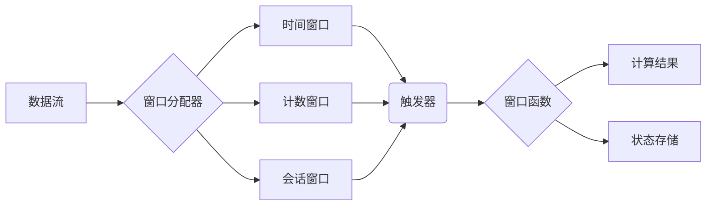

# Flink Window 原理与代码实例讲解

## 1. 背景介绍

### 1.1 问题的由来

在当今大数据时代，实时数据处理已经成为许多应用场景的基石。从电商平台的用户行为分析，到物联网设备的实时监控，再到金融领域的风险控制，实时数据处理技术都在发挥着至关重要的作用。而 Apache Flink 作为一款优秀的开源流处理框架，以其高吞吐、低延迟、容错性强等特点，成为了实时数据处理领域的首选方案之一。

然而，实时数据流通常是无限的、无序的，直接对海量数据进行处理往往是低效且不切实际的。为了解决这个问题，我们需要将数据流按照一定的规则进行切分，并在有限的数据集上进行计算。这就是 Flink Window 机制的作用所在。

### 1.2 研究现状

目前，Flink Window 机制已经发展得相当成熟，并被广泛应用于各种实时数据处理场景。Flink 提供了多种类型的窗口，包括时间窗口、计数窗口、会话窗口等，以及丰富的窗口操作函数，可以满足各种复杂的业务需求。

### 1.3 研究意义

深入理解 Flink Window 的原理和使用方法，对于我们构建高效、可靠的实时数据处理系统至关重要。本文将从原理出发，结合代码实例，详细讲解 Flink Window 的各个方面，帮助读者更好地掌握这一核心技术。

### 1.4 本文结构

本文将按照以下结构展开：

- **第二章：核心概念与联系**：介绍 Flink Window 的核心概念，包括窗口类型、触发器、状态管理等，并阐述它们之间的联系。
- **第三章：核心算法原理 & 具体操作步骤**：深入剖析 Flink Window 的内部机制，讲解窗口的创建、数据的分配、计算结果的输出等过程。
- **第四章：数学模型和公式 & 详细讲解 & 举例说明**：以数学模型的方式，对 Flink Window 的一些关键指标进行量化分析，并通过实例演示如何根据实际需求选择合适的窗口类型和参数。
- **第五章：项目实践：代码实例和详细解释说明**：通过一个完整的代码实例，演示如何使用 Flink Window 实现一个实用的实时数据处理应用。
- **第六章：实际应用场景**：介绍 Flink Window 在实际项目中的应用案例，例如实时统计、异常检测、推荐系统等。
- **第七章：工具和资源推荐**：推荐一些学习 Flink Window 的书籍、网站、开源项目等资源。
- **第八章：总结：未来发展趋势与挑战**：总结 Flink Window 的优势和不足，展望其未来发展趋势，并探讨其面临的挑战。

## 2. 核心概念与联系

### 2.1 窗口类型

Flink 提供了多种类型的窗口，以满足不同的业务需求：

- **时间窗口（Time Window）**：按照时间间隔对数据流进行切分，例如每隔 5 秒钟创建一个窗口。
    - **滚动窗口（Tumbling Window）**：窗口之间没有重叠，每个数据元素只属于一个窗口。
    - **滑动窗口（Sliding Window）**：窗口之间存在重叠，一个数据元素可能属于多个窗口。
- **计数窗口（Count Window）**：按照数据元素的数量对数据流进行切分，例如每收到 100 条数据创建一个窗口。
- **会话窗口（Session Window）**：根据数据流中元素之间的时间间隔进行动态划分，用于识别用户行为的会话。
- **全局窗口（Global Window）**：将所有数据元素分配到同一个窗口中，通常用于计算全局统计指标。

### 2.2 触发器

触发器决定了何时对窗口中的数据进行计算并输出结果。Flink 提供了多种类型的触发器：

- **事件时间触发器（Event Time Trigger）**：根据数据元素自身携带的时间戳进行触发，可以保证结果的准确性，但需要考虑数据乱序的情况。
- **处理时间触发器（Processing Time Trigger）**：根据 Flink 系统的处理时间进行触发，无法保证结果的准确性，但延迟较低。
- **自定义触发器（Custom Trigger）**：用户可以根据自身需求自定义触发逻辑。

### 2.3 状态管理

Flink Window 需要维护窗口内数据的中间状态，例如计数、求和等。Flink 提供了多种状态存储后端：

- **内存状态存储（MemoryStateBackend）**：将状态数据存储在内存中，速度快但容量有限。
- **文件系统状态存储（FsStateBackend）**：将状态数据存储在文件系统中，容量大但速度较慢。
- **RocksDB 状态存储（RocksDBStateBackend）**：将状态数据存储在 RocksDB 数据库中，兼顾了速度和容量。

### 2.4 核心概念之间的联系

下图展示了 Flink Window 核心概念之间的联系：



- 数据流首先进入窗口分配器，根据窗口类型和参数将数据元素分配到不同的窗口中。
- 每个窗口都绑定一个触发器，用于决定何时对窗口中的数据进行计算。
- 窗口函数对窗口内的数据进行聚合计算，并将结果输出。
- 窗口的状态数据存储在状态存储后端中，用于维护窗口的中间计算结果。

## 3. 核心算法原理 & 具体操作步骤

### 3.1 算法原理概述

Flink Window 的核心算法是基于事件时间的流处理模型。该模型将数据流视为一个按照事件时间顺序排列的事件序列，并通过水印（Watermark）机制来处理数据乱序问题。

### 3.2 算法步骤详解

Flink Window 的处理流程可以概括为以下几个步骤：

1. **数据源读取**：从数据源读取数据流。
2. **窗口分配**：根据窗口类型和参数，将数据元素分配到不同的窗口中。
3. **状态更新**：根据窗口函数的逻辑，更新窗口的状态数据。
4. **触发计算**：当触发器条件满足时，对窗口内的数据进行计算，并输出结果。
5. **状态清理**：当窗口不再活跃时，清理其状态数据。

### 3.3 算法优缺点

**优点：**

- **高吞吐、低延迟**：Flink 采用基于内存的计算模型，并支持数据流的并行处理，因此具有很高的吞吐量和较低的延迟。
- **容错性强**：Flink 支持数据流的 checkpoint 机制，可以保证数据处理过程的可靠性。
- **易于使用**：Flink 提供了丰富的 API 和操作符，可以方便地实现各种窗口操作。

**缺点：**

- **状态管理开销**：Flink Window 需要维护窗口的状态数据，这会带来一定的内存开销。
- **数据倾斜问题**：如果数据分布不均匀，可能会导致某些窗口的数据量过大，影响处理效率。

### 3.4 算法应用领域

Flink Window 适用于各种实时数据处理场景，例如：

- **实时统计**：例如计算网站的 PV、UV、转化率等指标。
- **异常检测**：例如识别网络攻击、欺诈行为等异常事件。
- **推荐系统**：例如根据用户的实时行为推荐相关商品或服务。
- **风险控制**：例如实时监控金融交易，识别异常交易行为。

## 4. 数学模型和公式 & 详细讲解 & 举例说明

### 4.1 数学模型构建

为了更好地理解 Flink Window 的工作原理，我们可以将其抽象成一个数学模型。假设数据流表示为一个事件序列：

```
E = {e1, e2, ..., en}
```

其中，每个事件 ei 都包含一个时间戳 ti。窗口可以表示为一个时间区间：

```
W = [ts, te)
```

其中，ts 表示窗口的起始时间，te 表示窗口的结束时间。窗口函数可以表示为一个函数：

```
f: E -> R
```

该函数将窗口内的事件序列映射为一个结果值。

### 4.2 公式推导过程

Flink Window 的计算过程可以表示为以下公式：

```
result = f({ei | ti ∈ W})
```

该公式表示，对所有时间戳在窗口 W 内的事件 ei 应用窗口函数 f，得到最终的计算结果。

### 4.3 案例分析与讲解

例如，假设我们要计算每分钟网站的访问量，可以使用 Flink 的滚动时间窗口来实现。假设窗口大小为 1 分钟，窗口函数为 count()，则计算过程如下：

1. 将数据流按照 1 分钟的时间间隔进行切分，每个时间间隔构成一个窗口。
2. 对每个窗口内的事件应用 count() 函数，统计事件的数量，即为该分钟内的网站访问量。

### 4.4 常见问题解答

**1. 如何处理数据乱序问题？**

Flink 通过水印机制来处理数据乱序问题。水印是一个全局的、递增的时间戳，用于标识已经处理完的数据的时间点。当 Flink 收到一个水印时，会将所有时间戳小于该水印的事件视为已经到达，并触发窗口计算。

**2. 如何选择合适的窗口类型和参数？**

选择合适的窗口类型和参数需要根据具体的业务需求进行考虑。例如，如果要计算每分钟的网站访问量，可以使用滚动时间窗口；如果要计算每 1000 个用户的平均年龄，可以使用计数窗口。

## 5. 项目实践：代码实例和详细解释说明

### 5.1 开发环境搭建

首先，需要搭建 Flink 的开发环境。可以参考 Flink 官网的文档进行安装和配置。

### 5.2 源代码详细实现

以下是一个使用 Flink Window 计算每分钟网站访问量的代码实例：

```java
import org.apache.flink.api.common.functions.FlatMapFunction;
import org.apache.flink.api.java.tuple.Tuple2;
import org.apache.flink.streaming.api.datastream.DataStream;
import org.apache.flink.streaming.api.environment.StreamExecutionEnvironment;
import org.apache.flink.streaming.api.windowing.assigners.TumblingProcessingTimeWindows;
import org.apache.flink.streaming.api.windowing.time.Time;
import org.apache.flink.util.Collector;

public class WebsiteTrafficAnalysis {

    public static void main(String[] args) throws Exception {
        // 创建执行环境
        StreamExecutionEnvironment env = StreamExecutionEnvironment.getExecutionEnvironment();

        // 创建数据源
        DataStream<String> lines = env.socketTextStream("localhost", 9999);

        // 数据预处理
        DataStream<Tuple2<String, Integer>> pageViews = lines.flatMap(new FlatMapFunction<String, Tuple2<String, Integer>>() {
            @Override
            public void flatMap(String line, Collector<Tuple2<String, Integer>> out) throws Exception {
                String[] fields = line.split(",");
                if (fields.length == 2) {
                    out.collect(new Tuple2<>(fields[0], Integer.parseInt(fields[1])));
                }
            }
        });

        // 按照页面 URL 进行分组
        DataStream<Tuple2<String, Integer>> pageCounts = pageViews
                .keyBy(0)
                // 设置滚动时间窗口，窗口大小为 1 分钟
                .window(TumblingProcessingTimeWindows.of(Time.minutes(1)))
                // 对窗口内的数据进行求和
                .sum(1);

        // 打印输出结果
        pageCounts.print();

        // 执行程序
        env.execute("Website Traffic Analysis");
    }
}
```

### 5.3 代码解读与分析

- 首先，创建 Flink 的执行环境，并创建一个 Socket 数据源。
- 然后，对数据进行预处理，将每行数据解析为一个 Tuple2 对象，其中第一个元素表示页面 URL，第二个元素表示访问次数。
- 接着，按照页面 URL 进行分组，并设置滚动时间窗口，窗口大小为 1 分钟。
- 最后，对窗口内的数据进行求和，得到每个页面每分钟的访问量，并将结果打印输出。

### 5.4 运行结果展示

运行程序后，可以通过 netcat 等工具向 Socket 端口发送数据，例如：

```
pageA,1
pageB,2
pageA,1
```

程序会每分钟统计一次每个页面的访问量，并将结果打印输出，例如：

```
(pageA,2)
(pageB,2)
```

## 6. 实际应用场景

### 6.1 实时统计

Flink Window 可以用于实时统计各种指标，例如网站的 PV、UV、转化率等。例如，可以使用滚动时间窗口统计每分钟的网站访问量，使用滑动时间窗口统计每 5 分钟内访问网站的不同用户数。

### 6.2 异常检测

Flink Window 可以用于实时检测异常事件，例如网络攻击、欺诈行为等。例如，可以使用会话窗口识别用户行为的异常模式，使用计数窗口识别短时间内访问量激增的情况。

### 6.3 推荐系统

Flink Window 可以用于构建实时推荐系统，例如根据用户的实时行为推荐相关商品或服务。例如，可以使用滑动时间窗口统计用户最近一段时间内浏览过的商品，并根据商品的相似度进行推荐。

### 6.4 未来应用展望

随着物联网、人工智能等技术的不断发展，实时数据处理的需求将会越来越大，Flink Window 作为一种高效、灵活的流处理工具，将会在更多的领域得到应用。

## 7. 工具和资源推荐

### 7.1 学习资源推荐

- Flink 官网：https://flink.apache.org/
- Flink 中文社区：https://flink-learning.org.cn/
- 《Flink 原理、实战与性能优化》：https://book.douban.com/subject/35416276/

### 7.2 开发工具推荐

- IntelliJ IDEA：https://www.jetbrains.com/idea/
- Eclipse：https://www.eclipse.org/

### 7.3 相关论文推荐

- Apache Flink: Stream and Batch Processing in a Single Engine
- The DataFlow Model: A Practical Approach to Balancing Correctness, Latency, and Cost in Massive-Scale, Unbounded, Out-of-Order Data Processing

### 7.4 其他资源推荐

- Flink 源码仓库：https://github.com/apache/flink
- Flink 邮件列表：https://flink.apache.org/community.html#mailing-lists

## 8. 总结：未来发展趋势与挑战

### 8.1 研究成果总结

本文详细介绍了 Flink Window 的原理、使用方法以及应用场景。Flink Window 作为 Flink 流处理框架的核心机制之一，为实时数据处理提供了强大的支持。

### 8.2 未来发展趋势

未来，Flink Window 将会朝着以下方向发展：

- **更丰富的窗口类型**：例如支持自定义窗口类型，以满足更复杂的业务需求。
- **更智能的触发器**：例如支持基于机器学习的触发器，可以自动学习数据模式并进行触发。
- **更高效的状态管理**：例如支持增量状态更新，以减少状态存储的开销。

### 8.3 面临的挑战

Flink Window 也面临着一些挑战：

- **数据倾斜问题**：如何有效地处理数据倾斜问题，提高窗口计算的效率。
- **状态管理的复杂性**：如何简化状态管理的复杂性，降低开发和维护成本。
- **与其他系统的集成**：如何与其他系统进行无缝集成，构建完整的实时数据处理解决方案。

### 8.4 研究展望

Flink Window 作为实时数据处理领域的核心技术之一，未来将会继续发展和完善。相信随着技术的不断进步，Flink Window 将会在更多领域发挥重要作用。


## 9. 附录：常见问题与解答

**1. 什么是 Flink Window？**

Flink Window 是一种机制，用于将无限的数据流按照一定的规则切分为有限的数据集，并在有限的数据集上进行计算。

**2. Flink Window 有哪些类型？**

Flink Window 包括时间窗口、计数窗口、会话窗口和全局窗口。

**3. 如何选择合适的 Flink Window 类型？**

选择合适的 Flink Window 类型需要根据具体的业务需求进行考虑，例如数据的时间特性、数据的数量特征等。

**4. 如何处理 Flink Window 中的数据乱序问题？**

Flink 通过水印机制来处理数据乱序问题。水印是一个全局的、递增的时间戳，用于标识已经处理完的数据的时间点。

**5. Flink Window 有哪些应用场景？**

Flink Window 适用于各种实时数据处理场景，例如实时统计、异常检测、推荐系统、风险控制等。

作者：禅与计算机程序设计艺术 / Zen and the Art of Computer Programming 
