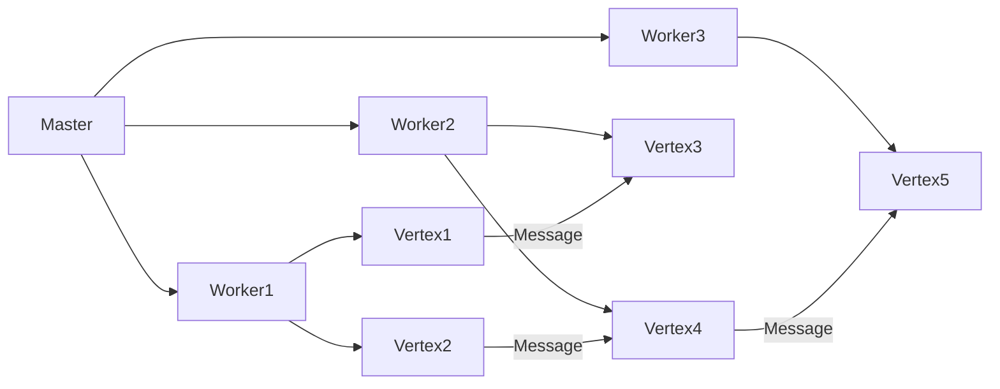

# Giraph原理与代码实例讲解

## 1. 背景介绍

### 1.1 问题的由来

在当今大数据时代,海量的数据被持续产生和积累。这些数据包含着许多有价值的信息和知识,如果能够高效地处理和分析这些数据,就能为企业带来巨大的价值。然而,传统的数据处理系统很难应对如此庞大的数据量和复杂的分析需求。因此,分布式大数据处理系统应运而生。

### 1.2 研究现状

Apache Giraph是一个用于构建可扩展的大规模图形处理系统的开源项目。它最初由Yahoo!研究院开发,后捐赠给Apache软件基金会。Giraph基于Google的Pregel论文,实现了一个用于构建大规模图形并行处理应用程序的框架。

### 1.3 研究意义

图是一种非常通用和强大的数据结构,可以用于表示各种复杂的关系数据,如社交网络、网页链接、交通网络等。能够高效地处理和分析大规模图形数据,对于挖掘隐藏在数据中的有价值信息至关重要。Giraph作为一个开源的大规模图形处理框架,为研究人员和开发人员提供了一个强大的工具,有助于推动大数据分析技术的发展。

### 1.4 本文结构  

本文将从以下几个方面深入探讨Giraph:

1. 核心概念与联系
2. 核心算法原理与具体操作步骤
3. 数学模型、公式推导及案例分析
4. 代码实例及详细解释
5. 实际应用场景
6. 工具和学习资源推荐
7. 未来发展趋势与挑战

## 2. 核心概念与联系

Giraph的核心概念源于Google的Pregel论文,主要包括:

- **顶点(Vertex)**: 表示图中的节点,包含了节点的值和边的信息。
- **边(Edge)**: 表示顶点之间的连接关系。
- **消息(Message)**: 顶点之间通过发送消息进行通信。
- **超步(Superstep)**: 计算过程被划分为多个超步,每个超步包括顶点并行计算、消息传递和聚合等阶段。
- **主机(Worker)**: 负责执行实际的计算任务,每个Worker负责处理部分顶点和边。
- **主节点(Master)**: 协调整个计算过程,负责分配任务、收集结果等。

这些概念之间的关系如下所示:

## 3. 核心算法原理与具体操作步骤  

### 3.1 算法原理概述

Giraph的核心算法基于"顶点并行"和"超步"两个关键概念:

- **顶点并行**: 所有顶点同时并行执行计算,而不是遍历整个图。这种方式可以充分利用分布式系统的并行计算能力。
- **超步**: 整个计算过程被划分为多个超步,每个超步包括以下三个阶段:
  1. **顶点并行计算**: 所有顶点并行执行用户定义的计算逻辑。
  2. **消息传递**: 顶点之间通过发送消息进行通信。
  3. **消息聚合**: 针对每个顶点,将发送给它的消息进行聚合。

通过这种"思考-通信-聚合"的迭代模式,算法可以在分布式环境中高效地处理大规模图形数据。

### 3.2 算法步骤详解

Giraph算法的具体执行步骤如下:

1. **初始化**: 根据输入数据初始化图形结构,包括顶点、边和初始消息(如果有)。
2. **超步迭代**:
   a. **顶点并行计算**: 所有顶点并行执行用户定义的 `compute()` 方法,可以读取顶点值、边信息和上一步的消息,进行计算并发送新消息。
   b. **消息传递**: 系统收集并传递所有顶点发送的消息。
   c. **消息聚合**: 针对每个顶点,将发送给它的消息进行聚合,生成下一步的输入消息。
   d. **终止检测**: 检查是否满足用户定义的终止条件,如果满足则终止计算,否则进入下一个超步。
3. **结果输出**: 将计算结果输出到指定位置。

### 3.3 算法优缺点

**优点**:

- **高度并行**: 利用了分布式系统的并行计算能力,可以高效处理大规模图形数据。
- **容错性强**: 基于谷歌的大规模分布式系统设计思想,具有良好的容错能力。
- **编程模型简单**: 用户只需要关注顶点的计算逻辑,底层的并行执行、容错等细节由系统自动处理。

**缺点**:

- **迭代计算开销大**: 需要多次迭代才能收敛,每次迭代都需要进行消息传递和聚合,开销较大。
- **不适合处理动态图形**: 由于每次迭代都需要重新加载整个图形结构,因此不适合处理动态变化的图形数据。
- **内存消耗较大**: 需要将整个图形结构加载到内存中,对内存消耗较大。

### 3.4 算法应用领域

Giraph可以应用于各种需要处理大规模图形数据的领域,包括但不限于:

- **社交网络分析**: 分析用户之间的关系网络,发现影响力大户、社区结构等。
- **网页排名**: 计算网页的重要性排名,如PageRank算法。
- **推荐系统**: 基于用户之间的相似关系进行个性化推荐。
- **金融风险分析**: 分析金融机构之间的风险传递路径。
- **交通网络优化**: 优化交通网络的路线规划和流量分配。

## 4. 数学模型和公式及详细讲解

### 4.1 数学模型构建

为了更好地理解和分析Giraph算法,我们可以构建一个数学模型。假设图 $G=(V,E)$ 由顶点集合 $V$ 和边集合 $E$ 组成,每个顶点 $v \in V$ 都有一个关联的值 $val(v)$。在每个超步 $t$ 中,每个顶点 $v$ 会执行以下操作:

1. 计算: 根据当前值 $val(v)$、入边上的消息 $msg_{in}(v,t)$ 和用户定义的函数 $\Gamma$,计算新的顶点值 $val'(v,t)$:

$$val'(v,t) = \Gamma(val(v), msg_{in}(v,t))$$

2. 发送消息: 根据新的顶点值 $val'(v,t)$ 和用户定义的函数 $\Delta$,向所有出边发送消息 $msg_{out}(v,t)$:

$$msg_{out}(v,t) = \Delta(val'(v,t))$$

3. 更新值: 将新的顶点值 $val'(v,t)$ 赋给 $val(v)$。

在下一个超步 $t+1$ 中,每个顶点 $v$ 会收到上一步发送给它的所有消息,并进行聚合,生成新的入边消息 $msg_{in}(v,t+1)$。

### 4.2 公式推导过程

我们可以将上述数学模型推广到整个图形,定义图形的值向量 $\vec{val}(t)$ 和消息向量 $\vec{msg}(t)$:

$$\vec{val}(t) = \begin{bmatrix} val(v_1) \\ val(v_2) \\ \vdots \\ val(v_n) \end{bmatrix}, \vec{msg}(t) = \begin{bmatrix} msg_{in}(v_1,t) \\ msg_{in}(v_2,t) \\ \vdots \\ msg_{in}(v_n,t) \end{bmatrix}$$

其中 $n$ 是图形中顶点的总数。

则在每个超步 $t$ 中,图形的计算过程可以表示为:

$$\vec{val'}(t) = \Gamma(\vec{val}(t), \vec{msg}(t))$$
$$\vec{msg'}(t) = \Delta(\vec{val'}(t))$$
$$\vec{val}(t+1) = \vec{val'}(t)$$
$$\vec{msg}(t+1) = \mathcal{A}(\vec{msg'}(t))$$

其中 $\Gamma$ 和 $\Delta$ 分别表示顶点计算和消息发送函数的并行应用,而 $\mathcal{A}$ 表示消息聚合函数。

通过迭代上述公式,算法就可以在分布式环境中高效地计算出图形的最终状态。

### 4.3 案例分析与讲解

为了更好地理解Giraph算法,我们来分析一个经典的图形算法:PageRank。PageRank算法用于计算网页的重要性排名,它的核心思想是:一个网页的重要性不仅取决于它自身,还取决于链接到它的其他重要网页的数量和质量。

在Giraph中实现PageRank算法的思路如下:

1. 将网页表示为顶点,链接关系表示为边。
2. 初始化每个顶点的PageRank值为 $1/n$,其中 $n$ 是网页总数。
3. 在每个超步中:
   a. 每个顶点将自己的PageRank值平均分配给所有出边对应的顶点,并发送消息。
   b. 每个顶点收集并求和所有入边上的消息,得到新的PageRank值。
   c. 对新的PageRank值进行归一化处理。
4. 重复上述过程,直到PageRank值收敛。

我们可以用数学公式来表示这个过程:

设 $PR(v)$ 表示顶点 $v$ 的PageRank值, $Out(v)$ 表示 $v$ 的出边集合, $In(v)$ 表示 $v$ 的入边集合。则在每个超步中:

1. 发送消息:

$$msg_{out}(v) = \frac{PR(v)}{|Out(v)|}$$

2. 接收消息并更新PageRank值:

$$PR'(v) = (1-d) + d \sum_{u \in In(v)} \frac{PR(u)}{|Out(u)|}$$

其中 $d$ 是一个阻尼系数,通常取值 $0.85$。

通过不断迭代这个过程,PageRank值就会逐渐收敛到稳定状态,反映了网页的重要性排名。

### 4.4 常见问题解答

1. **为什么需要超步的概念?**

   超步的概念源于分布式系统的"批量同步并行"模型,它将计算过程划分为多个阶段,每个阶段包括并行计算、通信和同步等步骤。这种模式可以保证计算的正确性,避免竞态条件等并发问题。

2. **如何确定算法的终止条件?**

   终止条件由用户根据具体应用场景定义。常见的终止条件包括:
   - 达到最大超步数
   - 顶点值或消息值的变化小于某个阈值
   - 满足特定的收敛条件(如PageRank算法)

3. **如何处理图形中的变化?**

   Giraph主要针对静态图形进行优化,对于动态变化的图形,需要在每个超步开始时重新加载整个图形结构,开销较大。一种可行的方案是定期对图形进行快照,在快照之间只处理增量变化。

4. **Giraph如何实现容错性?**

   Giraph基于谷歌的大规模分布式系统设计思想,采用了多种容错机制:
   - 通过检查点和重播日志实现故障恢复
   - 利用备份机制容忍Worker失败
   - 利用分区机制实现负载均衡和容错

## 5. 项目实践:代码实例和详细解释说明

### 5.1 开发环境搭建

要开发基于Giraph的应用程序,首先需要搭建开发环境。以下是主要步骤:

1. 安装Java开发环境(JDK 1.8或更高版本)
2. 下载并解压Giraph发行版
3. 配置Hadoop环境(Giraph依赖于Hadoop)
4. 配置Giraph环境变量
5. 验证Giraph是否安装成功

### 5.2 源代码详细实现

下面是