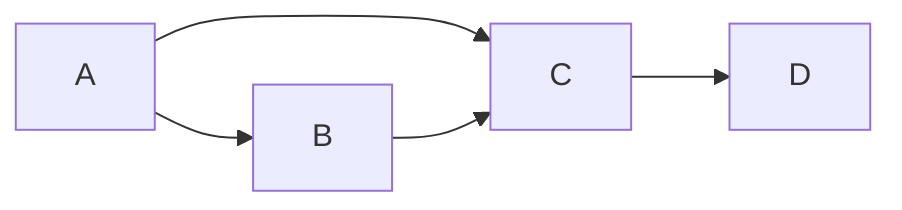

# Giraph图计算框架原理与代码实例讲解

## 1. 背景介绍

### 1.1 问题的由来

随着大数据时代的到来,海量数据的存储和处理成为了一个巨大的挑战。传统的关系型数据库在处理大规模数据时遇到了瓶颈,导致了NoSQL数据库等新型数据库的出现。然而,对于一些复杂的数据分析任务,如社交网络分析、Web链接分析、推荐系统等,单纯依赖数据库存储和查询是远远不够的。这些任务需要对数据进行复杂的图形化建模和迭代计算,才能得到有价值的结果。

### 1.2 研究现状  

为了解决上述问题,图计算(Graph Computing)应运而生。图计算是一种将数据建模为节点(Node)和边(Edge)的形式,并在图上执行并行迭代计算的范式。经典的图计算系统有Google的Pregel、Apache的Giraph、Spark的GraphX等。其中,Giraph作为开源的图计算框架,具有良好的扩展性和容错性,被广泛应用于各种图计算场景。

### 1.3 研究意义

掌握Giraph图计算框架的原理和使用方法,对于解决大规模数据分析问题具有重要意义。通过Giraph,我们可以高效地处理大规模图数据,挖掘隐藏其中的有价值信息,为各行业的数据驱动决策提供有力支持。同时,深入理解Giraph的设计思想和实现细节,也有助于我们设计和优化自己的分布式系统。

### 1.4 本文结构

本文将全面介绍Giraph图计算框架的核心概念、算法原理、数学模型、实现细节和应用场景。内容包括但不限于:

- Giraph的核心概念及其与其他系统的关联
- 基于BSP(Bulk Synchronous Parallel)模型的图计算算法原理
- 顶点程序(Vertex Program)和聚合器(Aggregator)的设计
- 基于Pregel的PageRank算法在Giraph中的实现
- 使用Giraph进行大规模图数据处理的实践指南
- Giraph在推荐系统、社交网络分析等领域的应用案例
- Giraph的局限性和未来发展趋势

## 2. 核心概念与联系

在深入探讨Giraph的细节之前,我们先介绍一些核心概念,为后续内容的理解打下基础。

### 2.1 图(Graph)

图是一种非线性的数据结构,由一组顶点(Vertex)和连接顶点的边(Edge)组成。在现实世界中,许多事物都可以用图来建模,如社交网络、网页链接、交通路线等。图可以分为有向图(Directed Graph)和无向图(Undirected Graph)两种类型。

### 2.2 BSP(Bulk Synchronous Parallel)模型

BSP是一种并行计算模型,由三个并发组件组成:多组计算节点、通信网络和路由器。计算是以"超步(Superstep)"为单位进行的,每个超步包含并行计算、通信和障碍同步三个阶段。BSP模型可以确保计算的正确性,同时提供良好的并行度和容错性。

### 2.3 Pregel

Pregel是Google提出的基于BSP模型的图计算框架,Giraph就是对Pregel的开源实现。在Pregel中,图计算任务被表示为一个"顶点程序",通过并行迭代执行来更新图的状态,直到满足某个条件为止。

### 2.4 Giraph与Hadoop/Spark的关系

Giraph是构建在Hadoop之上的,利用HDFS存储图数据,使用MapReduce进行计算。与Spark的GraphX相比,Giraph更加专注于迭代图计算,具有更好的容错性和可扩展性。不过,GraphX在某些场景下的性能更优,两者可以根据具体需求进行选择。

## 3. 核心算法原理 & 具体操作步骤  

### 3.1 算法原理概述

Giraph的核心算法原理是基于BSP模型的迭代图计算。算法的执行过程可以概括为以下几个步骤:

1. 将输入图数据加载到分布式文件系统(如HDFS)中。
2. 启动Giraph作业,根据分区策略将图划分为多个分区(Partition)。
3. 在每个分区上启动工作线程,执行用户定义的"顶点程序"。
4. 进入BSP超步迭代,每个超步包含以下三个阶段:
   a. 并行计算阶段:每个工作线程并行执行顶点程序,根据当前图状态进行计算。
   b. 消息传递阶段:工作线程之间交换消息,传递计算结果。
   c. 障碍同步阶段:所有工作线程等待彼此计算完成,统一进入下一个超步。
5. 重复第4步,直到满足终止条件(如最大超步数或全局状态满足要求)。
6. 将计算结果输出到分布式文件系统中。

该算法的核心在于将复杂的图计算任务分解为简单的"顶点程序",通过并行迭代的方式高效地更新图状态,最终得到所需的计算结果。

### 3.2 算法步骤详解

我们使用经典的PageRank算法来详细说明Giraph的执行过程。PageRank是一种用于计算网页重要性的算法,它模拟了随机网络浏览者在网页之间跳转的过程。

1. **加载图数据**

   首先,我们需要将网页链接数据转换为Giraph可识别的图格式,并加载到HDFS中。每个网页对应一个顶点,链接关系对应一条有向边。

2. **启动Giraph作业**

   运行Giraph作业时,需要指定作业名称、输入输出路径、分区数量等参数。Giraph会根据分区策略(如HashPartitionerVertex)将图划分为多个分区,每个分区由一个工作线程负责处理。

3. **执行顶点程序**

   Giraph中的核心逻辑是"顶点程序"(Vertex Program),它定义了每个顶点在每个超步中的行为。对于PageRank算法,顶点程序的主要步骤是:

   a. 计算当前顶点的PageRank值。
   b. 将PageRank值除以出边数,得到每条出边的贡献值。
   c. 通过消息机制,将贡献值发送给所有邻接顶点。
   d. 接收其他顶点发来的贡献值,并累加到自身的PageRank值中。

4. **超步迭代**

   在每个超步中,所有工作线程并行执行顶点程序。计算完成后,工作线程之间通过网络交换消息,传递计算结果。所有工作线程完成消息传递后,进入障碍同步阶段,等待彼此完成当前超步,然后统一进入下一个超步。

5. **终止条件**

   PageRank算法的终止条件通常是达到最大超步数或PageRank值的变化小于某个阈值。当满足终止条件时,Giraph作业结束,将最终的PageRank值输出到HDFS中。

通过上述步骤,Giraph高效地并行执行了PageRank算法,充分利用了集群的计算资源。下面我们将给出Giraph中PageRank算法的具体代码实现。

### 3.3 算法优缺点

Giraph基于BSP模型的图计算算法具有以下优点:

- **良好的并行度**:通过将图划分为多个分区,可以在集群中高效并行执行。
- **容错性强**:BSP模型中的障碍同步机制确保了计算的正确性,并提供了容错能力。
- **通用性强**:只需编写顶点程序,就可以在Giraph上执行各种图计算算法。

但同时也存在一些缺点:

- **延迟较高**:由于需要频繁的网络通信和障碍同步,会导致一定的延迟。
- **内存占用大**:需要将整个图加载到内存中,对于超大规模图来说内存可能不够用。
- **不适合数据流式处理**:Giraph更适合批处理,而不太适合实时流式处理。

### 3.4 算法应用领域

Giraph及其基于BSP模型的图计算算法可以广泛应用于以下领域:

- **社交网络分析**:计算用户影响力、发现社区结构等。
- **网页排名**:实现PageRank、HitRank等网页重要性排名算法。
- **推荐系统**:基于用户兴趣关系构建推荐模型。
- **金融风险分析**:识别金融交易网络中的风险点。
- **生物信息学**:分析蛋白质互作网络、基因调控网络等。

## 4. 数学模型和公式 & 详细讲解 & 举例说明

在介绍了Giraph的核心算法原理后,我们来看一下其中涉及的数学模型和公式,加深对算法的理解。

### 4.1 数学模型构建

我们将网页链接关系建模为一个有向图$G=(V, E)$,其中:

- $V$是网页集合,每个$v \in V$对应一个网页
- $E \subseteq V \times V$是链接集合,如果存在一条从$u$指向$v$的链接,则$(u, v) \in E$

我们的目标是计算每个网页$v$的PageRank值$PR(v)$,用于衡量其重要性。

### 4.2 公式推导过程  

PageRank算法的基本思想是,一个网页的重要性不仅取决于它被多少其他网页链接,还取决于链接它的网页的重要性。具体来说,PageRank值的计算公式为:

$$
PR(v) = (1 - d) + d \sum_{u \in B_v} \frac{PR(u)}{L(u)}
$$

其中:

- $d$是一个阻尼系数(damping factor),通常取值0.85
- $B_v$是所有链接到$v$的网页集合,即$B_v = \{u \in V | (u, v) \in E\}$
- $L(u)$是网页$u$的出度(出链接数)

该公式可以这样理解:一个网页的PageRank值来自两部分,一部分是固定的随机跳转值$(1 - d)$,另一部分是其他高PageRank值网页通过出链接贡献过来的值。

为了计算PageRank值,我们需要不断迭代上述公式,直到收敛(PageRank值变化小于某个阈值)。初始时,可以将所有网页的PageRank值设为相等的$\frac{1}{|V|}$。

### 4.3 案例分析与讲解

现在我们用一个简单的例子来说明PageRank算法的执行过程。假设有4个网页$\{A, B, C, D\}$,它们的链接关系如下图所示:

其中,网页A有2条出链接,网页B和C各有1条出链接,网页D没有出链接。

我们取阻尼系数$d=0.85$,初始时所有网页的PageRank值相等,为$\frac{1}{4}=0.25$。在第一次迭代后,各网页的PageRank值为:

- $PR(A) = (1 - 0.85) + 0.85 \times 0.25 = 0.3625$
- $PR(B) = (1 - 0.85) + 0.85 \times \frac{0.25 + 0.3625}{2} = 0.3406$
- $PR(C) = (1 - 0.85) + 0.85 \times \frac{0.3625 + 0.3406}{2} = 0.3656$
- $PR(D) = (1 - 0.85) + 0.85 \times 0.3656 = 0.2813$

我们继续迭代,直到PageRank值收敛。最终的结果大致为:

- $PR(A) \approx 0.4$
- $PR(B) \approx 0.2$
- $PR(C) \approx 0.3$
- $PR(D) \approx 0.1$

可以看出,作为入口网页,A的PageRank值最高;C虽然只有一条入链接,但由于A的贡献,其PageRank值也较高;而D由于没有出链接,PageRank值最低。

### 4.4 常见问题解答

1. **为什么需要阻尼系数d?**

   阻尼系数$d$的引入是为了解决"环形链接"和"孤立节点"等问题。如果没有$(1 - d)$这一部分,当出现环形