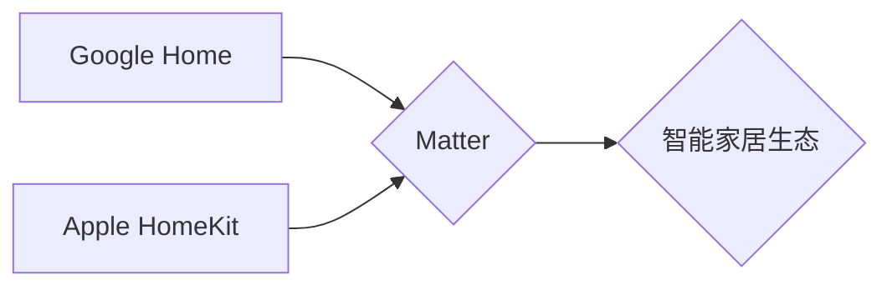
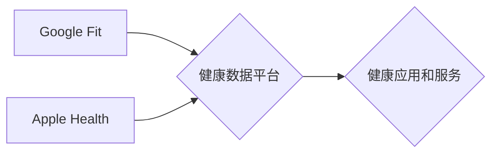
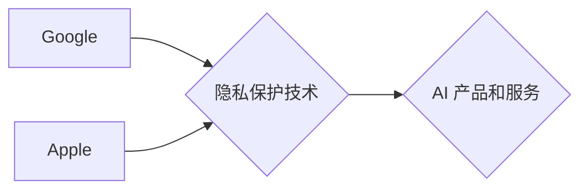

# Google与苹果在AI领域的合作前景

## 1. 背景介绍

### 1.1 问题的由来

人工智能（AI）正在以前所未有的速度发展，并逐渐渗透到我们生活的方方面面。从自动驾驶汽车到智能家居，从医疗诊断到金融交易，AI正在改变着我们的世界。在这个充满机遇和挑战的时代，科技巨头之间的合作与竞争关系也变得尤为重要。Google和苹果作为全球领先的两家科技公司，在AI领域都拥有着雄厚的技术实力和丰富的资源。两家公司之间的合作与竞争，不仅将深刻影响着AI产业的发展方向，也将对全球科技格局产生深远影响。

### 1.2 研究现状

目前，Google和苹果在AI领域既有竞争，也有合作。

**竞争方面:**

* **语音助手：** Google Assistant 和 Apple Siri 是两款领先的语音助手，它们在功能和市场份额上展开了激烈竞争。
* **移动操作系统：** Google 的 Android 和 Apple 的 iOS 是全球最大的两大移动操作系统，它们在 AI 功能的集成上也存在竞争关系。
* **硬件设备：** Google 的 Pixel 手机和 Apple 的 iPhone 手机都配备了强大的 AI 芯片，并在图像识别、语音处理等方面展开了竞争。

**合作方面:**

* **智能家居：** Google 和 Apple 都是智能家居领域的领导者，它们共同支持 Matter 标准，旨在实现不同品牌智能家居设备之间的互联互通。
* **健康数据：** Google 和 Apple 都在积极开发健康数据平台，并探索数据共享和合作的可能性。
* **隐私保护：** Google 和 Apple 都高度重视用户隐私保护，并在差分隐私、联邦学习等技术领域展开合作研究。

### 1.3 研究意义

探讨 Google 与苹果在 AI 领域的合作前景，具有重要的现实意义：

* **推动 AI 技术发展：** Google 和苹果的合作将汇聚双方优势资源，加速 AI 技术的创新和突破。
* **促进 AI 生态建设：** 两家公司的合作将有利于构建更加开放、互通的 AI 生态系统。
* **提升用户体验：** Google 和苹果的合作将为用户带来更加智能、便捷、安全的 AI 产品和服务。
* **引领行业发展：** 两家巨头的合作将为全球 AI 产业发展树立标杆，引领行业发展方向。

### 1.4 本文结构

本文将从以下几个方面，对 Google 与苹果在 AI 领域的合作前景进行深入分析：

* **核心概念与联系**：介绍 AI 领域的一些核心概念，以及 Google 和苹果在这些领域的技术布局。
* **潜在合作领域**：分析 Google 和苹果在 AI 领域可能展开合作的方向和具体项目。
* **合作的挑战与机遇**：探讨 Google 和苹果在 AI 领域合作可能面临的挑战和机遇。
* **未来展望**：对 Google 与苹果在 AI 领域的合作前景进行展望。

## 2. 核心概念与联系

### 2.1 人工智能（AI）

人工智能（Artificial Intelligence，AI）是指由人制造出来的机器所表现出来的智能。通常情况下，人工智能是指通过普通计算机程序来呈现人类智能的技术。 

### 2.2 机器学习（ML）

机器学习（Machine Learning，ML）是人工智能的一个分支，它使计算机能够在没有明确编程的情况下从数据中学习。机器学习算法可以通过识别数据中的模式来进行预测或决策。

### 2.3 深度学习（DL）

深度学习（Deep Learning，DL）是机器学习的一个子集，它使用多层神经网络来学习数据中的复杂模式。深度学习在图像识别、语音识别和自然语言处理等领域取得了突破性进展。

### 2.4 Google 在 AI 领域的布局

Google 在 AI 领域进行了全面的布局，其核心技术包括：

* **TensorFlow：** 开源机器学习平台，被广泛应用于各种 AI 应用开发。
* **Google Cloud AI Platform：** 提供机器学习模型训练、部署和管理的一站式服务。
* **Google Assistant：** 智能语音助手，可以理解自然语言并执行各种任务。
* **Waymo：** 自动驾驶汽车公司，致力于开发 Level 4 和 Level 5 级别的自动驾驶技术。

### 2.5 苹果在 AI 领域的布局

苹果在 AI 领域也进行了大量投入，其核心技术包括：

* **Core ML：** 用于在 Apple 设备上集成机器学习模型的框架。
* **Create ML：** 用于创建和训练机器学习模型的工具。
* **Siri：** 智能语音助手，可以理解自然语言并执行各种任务。
* **Apple Neural Engine：** 专为 AI 任务设计的芯片，可以高效地运行机器学习模型。

## 3. 潜在合作领域

### 3.1 智能家居

Google 和 Apple 都是智能家居领域的领导者，它们都推出了自己的智能家居平台，例如 Google Home 和 Apple HomeKit。 

**合作方向：**

* **统一标准：** 共同制定和推广智能家居设备的互联互通标准，例如 Matter。
* **数据共享：** 在用户授权的情况下，共享智能家居设备收集的数据，以提供更加个性化的服务。
* **联合开发：** 合作开发新的智能家居产品和服务，例如智能音箱、智能照明等。

**Mermaid 流程图：**

### 3.2 健康数据

Google 和 Apple 都在积极开发健康数据平台，例如 Google Fit 和 Apple Health。

**合作方向：**

* **数据互通：** 打破数据孤岛，实现 Google Fit 和 Apple Health 平台之间的数据共享。
* **联合研究：** 利用双方庞大的用户数据，联合开展疾病预测、健康管理等方面的研究。
* **开发新的健康服务：** 合作开发新的健康管理应用和服务，例如慢性病管理、运动健身等。

**Mermaid 流程图：**

### 3.3 隐私保护

Google 和 Apple 都高度重视用户隐私保护，并在差分隐私、联邦学习等技术领域展开合作研究。

**合作方向：**

* **技术研究：** 共同研发新的隐私保护技术，例如同态加密、安全多方计算等。
* **标准制定：** 参与制定 AI 领域的隐私保护标准和规范。
* **推广应用：** 在各自的产品和服务中推广应用隐私保护技术。

**Mermaid 流程图：**

## 4. 合作的挑战与机遇

### 4.1 挑战

* **企业文化差异：** Google 和 Apple 拥有不同的企业文化和价值观，这可能会影响双方的合作。
* **竞争关系：** Google 和 Apple 在多个领域都存在竞争关系，这可能会阻碍双方的合作意愿。
* **数据安全和隐私：** 数据安全和隐私是 AI 领域的重要问题，Google 和 Apple 需要解决数据共享和隐私保护之间的矛盾。

### 4.2 机遇

* **优势互补：** Google 和 Apple 在 AI 领域拥有各自的优势，双方合作可以实现优势互补，共同推动 AI 技术的发展。
* **市场潜力巨大：** AI 市场潜力巨大，Google 和 Apple 合作可以共同开拓更广阔的市场。
* **社会责任：** AI 技术的发展关乎人类未来，Google 和 Apple 作为行业领导者，有责任合作解决 AI 发展带来的伦理和社会问题。

## 5. 未来展望

Google 与苹果在 AI 领域的合作前景广阔，但也面临着诸多挑战。相信随着 AI 技术的不断发展和成熟，以及双方合作意愿的增强，Google 和苹果在 AI 领域的合作将会更加深入和广泛，共同推动 AI 技术的发展，造福人类社会。

## 6. 附录：常见问题与解答

### 6.1 Google 和苹果会合并吗？

目前没有迹象表明 Google 和苹果会合并。

### 6.2 Google 和苹果的合作会对其他公司产生什么影响？

Google 和苹果的合作可能会对其他 AI 公司产生一定的影响，例如促进行业标准的统一、加速技术创新等。

## 7. 工具和资源推荐

### 7.1 学习资源推荐

* **Google AI：** https://ai.google/
* **Apple Machine Learning：** https://developer.apple.com/machine-learning/

### 7.2 开发工具推荐

* **TensorFlow：** https://www.tensorflow.org/
* **Core ML：** https://developer.apple.com/documentation/coreml

## 8. 总结

Google 与苹果在 AI 领域的合作前景广阔，双方合作将推动 AI 技术的发展，促进 AI 生态建设，提升用户体验，引领行业发展。

**作者：禅与计算机程序设计艺术 / Zen and the Art of Computer Programming** 
