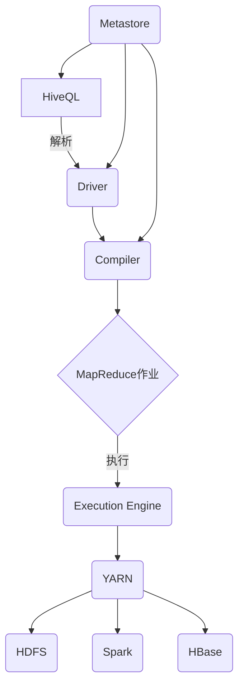
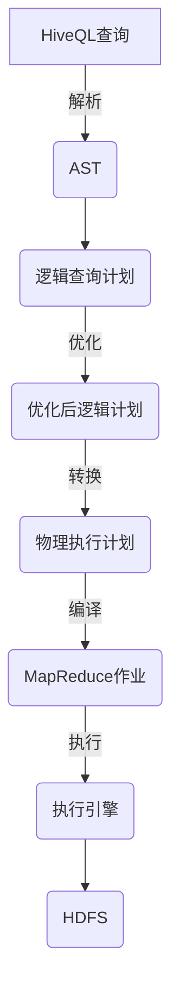

# HiveQL原理与代码实例讲解

## 1. 背景介绍

### 1.1 问题的由来

在大数据时代,海量数据的存储和处理成为了一个巨大的挑战。传统的关系型数据库已经无法满足大数据场景下的需求,因为它们在处理结构化数据方面表现出色,但在处理非结构化和半结构化数据时效率低下。这促使了一种新型数据处理架构的出现——大数据处理平台。

Apache Hive 作为大数据生态系统中的重要组件,为结构化的数据仓库查询提供了一种类似SQL的查询语言——HiveQL。它使得熟悉SQL的开发人员和数据分析师能够轻松地查询、汇总和分析存储在Hadoop分布式文件系统(HDFS)或兼容数据存储中的大量数据。

### 1.2 研究现状

目前,HiveQL已经广泛应用于各大公司和组织的大数据分析场景中。随着大数据技术的不断发展,HiveQL也在持续演进和优化,以满足更高效的数据处理需求。例如,Apache社区正在开发新的Hive 3.0版本,它将支持ACID事务、更好的性能优化、成本优化等新特性。

### 1.3 研究意义

深入理解HiveQL的原理和使用方式,对于从事大数据分析和处理的开发人员和数据分析师来说是非常重要的。掌握HiveQL不仅可以提高数据处理效率,还能够更好地利用Hadoop生态系统的强大功能,解决复杂的大数据分析问题。

### 1.4 本文结构

本文将全面介绍HiveQL的核心概念、原理和使用方法。首先阐述HiveQL的核心概念和与其他组件的关系。然后深入探讨HiveQL的查询执行原理和算法细节。接下来,通过数学模型和公式详细说明HiveQL的内部工作机制。再者,提供大量代码示例并进行详细解释,帮助读者掌握HiveQL的实际应用。最后,讨论HiveQL的应用场景、发展趋势和面临的挑战。

## 2. 核心概念与联系

HiveQL是Apache Hive的查询语言,它将SQL的类似语法应用于Hadoop生态系统中,使得用户可以使用熟悉的SQL语法来查询存储在HDFS或Hive元数据存储中的数据。HiveQL查询会被转换为一系列的MapReduce作业,并在Hadoop集群上并行执行。

Hive由以下几个核心组件组成:

- **Metastore**: 存储Hive中所有表、分区和模式的元数据信息。
- **Driver**: 将HiveQL查询语句解析为查询计划。
- **Compiler**: 将查询计划转换为一系列MapReduce作业。
- **Execution Engine**: 在Hadoop集群上执行MapReduce作业。

HiveQL与Hadoop生态系统中的其他组件也有着密切的联系:

- **HDFS**: Hadoop分布式文件系统,用于存储Hive表中的数据文件。
- **MapReduce/YARN**: 用于执行HiveQL查询转换而来的MapReduce作业。
- **Spark**: 可选的执行引擎,用于加速HiveQL查询的执行。
- **HBase**: 可以通过HiveQL查询HBase中的数据。

HiveQL的核心概念包括数据库(Database)、表(Table)、视图(View)、分区(Partition)、存储格式(File Format)等,这些概念与传统关系型数据库中的概念类似,但又有所不同。



上图展示了HiveQL与Hive组件及Hadoop生态系统的关系。HiveQL查询语句首先被Driver解析,然后由Compiler转换为MapReduce作业,最后在Execution Engine上执行,可选择使用YARN、Spark或HBase作为执行引擎,数据存储在HDFS中。整个过程由Metastore提供元数据支持。

## 3. 核心算法原理 & 具体操作步骤

### 3.1 算法原理概述

HiveQL查询的执行过程可以概括为以下几个主要步骤:

1. **语法解析**: Driver组件将HiveQL查询语句解析为抽象语法树(AST)。
2. **逻辑计划生成**: 根据AST生成逻辑查询计划。
3. **优化**: 对逻辑查询计划进行一系列规则优化,如投影剪裁、分区剪裁等。
4. **物理计划生成**: 将优化后的逻辑计划转换为物理计划。
5. **作业提交**: 根据物理计划生成一个或多个MapReduce作业,并提交到执行引擎(如YARN)执行。

HiveQL的查询执行遵循了经典的"查询重写"范式,通过一系列优化规则将高级查询转换为高效的物理执行计划。

### 3.2 算法步骤详解

1. **语法解析**

   HiveQL查询语句首先被Driver组件的Parser模块解析为抽象语法树(AST)。Parser使用ANTLR生成的自顶向下递归下降解析器,根据HiveQL的语法规则构建AST。

2. **逻辑计划生成**

   SemanticAnalyzer模块基于AST生成初始的逻辑查询计划,该计划是一系列逻辑操作符的有向非循环图(DAG)。逻辑查询计划独立于底层的物理执行细节。

3. **查询优化**

   Hive的优化器由一系列规则组成,这些规则对逻辑查询计划进行转换,以优化查询执行效率。主要优化规则包括:

   - **投影剪裁**: 只读取查询所需的列。
   - **分区剪裁**: 只扫描满足条件的分区。
   - **常量折叠**: 预计算常量表达式。
   - **谓词下推**: 将过滤条件下推到扫描源处。
   - **列裁剪**: 移除不需要的列。

4. **物理计划生成**

   优化后的逻辑查询计划由物理计划生成器转换为物理执行计划,即一系列的MapReduce作业。物理计划由一系列物理操作符组成,如TableScan、Filter、Join等。

5. **作业提交与执行**

   最后,物理计划被编译为一个或多个MapReduce作业,并提交到执行引擎(如YARN)上运行。作业的输入数据来自HDFS,输出结果也存储在HDFS中。



### 3.3 算法优缺点

**优点**:

- 借鉴了SQL的声明式查询语法,易于数据分析人员使用。
- 通过一系列优化规则,可以自动选择高效的执行计划。
- 与Hadoop生态系统无缝集成,能够充分利用分布式计算资源。

**缺点**:

- 查询延迟较高,不适合低延迟的在线事务处理场景。
- 优化器的规则有限,无法覆盖所有查询场景。
- 对于复杂查询,生成的MapReduce作业可能过于冗长和低效。

### 3.4 算法应用领域

HiveQL最常用于以下大数据分析场景:

- 离线数据分析: 对历史数据进行ETL、报表统计等批处理分析。
- 数据探索: 通过HiveQL对海量数据进行探索性分析。
- 数据仓库: 构建基于Hadoop的企业数据仓库。
- 机器学习: 使用HiveQL对训练数据进行预处理和特征工程。

HiveQL不适合对低延迟和高吞吐量有较高要求的场景,如实时数据分析、在线交易处理等。

## 4. 数学模型和公式 & 详细讲解 & 举例说明

HiveQL的查询执行过程涉及多个阶段,每个阶段都可以使用数学模型进行形式化描述和优化。

### 4.1 数学模型构建

#### 查询代价模型

假设一个查询 $Q$ 由 $n$ 个操作符 $\{o_1, o_2, ..., o_n\}$ 组成,其代价可以表示为:

$$
Cost(Q) = \sum_{i=1}^{n} Cost(o_i)
$$

其中,每个操作符的代价 $Cost(o_i)$ 可以进一步分解为:

$$
Cost(o_i) = f(CPU, IO, MEMORY, NETWORK)
$$

这里 $f$ 是一个代价函数,取决于操作符的CPU、IO、内存和网络开销。

优化器的目标是找到一个执行计划 $P$,使得 $Cost(P)$ 最小:

$$
\min_{P \in \mathcal{P}} Cost(P)
$$

其中 $\mathcal{P}$ 是所有可能的执行计划的集合。

#### 数据统计信息

为了准确估计查询代价,优化器需要收集表和列的数据统计信息,如行数、数据大小、数据分布等。假设表 $T$ 有 $m$ 个列 $\{c_1, c_2, ..., c_m\}$,可以构建如下统计信息矩阵:

$$
Stats(T) = 
\begin{bmatrix}
    numRows & numBytes & numNulls & ndv & ... \\
    s_{1,1} & s_{1,2} & s_{1,3} & s_{1,4} & ... \\
    s_{2,1} & s_{2,2} & s_{2,3} & s_{2,4} & ... \\
    ... & ... & ... & ... & ...
\end{bmatrix}
$$

其中:

- $numRows$ 表示表 $T$ 的行数。
- $numBytes$ 表示表 $T$ 的字节大小。
- $numNulls$ 表示表 $T$ 的空值数量。
- $ndv$ 表示表 $T$ 的distinct value个数。
- $s_{i,j}$ 表示第 $i$ 行第 $j$ 列的统计信息,如最大值、最小值、直方图等。

通过这些统计信息,优化器可以更准确地估计操作符的代价。

### 4.2 公式推导过程

我们以 Filter 操作符为例,推导其代价公式。假设 Filter 操作符的输入表为 $T$,过滤条件为 $\theta$,输出表为 $T'$。

首先,我们需要估计 Filter 操作符的选择率 $\alpha$,即满足条件 $\theta$ 的行数占总行数的比例:

$$
\alpha = \frac{|T'|}{|T|}
$$

其中 $|T|$ 和 $|T'|$ 分别表示表 $T$ 和 $T'$ 的行数。

选择率 $\alpha$ 可以根据列的数据统计信息估计,如直方图、最大值、最小值等。

接下来,我们可以估计 Filter 操作符的 CPU 代价:

$$
CPU_{cost}(Filter) = |T| \times C_{cpu}
$$

其中 $C_{cpu}$ 是每行数据的 CPU 开销常数。

同理,我们可以估计 Filter 操作符的 IO 代价:

$$
IO_{cost}(Filter) = \frac{|T|}{blockSize} \times C_{io}
$$

其中 $blockSize$ 是 HDFS 块大小, $C_{io}$ 是每块数据的 IO 开销常数。

综合 CPU 和 IO 代价,Filter 操作符的总代价可以表示为:

$$
Cost(Filter) = CPU_{cost}(Filter) + IO_{cost}(Filter)
$$

通过类似的方式,我们可以推导出其他操作符的代价公式,从而为查询优化提供理论支持。

### 4.3 案例分析与讲解

考虑如下 HiveQL 查询:

```sql
SELECT c1, c2 
FROM table1
WHERE c3 > 100 AND c4 LIKE '2%';
```

我们将逐步分析该查询的执行过程和代价估计。

1. **语法解析**

   查询语句首先被解析为抽象语法树(AST)。

2. **逻辑计划生成**

   根据 AST 生成初始的逻辑查询计划,包含 TableScan、Filter 和 Project 等逻辑操作符。