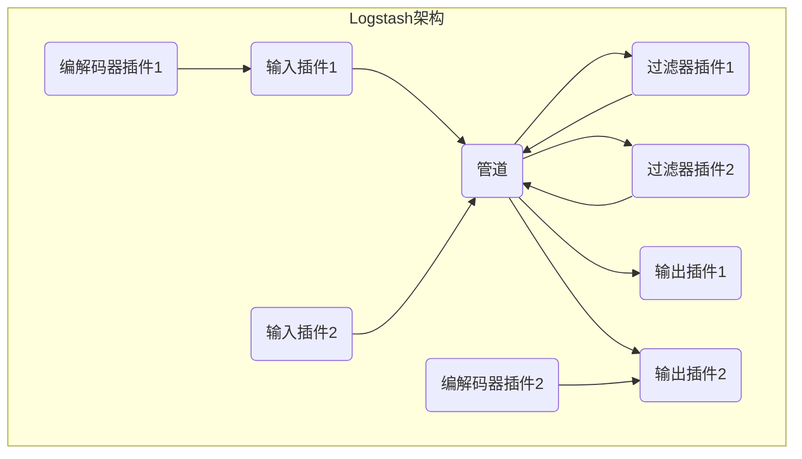
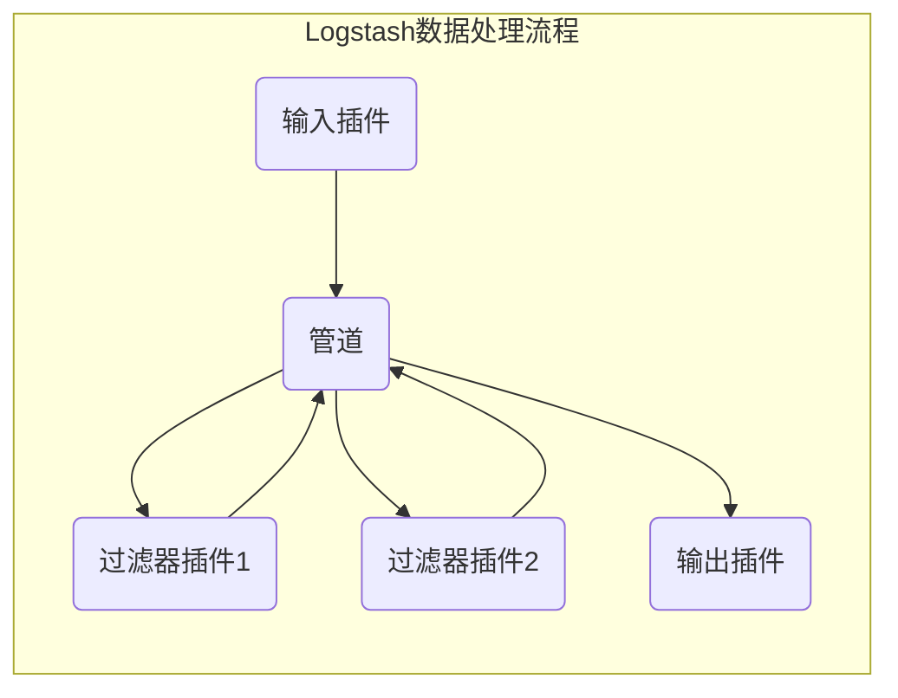

# Logstash原理与代码实例讲解

## 1. 背景介绍

### 1.1 问题的由来

在当今大数据时代，海量的数据每时每刻都在被生成和传输。这些数据来源广泛,形式多样,如系统日志、网络数据流、物联网设备数据、应用程序数据等。如何高效地收集、传输、处理和存储这些海量异构数据,成为一个亟待解决的问题。

传统的日志收集方式通常是将日志文件通过FTP、SCP等工具周期性地从服务器拷贝到集中式日志服务器上进行分析。这种方式存在以下几个主要问题:

1. **实时性差**: 日志文件需要周期性地拷贝,无法实时获取最新日志数据。
2. **可扩展性差**: 随着服务器数量的增加,日志收集的复杂度和难度也会线性增加。
3. **数据格式不统一**: 不同系统和应用程序生成的日志格式不统一,给后续的数据处理和分析带来了困难。
4. **数据丢失风险高**: 在日志文件拷贝的过程中,如果出现网络故障或其他异常情况,可能会导致部分日志数据丢失。

为了解决上述问题,需要一种高效、可扩展、统一的日志收集和传输系统。

### 1.2 研究现状

为了解决日志收集和传输的问题,出现了许多开源和商业解决方案,如Logstash、Flume、Kafka等。其中,Logstash作为ELK(Elasticsearch、Logstash、Kibana)技术栈的重要组成部分,凭借其强大的数据收集、传输、转换和输出能力,成为了当前最流行的日志收集和处理工具之一。

Logstash是一个开源的服务器端数据处理管道,能够同时从多个来源收集数据,并对数据进行转换、过滤和输出到指定的目的地。它具有以下主要特点:

1. **支持多种数据源**: Logstash可以从文件、syslog、Redis、Kafka、Beat等多种数据源收集数据。
2. **强大的数据处理能力**: Logstash内置了丰富的过滤器,可以对收集到的数据进行各种转换、丰富和过滤操作。
3. **可扩展性强**: Logstash采用了插件化的设计,用户可以根据需求开发和使用自定义插件。
4. **高度可靠性**: Logstash支持持久化队列,可以保证数据在传输过程中不会丢失。
5. **与ELK栈无缝集成**: Logstash可以将处理后的数据无缝输出到Elasticsearch,为后续的数据分析和可视化奠定基础。

### 1.3 研究意义

研究和掌握Logstash的原理和实践,对于构建高效、可靠的日志收集和处理系统具有重要意义。具体来说,研究Logstash可以带来以下收益:

1. **提高日志收集和处理效率**: 通过使用Logstash,可以实现实时、高效、统一的日志收集和处理,大大提高了数据处理的效率。
2. **降低系统复杂度**: Logstash提供了一种统一的方式来收集、转换和输出数据,简化了日志收集和处理的系统架构。
3. **增强数据可靠性**: Logstash采用了持久化队列机制,可以保证数据在传输过程中不会丢失,从而提高了数据的可靠性。
4. **扩展系统能力**: Logstash的插件化设计使得用户可以根据需求开发和使用自定义插件,从而扩展系统的功能和能力。
5. **促进数据价值挖掘**: Logstash与ELK栈无缝集成,为后续的数据分析和可视化奠定了基础,有助于从海量数据中挖掘出更多的商业价值。

### 1.4 本文结构

本文将全面介绍Logstash的原理和实践,内容安排如下:

1. 背景介绍
2. Logstash核心概念与架构
3. Logstash数据处理流程
4. Logstash插件机制
5. Logstash配置实例分析
6. Logstash性能优化
7. Logstash与ELK栈集成
8. Logstash最佳实践
9. Logstash未来发展趋势
10. 总结

## 2. 核心概念与架构

在深入探讨Logstash的原理和实践之前,我们需要先了解一些核心概念和Logstash的整体架构。

### 2.1 核心概念

以下是Logstash中的几个核心概念:

1. **事件(Event)**: Logstash中的基本数据单元,由一个或多个数据字段组成。每个事件都包含一个时间戳、主机信息和数据有效负载。
2. **输入(Input)**: 用于从各种数据源收集数据,如文件、syslog、Redis、Kafka等。Logstash支持多种输入插件。
3. **过滤器(Filter)**: 用于对收集到的数据进行转换、丰富和过滤操作。Logstash内置了丰富的过滤器插件,如grok、mutate、drop等。
4. **输出(Output)**: 用于将处理后的数据发送到指定的目的地,如Elasticsearch、文件、Kafka等。Logstash支持多种输出插件。
5. **编解码器(Codec)**: 用于在输入和输出阶段对数据进行编码和解码操作,确保数据格式的正确性。
6. **管道(Pipeline)**: Logstash的核心组件,负责将输入、过滤器和输出串联起来,构建数据处理管道。

### 2.2 Logstash架构

Logstash采用了插件化的架构设计,由多个插件组成,每个插件负责特定的功能。Logstash的整体架构如下图所示:



从上图可以看出,Logstash的核心是管道(Pipeline),它负责将输入、过滤器和输出插件串联起来,构建数据处理流程。在实际运行时,Logstash会根据配置文件加载相应的插件,并按照指定的顺序执行。

输入插件负责从各种数据源收集数据,并将数据转换为Logstash内部的事件(Event)格式。过滤器插件则对收集到的事件进行各种转换、丰富和过滤操作。最后,输出插件将处理后的事件发送到指定的目的地,如Elasticsearch、文件、Kafka等。

在输入和输出阶段,Logstash还可以使用编解码器插件对数据进行编码和解码操作,确保数据格式的正确性。

总的来说,Logstash的插件化架构设计使得它具有很强的灵活性和扩展性,用户可以根据需求自由组合不同的插件,构建出满足特定需求的数据处理管道。

## 3. 数据处理流程

了解了Logstash的核心概念和架构之后,我们来深入探讨一下Logstash的数据处理流程。

### 3.1 数据处理流程概述

Logstash的数据处理流程可以概括为以下几个步骤:

1. **数据输入**: Logstash通过输入插件从各种数据源收集数据,并将数据转换为内部的事件(Event)格式。
2. **数据过滤**: Logstash使用过滤器插件对收集到的事件进行各种转换、丰富和过滤操作。
3. **数据输出**: 处理后的事件被输出插件发送到指定的目的地,如Elasticsearch、文件、Kafka等。

整个数据处理流程如下图所示:



在实际运行时,Logstash会根据配置文件加载相应的插件,并按照指定的顺序执行。每个插件都可以配置多个实例,并且可以指定执行顺序。

需要注意的是,Logstash的数据处理流程是基于事件的。每个事件都是一个独立的数据单元,可以被多个过滤器插件处理。这种设计使得Logstash具有很强的灵活性和扩展性,能够满足各种复杂的数据处理需求。

### 3.2 数据输入

Logstash支持从多种数据源收集数据,包括文件、syslog、Redis、Kafka、Beat等。用户可以根据实际需求选择合适的输入插件。

以文件输入插件为例,它可以从本地文件系统或远程文件系统读取日志文件。配置示例如下:

```ruby
input {
  file {
    path => "/var/log/apache/access.log"
    start_position => "beginning"
  }
}
```

上述配置指定了Logstash从`/var/log/apache/access.log`文件读取数据,并从文件开头开始读取。

对于每个输入插件,Logstash都会创建一个或多个输入线程,用于从数据源读取数据。读取到的数据会被转换为Logstash内部的事件(Event)格式,并发送到管道(Pipeline)进行后续处理。

### 3.3 数据过滤

数据过滤是Logstash数据处理流程中最重要的一个环节。Logstash提供了丰富的过滤器插件,用于对收集到的事件进行各种转换、丰富和过滤操作。

常用的过滤器插件包括:

- **grok**: 用于解析和结构化非结构化日志数据。
- **mutate**: 用于修改事件中的字段,如重命名、删除、替换等。
- **drop**: 用于根据条件删除事件。
- **geoip**: 用于根据IP地址添加地理位置信息。
- **date**: 用于解析和转换日期时间字段。
- **ruby**: 用于使用Ruby代码对事件进行自定义处理。

过滤器插件可以按照指定的顺序执行,每个插件都可以对事件进行修改。多个过滤器插件可以组合使用,构建出复杂的数据处理逻辑。

以下是一个过滤器配置示例,用于解析Apache日志并添加地理位置信息:

```ruby
filter {
  grok {
    match => { "message" => "%{COMBINEDAPACHELOG}" }
  }
  geoip {
    source => "clientip"
  }
}
```

上述配置首先使用`grok`过滤器解析Apache日志,将非结构化的日志数据转换为结构化的字段。然后,使用`geoip`过滤器根据客户端IP地址添加地理位置信息,如国家、城市等。

经过过滤器处理后,事件中的数据字段会被丰富和转换,为后续的数据分析和可视化奠定基础。

### 3.4 数据输出

经过输入和过滤阶段后,处理后的事件会被发送到指定的目的地。Logstash支持多种输出插件,如Elasticsearch、文件、Kafka等。

以Elasticsearch输出插件为例,它可以将事件数据发送到Elasticsearch集群进行存储和索引。配置示例如下:

```ruby
output {
  elasticsearch {
    hosts => ["http://elasticsearch:9200"]
    index => "logstash-%{+YYYY.MM.dd}"
  }
}
```

上述配置指定了Logstash将事件数据发送到Elasticsearch集群,并使用`logstash-YYYY.MM.dd`作为索引名称。

除了将数据发送到目的地之外,输出插件还可以执行一些附加操作,如数据编码、缓冲、重试等。这些操作可以确保数据传输的可靠性和效率。

### 3.5 数据编解码

在数据输入和输出阶段,Logstash还可以使用编解码器插件对数据进行编码和解码操作,确保数据格式的正确性。

常用的编解码器插件包括:

- **json**: 用于编码和解码JSON格式的数据。
- **plain**: 用于处理纯文本数据。