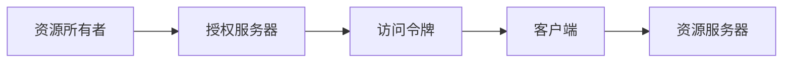

# OAuth 2.0 的单点登录功能

## 1. 背景介绍

### 1.1 问题的由来

在互联网时代，用户往往需要访问多个不同的网站和应用程序。每个网站都需要用户注册账号并登录，这给用户带来了极大的不便。为了解决这个问题，单点登录（Single Sign-On，SSO）应运而生。单点登录允许用户只需登录一次，就可以访问多个不同的应用程序，而无需重复输入用户名和密码。

OAuth 2.0 是一种授权框架，它允许第三方应用程序在用户授权的情况下访问用户的资源，而无需获取用户的用户名和密码。OAuth 2.0 可以用于实现单点登录功能，为用户提供更加便捷的登录体验。

### 1.2 研究现状

目前，OAuth 2.0 已经成为实现单点登录的主流方案之一。许多大型互联网公司，例如 Google、Facebook、Twitter 等，都提供了基于 OAuth 2.0 的单点登录服务。

### 1.3 研究意义

研究 OAuth 2.0 的单点登录功能具有重要的现实意义：

* **提升用户体验：** 单点登录可以让用户免于记忆多个账号和密码，简化登录流程，提升用户体验。
* **提高安全性：** OAuth 2.0 的授权机制可以有效地保护用户隐私，防止用户账号和密码泄露。
* **促进资源共享：** 单点登录可以方便用户在不同的应用程序之间共享数据，促进资源整合。

### 1.4 本文结构

本文将深入探讨 OAuth 2.0 的单点登录功能，内容涵盖以下几个方面：

* 核心概念与联系
* 核心算法原理 & 具体操作步骤
* 数学模型和公式 & 详细讲解 & 举例说明
* 项目实践：代码实例和详细解释说明
* 实际应用场景
* 工具和资源推荐
* 总结：未来发展趋势与挑战
* 附录：常见问题与解答

## 2. 核心概念与联系

在深入探讨 OAuth 2.0 的单点登录功能之前，我们需要先了解一些核心概念：

* **资源所有者 (Resource Owner):**  对资源拥有所有权的用户，可以是个人或组织。
* **资源服务器 (Resource Server):** 存储受保护资源的服务器，例如存储用户信息的服务器。
* **客户端 (Client):**  需要访问受保护资源的应用程序，例如需要访问用户信息的网站。
* **授权服务器 (Authorization Server):** 负责颁发访问令牌的服务器，用于验证客户端的身份并授权其访问资源服务器上的资源。
* **访问令牌 (Access Token):**  授权服务器颁发给客户端的凭证，用于证明客户端已被授权访问资源服务器上的资源。

下图展示了 OAuth 2.0 中各个角色之间的关系：



## 3. 核心算法原理 & 具体操作步骤

### 3.1 算法原理概述

OAuth 2.0 的单点登录功能基于授权码模式 (Authorization Code Grant)。该模式的流程如下：

1. 用户访问客户端应用程序，并选择使用第三方身份提供商进行登录。
2. 客户端将用户重定向到授权服务器，并请求授权码。
3. 授权服务器验证用户身份，并请求用户授权客户端访问其资源。
4. 用户授权后，授权服务器将授权码返回给客户端。
5. 客户端使用授权码向授权服务器请求访问令牌。
6. 授权服务器验证授权码，并颁发访问令牌给客户端。
7. 客户端使用访问令牌访问资源服务器上的资源。

### 3.2 算法步骤详解

1. **客户端发起授权请求**

   客户端将用户重定向到授权服务器，并在请求参数中包含以下信息：

   * `response_type`:  指定响应类型，此处应为 `code`。
   * `client_id`:  客户端的唯一标识。
   * `redirect_uri`:  授权服务器重定向用户浏览器到客户端的地址。
   * `scope`:  客户端请求访问的资源范围。

2. **用户授权**

   授权服务器验证用户身份，并向用户展示授权页面，请求用户授权客户端访问其资源。

3. **授权服务器返回授权码**

   用户授权后，授权服务器将授权码返回给客户端。授权码通常是一个短期的、一次性的字符串。

4. **客户端使用授权码请求访问令牌**

   客户端使用授权码向授权服务器请求访问令牌。请求参数中包含以下信息：

   * `grant_type`:  指定授权类型，此处应为 `authorization_code`。
   * `code`:  授权服务器返回的授权码。
   * `redirect_uri`:  客户端的重定向地址，必须与授权请求中的 `redirect_uri` 相同。
   * `client_id`:  客户端的唯一标识。
   * `client_secret`:  客户端的密钥。

5. **授权服务器颁发访问令牌**

   授权服务器验证授权码，并颁发访问令牌给客户端。访问令牌通常是一个长期的、可重复使用的字符串。

6. **客户端使用访问令牌访问资源**

   客户端使用访问令牌访问资源服务器上的资源。

### 3.3 算法优缺点

**优点：**

* 安全性高：授权码模式可以有效地防止授权码泄露，即使授权码被窃取，攻击者也无法直接获取访问令牌。
* 用户体验好：用户只需授权一次，就可以访问多个不同的应用程序。

**缺点：**

* 流程复杂：授权码模式的流程相对复杂，需要客户端和服务器之间进行多次交互。

### 3.4 算法应用领域

OAuth 2.0 的单点登录功能可以应用于各种需要用户登录的场景，例如：

* 网站单点登录
* 移动应用单点登录
* 企业内部系统单点登录

## 4. 数学模型和公式 & 详细讲解 & 举例说明

OAuth 2.0 的授权码模式不涉及复杂的数学模型和公式。

## 5. 项目实践：代码实例和详细解释说明

### 5.1 开发环境搭建

本节将以 Google OAuth 2.0 为例，演示如何使用 OAuth 2.0 实现单点登录功能。

首先，需要在 Google Cloud Platform 上创建一个项目，并启用 Google Sign-In 功能。

### 5.2 源代码详细实现

以下是一个简单的示例，演示如何使用 Google OAuth 2.0 实现单点登录功能：

```python
from flask import Flask, redirect, url_for, session, request
from flask_oauthlib.client import OAuth

app = Flask(__name__)
app.secret_key = 'your_secret_key'

oauth = OAuth(app)

google = oauth.remote_app(
    'google',
    consumer_key='your_consumer_key',
    consumer_secret='your_consumer_secret',
    request_token_params={'scope': 'email'},
    base_url='https://www.googleapis.com/oauth2/v1/',
    request_token_url=None,
    access_token_url='https://accounts.google.com/o/oauth2/token',
    authorize_url='https://accounts.google.com/o/oauth2/auth',
)

@app.route('/')
def index():
    if 'google_token' in session:
        # 用户已登录
        return 'You are logged in as {}!'.format(session['google_token']['id_token']['email'])
    else:
        # 用户未登录
        return redirect(url_for('login'))

@app.route('/login')
def login():
    return google.authorize(callback=url_for('authorized', _external=True))

