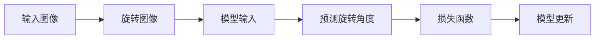

# Self-Supervised Learning原理与代码实例讲解

## 1. 背景介绍

### 1.1 问题的由来

近年来，深度学习在诸多领域取得了突破性进展，然而其成功很大程度上依赖于大规模标注数据的驱动。获取大量高质量的标注数据往往需要耗费巨大的人力、物力和时间成本，这极大地限制了深度学习在更多场景下的应用。为了解决这一瓶颈问题，研究者们开始探索如何利用海量的无标注数据进行模型训练，从而降低对标注数据的依赖，这就是**自监督学习（Self-Supervised Learning）** 的研究动机。

### 1.2 研究现状

自监督学习作为一种新的学习范式，近年来受到了学术界和工业界的广泛关注，并取得了一系列重要进展。目前，自监督学习方法主要可以分为以下几类：

* **基于生成式任务的自监督学习**: 这类方法通过设计一些生成式任务，例如图像修复、图像着色、文本生成等，利用无标注数据训练模型。
* **基于对比学习的自监督学习**: 这类方法通过构建正负样本对，并设计损失函数使得模型能够学习到样本之间的相似性和差异性。
* **基于预测性任务的自监督学习**: 这类方法通过设计一些预测性任务，例如预测图像中被遮挡的部分、预测视频中的下一帧等，利用无标注数据训练模型。

### 1.3 研究意义

自监督学习的研究具有重要的理论意义和现实意义：

* **理论意义**: 自监督学习为解决深度学习对标注数据的依赖问题提供了一种新的思路，推动了机器学习理论的发展。
* **现实意义**: 自监督学习可以利用海量的无标注数据进行模型训练，降低了对标注数据的依赖，有利于推动人工智能在更多场景下的应用。

### 1.4 本文结构

本文将深入浅出地介绍自监督学习的基本原理、典型算法以及代码实例，并探讨其未来发展趋势与挑战。文章结构如下:

## 2. 核心概念与联系

### 2.1 自监督学习的定义

自监督学习是一种机器学习范式，其目标是利用无标注数据训练模型，使其能够学习到数据的内在结构和特征表示。与监督学习需要人工标注数据不同，自监督学习通过设计一些辅助任务（pretext task）来引导模型学习，这些辅助任务通常不需要人工标注，而是可以从数据本身中自动生成。

### 2.2 自监督学习与监督学习、无监督学习的关系

* **与监督学习的关系**: 监督学习需要人工标注数据，而自监督学习不需要人工标注数据，而是利用数据本身的结构和特征进行学习。
* **与无监督学习的关系**: 无监督学习的目标是发现数据中的模式和结构，而自监督学习的目标是利用数据本身的结构和特征进行学习，从而提高模型在下游任务上的性能。

### 2.3 自监督学习的关键要素

自监督学习的关键要素包括：

* **辅助任务**: 辅助任务是自监督学习的核心，其设计的好坏直接影响着模型的学习效果。
* **损失函数**: 损失函数用于衡量模型预测结果与真实结果之间的差异，引导模型进行学习。
* **训练策略**: 训练策略是指如何利用无标注数据训练模型，例如数据增强、模型预训练等。

## 3. 核心算法原理 & 具体操作步骤

### 3.1  算法原理概述

本节将介绍一种经典的自监督学习算法——**旋转预测（Rotation Prediction）**。该算法将图像旋转不同角度作为辅助任务，训练模型预测图像的旋转角度。

**算法流程图:**



**算法原理:**

* 将输入图像随机旋转 0°, 90°, 180° 或 270°，得到旋转后的图像。
* 将旋转后的图像输入到模型中，预测图像的旋转角度。
* 使用交叉熵损失函数计算预测角度与真实角度之间的差异，并更新模型参数。

### 3.2  算法步骤详解

1. **数据预处理**: 对图像进行归一化处理，例如将像素值缩放到 [0, 1] 区间。
2. **图像旋转**: 将每张图像随机旋转 0°, 90°, 180° 或 270°，得到旋转后的图像和对应的旋转角度标签。
3. **模型构建**: 构建一个图像分类模型，例如 ResNet、AlexNet 等。
4. **模型训练**: 将旋转后的图像输入到模型中，预测图像的旋转角度，并使用交叉熵损失函数计算预测角度与真实角度之间的差异，更新模型参数。
5. **模型评估**: 使用测试集评估模型的性能，例如准确率等指标。

### 3.3  算法优缺点

**优点**:

* 简单易实现
* 可以学习到图像的旋转不变性特征

**缺点**:

* 学习到的特征表示能力有限
* 对图像的旋转操作比较敏感

### 3.4  算法应用领域

旋转预测算法可以应用于图像分类、目标检测等领域，提高模型的泛化能力和鲁棒性。

## 4. 数学模型和公式 & 详细讲解 & 举例说明

### 4.1  数学模型构建

旋转预测算法的数学模型可以表示为：

$$
\hat{y} = f(x, \theta)
$$

其中：

* $x$ 表示输入图像
* $\theta$ 表示模型参数
* $f(x, \theta)$ 表示模型对输入图像的预测结果，即预测的旋转角度
* $\hat{y}$ 表示预测的旋转角度

### 4.2  公式推导过程

旋转预测算法使用交叉熵损失函数计算预测角度与真实角度之间的差异：

$$
L = -\frac{1}{N}\sum_{i=1}^{N}\sum_{j=1}^{C}y_{ij}log(\hat{y}_{ij})
$$

其中：

* $N$ 表示样本数量
* $C$ 表示类别数量，即旋转角度的类别数
* $y_{ij}$ 表示第 $i$ 个样本属于第 $j$ 个类别的真实标签，如果第 $i$ 个样本的真实旋转角度为第 $j$ 个类别，则 $y_{ij}=1$，否则 $y_{ij}=0$
* $\hat{y}_{ij}$ 表示模型对第 $i$ 个样本属于第 $j$ 个类别的预测概率

### 4.3  案例分析与讲解

假设我们有一张图像，其真实旋转角度为 90°。我们将该图像输入到旋转预测模型中，模型预测其旋转角度为 180°。则该样本的交叉熵损失为：

$$
L = -(1*log(0) + 0*log(1) + 0*log(0) + 0*log(0)) = +\infty
$$

由于模型预测错误，因此损失函数的值为正无穷大。

### 4.4  常见问题解答

**问题 1**: 旋转预测算法只能预测图像的旋转角度吗？

**回答**: 不，旋转预测算法可以扩展到其他类型的预测任务，例如预测图像的颜色、纹理等。

**问题 2**: 旋转预测算法的训练数据需要进行旋转吗？

**回答**: 是的，旋转预测算法的训练数据需要进行旋转，以便模型学习到图像的旋转不变性特征。

## 5. 项目实践：代码实例和详细解释说明

### 5.1  开发环境搭建

本节将介绍如何使用 Python 和 PyTorch 实现旋转预测算法。

首先，需要安装 PyTorch 和 torchvision 库：

```
pip install torch torchvision
```

### 5.2  源代码详细实现

```python
import torch
import torch.nn as nn
import torch.optim as optim
from torchvision import datasets, transforms

# 定义超参数
batch_size = 64
learning_rate = 0.01
epochs = 10

# 定义数据预处理
transform = transforms.Compose([
    transforms.ToTensor(),
    transforms.Normalize((0.5, 0.5, 0.5), (0.5, 0.5, 0.5))
])

# 加载 CIFAR10 数据集
train_dataset = datasets.CIFAR10(root='./data', train=True, download=True, transform=transform)
train_loader = torch.utils.data.DataLoader(train_dataset, batch_size=batch_size, shuffle=True)

# 定义模型
class RotationPredictionModel(nn.Module):
    def __init__(self):
        super(RotationPredictionModel, self).__init__()
        self.conv1 = nn.Conv2d(3, 6, 5)
        self.pool = nn.MaxPool2d(2, 2)
        self.conv2 = nn.Conv2d(6, 16, 5)
        self