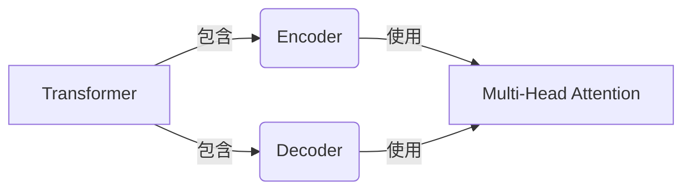
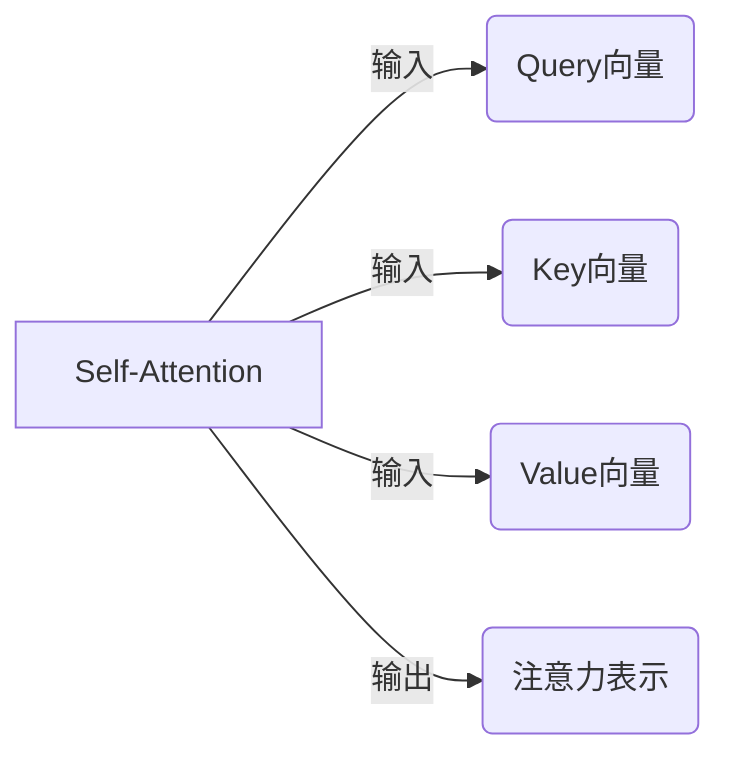
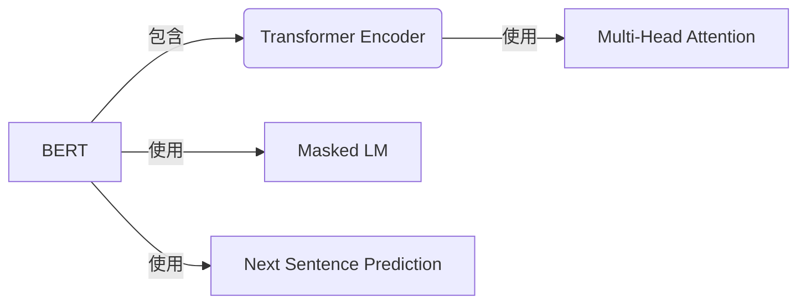

# Transformer大模型实战 了解BERT模型

## 1. 背景介绍

### 1.1 问题的由来

在自然语言处理(NLP)领域,机器理解人类语言并做出合理响应一直是一个巨大的挑战。传统的NLP模型如n-gram模型、统计机器翻译模型等,由于缺乏对语义层面的建模能力,很难解决语义歧义、长距离依赖等核心难题。

为了突破这一瓶颈,研究人员开始探索基于深度学习的新型NLP模型。2017年,Transformer模型在机器翻译任务中取得了惊人的成功,为NLP领域带来了新的曙光。作为Transformer模型的进一步发展,BERT(Bidirectional Encoder Representations from Transformers)于2018年问世,成为NLP领域最重要和最广为人知的预训练语言模型之一。

### 1.2 研究现状  

BERT模型通过在大规模无标注语料库上进行预训练,学习到了丰富的语义知识,可以有效地捕捉词语之间的关联关系。预训练后的BERT可以在下游的NLP任务上进行微调(fine-tuning),显著提高了模型的性能表现。

自从发布以来,BERT模型在多项NLP任务中创造了新的最佳成绩,如文本分类、命名实体识别、问答系统、自然语言推理等,极大推动了NLP技术的发展。越来越多的科技公司和研究机构投入到BERT及其变种模型的研究和应用中。

### 1.3 研究意义

深入理解BERT模型的原理和实现细节,对于NLP从业人员具有重要意义:

1. 帮助掌握transformer编码器的工作机制和自注意力机制,为进一步优化和创新预训练语言模型奠定基础。

2. 了解BERT预训练和微调的过程,为在特定领域和场景进行语言模型微调提供实践指导。

3. 探究BERT在下游任务中的应用,发现其优缺点,为改进模型性能和推动NLP技术发展提供思路。

4. 结合BERT模型在工业界的实践应用,培养解决实际问题的能力,为未来职业发展做好准备。

### 1.4 本文结构

本文将全面介绍BERT模型的相关知识,内容安排如下:

- 第2部分阐述Transformer和BERT模型的核心概念,展示它们与其他NLP模型的关联。

- 第3部分深入探讨BERT模型的算法原理,包括Transformer编码器、预训练任务、微调过程等。

- 第4部分构建BERT模型的数学基础,推导关键公式,并结合案例进行说明。  

- 第5部分提供BERT模型的代码实现细节,帮助读者动手实践。

- 第6部分介绍BERT在实际应用场景中的应用,如问答系统、文本分类等。

- 第7部分总结BERT模型的优缺点,并对其未来发展趋势和面临的挑战进行展望。

## 2. 核心概念与联系

为了理解BERT模型,我们首先需要了解Transformer模型和自注意力(Self-Attention)机制的相关概念。

Transformer是一种全新的基于注意力机制的序列到序列(Seq2Seq)模型,用于机器翻译等任务。它完全放弃了循环神经网络(RNN)和卷积神经网络(CNN)的结构,纯粹使用注意力机制来捕获输入和输出序列之间的长距离依赖关系。

Transformer的核心是Self-Attention(自注意力)机制,通过计算输入序列中每个单词与其他单词的相关性,捕获它们之间的语义关联。这种全局依赖建模的方式,使Transformer在长序列场景下表现优异。

BERT(Bidirectional Encoder Representations from Transformers)是一种基于Transformer编码器的预训练语言模型。与以往的语言模型只能捕获单向上下文不同,BERT使用Masked Language Model(掩蔽语言模型)任务,能够同时获取左右上下文的表示。

通过在大规模无标注语料上进行双向预训练,BERT学习到了丰富的语义知识。预训练完成后,BERT可以在下游的NLP任务上进行微调(fine-tuning),快速适配到新的数据分布和任务目标,大幅提高了模型性能。

BERT模型的出现,不仅推动了NLP技术的发展,也为计算机视觉、语音识别等其他领域的预训练模型研究提供了新思路。

## 3. 核心算法原理 & 具体操作步骤

### 3.1 算法原理概述

BERT模型的核心算法原理可以分为三个部分:Transformer编码器、预训练任务和微调过程。

1. **Transformer编码器**

   BERT使用了基于Self-Attention的Transformer编码器作为基本组件。编码器对输入序列进行编码,生成对应的上下文表示向量。

   编码器由多层相同的子层组成,每一层包含两个子层:Multi-Head Attention层和前馈神经网络层。通过层与层之间的残差连接,编码器可以有效地传递上下文信息。

2. **预训练任务**

   BERT在大规模无标注语料库上执行两个无监督预训练任务:
   
   - Masked Language Model(掩蔽语言模型):对输入序列中随机选择15%的词语进行掩蔽,模型需要根据上下文预测被掩蔽词语的原始词项。
   - Next Sentence Prediction(下一句预测):判断两个句子是否为连续关系,以捕获句子之间的coherence关系。

   通过上述两个任务,BERT可以同时学习到单词级别和句子级别的语义表示。

3. **微调过程**

   在完成预训练后,BERT可以在下游的NLP任务上进行微调(fine-tuning)。微调过程中,BERT的大部分参数保持不变,只对最后一层添加一个输出层,并根据任务目标定义相应的损失函数,使用标注数据进行监督式训练。

   由于BERT在预训练阶段已经学习到了丰富的语义知识,在微调阶段可以快速适配到新的任务,显著提高模型性能。

### 3.2 算法步骤详解

1. **输入表示**

   BERT在输入序列的起始位置添加一个特殊的[CLS]标记,用于表示整个序列;在每个句子的结尾添加[SEP]标记,用于分隔不同的句子。

   输入序列中的每个词语首先通过Word Embedding层转换为词向量表示,然后再与位置嵌入(Position Embedding)和句子嵌入(Sentence Embedding)相加,作为Transformer编码器的输入。

2. **Transformer编码器**

   Transformer编码器的核心是Multi-Head Attention机制。对于每个单词,Attention会计算它与输入序列中其他单词的相关性权重,并根据权重对所有单词的表示进行加权求和,生成该单词的上下文表示向量。

   Multi-Head Attention则是将Attention机制复制成多个头(Head),每一个头可以关注输入序列的不同位置,最终将所有头的结果进行拼接,捕获更丰富的上下文信息。

   除了Attention层,每个编码器层还包含一个前馈神经网络层,对序列进行进一步编码。

3. **预训练任务**

   - Masked LM:在输入序列中随机选择15%的词语进行掩蔽,BERT需要基于上下文预测被掩蔽词语的原始词项。
   - Next Sentence Prediction:判断两个输入句子是否为连续关系,通过[CLS]标记的输出向量进行二分类。

   这两个任务的损失函数之和作为BERT的预训练损失,使用大规模无标注语料进行训练。

4. **微调过程**

   在完成预训练后,BERT可以转移到下游的NLP任务上进行微调。以文本分类任务为例:

   - 将BERT的输出[CLS]向量通过一个分类器层,生成类别概率分布。
   - 使用带标注的文本分类数据,计算分类损失函数。
   - 在保持BERT其余部分参数不变的情况下,只更新分类器层的参数,使分类损失最小化。

   通过微调,BERT可以快速适配到新的任务和数据分布,取得很好的性能表现。

### 3.3 算法优缺点

**优点:**

1. 通过预训练任务学习到丰富的语义知识,避免了从头开始训练的困难。
2. 双向建模能力,可以同时利用左右上下文信息。
3. 自注意力机制,能够有效捕获长距离依赖关系。
4. 可以快速转移到下游任务,通过少量数据微调即可取得很好的性能。

**缺点:**

1. 训练数据量需求大,预训练过程计算开销昂贵。
2. 输入长度受限于最大位置嵌入序列长度,难以直接处理过长序列。
3. 对于某些特定任务,仍需要一定量的标注数据进行微调。
4. 对抗性较差,容易受到对抗样本的攻击。

### 3.4 算法应用领域

BERT模型及其变种在自然语言处理的多个领域都取得了卓越的成绩,主要应用领域包括:

1. **文本分类**:情感分析、新闻分类、垃圾邮件识别等。
2. **序列标注任务**:命名实体识别、词性标注、关键词提取等。
3. **文本生成**:文本续写、对话系统、自动文案创作等。
4. **阅读理解**:问答系统、机器閲读理解、多选阅读理解等。
5. **自然语言推理**:语义等价性判断、事实性推理、关系推理等。
6. **机器翻译**:BERT的多语言版本也被应用于机器翻译任务。

除了NLP领域,BERT模型的思路也被推广到了计算机视觉、语音识别等其他领域,推动了各个领域的AI技术发展。

## 4. 数学模型和公式 & 详细讲解 & 举例说明

### 4.1 数学模型构建

BERT模型的核心是Transformer编码器,我们先来构建Transformer的数学模型。

假设输入序列为$X=(x_1, x_2, ..., x_n)$,其中$x_i$表示第i个词语的词嵌入向量。我们的目标是学习一个序列到序列的映射函数$f: X \rightarrow Y$,使得输出序列$Y$包含了输入序列$X$的丰富上下文语义信息。

在Transformer中,这个映射函数由一系列的编码器层组成:

$$f(X) = \text{Encoder}_N(\text{Encoder}_{N-1}(...\text{Encoder}_1(X)))$$

其中,每一层$\text{Encoder}_i$的计算过程为:

$$\text{Encoder}_i(X) = \text{FeedForward}(\text{Attn}(X) + X)$$

$\text{Attn}(\cdot)$表示Self-Attention子层的计算,用于捕获输入序列中词语之间的相关性关系;$\text{FeedForward}(\cdot)$表示前馈神经网络子层,对序列进行进一步编码。

### 4.2 公式推导过程

我们重点看一下Self-Attention机制的数学原理。Self-Attention的核心思想是计算查询词(Query)与键值对(Key-Value Pair)之间的相关性分数,并据此对值向量(Value)进行加权求和,生成查询词的注意力表示。

具体来说,对于输入序列$X$中的第$i$个词$x_i$,它的注意力表示$\text{Attn}(x_i)$计算如下:

$$\begin{aligned}
\text{Query}_i &= x_iW^Q\\
\text{Key}_j &= x_jW^K\\
\text{Value}_j &= x_jW