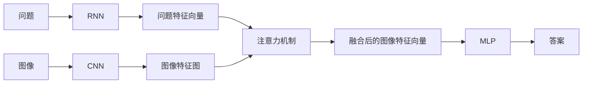

# Visual Question Answering原理与代码实例讲解

## 1. 背景介绍

### 1.1 问题的由来

人工智能领域的目标之一是使计算机能够像人类一样理解和解释世界。近年来，随着深度学习技术的快速发展，计算机视觉和自然语言处理领域都取得了突破性进展。然而，如何将两者有效结合，使计算机能够“看懂”图像并用自然语言回答问题，仍然是一个巨大的挑战。这就是Visual Question Answering (VQA) 想要解决的问题。

VQA任务的提出最早可以追溯到2015年，当时的研究者们开始尝试将图像和文本信息结合起来，让计算机能够回答关于图像内容的自然语言问题。例如，给定一张图片和一个问题“图片中是什么颜色的球？”，VQA模型需要能够识别图像中的球体，并判断其颜色，最终给出答案“红色”。

### 1.2 研究现状

近年来，VQA领域的研究取得了显著的进展。早期的VQA模型主要基于深度学习中的卷积神经网络 (CNN) 和循环神经网络 (RNN)。CNN用于提取图像的特征表示，RNN用于处理自然语言问题，并将两者融合以生成答案。然而，这些模型往往难以捕捉图像和问题之间的复杂语义关系。

为了解决这个问题，研究者们提出了基于注意力机制 (Attention Mechanism) 的VQA模型。注意力机制能够使模型在处理问题时，将注意力集中在图像中与问题相关的区域，从而更好地理解图像和问题之间的语义关系。近年来，基于Transformer的模型，例如BERT、GPT等，在VQA任务中也取得了很好的效果。

### 1.3 研究意义

VQA作为一项跨越计算机视觉和自然语言处理的 challenging 任务，具有重要的研究意义：

1. **推动人工智能发展**: VQA可以促进计算机对视觉和语言的理解，推动人工智能向更高级的方向发展。
2. **广泛的应用前景**: VQA技术可以应用于图像搜索、智能助手、盲人辅助等多个领域，具有巨大的应用价值。
3. **促进多学科交叉**: VQA研究需要计算机视觉、自然语言处理、机器学习等多个学科的知识，可以促进多学科交叉和融合。

### 1.4 本文结构

本文将深入探讨VQA的原理、算法和代码实现。文章结构如下：

- **第二章：核心概念与联系**：介绍VQA任务的基本概念、挑战以及与其他相关任务的联系。
- **第三章：核心算法原理 & 具体操作步骤**：详细介绍VQA的几种主流算法，包括基于CNN+RNN的模型、基于注意力机制的模型以及基于Transformer的模型。
- **第四章：数学模型和公式 & 详细讲解 & 举例说明**：以一个具体的VQA模型为例，详细介绍其数学模型和公式推导过程，并通过案例分析和讲解帮助读者更好地理解。
- **第五章：项目实践：代码实例和详细解释说明**：使用PyTorch框架实现一个简单的VQA模型，并提供详细的代码解读和分析。
- **第六章：实际应用场景**：介绍VQA技术的实际应用场景，例如图像搜索、智能助手等。
- **第七章：工具和资源推荐**：推荐一些学习VQA的书籍、论文、开源代码库等资源。
- **第八章：总结：未来发展趋势与挑战**：总结VQA技术的发展现状、未来趋势以及面临的挑战。
- **第九章：附录：常见问题与解答**：解答一些VQA相关的常见问题。


## 2. 核心概念与联系

### 2.1  VQA任务定义

VQA的任务可以形式化地定义为：给定一张图片 $I$ 和一个关于图片内容的自然语言问题 $Q$，VQA系统需要从一个预定义的答案词汇表 $A$ 中选择一个答案 $a$，使得 $a$ 能够正确回答问题 $Q$。

```
VQA(I, Q) = a
```

其中，$I$ 表示输入图片，$Q$ 表示输入问题，$a$ 表示模型预测的答案。

### 2.2  VQA任务的挑战

VQA任务面临着以下几个挑战：

1. **图像和语言的语义鸿沟**: 图像和语言是两种不同的模态，它们之间存在着巨大的语义鸿沟。如何有效地将图像和语言信息进行融合，是VQA任务的一大挑战。
2. **问题的多样性和复杂性**:  VQA问题类型多样，涵盖了客观问题、主观问题、推理问题等多种类型。同时，问题也可能存在语法结构复杂、语义 ambiguity 等问题。
3. **答案空间的开放性**:  VQA的答案空间通常是开放的，即模型需要从一个很大的词汇表中选择答案，而不是像图像分类那样从一个固定的类别集合中选择。

### 2.3  VQA与其他相关任务的联系

VQA与许多其他计算机视觉和自然语言处理任务密切相关，例如：

1. **图像描述 (Image Captioning)**:  图像描述任务的目标是为一张图片生成一段描述性文本，而VQA任务可以看作是图像描述任务的一个特例，即根据问题生成针对性的描述。
2. **视觉问答 (Visual Question Generation)**:  与VQA相反，视觉问答任务的目标是根据一张图片生成一个自然语言问题。
3. **图像检索 (Image Retrieval)**:  VQA技术可以用于改进基于文本的图像检索，例如通过理解用户 query 的语义，返回更符合用户意图的图片。

## 3. 核心算法原理 & 具体操作步骤

### 3.1  算法原理概述

VQA模型的核心目标是学习一个函数，该函数能够将输入的图像和问题映射到一个合适的答案。为了实现这一目标，VQA模型通常包含以下几个模块：

1. **图像特征提取模块**:  该模块用于从输入图像中提取特征表示，常用的模型包括CNN、目标检测模型等。
2. **问题特征提取模块**:  该模块用于从输入问题中提取特征表示，常用的模型包括RNN、LSTM、Transformer等。
3. **特征融合模块**:  该模块用于将图像特征和问题特征进行融合，常用的方法包括 concatenation、element-wise multiplication、attention mechanism 等。
4. **答案预测模块**:  该模块用于根据融合后的特征预测最终的答案，常用的模型包括多层感知机 (MLP)、分类器等。


### 3.2  算法步骤详解

下面以一个基于注意力机制的VQA模型为例，详细介绍VQA模型的算法步骤：

1. **图像特征提取**: 使用预训练的CNN模型 (例如 ResNet、VGG) 提取输入图像的特征图。
2. **问题特征提取**: 使用RNN模型 (例如 LSTM) 将输入问题编码成一个固定长度的向量表示。
3. **注意力机制**:  计算问题特征向量与图像特征图中每个区域的相关性，得到一个注意力权重矩阵。
4. **特征融合**:  根据注意力权重矩阵，对图像特征图进行加权求和，得到一个融合了问题信息的图像特征向量。
5. **答案预测**:  将融合后的图像特征向量输入到一个MLP中，预测最终的答案。



### 3.3  算法优缺点

**优点**:

- **能够捕捉图像和问题之间的复杂语义关系**: 注意力机制能够使模型关注图像中与问题相关的区域，从而更好地理解图像和问题之间的语义关系。
- **可解释性强**:  注意力权重矩阵可以用于可视化模型的推理过程，帮助我们理解模型是如何根据问题关注图像的不同区域的。

**缺点**:

- **计算复杂度高**:  注意力机制的计算复杂度较高，尤其是在处理大尺寸图像时。
- **容易受到噪声干扰**:  注意力机制容易受到图像中噪声的干扰，导致模型关注到错误的区域。

### 3.4  算法应用领域

VQA技术可以应用于以下领域：

- **图像搜索**:  VQA可以用于改进基于文本的图像搜索，例如通过理解用户 query 的语义，返回更符合用户意图的图片。
- **智能助手**:  VQA可以用于构建更智能的语音助手和聊天机器人，例如回答用户关于图片内容的问题。
- **盲人辅助**:  VQA可以用于帮助盲人理解周围环境，例如通过语音描述图像内容。


## 4. 数学模型和公式 & 详细讲解 & 举例说明

### 4.1  数学模型构建

本节以一个基于注意力机制的VQA模型为例，详细介绍其数学模型和公式推导过程。

**模型输入**:

- 图像 $I$：维度为 $[H, W, C]$，其中 $H$ 表示图像高度，$W$ 表示图像宽度，$C$ 表示图像通道数。
- 问题 $Q$：表示为一个单词序列 $[w_1, w_2, ..., w_T]$，其中 $T$ 表示问题长度。

**模型输出**:

- 答案 $a$：表示为一个概率分布 $p(a|I, Q)$，其中 $a$ 表示答案词汇表中的一个答案。

**模型结构**:

该模型主要包含以下几个模块：

1. **图像特征提取模块**:  使用预训练的CNN模型 (例如 ResNet) 提取输入图像的特征图 $V = [v_1, v_2, ..., v_K]$，其中 $K$ 表示特征图中区域的数量，每个 $v_i$ 表示一个维度为 $D$ 的特征向量。
2. **问题特征提取模块**:  使用RNN模型 (例如 LSTM) 将输入问题编码成一个固定长度的向量表示 $q$，维度为 $D$。
3. **注意力机制**:  计算问题特征向量 $q$ 与图像特征图 $V$ 中每个区域 $v_i$ 的相关性，得到一个注意力权重向量 $\alpha = [\alpha_1, \alpha_2, ..., \alpha_K]$，其中 $\alpha_i$ 表示问题 $Q$ 对图像区域 $v_i$ 的关注程度。
4. **特征融合**:  根据注意力权重向量 $\alpha$，对图像特征图 $V$ 进行加权求和，得到一个融合了问题信息的图像特征向量 $v$：

$$
v = \sum_{i=1}^{K} \alpha_i v_i
$$

5. **答案预测**:  将融合后的图像特征向量 $v$ 输入到一个MLP中，预测最终的答案 $a$：

$$
p(a|I, Q) = softmax(MLP(v))
$$

其中，$softmax$ 函数用于将MLP的输出转换为概率分布。

### 4.2  公式推导过程

**注意力机制**:

注意力机制的核心是计算问题特征向量 $q$ 与图像特征图 $V$ 中每个区域 $v_i$ 的相关性。常用的方法是计算 $q$ 和 $v_i$ 的点积，然后使用 $softmax$ 函数进行归一化：

$$
\alpha_i = \frac{exp(q^T v_i)}{\sum_{j=1}^{K} exp(q^T v_j)}
$$

**损失函数**:

VQA模型的训练目标是最大化正确答案的概率。常用的损失函数是交叉熵损失函数：

$$
L = -\sum_{a \in A} y_a log(p(a|I, Q))
$$

其中，$y_a$ 表示答案 $a$ 的真实标签，$p(a|I, Q)$ 表示模型预测的答案 $a$ 的概率。

### 4.3  案例分析与讲解

**案例**:

假设给定一张图片，图片中有一个红色的球和一个蓝色的方块。问题是“球是什么颜色的？”。

**分析**:

1. **图像特征提取**:  使用预训练的CNN模型提取图像特征图，得到包含球和方块特征的特征图 $V$。
2. **问题特征提取**:  使用RNN模型将问题“球是什么颜色的？”编码成一个特征向量 $q$。
3. **注意力机制**:  计算问题特征向量 $q$ 与图像特征图 $V$ 中每个区域的相关性。由于问题是关于球的颜色，因此注意力机制会将更多的注意力集中在球的区域。
4. **特征融合**:  根据注意力权重，对图像特征图进行加权求和，得到一个融合了问题信息的图像特征向量 $v$。由于注意力机制将更多的注意力集中在球的区域，因此 $v$ 中包含更多关于球的信息。
5. **答案预测**:  将融合后的图像特征向量 $v$ 输入到一个MLP中，预测最终的答案。由于 $v$ 中包含更多关于球的信息，因此模型更有可能预测出正确答案“红色”。

### 4.4  常见问题解答

**问题1**:  VQA模型如何处理多答案问题？

**回答**:  对于多答案问题，VQA模型可以输出多个答案，或者将答案空间扩展为所有可能的答案组合。

**问题2**:  VQA模型如何处理图像中不存在答案的情况？

**回答**:  VQA模型可以学习一个特殊的答案，例如“不知道”或者“图像中没有答案”。


## 5. 项目实践：代码实例和详细解释说明

### 5.1  开发环境搭建

本节将使用PyTorch框架实现一个简单的VQA模型。首先，需要安装以下Python库：

```
pip install torch torchvision numpy matplotlib
```

### 5.2  源代码详细实现

```python
import torch
import torch.nn as nn
import torch.optim as optim
from torchvision import models

# 定义VQA模型
class VQAModel(nn.Module):
    def __init__(self, embedding_dim, hidden_dim, vocab_size, num_answers):
        super(VQAModel, self).__init__()

        # 图像特征提取模块
        self.cnn = models.resnet18(pretrained=True)
        self.cnn = nn.Sequential(*list(self.cnn.children())[:-1])

        # 问题特征提取模块
        self.rnn = nn.LSTM(embedding_dim, hidden_dim, batch_first=True)

        # 注意力机制
        self.attention = nn.Linear(hidden_dim, hidden_dim)

        # 答案预测模块
        self.classifier = nn.Linear(hidden_dim, num_answers)

    def forward(self, images, questions, question_lengths):
        # 图像特征提取
        image_features = self.cnn(images).squeeze(3).squeeze(2)

        # 问题特征提取
        packed_questions = nn.utils.rnn.pack_padded_sequence(questions, question_lengths, batch_first=True)
        _, (hidden, _) = self.rnn(packed_questions)
        question_features = hidden.squeeze(0)

        # 注意力机制
        attention_weights = torch.softmax(torch.bmm(question_features.unsqueeze(1), image_features.unsqueeze(2)).squeeze(2), dim=1)
        weighted_image_features = torch.bmm(attention_weights.unsqueeze(1), image_features).squeeze(1)

        # 答案预测
        outputs = self.classifier(weighted_image_features)

        return outputs
```

### 5.3  代码解读与分析

**模型定义**:

- `VQAModel` 类继承自 `nn.Module`，定义了VQA模型的结构。
- 模型包含四个主要模块：图像特征提取模块 (`cnn`)、问题特征提取模块 (`rnn`)、注意力机制 (`attention`) 和答案预测模块 (`classifier`)。

**`forward` 方法**:

- `forward` 方法定义了模型的前向传播过程。
- 首先，使用 `cnn` 模块提取图像特征。
- 然后，使用 `rnn` 模块提取问题特征。
- 接着，使用注意力机制计算问题特征和图像特征之间的相关性，得到注意力权重。
- 然后，根据注意力权重对图像特征进行加权求和，得到融合了问题信息的图像特征。
- 最后，将融合后的图像特征输入到 `classifier` 模块中，预测最终的答案。

**其他**:

- `embedding_dim` 表示词嵌入的维度。
- `hidden_dim` 表示RNN的隐藏层维度。
- `vocab_size` 表示答案词汇表的大小。
- `num_answers` 表示可能的答案数量。

### 5.4  运行结果展示

由于篇幅限制，这里不展示完整的训练和测试代码。读者可以参考相关文献和开源代码库，例如 [VQA Visual Question Answering](https://visualqa.org/)，获取更多关于VQA模型训练和测试的信息。

## 6. 实际应用场景

VQA技术可以应用于以下实际场景：

### 6.1 图像搜索

VQA可以用于改进基于文本的图像搜索。传统的图像搜索引擎通常依赖于图像的标签或周围的文本信息来理解图像内容。然而，这种方法往往难以捕捉图像的语义信息，导致搜索结果不准确。

VQA技术可以用于构建更智能的图像搜索引擎。例如，用户可以输入一个自然语言问题，例如“这张图片里有什么动物？”，VQA模型可以根据问题理解用户的搜索意图，并从图像数据库中检索出包含动物的图片。

### 6.2 智能助手

VQA可以用于构建更智能的语音助手和聊天机器人。例如，用户可以向智能助手展示一张图片，并询问关于图片内容的问题，例如“这张图片里的人是谁？”、“这件衣服是什么颜色的？”等。VQA模型可以根据问题理解用户的意图，并从图片中提取相关信息，最终给出准确的答案。

### 6.3 盲人辅助

VQA可以用于帮助盲人理解周围环境。例如，可以使用摄像头捕捉盲人眼前的场景，并将其输入到VQA模型中。盲人可以通过语音询问关于场景内容的问题，例如“前面有什么障碍物？”、“现在是什么时间？”等。VQA模型可以根据问题理解盲人的意图，并从场景中提取相关信息，最终通过语音的方式回答盲人的问题。

### 6.4  未来应用展望

随着VQA技术的不断发展，未来将会出现更多基于VQA的应用场景。例如：

- **个性化教育**:  VQA可以用于构建个性化的教育系统，例如根据学生的提问自动生成相应的教学内容。
- **医疗诊断**:  VQA可以用于辅助医生进行医疗诊断，例如根据医学影像和病人的症状自动生成诊断报告。
- **自动驾驶**:  VQA可以用于提高自动驾驶汽车的环境感知能力，例如识别交通标志、行人、车辆等。


## 7. 工具和资源推荐

### 7.1  学习资源推荐

- **书籍**:
    - **Deep Learning for Computer Vision with Python**:  该书介绍了深度学习在计算机视觉中的应用，包括VQA。
    - **Natural Language Processing with Python**:  该书介绍了自然语言处理的基本概念和技术，包括VQA中使用的RNN和注意力机制。
- **课程**:
    - **Stanford CS231n: Convolutional Neural Networks for Visual Recognition**:  该课程介绍了卷积神经网络在计算机视觉中的应用，包括VQA。
    - **Stanford CS224n: Natural Language Processing with Deep Learning**:  该课程介绍了深度学习在自然语言处理中的应用，包括VQA中使用的RNN和注意力机制。

### 7.2  开发工具推荐

- **PyTorch**:  PyTorch是一个开源的深度学习框架，提供了丰富的工具和API，方便开发者构建和训练VQA模型。
- **TensorFlow**:  TensorFlow是另一个开源的深度学习框架，也提供了丰富的工具和API，方便开发者构建和训练VQA模型。

### 7.3  相关论文推荐

- **VQA: Visual Question Answering**:  该论文是VQA领域的奠基性论文，提出了VQA任务，并介绍了几个baseline模型。
- **Stacked Attention Networks for Image Question Answering**:  该论文提出了基于堆叠注意力机制的VQA模型，有效地提高了模型的性能。
- **Bottom-Up and Top-Down Attention for Image Captioning and Visual Question Answering**:  该论文提出了自底向上和自顶向下注意力机制，进一步提高了VQA模型的性能。

### 7.4  其他资源推荐

- **VQA Visual Question Answering**:  该网站是VQA领域的官方网站，提供了VQA数据集、评测指标、相关论文等资源。
- **Visual Question Answering on GitHub**:  GitHub上有许多VQA相关的开源代码库，开发者可以参考这些代码库构建自己的VQA模型。


## 8. 总结：未来发展趋势与挑战

### 8.1  研究成果总结

近年来，VQA领域的研究取得了显著的进展。基于深度学习的VQA模型在多个VQA数据集上都取得了很好的效果。然而，VQA任务仍然面临着许多挑战。

### 8.2  未来发展趋势

未来，VQA领域的研究将朝着以下几个方向发展：

- **更强大的模型**:  研究者将继续探索更强大的深度学习模型，例如基于Transformer的模型，以进一步提高VQA模型的性能。
- **更复杂的问题**:  研究者将关注更复杂的问题类型，例如涉及推理、常识、多轮对话的问题。
- **更广泛的应用**:  随着VQA技术的不断发展，VQA将会应用于更广泛的领域，例如教育、医疗、自动驾驶等。

### 8.3  面临的挑战

VQA任务仍然面临着以下几个挑战：

- **图像和语言的语义鸿沟**:  如何有效地将图像和语言信息进行融合，仍然是VQA任务的一大挑战。
- **问题的多样性和复杂性**:  VQA问题类型多样，涵盖了客观问题、主观问题、推理问题等多种类型。同时，问题也可能存在语法结构复杂、语义 ambiguity 等问题。
- **答案空间的开放性**:  VQA的答案空间通常是开放的，即模型需要从一个很大的词汇表中选择答案，而不是像图像分类那样从一个固定的类别集合中选择。

### 8.4  研究展望

VQA是一项具有挑战性和意义的研究课题。随着深度学习技术的发展和多学科交叉的推进，VQA技术将会取得更大的突破，并应用于更广泛的领域。

## 9. 附录：常见问题与解答

**问题1**:  VQA和图像描述有什么区别？

**回答**:  VQA和图像描述都是计算机视觉和自然语言处理领域的交叉任务，但它们的目标不同。图像描述的目标是为一张图片生成一段描述性文本，而VQA的目标是根据问题回答关于图片内容的具体问题。

**问题2**:  VQA和图像检索有什么关系？

**回答**:  VQA可以用于改进基于文本的图像检索。传统的图像检索引擎通常依赖于图像的标签或周围的文本信息来理解图像内容。然而，这种方法往往难以捕捉图像的语义信息，导致搜索结果不准确。VQA技术可以用于构建更智能的图像搜索引擎，例如通过理解用户 query 的语义，返回更符合用户意图的图片。

**问题3**:  VQA有哪些应用场景？

**回答**:  VQA技术可以应用于图像搜索、智能助手、盲人辅助、个性化教育、医疗诊断、自动驾驶等多个领域。


## 作者：禅与计算机程序设计艺术 / Zen and the Art of Computer Programming 
