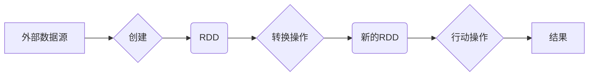

# 【AI大数据计算原理与代码实例讲解】RDD

## 1. 背景介绍

### 1.1 问题的由来

随着互联网和移动设备的普及，全球数据量呈爆炸式增长，大数据时代已经到来。如何高效地存储、处理和分析海量数据成为学术界和工业界共同关注的焦点。传统的单机计算模式已经无法满足大数据处理的需求，分布式计算框架应运而生。在众多分布式计算框架中，Apache Spark凭借其高效、易用、通用等优势，成为近年来最受欢迎的大数据处理平台之一。

Spark的核心抽象是弹性分布式数据集（Resilient Distributed Dataset，RDD），它是一个不可变的分布式数据集合，可以被分区并行处理。RDD的出现，使得大规模数据的并行处理变得更加简单和高效。

### 1.2 研究现状

目前，RDD已经被广泛应用于各种大数据应用场景，例如：

* **数据清洗和预处理:** RDD可以用于清洗和转换原始数据，为后续的数据分析和机器学习任务做好准备。
* **批处理:** RDD支持批处理操作，可以高效地处理大规模数据集。
* **机器学习:** RDD可以作为机器学习算法的输入数据，用于训练和评估模型。
* **图计算:** RDD可以用于表示和处理图数据，例如社交网络和推荐系统。
* **流处理:** Spark Streaming 基于RDD构建，可以用于实时处理数据流。

### 1.3 研究意义

深入理解RDD的概念、原理和应用，对于我们更好地利用Spark平台处理大规模数据具有重要意义。通过学习RDD，我们可以：

* 掌握Spark平台的核心抽象和编程模型。
* 理解RDD的内部机制和工作原理。
* 了解RDD的常见操作和应用场景。
* 能够使用RDD开发高效的分布式数据处理程序。

### 1.4 本文结构

本文将从以下几个方面对RDD进行详细介绍：

* **核心概念与联系:** 介绍RDD的定义、特点、转换操作和行动操作。
* **核心算法原理 & 具体操作步骤:** 深入分析RDD的创建、转换和行动操作的内部实现机制。
* **数学模型和公式 & 详细讲解 & 举例说明:**  以WordCount为例，讲解RDD的数学模型和公式推导过程，并给出详细的案例分析和讲解。
* **项目实践：代码实例和详细解释说明:** 提供完整的代码实例，演示如何使用RDD进行数据处理，并对代码进行详细的解读和分析。
* **实际应用场景:** 介绍RDD在实际应用场景中的应用案例。
* **工具和资源推荐:** 推荐学习RDD的相关资源，包括书籍、网站和开源项目。
* **总结：未来发展趋势与挑战:** 总结RDD的研究成果、未来发展趋势以及面临的挑战。

## 2. 核心概念与联系

### 2.1 RDD的定义

RDD是Spark的核心抽象，全称为弹性分布式数据集（Resilient Distributed Dataset）。它是一个不可变的分布式数据集合，可以被分区并行处理。RDD的特点如下：

* **弹性:** RDD具有容错性，可以从节点故障中自动恢复。
* **分布式:** RDD的数据分布存储在集群的不同节点上。
* **数据集:** RDD是一个数据集合，可以包含任意类型的数据。
* **不可变:** RDD一旦创建就不能修改，只能通过转换操作生成新的RDD。

### 2.2 RDD的创建

RDD可以通过以下两种方式创建：

* **从外部数据源加载:** 例如，从HDFS、本地文件系统、数据库等加载数据。

```python
# 从HDFS加载文本文件
lines = sc.textFile("hdfs://namenode:9000/input.txt")

# 从本地文件系统加载文本文件
lines = sc.textFile("file:///path/to/input.txt")
```

* **从已有的集合创建:** 例如，从Scala的List、Set等集合创建RDD。

```python
# 从列表创建RDD
data = [1, 2, 3, 4, 5]
rdd = sc.parallelize(data)
```

### 2.3 RDD的转换操作

RDD的转换操作是指将一个RDD转换为另一个RDD的操作。转换操作是懒加载的，只有当遇到行动操作时才会真正执行。常见的转换操作有：

* **map:** 对RDD中的每个元素应用一个函数，返回一个新的RDD。
* **filter:** 过滤RDD中满足条件的元素，返回一个新的RDD。
* **flatMap:** 对RDD中的每个元素应用一个函数，将结果扁平化后返回一个新的RDD。
* **groupByKey:** 按照key对RDD中的元素进行分组，返回一个新的RDD。
* **reduceByKey:** 按照key对RDD中的元素进行聚合，返回一个新的RDD。
* **join:** 将两个RDD按照key进行连接，返回一个新的RDD。

### 2.4 RDD的行动操作

RDD的行动操作是指触发RDD计算并返回结果的操作。常见的行动操作有：

* **collect:** 将RDD的所有元素收集到Driver程序中。
* **count:** 返回RDD中元素的个数。
* **take:** 返回RDD中的前n个元素。
* **reduce:** 对RDD中的所有元素进行聚合，返回一个结果。
* **saveAsTextFile:** 将RDD保存到文本文件。

### 2.5 RDD之间的关系图



## 3. 核心算法原理 & 具体操作步骤

### 3.1 RDD的内部机制

RDD的内部机制主要包括以下几个方面：

* **分区:** RDD的数据被分成多个分区，每个分区可以并行处理。
* **依赖关系:** RDD之间存在依赖关系，用于记录RDD的 lineage 信息，以便在节点故障时进行恢复。
* **计算模型:** RDD采用懒加载的计算模型，只有当遇到行动操作时才会真正执行。

### 3.2 RDD的创建过程

RDD的创建过程如下：

1. 从外部数据源加载数据，或者从已有的集合创建RDD。
2. 将数据划分成多个分区。
3. 创建RDD对象，记录RDD的 lineage 信息。

### 3.3 RDD的转换操作实现

RDD的转换操作是懒加载的，不会立即执行。当调用转换操作时，Spark会创建一个新的RDD对象，并将转换操作记录到RDD的 lineage 信息中。

### 3.4 RDD的行动操作实现

当调用RDD的行动操作时，Spark会根据RDD的 lineage 信息构建DAG（Directed Acyclic Graph，有向无环图），并提交到DAGScheduler进行调度执行。

## 4. 数学模型和公式 & 详细讲解 & 举例说明

### 4.1 WordCount案例分析

WordCount是一个经典的大数据处理案例，用于统计文本文件中每个单词出现的次数。

### 4.2 RDD实现WordCount

使用RDD实现WordCount的步骤如下：

1. 从文本文件创建RDD。
2. 将每行文本分割成单词。
3. 按照单词进行分组。
4. 统计每个单词出现的次数。

```python
# 从文本文件创建RDD
lines = sc.textFile("input.txt")

# 将每行文本分割成单词
words = lines.flatMap(lambda line: line.split(" "))

# 按照单词进行分组
wordCounts = words.map(lambda word: (word, 1)).reduceByKey(lambda a, b: a + b)

# 打印结果
print(wordCounts.collect())
```

### 4.3 数学模型

WordCount的数学模型可以使用map-reduce模型来表示。

* **map阶段:** 将每行文本分割成单词，并为每个单词生成一个键值对，其中键是单词，值是1。
* **reduce阶段:** 按照单词进行分组，并将每个单词对应的值进行累加，得到每个单词出现的次数。

### 4.4 公式推导

假设输入数据为：

```
hello world
world hello
```

* **map阶段:**

```
(hello, 1)
(world, 1)
(world, 1)
(hello, 1)
```

* **reduce阶段:**

```
(hello, 2)
(world, 2)
```

## 5. 项目实践：代码实例和详细解释说明

### 5.1 开发环境搭建

* 安装Java JDK 8+
* 下载并解压Apache Spark
* 设置环境变量

### 5.2 源代码详细实现

```python
from pyspark import SparkContext

# 创建SparkContext
sc = SparkContext("local", "WordCount")

# 从文本文件创建RDD
lines = sc.textFile("input.txt")

# 将每行文本分割成单词
words = lines.flatMap(lambda line: line.split(" "))

# 按照单词进行分组
wordCounts = words.map(lambda word: (word, 1)).reduceByKey(lambda a, b: a + b)

# 打印结果
print(wordCounts.collect())

# 停止SparkContext
sc.stop()
```

### 5.3 代码解读与分析

* **创建SparkContext:** `SparkContext`是Spark程序的入口点，用于连接Spark集群。
* **从文本文件创建RDD:** `sc.textFile()`方法用于从文本文件创建RDD。
* **flatMap()转换操作:** `flatMap()`方法对RDD中的每个元素应用一个函数，将结果扁平化后返回一个新的RDD。
* **map()转换操作:** `map()`方法对RDD中的每个元素应用一个函数，返回一个新的RDD。
* **reduceByKey()转换操作:** `reduceByKey()`方法按照key对RDD中的元素进行聚合，返回一个新的RDD。
* **collect()行动操作:** `collect()`方法将RDD的所有元素收集到Driver程序中。

### 5.4 运行结果展示

```
[('hello', 2), ('world', 2)]
```

## 6. 实际应用场景

### 6.1 数据清洗和预处理

RDD可以用于清洗和转换原始数据，例如：

* 过滤掉无效数据
* 填充缺失值
* 数据类型转换

### 6.2 批处理

RDD支持批处理操作，可以高效地处理大规模数据集，例如：

* 计算汇总统计信息
* 数据排序
* 数据去重

### 6.3 机器学习

RDD可以作为机器学习算法的输入数据，用于训练和评估模型，例如：

* 特征提取
* 模型训练
* 模型评估

### 6.4 未来应用展望

随着大数据技术的不断发展，RDD在未来将会应用于更多领域，例如：

* 图计算
* 流处理
* 深度学习

## 7. 工具和资源推荐

### 7.1 学习资源推荐

* Spark官方文档: https://spark.apache.org/docs/latest/
* 《Spark快速大数据分析》

### 7.2 开发工具推荐

* IntelliJ IDEA
* Eclipse

### 7.3 相关论文推荐

* Matei Zaharia, et al. "Resilient distributed datasets: A fault-tolerant abstraction for in-memory cluster computing." NSDI'12.

### 7.4 其他资源推荐

* Spark官方网站: https://spark.apache.org/
* Spark社区: https://spark.apache.org/community.html

## 8. 总结：未来发展趋势与挑战

### 8.1 研究成果总结

RDD是Spark的核心抽象，它为大规模数据的并行处理提供了一种高效、灵活和容错的解决方案。

### 8.2 未来发展趋势

* RDD的性能优化
* RDD与其他大数据技术的融合
* RDD在更多领域的应用

### 8.3 面临的挑战

* RDD的易用性
* RDD的安全性
* RDD的可扩展性

### 8.4 研究展望

随着大数据技术的不断发展，RDD将会继续发挥重要作用，并推动大数据技术的发展。


作者：禅与计算机程序设计艺术 / Zen and the Art of Computer Programming 
