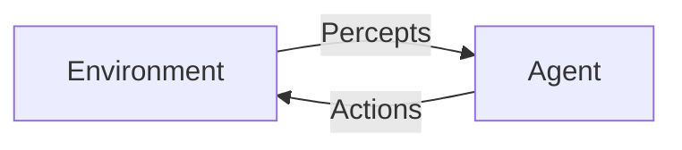

# 【大模型应用开发 动手做AI Agent】大模型出现之前的Agent

## 1. 背景介绍

### 1.1 问题的由来

在人工智能(AI)领域,Agent一直是一个重要的概念和研究方向。Agent可以被视为一个感知环境并根据环境做出行为的自主实体。在大规模语言模型(如GPT-3、ChatGPT等)出现之前,Agent主要是基于规则、知识库或经典机器学习算法构建的。

传统Agent面临的主要挑战包括:

1. **知识获取**:如何高效地从各种数据源中获取知识并建模?
2. **推理能力**:如何在有限的知识和计算资源下进行复杂推理?
3. **决策制定**:如何根据当前状态和目标制定合理的行为决策?
4. **交互能力**:如何与人类或其他Agent自然、高效地交互?

### 1.2 研究现状  

早期的Agent系统主要依赖专家知识和规则,如基于规则的专家系统、规划系统等。随着机器学习的发展,基于数据驱动的Agent也逐渐兴起,如强化学习Agent、多智能体系统等。

此外,一些综合方法也被提出,试图结合符号推理、机器学习等不同范式的优势,构建更加通用和智能的Agent,如认知架构(Cognitive Architecture)、混合智能系统等。

### 1.3 研究意义

发展高性能Agent对于实现通用人工智能(Artificial General Intelligence, AGI)至关重要。Agent需要具备多模态感知、逻辑推理、决策制定、交互沟通等各种能力,并能在动态、不确定的环境中自主运作。因此,Agent研究不仅是人工智能理论研究的重点,也是推动人工智能实际应用的关键。

### 1.4 本文结构

本文将首先介绍Agent的核心概念,包括智能Agent的定义、Agent与环境的交互模型等。然后分别从经典算法和架构两个角度,阐述大模型出现之前Agent的核心原理和实现方法。接下来通过数学模型和代码实例,对关键技术进行深入分析和实践演示。最后探讨Agent在实际应用中的场景,并对未来发展趋势和挑战进行展望。

## 2. 核心概念与联系

在介绍具体算法和架构之前,我们先来理解Agent的核心概念。

**智能Agent**可以定义为:一个感知环境并根据环境做出行为以实现某种目标的自主实体。一个智能Agent通常包括以下几个关键组成部分:

- **感知器(Sensors)**: 用于获取环境状态信息
- **执行器(Actuators)**: 用于对环境施加行为
- **知识库(Knowledge Base)**: 存储Agent的知识和经验
- **推理引擎(Inference Engine)**: 根据感知、知识和目标进行推理并作出决策

Agent与环境的交互可以用下面的模型来描述:

其中:

- **Percepts**: 环境状态的感知输入
- **Actions**: Agent对环境施加的行为输出

Agent的目标是基于当前Percepts和Knowledge Base,通过推理决策产生合适的Actions,以最大化某种效用函数或达成特定目标。

经典Agent系统主要包括以下几种类型:

- **简单反射Agent**: 基于条件行为规则的最简单Agent
- **基于模型的Agent**: 利用环境模型进行规划和推理
- **基于目标的Agent**: 根据期望效用最大化目标进行决策
- **基于效用的Agent**: 结合概率模型进行效用最大化决策
- **学习Agent**: 具有学习能力,可以从经验中积累知识

上述Agent类型各有优缺点,在不同应用场景下会有不同的选择。接下来我们将分别介绍一些经典算法和架构。

## 3. 核心算法原理 & 具体操作步骤  

### 3.1 算法原理概述

在大模型出现之前,Agent系统主要依赖一些经典的搜索、规划、推理和学习算法。这些算法为Agent赋予了一定的智能,但也存在明显的局限性。

**搜索算法**

搜索算法是最基本的一类算法,用于在一组可能的解决方案中寻找最优解。常见的搜索算法包括:

- 盲目搜索: 广度优先搜索、深度优先搜索等
- 启发式搜索: 贪婪最优优先搜索、A*算法等
- 局部搜索: 爬山算法、模拟退火等

这些算法在有限、静态的搜索空间中表现良好,但在动态、复杂的环境中就力有未逮。

**规划算法**

规划算法旨在根据环境模型和目标,生成一系列行为以达成目标。常见的规划算法有:

- 情景规划: 线性规划、非线性规划等
- 时序规划: 部分可观测马尔可夫决策过程(POMDP)等
- 层次规划: 分层时序规划等

规划算法需要对环境建模,并假设环境是确定性或满足马尔可夫性质,在实际应用中这种假设常常不成立。

**逻辑推理算法**

逻辑推理算法基于知识库和推理规则进行符号推理,主要包括:

- 命题逻辑推理
- 一阶逻辑推理: 解释器、证明程序等
- 非单调推理: 缺省推理、权衡推理等
- 概率推理: 贝叶斯网络推理等

逻辑推理算法能处理复杂知识,但推理效率往往较低,且知识获取是一大难题。

**机器学习算法**

机器学习算法使Agent能从数据中自动获取知识,主要包括:

- 监督学习: 决策树、支持向量机等
- 非监督学习: 聚类算法等 
- 强化学习: Q-Learning、策略梯度等
- 其他学习: 贝叶斯学习、解释学习等

机器学习算法能从数据中获取知识模型,但存在数据效率、可解释性等缺陷。

上述经典算法各有特色,为Agent系统赋予了不同的智能,但都存在一定局限性。接下来我们将介绍一些将这些算法有机结合的综合架构。

### 3.2 算法步骤详解

这里我们以**实时动态规划(RTDP)**算法为例,详细介绍一种基于规划的Agent算法的工作流程。

RTDP算法是一种用于求解POMDP(部分可观测马尔可夫决策过程)的启发式搜索算法。它通过学习价值函数来近似求解POMDP,避免了枚举整个状态空间的计算开销。算法步骤如下:

1. **初始化**
   - 给定POMDP模型:状态集合S、行为集合A、状态转移概率P、奖励函数R
   - 初始化价值函数V(s)=0,优化启发项H(s,a)=0
2. **执行回合**
   - 从初始状态s0开始,重复以下步骤:
     1. 选择行为a,使H(s,a)最大化
     2. 模拟执行行为a,获得新状态s'和奖励r
     3. 更新价值函数V(s)和启发项H(s,a)
     4. s <- s'
   - 直到达到目标状态或上限步数
3. **更新价值函数和启发项**
   - 对于当前状态s和执行行为a,计算:
     - 新价值: V'(s) = R(s,a) + γ * max(V(s') + H(s',a'))
     - 更新量: Δ = max(0, V'(s) - V(s))  
     - V(s) <- V(s) + Δ
     - H(s,a) <- H(s,a) + α * Δ  (α为学习率)
4. **重复执行回合,直到收敛**

RTDP算法通过不断执行回合并更新价值函数和启发项,逐步改善策略,最终收敛到一个近似最优策略。

该算法的优点是:

- 避免了枚举整个状态空间,计算效率较高
- 能够处理POMDP,即部分可观测和随机环境
- 通过学习逐步改善策略,无需提前建模

缺点是:

- 需要大量的样本才能收敛
- 只能得到一个近似解,无法保证最优性
- 对于连续状态和行为空间,需要进行离散化处理

上述就是RTDP算法的核心思路和工作流程。可以看出,经典算法往往需要一些理想化假设,且计算复杂度较高,难以应对实际复杂环境。这也促使了综合架构的出现。

### 3.3 算法优缺点

经典Agent算法的主要优缺点总结如下:

**优点**:

1. **清晰的理论基础**: 基于数学、逻辑、概率等坚实的理论基础
2. **可解释性强**: 算法过程和结果都具有较好的可解释性
3. **高效性**: 在特定条件下,算法计算效率较高
4. **多样化**: 涵盖了搜索、规划、推理、学习等多种范式

**缺点**:

1. **理想化假设**: 大多基于环境确定性、马尔可夫性等理想化假设
2. **局限性**: 每种算法范式都有自身的局限,难以单独应对复杂环境
3. **知识获取困难**: 规则、模型等知识难以手动构建和维护 
4. **缺乏学习能力**: 大多无法从经验中持续学习和进化
5. **可扩展性差**: 很难扩展到大规模、多模态、动态复杂环境

这些缺点导致传统Agent算法在实际应用中受到诸多限制。因此,出现了一些综合架构,试图结合不同范式的优势,构建更加通用和智能的Agent系统。

### 3.4 算法应用领域

尽管存在一定局限性,但经典Agent算法在一些特定领域仍有广泛应用,主要包括:

1. **游戏AI**: 如国际象棋、围棋等具有确定性规则的游戏,常采用搜索、规划等算法
2. **机器人规划**: 在受控环境下,机器人运动规划等可使用规划算法
3. **智能调度**: 作业调度、资源分配等可使用搜索、规划算法进行优化
4. **专家系统**: 基于规则的专家系统广泛应用于医疗、法律等领域
5. **对话系统**: 基于规则和模板的对话系统

此外,一些算法也被用于训练和优化更加复杂的机器学习模型,如强化学习在训练AlphaGo等系统中的应用。

总的来说,经典算法为Agent系统奠定了坚实的理论基础,并在一些特定领域取得了成功应用。但要构建通用智能Agent,仍需要更加先进的架构和算法。接下来我们将介绍一些综合架构的思路。

## 4. 数学模型和公式 & 详细讲解 & 举例说明

### 4.1 数学模型构建

在介绍具体架构之前,我们先来建立一些数学模型,为后续分析奠定理论基础。

**马尔可夫决策过程(MDP)**

马尔可夫决策过程是形式化研究序贯决策问题的主要数学模型,由一个五元组(S, A, P, R, γ)定义:

- S: 有限状态集合
- A: 有限行为集合 
- P: 状态转移概率函数P(s'|s,a)
- R: 奖励函数R(s,a,s')
- γ: 折扣因子(0≤γ≤1)

在MDP中,Agent的目标是找到一个策略π:S→A,使得期望总奖励最大化:

$$\max_\pi \mathbb{E}\left[\sum_{t=0}^\infty \gamma^t R(s_t, a_t, s_{t+1})\right]$$

其中期望总奖励可以通过Bellman方程求解:

$$V^\pi(s) = \mathbb{E}_\pi\left[R(s,\pi(s)) + \gamma\sum_{s'\in S}P(s'|s,\pi(s))V^\pi(s')\right]$$

**部分可观测马尔可夫决策过程(POMDP)** 

POMDP是MDP的推广,用于描述部分可观测的随机环境。一个POMDP模型由一个七元组(S, A, P, R, Ω, O, γ)定义:

- S, A, P, R, γ