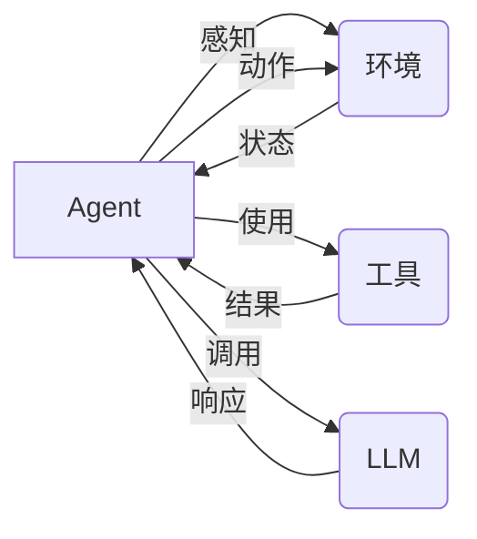

# 【大模型应用开发 动手做AI Agent】显示响应

## 1. 背景介绍

### 1.1 问题的由来

近年来，随着深度学习技术的飞速发展，大型语言模型（LLM）在自然语言处理领域取得了显著的成果。这些模型，如 GPT-3、BERT 和 LaMDA，展现出了惊人的语言理解和生成能力，为构建更智能、更人性化的应用程序打开了大门。然而，传统的 LLM 应用往往局限于单轮对话或简单的文本生成任务，难以满足用户日益增长的复杂需求。

为了突破这一瓶颈，AI Agent 应运而生。AI Agent 是一种能够感知环境、进行推理、做出决策并采取行动的智能体，它可以利用 LLM 强大的语言能力来理解和执行用户的指令，并与外部环境进行交互，从而完成更复杂、更灵活的任务。

### 1.2 研究现状

目前，AI Agent 的研究和应用还处于早期阶段，但已经涌现出一些令人瞩目的成果。例如：

* **AutoGPT**：一个可以根据用户目标自动生成代码、编写邮件、进行市场分析等任务的 AI Agent。
* **BabyAGI**：一个可以根据用户指令自动创建、优先排序和执行任务的 AI Agent。
* **LangChain**：一个用于构建 AI Agent 的开源框架，它提供了与 LLM、工具和数据源交互的接口。

### 1.3 研究意义

AI Agent 的出现，为 LLM 的应用开辟了新的方向，具有重要的研究意义：

* **拓展 LLM 应用场景**: AI Agent 可以将 LLM 的能力应用于更广泛的领域，例如自动化工作流程、个性化推荐、智能客服等。
* **提升用户体验**: AI Agent 可以根据用户的个性化需求，提供更智能、更便捷的服务。
* **推动人工智能发展**: AI Agent 的研究将促进人工智能在感知、推理、决策等方面的进步。

### 1.4 本文结构

本文将深入探讨 AI Agent 的核心概念、算法原理、开发流程以及应用场景，并结合代码实例，手把手教你构建一个可以显示响应的 AI Agent。

## 2. 核心概念与联系

在深入探讨 AI Agent 的技术细节之前，我们先来了解一些核心概念及其之间的联系：

* **Agent（代理）**:  一个能够感知环境、进行推理、做出决策并采取行动的实体。
* **Environment（环境）**: Agent 所处的外部世界，可以是物理世界或虚拟世界。
* **Action（动作）**: Agent 可以采取的操作，例如移动、发送消息、执行代码等。
* **State（状态）**: 环境的当前状况，例如用户输入、数据库记录、网页内容等。
* **Reward（奖励）**: Agent 执行动作后获得的反馈，用于指导 Agent 学习和优化策略。
* **Policy（策略）**: Agent 根据当前状态选择动作的规则。
* **Large Language Model (LLM)**:  一种能够理解和生成自然语言的深度学习模型，例如 GPT-3。
* **Prompt（提示）**:  输入给 LLM 的文本，用于引导 LLM 生成特定内容。
* **Tool（工具）**:  AI Agent 可以使用的外部程序或服务，例如搜索引擎、数据库、API 等。

下图展示了 AI Agent 的核心组件及其交互关系：



## 3. 核心算法原理 & 具体操作步骤

### 3.1 算法原理概述

AI Agent 的核心算法是强化学习（Reinforcement Learning，RL）。RL 的目标是训练一个 Agent，使其能够在与环境交互的过程中，通过不断试错，学习到最优的策略，从而最大化累积奖励。

在 AI Agent 中，RL 算法主要用于训练 Agent 的 Policy，使其能够根据当前状态选择最优的动作。具体来说，RL 算法的工作流程如下：

1. **Agent 观察环境状态**。
2. **Agent 根据 Policy 选择动作**。
3. **Agent 执行动作，并观察环境状态的变化**。
4. **Agent 收到环境反馈的奖励**。
5. **Agent 根据奖励更新 Policy**。

### 3.2 算法步骤详解

构建一个可以显示响应的 AI Agent，通常需要以下步骤：

1. **定义 Agent 的目标和任务**:  明确 Agent 需要完成的任务，例如回答用户问题、生成代码、撰写文案等。
2. **设计 Agent 的状态空间**:  确定 Agent 需要感知哪些环境信息，例如用户输入、当前对话历史、数据库记录等。
3. **设计 Agent 的动作空间**:  确定 Agent 可以采取哪些动作，例如发送消息、查询数据库、调用 API 等。
4. **选择合适的 LLM**:  根据任务需求选择合适的 LLM，例如 GPT-3 适用于文本生成任务，BERT 适用于文本分类任务。
5. **设计 Prompt 模板**:  设计 Prompt 模板，用于将 Agent 的状态信息传递给 LLM，并引导 LLM 生成期望的响应。
6. **选择合适的 RL 算法**:  根据任务特点和性能需求选择合适的 RL 算法，例如 Q-learning 适用于离散动作空间，Policy Gradient 适用于连续动作空间。
7. **训练 Agent**:  使用 RL 算法训练 Agent 的 Policy，使其能够根据当前状态选择最优的动作。
8. **评估 Agent 性能**:  使用测试集评估 Agent 的性能，例如准确率、召回率、F1 值等。

### 3.3 算法优缺点

**优点**:

* **能够处理复杂任务**:  RL 算法可以处理复杂的任务，例如游戏 AI、机器人控制等。
* **能够适应环境变化**:  RL 算法可以根据环境变化动态调整策略。

**缺点**:

* **训练效率低**:  RL 算法的训练效率通常较低，需要大量的样本和计算资源。
* **奖励函数设计困难**:  设计合理的奖励函数是 RL 算法成功的关键，但往往比较困难。

### 3.4 算法应用领域

AI Agent 的应用领域非常广泛，例如：

* **自动化工作流程**:  例如自动回复邮件、自动生成报表、自动处理订单等。
* **个性化推荐**:  例如根据用户的兴趣爱好推荐商品、电影、音乐等。
* **智能客服**:  例如自动回答用户问题、解决用户投诉、提供技术支持等。
* **游戏 AI**:  例如开发更智能的游戏角色、设计更具挑战性的游戏关卡等。
* **机器人控制**:  例如控制机器人在复杂环境中导航、操作物体等。


## 4. 数学模型和公式 & 详细讲解 & 举例说明

### 4.1 数学模型构建

Markov Decision Process (MDP) 是 RL 问题的常用数学模型。

一个 MDP 可以用一个五元组  $(S, A, P, R, \gamma)$ 来表示，其中：

* $S$  是状态空间，表示所有可能的环境状态。
* $A$  是动作空间，表示 Agent 可以采取的所有动作。
* $P$  是状态转移概率矩阵，$P_{ss'}^a$ 表示在状态 $s$ 下采取动作 $a$ 后转移到状态 $s'$ 的概率。
* $R$  是奖励函数，$R_s^a$ 表示在状态 $s$ 下采取动作 $a$ 后获得的奖励。
* $\gamma$ 是折扣因子，用于平衡当前奖励和未来奖励的重要性。

### 4.2 公式推导过程

RL 的目标是找到一个最优策略 $\pi^*$, 使得 Agent 在与环境交互的过程中获得的累积奖励最大化。

累积奖励可以用以下公式表示：

$$
G_t = R_{t+1} + \gamma R_{t+2} + \gamma^2 R_{t+3} + ... = \sum_{k=0}^{\infty} \gamma^k R_{t+k+1}
$$

其中，$G_t$ 表示从时间步 $t$ 开始的累积奖励。

最优策略 $\pi^*$ 可以用以下公式表示：

$$
\pi^* = \arg\max_{\pi} \mathbb{E}[G_0 | \pi]
$$

其中，$\mathbb{E}[G_0 | \pi]$ 表示在策略 $\pi$ 下，从初始状态开始的累积奖励的期望值。

### 4.3 案例分析与讲解

以一个简单的迷宫游戏为例，说明如何使用 MDP 模型来描述 RL 问题。

**迷宫环境**:

```
+---+---+---+
| S |   | G |
+---+---+---+
|   | X |   |
+---+---+---+
```

* **状态空间**:  $S = \{S, 1, 2, 3, G, X\}$，其中 $S$ 表示起点，$G$ 表示终点，$X$ 表示障碍物，其他数字表示空白格子。
* **动作空间**:  $A = \{上, 下, 左, 右\}$
* **状态转移概率**:  如果 Agent 采取的动作可以到达目标格子，则转移概率为 1，否则为 0。例如，在状态 $S$ 下采取动作 “右”，则转移到状态 $1$ 的概率为 1。
* **奖励函数**:  到达终点 $G$ 获得奖励 1，到达障碍物 $X$ 获得奖励 -1，其他情况获得奖励 0。
* **折扣因子**:  $\gamma = 0.9$

### 4.4 常见问题解答

**1. RL 算法如何处理连续状态空间和动作空间？**

对于连续状态空间和动作空间，可以使用函数逼近的方法，例如深度神经网络，来表示策略函数和价值函数。

**2. 如何设计合理的奖励函数？**

奖励函数的设计是 RL 算法成功的关键。一个好的奖励函数应该能够准确地反映任务目标，并引导 Agent 学习到期望的行为。

## 5. 项目实践：代码实例和详细解释说明

### 5.1 开发环境搭建

本项目使用 Python 语言和 LangChain 框架来构建 AI Agent。

首先，需要安装必要的 Python 包：

```bash
pip install langchain openai python-dotenv
```

然后，需要在 OpenAI 网站上注册账号，并获取 API 密钥。

### 5.2 源代码详细实现

以下是一个简单的 AI Agent 代码示例，它可以根据用户输入查询天气信息：

```python
from langchain.agents import Tool, AgentExecutor, ZeroShotAgent, AgentOutputParser
from langchain.llms import OpenAI
from langchain.utilities import SerpAPIWrapper
from typing import List, Union
from langchain.schema import AgentAction, AgentFinish
import os
import re

# 设置 OpenAI API 密钥
os.environ["OPENAI_API_KEY"] = "YOUR_API_KEY"

# 初始化 LLM
llm = OpenAI(temperature=0)

# 定义工具
tools = [
    Tool(
        name="Search",
        func=SerpAPIWrapper().run,
        description="useful for when you need to answer questions about current events. You should ask targeted questions",
    )
]

# 定义 Prompt 模板
prompt = ZeroShotAgent.create_prompt(
    tools,
    prefix="""You are a helpful AI assistant. Answer the following questions as best as you can using the tools available to you. 
You have access to the following tools:

{tools}

Use the following format:

Question: the input question you must answer
Thought: you should always think about what to do
Action: the action