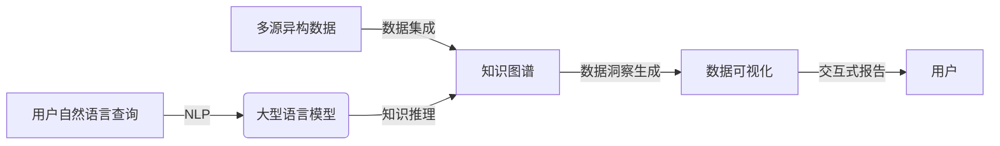

# 【大模型应用开发 动手做AI Agent】自主创建数据洞察

## 1. 背景介绍

### 1.1 问题的由来

在当今数据时代,海量数据的产生使得传统的数据分析方法已经无法满足企业对数据洞察的需求。随着人工智能技术的快速发展,大型语言模型(Large Language Model,LLM)凭借其强大的自然语言处理能力和知识推理能力,为数据分析带来了全新的机遇和挑战。

### 1.2 研究现状  

目前,一些科技公司已经开始探索将大型语言模型应用于数据分析领域。例如,OpenAI的GPT-3模型可以根据用户的自然语言查询生成相关的数据报告和可视化图表。谷歌的LaMBDA模型也可以对结构化数据进行分析和解释。然而,这些现有的解决方案大多局限于特定的数据集和任务,缺乏通用性和可扩展性。

### 1.3 研究意义

本文提出了一种基于大型语言模型的自主数据洞察创建系统,旨在帮助企业从海量数据中自动发现有价值的洞察。该系统可以理解用户的自然语言查询,智能地从多个数据源中提取相关数据,并生成可视化的数据报告和洞察分析。这种自主创建数据洞察的能力将极大地提高企业的数据分析效率,降低数据分析的门槛,促进数据驱动的决策。

### 1.4 本文结构

本文首先介绍了自主创建数据洞察的核心概念和关键技术,包括大型语言模型、知识图谱、数据可视化等。接下来,详细阐述了系统的核心算法原理和具体实现步骤。然后,通过数学建模和公式推导,对系统的核心机制进行了理论分析。随后,提供了一个基于Python的项目实践案例,包括代码实现和运行结果展示。最后,探讨了该系统在不同应用场景下的实际应用前景,并总结了未来的发展趋势和面临的挑战。

## 2. 核心概念与联系

自主创建数据洞察系统涉及多个核心概念,包括:

1. **大型语言模型(LLM)**: 用于理解用户的自然语言查询,并根据查询生成相关的文本内容。
2. **知识图谱**: 一种结构化的知识表示形式,用于存储和组织来自多个数据源的信息。
3. **数据可视化**: 将分析结果以图表、报告等形式呈现,帮助用户直观地理解数据洞察。
4. **自然语言处理(NLP)**: 处理和分析自然语言文本的技术,用于理解用户查询和生成自然语言输出。
5. **数据集成**: 从多个异构数据源中提取、清洗和整合数据的过程。

这些概念之间存在紧密的联系和相互作用。大型语言模型作为系统的核心,通过自然语言处理技术理解用户查询,并与知识图谱中的结构化知识相结合,生成相关的数据洞察。数据可视化模块则负责将这些洞察以直观的形式呈现给用户。数据集成技术保证了系统可以处理来自多个数据源的异构数据。

## 3. 核心算法原理 & 具体操作步骤

### 3.1 算法原理概述

自主创建数据洞察系统的核心算法基于大型语言模型和知识图谱技术,可以概括为以下几个主要步骤:

1. **查询理解**: 利用自然语言处理技术,将用户的自然语言查询转换为结构化的查询表示。
2. **知识图谱构建**: 从多个数据源中提取相关数据,并将其整合到统一的知识图谱中。
3. **知识推理**: 基于知识图谱和查询表示,利用大型语言模型进行知识推理,生成相关的数据洞察。
4. **可视化呈现**: 将生成的数据洞察转换为图表、报告等可视化形式,方便用户理解和交互。

### 3.2 算法步骤详解

1. **查询理解**
   - 使用自然语言处理技术(如命名实体识别、依存分析等)对用户查询进行语义分析
   - 将查询转换为结构化的表示形式,如三元组 (subject, predicate, object)

2. **知识图谱构建**
   - 从多个数据源(如数据库、文件、API等)中提取相关数据
   - 进行数据清洗、转换和标准化,将异构数据转换为统一的知识表示形式
   - 构建知识图谱,表示实体之间的关系和属性

3. **知识推理**
   - 将结构化查询表示和知识图谱输入到大型语言模型中
   - 利用模型的自回归生成能力,根据查询和已有知识生成相关的数据洞察
   - 对生成的文本进行后处理,提取关键信息和见解

4. **可视化呈现**
   - 分析生成的数据洞察,识别其中的数据模式和趋势
   - 根据数据类型和需求,选择合适的可视化形式(如折线图、柱状图、仪表盘等)
   - 生成交互式的数据报告,允许用户探索和drill-down数据洞察

### 3.3 算法优缺点

**优点**:

- 利用大型语言模型的强大能力,可以自主生成高质量的数据洞察,无需人工编写复杂的规则或模板。
- 支持处理来自多个异构数据源的数据,提高了系统的通用性和扩展性。
- 基于自然语言交互,降低了数据分析的门槛,使非技术人员也能轻松获取数据洞察。

**缺点**:

- 大型语言模型的训练和推理成本较高,需要强大的计算资源。
- 生成的数据洞察质量在一定程度上依赖于模型的训练数据和知识图谱的覆盖范围。
- 存在一定的黑盒操作,模型的决策过程可解释性有待提高。

### 3.4 算法应用领域

自主创建数据洞察系统可以应用于多个领域,包括但不限于:

- **商业智能(BI)**: 帮助企业从海量业务数据中发现有价值的洞察,支持数据驱动的决策。
- **客户关系管理(CRM)**: 分析客户数据,发现客户需求和行为模式,优化营销策略。
- **金融分析**: 从金融市场数据中挖掘投资机会,支持量化交易决策。
- **医疗健康**: 分析患者数据,发现疾病风险因素和治疗模式,提高医疗质量。
- **社会科学研究**: 从社会数据中发现人口、经济和文化等方面的洞察,支持政策制定。

## 4. 数学模型和公式 & 详细讲解 & 举例说明

### 4.1 数学模型构建

为了量化分析自主创建数据洞察系统的性能,我们构建了一个基于概率图模型的数学模型。该模型旨在最大化生成的数据洞察与真实数据模式之间的相似度,同时考虑了查询的相关性和洞察的可解释性。

我们定义以下随机变量:

- $Q$: 用户的自然语言查询
- $D$: 知识图谱中的数据
- $I$: 生成的数据洞察
- $R$: 数据洞察与真实数据模式之间的相似度
- $E$: 数据洞察的可解释性得分

我们的目标是最大化以下概率:

$$\mathbb{P}(I, R, E | Q, D) = \mathbb{P}(I | Q, D) \mathbb{P}(R | I, D) \mathbb{P}(E | I)$$

其中:

- $\mathbb{P}(I | Q, D)$ 表示根据查询 $Q$ 和数据 $D$ 生成洞察 $I$ 的概率,由大型语言模型确定。
- $\mathbb{P}(R | I, D)$ 表示洞察 $I$ 与真实数据模式之间的相似度概率,可以通过对比真实数据和生成的洞察来计算。
- $\mathbb{P}(E | I)$ 表示洞察 $I$ 的可解释性得分,可以通过语义分析和人工评估来获得。

通过优化上述概率,我们可以获得高质量的数据洞察,满足用户查询的相关性,并与真实数据模式保持一致,同时保证洞察的可解释性。

### 4.2 公式推导过程

我们将上述概率模型进一步分解,以便于优化和求解。首先,我们引入一个隐含变量 $Z$,表示大型语言模型的中间状态。则有:

$$\begin{aligned}
\mathbb{P}(I, R, E | Q, D) &= \sum_Z \mathbb{P}(I, R, E, Z | Q, D) \\
&= \sum_Z \mathbb{P}(I | Z, Q, D) \mathbb{P}(R | I, D) \mathbb{P}(E | I) \mathbb{P}(Z | Q, D)
\end{aligned}$$

其中:

- $\mathbb{P}(I | Z, Q, D)$ 表示根据模型状态 $Z$、查询 $Q$ 和数据 $D$ 生成洞察 $I$ 的概率。
- $\mathbb{P}(Z | Q, D)$ 表示根据查询 $Q$ 和数据 $D$ 得到模型状态 $Z$ 的概率。

我们进一步假设洞察 $I$ 只依赖于模型状态 $Z$,而不直接依赖于查询 $Q$ 和数据 $D$。则有:

$$\mathbb{P}(I | Z, Q, D) = \mathbb{P}(I | Z)$$

将上式代入前面的公式,我们得到:

$$\mathbb{P}(I, R, E | Q, D) = \sum_Z \mathbb{P}(I | Z) \mathbb{P}(R | I, D) \mathbb{P}(E | I) \mathbb{P}(Z | Q, D)$$

这个公式给出了生成高质量数据洞察的概率模型,可以通过优化各个概率项来最大化该概率。具体的优化方法将在下一节介绍。

### 4.3 案例分析与讲解

为了更好地理解上述数学模型,我们给出一个具体的案例分析。假设一家零售公司希望从销售数据中发现有价值的洞察,以优化产品策略。

1. 用户输入自然语言查询:"分析去年每个季度的销售额,并比较不同产品类别的表现。"

2. 系统从销售数据库和产品目录中构建知识图谱 $D$,包含产品信息、销售记录等。

3. 将查询 $Q$ 转换为结构化表示,如 `(sales, trend, quarter)`, `(product, performance, compare)`。

4. 根据查询 $Q$ 和知识图谱 $D$,大型语言模型进入状态 $Z$,表示对查询和数据的理解。

5. 模型根据状态 $Z$ 生成数据洞察 $I$,如:"去年第四季度的总销售额最高,增长率为15%。服装类产品销售额占比最大,但增长率落后于电子产品。"

6. 计算洞察 $I$ 与真实数据模式之间的相似度 $R$,以及可解释性得分 $E$。

7. 根据公式 $\mathbb{P}(I, R, E | Q, D)$,系统评估当前生成的洞察质量,并通过优化各个概率项来迭代改进。

通过上述案例,我们可以看到数学模型如何指导系统生成高质量的数据洞察,并量化评估其质量。在实际应用中,该模型可以根据特定场景和需求进行调整和优化。

### 4.4 常见问题解答

1. **如何确保生成的数据洞察与真实数据模式一致?**

我们引入了相似度概率 $\mathbb{P}(R | I, D)$ 来量化洞察与真实数据之间的一致性。可以通过对比真实数据和生成的洞察,计算相似度得分。此