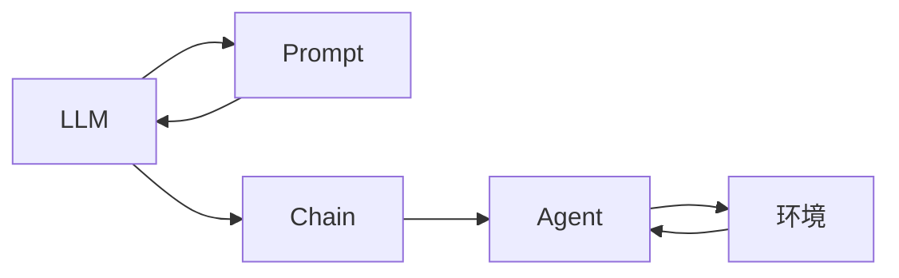

# 【大模型应用开发 动手做 AI Agent】说说 LangChain

## 1. 背景介绍

### 1.1 问题的由来

近年来，以 GPT-3、ChatGPT 为代表的大语言模型（LLM）在自然语言处理领域取得了突破性进展，展现出强大的文本生成、问答、翻译等能力。然而，如何将这些强大的 LLMs 应用于实际场景，构建更智能、更实用的 AI 应用，成为了一个亟待解决的问题。

传统的 AI 应用开发模式通常需要大量的代码编写和模型训练，开发周期长、成本高。同时，传统的 AI 应用往往只能完成单一的任务，缺乏通用性和可扩展性。

为了解决这些问题，AI Agent 应运而生。AI Agent 是一种能够感知环境、自主学习和决策的智能体，它可以像人类一样与环境交互，并完成各种复杂的任务。而 LangChain 作为一个强大的框架，为构建基于 LLMs 的 AI Agent 提供了强大的支持。

### 1.2 研究现状

目前，已经有一些开源框架致力于简化 AI Agent 的开发流程，例如：

* **LangChain:**  专注于将 LLMs 与外部数据和计算资源相结合，构建更强大、更实用的 AI 应用。
* **AutoGPT:**  一个实验性的开源项目，旨在实现完全自主的 AI Agent，可以自动完成各种任务。
* **BabyAGI:**  另一个类似于 AutoGPT 的项目，目标是构建能够自我学习和进化的 AI Agent。

这些框架各有优劣，LangChain 以其灵活性和易用性，以及对 LLMs 的强大支持，成为了目前最受欢迎的 AI Agent 开发框架之一。

### 1.3 研究意义

LangChain 的出现，为 AI Agent 的普及和应用带来了新的机遇。通过 LangChain，开发者可以更轻松地构建基于 LLMs 的 AI Agent，从而：

* **降低 AI 应用开发门槛：**  LangChain 提供了简单易用的 API 和丰富的组件，开发者无需深入了解 LLMs 的内部机制，即可快速构建 AI 应用。
* **提高 AI 应用的智能化水平：**  LangChain 允许开发者将 LLMs 与外部数据和计算资源相结合，从而构建更强大、更智能的 AI 应用。
* **拓展 AI 应用的应用场景：**  LangChain 支持多种类型的 AI Agent，可以应用于各种不同的场景，例如：聊天机器人、智能助手、自动化工具等。

### 1.4 本文结构

本文将深入探讨 LangChain 框架，从以下几个方面进行阐述：

* 核心概念与联系：介绍 LangChain 的核心概念，例如：LLM、Prompt、Chain、Agent 等，并阐述它们之间的联系。
* 核心算法原理 & 具体操作步骤：详细介绍 LangChain 的核心算法原理，并结合实际案例，讲解如何使用 LangChain 构建 AI Agent。
* 项目实践：提供完整的代码实例和详细解释说明，帮助读者快速上手 LangChain。
* 实际应用场景：介绍 LangChain 在实际场景中的应用案例，例如：聊天机器人、智能助手等。
* 工具和资源推荐：推荐一些学习 LangChain 的资源，例如：官方文档、博客文章、开源项目等。
* 总结：总结 LangChain 的优势和不足，以及未来的发展趋势。

## 2. 核心概念与联系

LangChain 的核心概念可以概括为以下几点：

* **LLM (Large Language Model):**  大型语言模型，例如 GPT-3、ChatGPT 等，是 LangChain 的核心组件，负责理解和生成自然语言。
* **Prompt:**  提示，是用户输入给 LLM 的文本，用于引导 LLM 生成符合预期结果的文本。
* **Chain:**  链，是将多个 LLM 或其他工具组合在一起形成的处理流程，可以完成更复杂的任务。
* **Agent:**  代理，是能够感知环境、自主学习和决策的智能体，可以与环境交互并完成各种任务。

下图展示了 LangChain 的核心概念之间的联系：



* **LLM 和 Prompt:**  LLM 接收 Prompt 作为输入，并生成相应的文本作为输出。
* **LLM 和 Chain:**  Chain 可以包含多个 LLM，并将它们的输出连接起来，形成更复杂的处理流程。
* **Chain 和 Agent:**  Agent 使用 Chain 来完成具体的任务，例如：获取信息、执行操作等。
* **Agent 和环境:**  Agent 与环境交互，感知环境状态，并根据环境状态做出决策。

## 3. 核心算法原理 & 具体操作步骤

### 3.1 算法原理概述

LangChain 的核心算法原理是基于 **Prompt Engineering** 和 **Chain of Thought**。

* **Prompt Engineering:**  通过设计合适的 Prompt，引导 LLM 生成符合预期结果的文本。
* **Chain of Thought:**  将复杂的任务分解成多个步骤，并使用多个 LLM 或其他工具分别完成每个步骤，最后将所有步骤的结果连接起来，形成最终的解决方案。

### 3.2 算法步骤详解

使用 LangChain 构建 AI Agent 的一般步骤如下：

1. **定义任务：**  明确 AI Agent 需要完成的任务，例如：回答问题、生成代码、撰写文章等。
2. **选择 LLM：**  根据任务需求选择合适的 LLM，例如：GPT-3 适用于文本生成，ChatGPT 适用于对话生成。
3. **设计 Prompt：**  根据任务需求设计合适的 Prompt，引导 LLM 生成符合预期结果的文本。
4. **构建 Chain：**  将多个 LLM 或其他工具组合在一起，形成处理流程，例如：使用一个 LLM 生成代码，再使用另一个 LLM 对代码进行解释。
5. **创建 Agent：**  使用 LangChain 提供的 Agent 类，将 LLM、Prompt、Chain 组合在一起，创建 AI Agent。
6. **运行 Agent：**  运行 AI Agent，并与之交互，例如：向其提问、下达指令等。

### 3.3 算法优缺点

**优点：**

* **灵活性和易用性：**  LangChain 提供了简单易用的 API 和丰富的组件，开发者可以快速构建 AI Agent。
* **强大的功能：**  LangChain 支持多种类型的 LLM 和工具，可以完成各种复杂的任务。
* **活跃的社区：**  LangChain 拥有活跃的社区，开发者可以获得丰富的学习资源和技术支持。

**缺点：**

* **对 LLM 的依赖性：**  LangChain 的功能依赖于 LLM 的能力，如果 LLM 无法完成任务，LangChain 也无能为力。
* **可解释性较差：**  LangChain 的内部机制比较复杂，可解释性较差，难以调试和优化。

### 3.4 算法应用领域

LangChain 可以应用于各种需要自然语言处理的场景，例如：

* **聊天机器人：**  构建智能客服、虚拟助手等。
* **智能助手：**  帮助用户完成各种任务，例如：订机票、预订酒店、查询信息等。
* **自动化工具：**  自动生成代码、文档、报表等。
* **数据分析：**  从文本数据中提取信息，例如：情感分析、主题提取等。

## 4. 数学模型和公式 & 详细讲解 & 举例说明

LangChain 本身并没有涉及具体的数学模型和公式，它只是一个用于构建 AI Agent 的框架。

## 5. 项目实践：代码实例和详细解释说明

### 5.1 开发环境搭建

1. 安装 Python：确保你的系统上安装了 Python 3.7 或更高版本。
2. 安装 LangChain：使用 pip 安装 LangChain：

```bash
pip install langchain
```

### 5.2 源代码详细实现

以下是一个使用 LangChain 构建简单问答系统的示例代码：

```python
from langchain.llms import OpenAI
from langchain.chains import ConversationChain

# 初始化 OpenAI LLM
llm = OpenAI(temperature=0.9)

# 创建对话链
conversation = ConversationChain(llm=llm)

# 开始对话
while True:
    # 获取用户输入
    question = input("你：")

    # 如果用户输入 "退出"，则退出程序
    if question == "退出":
        break

    # 使用对话链生成回复
    answer = conversation.predict(input=question)

    # 打印回复
    print(f"AI：{answer}")
```

### 5.3 代码解读与分析

* 首先，我们导入了 `OpenAI` 和 `ConversationChain` 类。
* 然后，我们使用 `OpenAI()` 初始化了一个 OpenAI LLM。
* 接下来，我们使用 `ConversationChain()` 创建了一个对话链，并将 OpenAI LLM 作为参数传递给它。
* 在 `while` 循环中，我们不断获取用户输入，并使用对话链生成回复。
* 最后，我们将回复打印到控制台。

### 5.4 运行结果展示

运行代码后，你就可以与 AI 进行对话了：

```
你：你好！
AI：你好！很高兴和你聊天。

你：今天天气怎么样？
AI：对不起，我没有获取实时信息的权限。

你：退出
```

## 6. 实际应用场景

LangChain 可以应用于各种需要自然语言处理的场景，以下是一些具体的应用案例：

* **聊天机器人：**  可以使用 LangChain 构建智能客服、虚拟助手等。例如，你可以使用 LangChain 构建一个可以回答用户关于产品或服务的问题的聊天机器人。
* **智能助手：**  可以使用 LangChain 构建可以帮助用户完成各种任务的智能助手。例如，你可以使用 LangChain 构建一个可以帮助用户预订酒店、购买机票、查询天气预报的智能助手。
* **自动化工具：**  可以使用 LangChain 构建可以自动生成代码、文档、报表等的自动化工具。例如，你可以使用 LangChain 构建一个可以根据用户需求自动生成 Python 代码的工具。

## 7. 工具和资源推荐

### 7.1 学习资源推荐

* **LangChain 官方文档：**  https://langchain.readthedocs.io/
* **LangChain GitHub 仓库：**  https://github.com/hwchase17/langchain

### 7.2 开发工具推荐

* **Python：**  LangChain 是基于 Python 开发的，你需要安装 Python 3.7 或更高版本。
* **Visual Studio Code：**  Visual Studio Code 是一个功能强大的代码编辑器，支持 Python 开发，并提供了丰富的插件，可以帮助你更方便地使用 LangChain。

### 7.3 相关论文推荐

* **Chain-of-Thought Prompting Elicits Reasoning in Large Language Models:**  https://arxiv.org/abs/2201.11903

### 7.4 其他资源推荐

* **LangChain 社区：**  你可以在 LangChain 社区中与其他开发者交流，并获取帮助。

## 8. 总结：未来发展趋势与挑战

### 8.1 研究成果总结

LangChain 是一个强大的框架，可以帮助开发者更轻松地构建基于 LLMs 的 AI Agent。它提供了简单易用的 API 和丰富的组件，支持多种类型的 LLM 和工具，可以应用于各种需要自然语言处理的场景。

### 8.2 未来发展趋势

未来，LangChain 将会继续发展，并朝着以下方向努力：

* **支持更多类型的 LLM 和工具：**  LangChain 将会支持更多类型的 LLM 和工具，以满足更多场景的需求。
* **提高易用性和可扩展性：**  LangChain 将会继续简化 API，并提供更丰富的组件，以提高易用性和可扩展性。
* **增强可解释性和安全性：**  LangChain 将会致力于提高可解释性和安全性，以构建更可靠、更值得信赖的 AI Agent。

### 8.3 面临的挑战

LangChain 面临着以下挑战：

* **LLM 的局限性：**  LangChain 的功能依赖于 LLM 的能力，而 LLM 本身还存在一些局限性，例如：缺乏常识、容易生成错误信息等。
* **可解释性：**  LangChain 的内部机制比较复杂，可解释性较差，难以调试和优化。
* **安全性：**  AI Agent 的安全性是一个重要问题，需要采取措施来防止 AI Agent 被恶意利用。

### 8.4 研究展望

未来，LangChain 将会继续发展，并克服现有的挑战，以构建更强大、更智能、更安全的 AI Agent。

## 9. 附录：常见问题与解答

**Q：LangChain 支持哪些 LLM？**

A：LangChain 支持多种 LLM，包括：

* OpenAI GPT-3
* Google PaLM
* AI21 Jurassic-1 Jumbo
* Cohere xlarge

**Q：如何使用 LangChain 构建聊天机器人？**

A：你可以使用 LangChain 提供的 `ConversationChain` 类来构建聊天机器人。`ConversationChain` 类可以将多个 LLM 或其他工具组合在一起，形成一个对话流程。

**Q：LangChain 的安全性如何？**

A：AI Agent 的安全性是一个重要问题，LangChain 提供了一些安全机制，例如：

* **输入验证：**  LangChain 可以对用户输入进行验证，以防止恶意输入。
* **输出过滤：**  LangChain 可以对 LLM 的输出进行过滤，以防止 LLM 生成不安全的内容。

作者：禅与计算机程序设计艺术 / Zen and the Art of Computer Programming 
