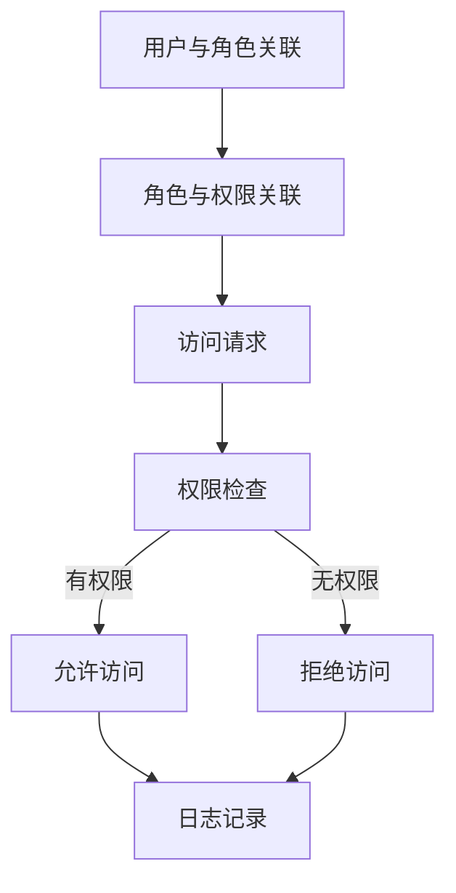

# 专业技术能力培养：深入了解IT基础设施、数据安全和合规要求

## 1. 背景介绍

### 1.1 问题的由来

在当今数字化时代,IT基础设施、数据安全和合规性已成为企业运营的核心支柱。随着技术的快速发展和数据量的激增,确保IT系统的高效、安全和合规运行变得前所未有的重要。然而,IT专业人员面临着诸多挑战,例如复杂的系统架构、不断升级的安全威胁、严格的法规要求等,这都需要他们具备扎实的专业技术能力。

### 1.2 研究现状

近年来,IT行业已经意识到专业技术能力培养的重要性。许多企业和组织都在积极探索如何为员工提供高质量的培训,以提高他们的技术水平。同时,也有一些专业培训机构推出了相关的认证课程和考试,旨在评估和验证IT从业者的专业能力。

### 1.3 研究意义

掌握IT基础设施、数据安全和合规性方面的专业技术能力,对于IT从业者来说至关重要。这不仅有助于提高工作效率和系统性能,还能够确保数据的安全性和企业的合规运营。此外,拥有扎实的专业技术能力也有利于个人职业发展,提高就业竞争力。

### 1.4 本文结构

本文将全面探讨IT基础设施、数据安全和合规性方面的专业技术能力培养。首先介绍相关的核心概念和它们之间的联系,然后深入探讨核心算法原理和具体操作步骤。接下来,我们将构建数学模型并推导相关公式,并通过案例分析加以说明。此外,本文还将提供代码实例和详细解释,帮助读者更好地掌握实践技能。最后,我们将讨论实际应用场景、未来发展趋势和面临的挑战,并推荐相关的学习资源和工具。

## 2. 核心概念与联系

在探讨IT基础设施、数据安全和合规性方面的专业技术能力培养之前,我们需要先了解一些核心概念及它们之间的联系。

IT基础设施是指支持企业IT系统运行的硬件、软件和网络资源的集合。它包括服务器、存储设备、网络设备、操作系统、数据库等组件。一个健康、高效的IT基础设施对于企业的正常运营至关重要。

数据安全则是指保护数据免受未经授权的访问、使用、披露、破坏、修改或中断的过程。它包括了访问控制、加密、防火墙、入侵检测等多种技术和措施。随着数据在企业中的作用日益重要,确保数据安全成为了一项关键任务。

合规性是指遵守相关法律法规、行业标准和组织政策的要求。在IT领域,合规性涉及多个方面,如数据隐私保护、系统审计、风险管理等。企业必须严格遵守合规性要求,否则可能会面临严重的法律和财务后果。

这三个核心概念密切相关。IT基础设施为数据安全和合规性提供了技术基础,而数据安全和合规性又是IT基础设施运营的重要目标。只有将三者有机结合,企业才能真正实现IT系统的高效、安全和合规运行。

## 3. 核心算法原理 & 具体操作步骤

### 3.1 算法原理概述

在IT基础设施、数据安全和合规性领域,有许多核心算法被广泛应用。这些算法通常基于数学原理和计算机科学理论,旨在解决特定的问题或实现特定的功能。

例如,在访问控制领域,基于角色的访问控制(RBAC)算法被广泛使用。RBAC将系统中的用户与角色相关联,并根据角色分配相应的权限,从而实现对资源的精细化访问控制。

在加密领域,常见的算法包括对称加密算法(如AES、DES)和非对称加密算法(如RSA、ECC)。这些算法利用密钥对数据进行加密和解密,确保数据在传输和存储过程中的安全性。

在入侵检测领域,常用的算法有基于签名的检测算法和基于异常的检测算法。前者通过匹配已知攻击模式来识别入侵行为,而后者则通过建立正常行为模型来检测异常活动。

此外,在合规性领域,也有一些专门的算法用于风险评估、审计跟踪等任务。

### 3.2 算法步骤详解

以基于角色的访问控制(RBAC)算法为例,我们可以详细介绍其具体操作步骤:

1. **用户与角色关联**:首先,需要将系统中的用户与一个或多个角色关联起来。这可以通过手动配置或基于某些规则自动完成。

2. **角色与权限关联**:接下来,需要为每个角色分配相应的权限。权限可以是对特定资源的读、写、执行等操作的许可。

3. **访问请求**:当用户尝试访问某个资源时,系统会发出一个访问请求。

4. **权限检查**:系统会检查该用户所关联的角色是否具有访问所请求资源的权限。

5. **访问决策**:如果用户的角色具有所需权限,则允许访问;否则,拒绝访问。

6. **日志记录**:系统会记录每一次访问请求及其决策结果,以便进行审计和追踪。

这个过程可以通过以下Mermaid流程图来直观展示:

### 3.3 算法优缺点

每种算法都有其优缺点,RBAC算法也不例外。

**优点**:

- 简化权限管理:RBAC将用户和权限解耦,通过角色这一中间层进行关联,大大简化了权限管理的复杂度。
- 支持最小权限原则:用户只被授予完成工作所需的最小权限集合,提高了系统的安全性。
- 易于审计:由于权限是基于角色分配的,因此可以方便地审计每个角色的权限分配情况。

**缺点**:

- 角色划分复杂:在大型系统中,合理划分角色并分配权限是一项艰巨的任务。
- 角色继承问题:如果引入角色继承机制,可能会导致权限膨胀,增加管理难度。
- 静态特性:RBAC通常是静态的,无法动态调整权限,难以适应快速变化的环境。

### 3.4 算法应用领域

RBAC算法在多个领域都有广泛应用,包括但不限于:

- 操作系统:如Windows的用户账户控制(UAC)机制。
- 数据库系统:如Oracle数据库的权限管理。
- 网络设备:如路由器、交换机的访问控制列表(ACL)。
- 云计算:如AWS的身份和访问管理(IAM)服务。
- 企业应用:如ERP、CRM系统的权限控制。

除RBAC算法外,其他算法也在相应的领域得到了广泛应用,如加密算法在网络通信、数据存储等领域的应用,入侵检测算法在网络安全领域的应用等。

## 4. 数学模型和公式 & 详细讲解 & 举例说明

在IT基础设施、数据安全和合规性领域,许多概念和原理都可以用数学模型和公式来表示和计算。本节将介绍一些常见的数学模型和公式,并通过案例分析加以说明。

### 4.1 数学模型构建

**机密性模型**

在数据安全领域,机密性模型是一种广泛使用的数学模型,用于描述和量化数据的机密性程度。常见的机密性模型包括香农熵模型、贝叶斯模型等。

以香农熵模型为例,它将信息的不确定性或随机性作为衡量信息熵的指标。对于一个离散随机变量$X$,其熵$H(X)$可以表示为:

$$H(X) = -\sum_{i=1}^{n}P(x_i)\log_2P(x_i)$$

其中,$P(x_i)$表示$X$取值$x_i$的概率。熵值越大,表示信息的不确定性越高,机密性也就越强。

**风险评估模型**

在合规性领域,风险评估模型被广泛用于评估系统或流程中存在的风险水平。一种常见的风险评估模型是基于概率和影响的风险计算公式:

$$\text{Risk} = \text{Probability} \times \text{Impact}$$

其中,Probability表示风险事件发生的概率,Impact表示一旦发生将造成的影响程度。通过计算风险值,我们可以对风险进行优先级排序,并针对性地采取相应的控制措施。

### 4.2 公式推导过程

下面以香农熵模型为例,推导熵的计算公式。

设$X$是一个离散随机变量,其可能取值为$\{x_1, x_2, \ldots, x_n\}$,相应的概率为$\{p_1, p_2, \ldots, p_n\}$,且$\sum_{i=1}^{n}p_i = 1$。

我们定义$X$的自信息(self-information)为$I(x_i) = -\log_2 p_i$。自信息实际上反映了事件$x_i$发生的惊讶程度,概率越小,惊讶程度越大,自信息也就越大。

$X$的熵可以看作是$X$的所有可能值的自信息的期望值,即:

$$\begin{aligned}
H(X) &= E[I(X)] \\
      &= \sum_{i=1}^{n}I(x_i)P(x_i) \\
      &= -\sum_{i=1}^{n}P(x_i)\log_2P(x_i)
\end{aligned}$$

这就是香农熵的计算公式。

### 4.3 案例分析与讲解

**案例1:文件加密**

假设我们有一个文件,其中包含以下6个字符:ABCABC,我们希望计算加密这个文件所需的最小熵。

首先,我们需要计算每个字符出现的概率:

- $P(A) = 1/3$
- $P(B) = 1/3$
- $P(C) = 1/3$

将这些概率代入香农熵公式,我们可以得到:

$$\begin{aligned}
H(X) &= -\sum_{i=1}^{n}P(x_i)\log_2P(x_i) \\
     &= -\left(\frac{1}{3}\log_2\frac{1}{3} + \frac{1}{3}\log_2\frac{1}{3} + \frac{1}{3}\log_2\frac{1}{3}\right) \\
     &= 1.585
\end{aligned}$$

因此,加密这个文件所需的最小熵为1.585比特。

**案例2:风险评估**

某公司准备上线一个新的网上银行系统,需要进行风险评估。假设系统被黑客攻击的概率为0.1,一旦被攻击将导致数据泄露、财务损失和声誉损害,影响程度为5(按0-5量级衡量)。

根据风险计算公式:

$$\text{Risk} = \text{Probability} \times \text{Impact} = 0.1 \times 5 = 0.5$$

因此,该系统的风险值为0.5,属于中等风险级别。公司需要采取一些控制措施来降低风险,如加强系统安全性、制定应急预案等。

### 4.4 常见问题解答

**Q:为什么要使用对数底数2计算熵?**

A:使用对数底数2是因为信息论中通常使用比特(bit)作为信息量的单位。由于$\log_2(1/p) = -\log_2 p$,因此使用以2为底的对数可以直接得到以比特为单位的熵值。

**Q:如何确定风险事件的概率和影响程度?**

A:确定风险事件概率和影响程度通常需要依赖历史数据、专家经验和定量分析。对于一些新出现的风险,可以使用类比法、情景分析法等方法进行评估。评估过程中还需要充分考虑不确定性因素。

**Q:除了香