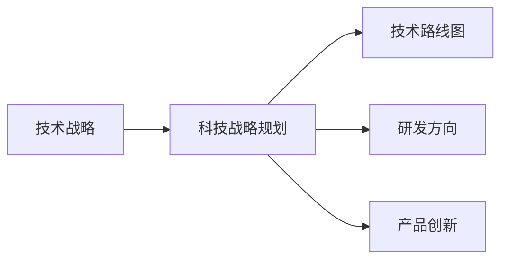

# 主导和把握公司的技术发展方向，研究制订公司的科技战略规划，包括技术路线、研发方向、产品创新等

## 1. 背景介绍

### 1.1 问题的由来

在当今科技日新月异、市场竞争日益激烈的环境下，企业要想在激烈的市场竞争中立于不败之地，必须高度重视技术创新，将技术创新作为企业发展的核心战略。一个企业的技术发展方向，直接决定着企业的未来发展方向。制定科学合理的科技战略规划，对于企业抢占技术制高点、提升核心竞争力、实现可持续发展具有至关重要的意义。

### 1.2 研究现状

目前，越来越多的企业已经意识到科技战略规划的重要性，并开始着手制定和实施自身的科技战略规划。然而，由于缺乏科学的方法论指导和实践经验，很多企业的科技战略规划仍然存在着一些问题，例如：

* **战略目标不明确：**缺乏对自身技术现状和未来发展趋势的清晰认识，导致战略目标制定过于模糊或者不切实际。
* **战略措施不具体：**缺乏可操作性强的具体措施来保证战略目标的实现，导致战略规划流于形式。
* **缺乏有效的执行和评估机制：**缺乏对战略规划执行情况进行跟踪评估和及时调整的机制，导致战略规划难以落地。

### 1.3 研究意义

制定科学合理的科技战略规划，对于企业具有以下重要意义：

* **明确技术发展方向，抢占技术制高点：**通过对未来技术发展趋势的预测和分析，帮助企业明确自身的技术发展方向，提前布局未来技术，抢占技术制高点。
* **提升核心竞争力，增强企业市场竞争力：**通过技术创新，不断提升产品和服务的技术含量和附加值，增强企业的核心竞争力，提升企业的市场竞争力。
* **推动企业转型升级，实现可持续发展：**通过技术创新，推动企业向更高技术水平、更高附加值的方向转型升级，实现企业的可持续发展。

### 1.4 本文结构

本文将从以下几个方面，详细阐述如何主导和把握公司的技术发展方向，研究制订公司的科技战略规划：

* **核心概念与联系：**介绍科技战略规划相关的核心概念，以及它们之间的相互联系。
* **核心算法原理 & 具体操作步骤：**介绍制定科技战略规划的核心方法论，以及具体的步骤和操作方法。
* **数学模型和公式 & 详细讲解 & 举例说明：**介绍一些常用的科技战略规划分析模型和工具，并结合案例进行详细讲解。
* **项目实践：代码实例和详细解释说明：**以一个具体的企业为例，演示如何进行科技战略规划。
* **实际应用场景：**介绍科技战略规划在不同行业和企业的应用场景。
* **工具和资源推荐：**推荐一些常用的科技战略规划工具和学习资源。
* **总结：未来发展趋势与挑战：**总结科技战略规划的重要性，并展望未来发展趋势和挑战。

## 2. 核心概念与联系

### 2.1 技术战略

技术战略是指企业根据自身发展战略和市场竞争环境，对技术发展方向、技术获取方式、技术创新模式等方面做出的长期性、全局性的谋划和安排。

### 2.2 科技战略规划

科技战略规划是指企业在技术战略的指导下，对未来一定时期内科技发展目标、重点任务、资源配置等方面做出的具体安排和部署，是技术战略的具体实施方案。

### 2.3 技术路线图

技术路线图是一种用于描述技术发展路径和关键节点的图形化工具，它可以帮助企业清晰地了解技术发展趋势，识别关键技术领域，制定技术发展路线。

### 2.4 研发方向

研发方向是指企业根据自身技术战略和市场需求，选择进行技术研发的具体领域和方向。

### 2.5 产品创新

产品创新是指企业通过技术创新、市场调研等手段，不断推出具有新功能、新性能、新用途的新产品，以满足不断变化的市场需求。

### 2.6 核心概念之间的联系

如下图所示，技术战略是企业科技战略规划的指导思想，科技战略规划是技术战略的具体实施方案。技术路线图、研发方向、产品创新都是科技战略规划的重要组成部分。



## 3. 核心算法原理 & 具体操作步骤

### 3.1  算法原理概述

制定科技战略规划，需要遵循一定的科学方法论，常用的方法论包括：

* **SWOT分析法：**分析企业的优势、劣势、机会和威胁，为制定科技战略规划提供依据。
* **PEST分析法：**分析企业的政治、经济、社会和技术环境，为制定科技战略规划提供依据。
* **波特五力模型：**分析行业竞争状况，为制定科技战略规划提供依据。
* **生命周期分析法：**分析产品或技术的生命周期，为制定科技战略规划提供依据。

### 3.2  算法步骤详解

制定科技战略规划，一般可以分为以下几个步骤：

1. **现状分析：**对企业自身的内外部环境进行分析，包括技术现状、市场环境、竞争对手、政策法规等。
2. **战略目标制定：**根据现状分析的结果，制定企业的科技发展战略目标，明确企业未来3-5年的技术发展方向和目标。
3. **战略措施制定：**根据战略目标，制定具体的战略措施，包括技术路线图、研发方向、产品创新、人才队伍建设、资金投入等。
4. **组织实施：**建立健全科技战略规划的组织实施机制，明确责任主体、时间节点和考核指标。
5. **评估与调整：**定期对科技战略规划的执行情况进行评估，及时发现问题并进行调整。

### 3.3  算法优缺点

**优点：**

* 能够帮助企业明确技术发展方向，制定科学合理的科技战略规划。
* 能够帮助企业提升核心竞争力，增强市场竞争力。
* 能够帮助企业推动转型升级，实现可持续发展。

**缺点：**

* 制定和实施科技战略规划需要投入大量的人力、物力和财力。
* 科技发展日新月异，科技战略规划需要不断进行调整和完善。

### 3.4  算法应用领域

科技战略规划适用于所有类型的企业，特别是对于那些技术密集型企业、处于快速发展阶段的企业、面临转型升级压力的企业尤为重要。

## 4. 数学模型和公式 & 详细讲解 & 举例说明

### 4.1  数学模型构建

常用的科技战略规划分析模型包括：

* **技术成熟度曲线：**用于评估新兴技术的成熟度和市场接受程度。
* **波士顿矩阵：**用于分析企业产品的市场份额和市场增长率，帮助企业制定产品组合策略。
* **价值链分析：**用于分析企业的价值创造过程，识别企业的核心竞争力。

### 4.2  公式推导过程

以技术成熟度曲线为例，其公式如下：

```
成熟度 = f(时间, 技术发展水平)
```

其中：

* **成熟度**表示技术的成熟程度，取值范围为0-1。
* **时间**表示时间变量。
* **技术发展水平**表示技术的先进程度。

### 4.3  案例分析与讲解

以一家新能源汽车企业为例，该公司希望制定未来5年的科技战略规划。

**1. 现状分析**

* **技术现状：**该公司目前掌握了电池、电机、电控等核心技术，但在自动驾驶、智能网联等方面技术储备不足。
* **市场环境：**新能源汽车市场发展迅速，但竞争也日益激烈。
* **竞争对手：**特斯拉、比亚迪等企业在技术和市场方面都处于领先地位。

**2. 战略目标制定**

* 成为全球领先的新能源汽车企业。
* 掌握自动驾驶、智能网联等核心技术。
* 推出具有市场竞争力的新能源汽车产品。

**3. 战略措施制定**

* **技术路线图：**制定自动驾驶、智能网联等技术路线图，明确技术发展路径和关键节点。
* **研发方向：**加大自动驾驶、智能网联等领域的研发投入，加强与高校、科研院所的合作。
* **产品创新：**推出具有自动驾驶、智能网联功能的新能源汽车产品。

**4. 组织实施**

* 成立科技战略规划领导小组，负责科技战略规划的制定和实施。
* 制定科技战略规划实施方案，明确责任主体、时间节点和考核指标。

**5. 评估与调整**

* 定期对科技战略规划的执行情况进行评估，及时发现问题并进行调整。

### 4.4  常见问题解答

**1. 如何进行技术预测？**

技术预测的方法有很多，常用的方法包括：

* **德尔菲法：**通过多轮专家咨询，对未来技术发展趋势进行预测。
* **情景分析法：**通过构建不同的未来情景，对未来技术发展趋势进行预测。
* **趋势外推法：**根据历史数据，对未来技术发展趋势进行预测。

**2. 如何制定合理的研发投入预算？**

研发投入预算的制定需要考虑企业的财务状况、研发项目的风险程度、预期收益等因素。

**3. 如何评估科技战略规划的实施效果？**

可以通过以下指标来评估科技战略规划的实施效果：

* **技术创新指标：**专利数量、新产品数量、研发投入占营业收入的比例等。
* **市场竞争力指标：**市场份额、品牌知名度、客户满意度等。
* **企业效益指标：**营业收入、利润率、资产回报率等。

## 5. 项目实践：代码实例和详细解释说明

### 5.1  开发环境搭建

本案例将使用Python语言和相关库来演示如何进行科技战略规划分析。

首先，需要安装以下Python库：

```
pip install numpy pandas matplotlib
```

### 5.2  源代码详细实现

```python
import numpy as np
import pandas as pd
import matplotlib.pyplot as plt

# 定义技术成熟度曲线函数
def technology_maturity_curve(time, technology_level):
    """
    计算技术成熟度。

    参数：
        time: 时间变量。
        technology_level: 技术发展水平。

    返回值：
        技术成熟度。
    """
    maturity = 1 / (1 + np.exp(-(time - 5) * technology_level))
    return maturity

# 设置时间变量
time = np.arange(0, 10, 0.1)

# 设置不同技术发展水平
technology_levels = [0.5, 1, 2]

# 计算不同技术发展水平下的技术成熟度
maturities = []
for technology_level in technology_levels:
    maturity = technology_maturity_curve(time, technology_level)
    maturities.append(maturity)

# 绘制技术成熟度曲线
plt.figure(figsize=(10, 6))
for i, maturity in enumerate(maturities):
    plt.plot(time, maturity, label=f"技术发展水平：{technology_levels[i]}")
plt.xlabel("时间")
plt.ylabel("技术成熟度")
plt.title("技术成熟度曲线")
plt.legend()
plt.grid(True)
plt.show()
```

### 5.3  代码解读与分析

* 首先，我们定义了一个 `technology_maturity_curve()` 函数，该函数用于计算技术成熟度。
* 然后，我们设置了时间变量 `time` 和不同技术发展水平 `technology_levels`。
* 接下来，我们使用循环计算了不同技术发展水平下的技术成熟度，并将结果存储在 `maturities` 列表中。
* 最后，我们使用 `matplotlib` 库绘制了技术成熟度曲线。

### 5.4  运行结果展示

运行上述代码，可以得到如下技术成熟度曲线图：


从图中可以看出，技术发展水平越高，技术成熟的速度越快。

## 6. 实际应用场景

科技战略规划在各行各业都有着广泛的应用，例如：

* **互联网行业：**制定移动互联网、云计算、大数据等技术发展战略。
* **制造业：**制定智能制造、工业互联网等技术发展战略。
* **医疗健康行业：**制定精准医疗、移动医疗等技术发展战略。
* **金融行业：**制定金融科技、区块链等技术发展战略。

## 7. 工具和资源推荐

### 7.1  学习资源推荐

* **书籍：**
    * 《竞争战略》
    * 《蓝海战略》
    * 《创新者的窘境》
* **网站：**
    * 哈佛商业评论
    * 麦肯锡季刊
    * 36氪

### 7.2  开发工具推荐

* **数据分析工具：**
    * Python
    * R
    * Excel
* **可视化工具：**
    * Tableau
    * Power BI
* **项目管理工具：**
    * Jira
    * Trello

### 7.3  相关论文推荐

* Christensen, C. M. (1997). The innovator's dilemma: When new technologies cause great firms to fail. Harvard Business Press.
* Porter, M. E. (1985). Competitive advantage: Creating and sustaining superior performance. Free Press.

### 7.4  其他资源推荐

* **咨询公司：**
    * 麦肯锡
    * 波士顿咨询
    * 贝恩
* **行业协会：**
    * 中国信息产业网
    * 中国电子学会

## 8. 总结：未来发展趋势与挑战

### 8.1  研究成果总结

科技战略规划对于企业的生存和发展至关重要。制定科学合理的科技战略规划，需要遵循一定的科学方法论，并结合企业的实际情况进行制定。

### 8.2  未来发展趋势

未来，科技战略规划将呈现以下发展趋势：

* **更加注重技术预见性：**随着科技发展日新月异，企业需要更加注重技术预见性，提前布局未来技术。
* **更加注重跨界融合：**不同技术领域之间的界限越来越模糊，企业需要更加注重跨界融合，打造新的技术竞争优势。
* **更加注重数据驱动：**随着大数据技术的快速发展，企业需要更加注重数据驱动，利用数据分析技术来支持科技战略规划的制定和实施。

### 8.3  面临的挑战

科技战略规划面临以下挑战：

* **技术发展的不确定性：**科技发展日新月异，企业难以准确预测未来技术发展趋势。
* **市场竞争的激烈性：**市场竞争日益激烈，企业需要不断进行技术创新才能保持竞争优势。
* **人才资源的匮乏：**科技人才的争夺日益激烈，企业难以招聘到足够数量的优秀科技人才。

### 8.4  研究展望

未来，需要进一步研究以下问题：

* 如何提高科技战略规划的技术预见性？
* 如何促进不同技术领域之间的跨界融合？
* 如何利用数据分析技术来支持科技战略规划的制定和实施？


## 9. 附录：常见问题与解答

**1. 什么是科技战略规划？**

科技战略规划是指企业在技术战略的指导下，对未来一定时期内科技发展目标、重点任务、资源配置等方面做出的具体安排和部署，是技术战略的具体实施方案。

**2. 科技战略规划的重要性是什么？**

制定科学合理的科技战略规划，对于企业抢占技术制高点、提升核心竞争力、实现可持续发展具有至关重要的意义。

**3. 如何制定科技战略规划？**

制定科技战略规划，一般可以分为以下几个步骤：现状分析、战略目标制定、战略措施制定、组织实施、评估与调整。

**4. 科技战略规划的应用领域有哪些？**

科技战略规划适用于所有类型的企业，特别是对于那些技术密集型企业、处于快速发展阶段的企业、面临转型升级压力的企业尤为重要。

**5. 科技战略规划未来发展趋势是什么？**

未来，科技战略规划将更加注重技术预见性、跨界融合和数据驱动。

作者：禅与计算机程序设计艺术 / Zen and the Art of Computer Programming 
