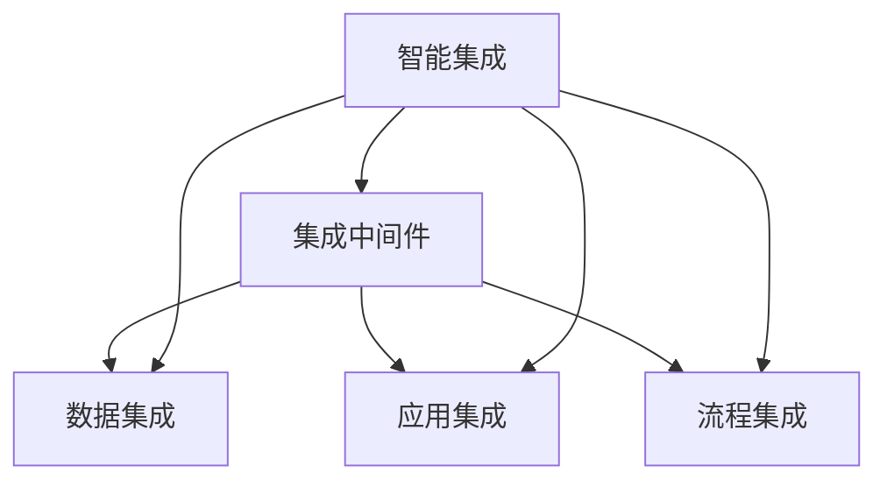

# 产业板块集成信息系统总体构架

## 1. 背景介绍

### 1.1 问题的由来

在当今快速发展的数字化时代，各行业都面临着数据孤岛、系统割裂、业务协同困难等挑战。传统的信息系统架构无法满足企业日益增长的集成需求,导致了数据流转效率低下、决策缺乏全局视角等问题。因此,构建一个高效、灵活、可扩展的集成信息系统架构,实现跨系统、跨部门、跨地域的无缝集成,成为企业提高运营效率、增强竞争力的当务之急。

### 1.2 研究现状  

目前,已有多种集成方案应运而生,如企业服务总线(ESB)、微服务架构等。但这些方案或者过于笨重、或者缺乏统一管理,难以适应现代企业异构复杂的IT环境。同时,随着新兴技术如云计算、大数据、人工智能等的发展,对集成架构的灵活性、扩展性、智能化提出了更高要求。

### 1.3 研究意义

构建一个先进的产业板块集成信息系统总体架构,可以帮助企业实现:

1. 数据集成,打破信息孤岛,提高数据流转效率
2. 应用集成,实现无缝业务协作,提高运营效率 
3. 技术集成,统一异构系统,降低维护成本
4. 决策集成,融合多源数据,提高决策科学性
5. 智能集成,引入AI技术,实现自动化运维

总之,这种架构将为企业带来更高的运营效率、更好的用户体验和更强的创新能力。

### 1.4 本文结构

本文将首先介绍产业板块集成信息系统总体架构的核心概念,阐述架构的设计原则和总体框架。然后详细解释架构的关键技术,包括集成中间件、数据集成、应用集成、流程集成、智能集成等。接下来通过案例分析说明架构在实际场景中的应用。最后总结架构的优势,并展望未来的发展趋势和挑战。

## 2. 核心概念与联系

产业板块集成信息系统总体架构的核心概念包括:

1. **集成中间件**: 作为整个架构的基础,提供了可靠的消息传递、服务注册发现、流程编排、安全控制等能力。

2. **数据集成**: 实现异构数据源之间的实时或批量数据交换、清洗、转换、加载等,构建统一的数据视图。

3. **应用集成**: 通过标准化接口和协议,实现不同应用系统之间的无缝集成和业务协作。

4. **流程集成**: 将分散的业务流程进行有序编排,实现跨系统、跨组织的端到端流程自动化。

5. **智能集成**: 利用人工智能技术(如机器学习、自然语言处理等),实现集成系统的智能化运维和决策支持。

这些概念相互关联、相辅相成,共同构建了一个完整的、智能化的集成架构体系,如下图所示:



## 3. 核心算法原理 & 具体操作步骤

### 3.1 算法原理概述

产业板块集成信息系统总体架构的核心算法原理主要包括:

1. **消息队列与发布订阅模式**:用于实现系统间的异步、可靠、解耦的消息传递。

2. **服务注册发现与负载均衡**:通过服务注册中心和负载均衡算法,实现高可用、可扩展的分布式服务架构。

3. **数据ETL(提取-转换-加载)**:从异构数据源提取数据,进行清洗、转换,最终加载到统一的数据平台中。

4. **流程编排与业务规则引擎**:根据预定义的业务规则和流程模型,自动编排跨系统的业务流程执行。

5. **机器学习与优化算法**:利用机器学习算法对历史数据进行分析,优化集成系统的性能、可靠性等指标。

### 3.2 算法步骤详解

以消息队列与发布订阅模式为例,其核心算法步骤如下:

1. **生产者发送消息**:生产者将消息发送到消息队列中,并指定相应的路由键(routing key)。

2. **消息队列存储消息**:消息队列按照先进先出(FIFO)原则,临时存储消息。

3. **消费者订阅路由键**:消费者向消息队列管理器声明自己需要订阅的路由键。

4. **消息分发给消费者**:当有匹配路由键的消息到达时,队列将消息分发给相应的消费者。

5. **消费者处理消息**:消费者接收到消息后,根据消息内容执行相应的业务逻辑。

6. **发送确认消息**:消费者处理完成后,向队列发送确认消息,队列则从内存中移除该消息。

该算法的优点是实现了生产者与消费者的异步解耦,提高了系统的吞吐量和可靠性。具体实现时,需要考虑消息的持久化、重试机制、流控等策略。

### 3.3 算法优缺点

**优点**:

1. 高可靠:消息队列能够缓存消息,防止数据丢失。
2. 解耦性强:生产者和消费者完全解耦,提高系统灵活性。
3. 异步通信:不需要等待响应,提高系统吞吐量。
4. 流量削峰:能够缓冲短时间内的高流量。

**缺点**:

1. 系统复杂度提高:需要额外的消息队列组件,增加了系统复杂度。
2. 消息顺序性:在并发场景下,难以保证消息的顺序性。
3. 消息重复:由于网络等原因,可能出现消息重复的情况。

### 3.4 算法应用领域

消息队列与发布订阅模式在以下场景中有广泛应用:

1. 异步通信:如电商订单处理、物流信息推送等。
2. 应用程序集成:实现不同系统之间的无缝集成。
3. 日志处理:收集分散的日志信息,进行集中处理和分析。
4. 流量削峰:缓解短时间内的高流量冲击,保证系统稳定性。

除此之外,该模式也可应用于物联网、金融支付、社交网络等多个领域。

## 4. 数学模型和公式 & 详细讲解 & 举例说明

在产业板块集成信息系统总体架构中,数学模型和公式主要应用于以下几个方面:

### 4.1 数学模型构建

1. **负载均衡模型**

负载均衡是分布式系统中的一个关键问题,常用的负载均衡算法有轮询(Round Robin)、最小连接(Least Connections)、源地址哈希(Source Hash)等。

假设有 n 个服务实例,第 i 个实例的权重为 $w_i$,则在轮询算法中,实例 i 被选中的概率为:

$$
p_i = \frac{w_i}{\sum_{j=1}^n w_j}
$$

2. **数据ETL模型**

在数据ETL过程中,需要对异构数据源进行规范化处理,将不同格式的数据转换为统一格式。可以构建基于模式映射的数据转换模型,定义源模式到目标模式的映射规则。

假设源模式为 $S=\{A_1,A_2,...,A_m\}$,目标模式为 $T=\{B_1,B_2,...,B_n\}$,则映射函数 $f:S\rightarrow T$ 可表示为:

$$
\begin{aligned}
B_1&=f_1(A_1,A_2,...,A_m)\\
B_2&=f_2(A_1,A_2,...,A_m)\\
&...\\
B_n&=f_n(A_1,A_2,...,A_m)
\end{aligned}
$$

其中 $f_i$ 为第 i 个属性的映射函数。

### 4.2 公式推导过程

以轮询负载均衡算法为例,推导实例 i 被选中的概率 $p_i$:

1) 设总权重为 $W=\sum_{j=1}^n w_j$
2) 在一个循环周期内,实例 i 会被选中 $w_i$ 次
3) 因此,实例 i 被选中的概率为:
   
$$
p_i = \frac{w_i}{W} = \frac{w_i}{\sum_{j=1}^n w_j}
$$

### 4.3 案例分析与讲解

**案例1:电商订单处理**

在电商系统中,消息队列常用于异步处理订单。假设每秒有 100 个订单到达,每个订单处理时间服从参数为 $\lambda=0.1$ 的指数分布。

令 $X(t)$ 为 $t$ 时刻队列长度,则 $\{X(t),t\geq 0\}$ 为一个出生死亡过程,其平均队列长度 $L$ 可由下式计算:

$$
L = \frac{\lambda}{\mu-\lambda}=\frac{10}{1-10}=\infty
$$

由于 $\lambda > \mu$,因此队列长度将无限增长,系统将发生拥塞。这时可以适当增加服务实例数,使 $\mu > \lambda$,从而保证系统稳定性。

**案例2:物流数据ETL**

假设有两个物流系统 A 和 B,它们的数据模式分别为:

- A: 快递单号(ID)、发件人(Sender)、收件人(Receiver)、发件地(From)、收件地(To)
- B: 运单编号(ID)、寄件人(Sender)、收件人(Receiver)、寄件地址(FromAddr)、收件地址(ToAddr)

则源模式到目标模式的映射规则可定义为:

$$
\begin{aligned}
\text{ID} &= \text{ID}\\
\text{Sender} &= \text{Sender}\\
\text{Receiver} &= \text{Receiver}\\
\text{FromAddr} &= \text{From}\\
\text{ToAddr} &= \text{To}
\end{aligned}
$$

通过这种映射,可以将两个系统的物流数据集成到同一个数据平台中,为后续的数据分析和业务决策提供支持。

### 4.4 常见问题解答

**1. 如何选择合适的负载均衡算法?**

不同场景下,应根据系统的特点选择不同的负载均衡算法。例如,如果追求绝对的负载均衡,可选择轮询算法;如果考虑实例的响应能力,可选择最小连接算法;如果需要保持会话粘性,可选择源地址哈希算法。

**2. 数据ETL过程中如何处理数据质量问题?**

数据质量是ETL过程中的一个重要环节。可以在提取阶段对数据进行校验,剔除不合格数据;在转换阶段进行数据清洗、标准化、去重等处理;在加载阶段执行一致性检查,确保数据加载的正确性。

**3. 如何提高消息队列的吞吐量?**

提高吞吐量的策略包括:增加队列实例数、优化消费者数量、使用更高效的序列化方式、开启消息持久化等。同时也要注意控制消息堆积,防止出现消息延迟或丢失的情况。

## 5. 项目实践:代码实例和详细解释说明

### 5.1 开发环境搭建

本节将使用 Java 语言、Spring Boot 框架和 RabbitMQ 消息队列,搭建一个简单的消息驱动集成系统。

**环境要求**:

- Java 8+
- Maven 3+
- RabbitMQ 3.8+

**步骤**:

1. 创建 Spring Boot 项目
2. 添加 RabbitMQ 依赖
3. 配置 RabbitMQ 连接信息
4. 编写生产者和消费者代码

### 5.2 源代码详细实现

**1. 配置文件**

```properties
# 配置 RabbitMQ 连接信息
spring.rabbitmq.host=localhost
spring.rabbitmq.port=5672
spring.rabbitmq.username=guest
spring.rabbitmq.password=guest
```

**2. 生产者代码**

```java
@Service
public class MessageProducer {

    @