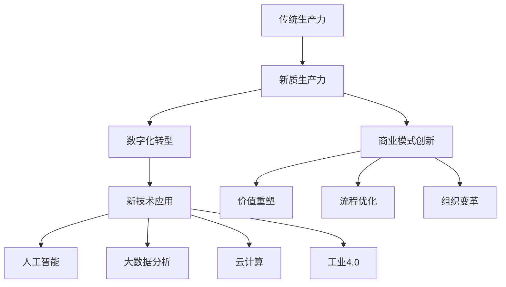
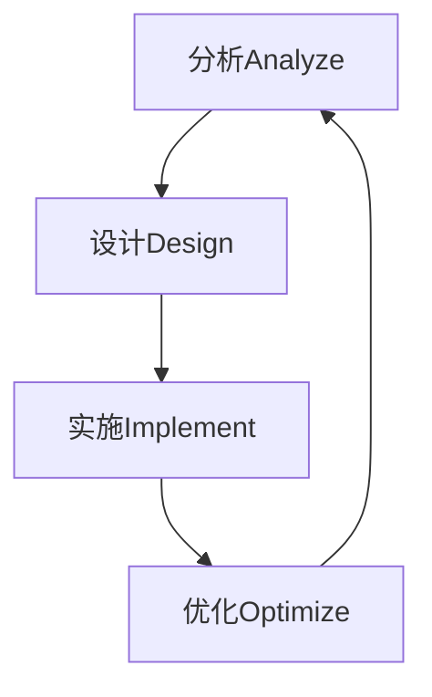

# 发展新质生产力提高核心竞争力

## 1. 背景介绍

### 1.1 问题的由来

在当前快速发展的数字化时代,企业面临着前所未有的挑战和机遇。传统的生产力模式已经无法满足日益增长的市场需求和竞争压力。为了在这场竞争中获胜,企业必须发展新质生产力,提高核心竞争力。

新质生产力是指利用新兴技术(如人工智能、大数据、云计算等)来重塑和优化企业的生产、运营和管理流程,从而实现效率、灵活性和创新的飞跃。它不仅关注生产效率,更注重质量、敏捷性和创新能力,是企业可持续发展的关键驱动力。

### 1.2 研究现状  

目前,许多领先企业已经意识到新质生产力的重要性,并开始采用相关技术来转型升级。例如,制造业利用工业4.0和智能制造技术提高生产效率;零售业使用大数据分析优化供应链管理;金融业应用人工智能进行风险管理和投资决策等。

然而,发展新质生产力并非一蹴而就。它需要企业进行全面的数字化转型,重塑业务流程,培养新型人才,构建新型组织架构等。这对于很多企业来说都是一个巨大的挑战。

### 1.3 研究意义

发展新质生产力对于提高企业核心竞争力至关重要。它可以带来以下重大意义:

1. 提高生产效率,降低运营成本
2. 优化产品质量,提升客户体验
3. 加快创新步伐,抢占市场先机  
4. 建立敏捷高效的组织架构
5. 培养复合型人才,激发员工潜能
6. 实现可持续发展,应对未来挑战

因此,研究新质生产力的发展路径和实施方法,对于企业的长远发展至关重要。

### 1.4 本文结构

本文将全面探讨发展新质生产力的理论与实践。主要内容包括:

- 新质生产力的核心概念及其与传统生产力的关系
- 发展新质生产力的核心算法原理和具体实施步骤  
- 新质生产力相关的数学模型和公式推导
- 新质生产力在实际项目中的代码实现和案例分析
- 新质生产力在不同行业的应用场景和前景展望
- 发展新质生产力所需的工具和学习资源
- 新质生产力的发展趋势、面临的挑战及未来展望

## 2. 核心概念与联系

新质生产力是一个涵盖广泛的概念,它与传统生产力、数字化转型、商业模式创新等密切相关。我们先来厘清这些概念之间的关系:

新质生产力建基于传统生产力之上,但与之有着本质的区别:

- 传统生产力主要关注生产效率,新质生产力更注重质量、敏捷性和创新能力
- 传统生产力依赖人力和设备投入,新质生产力高度依赖新兴技术的应用
- 传统生产力旨在优化现有流程,新质生产力则需要重塑和创新流程

发展新质生产力需要企业进行全面的数字化转型,充分应用人工智能、大数据分析、云计算、工业4.0等新技术,从而推动商业模式创新、价值重塑、流程优化和组织变革。

新质生产力是企业提高核心竞争力的关键所在。下面我们将深入探讨其核心算法原理和实现路径。

## 3. 核心算法原理 & 具体操作步骤

### 3.1 算法原理概述

发展新质生产力的核心算法原理可以概括为"AIDP"循环:

1. **分析(Analyze)**: 充分利用大数据分析、机器学习等技术,全面分析企业的现状、问题和需求。
2. **设计(Design)**: 基于分析结果,设计新的商业模式、流程和组织架构,制定数字化转型策略。  
3. **实施(Implement)**: 通过应用人工智能、云计算等新技术,落实转型策略,推进流程再造。
4. **优化(Optimize)**: 持续收集反馈数据,运用分析手段评估效果,并对策略和实施进行优化调整。

该算法本质上是一个闭环的PDCA(Plan-Do-Check-Act)循环,不断进行分析、设计、实施和优化,推动企业的持续进化。

### 3.2 算法步骤详解

1. **分析(Analyze)阶段**
   - 数据采集:建立数据中台,采集企业内外部多源数据
   - 数据处理:进行数据清洗、集成、转换和建模
   - 分析挖掘:运用机器学习、统计分析等技术,发现问题和需求
   - 可视化:使用数据可视化技术呈现分析结果
   
2. **设计(Design)阶段**
   - 战略制定:基于分析结果,制定数字化转型战略
   - 架构设计:重塑商业模式、流程和组织架构  
   - 技术选型:评估和选择合适的新技术方案
   - 项目规划:分解任务,编制实施计划和进度

3. **实施(Implement)阶段**
   - 环境准备:搭建开发、测试和生产环境
   - 系统开发:基于新架构,开发相关应用系统  
   - 流程再造:使用新系统重塑和优化业务流程
   - 人员培训:培养复合型人才,提升员工数字化能力

4. **优化(Optimize)阶段** 
   - 数据监控:持续采集系统运行和业务过程数据
   - 效果评估:分析实施效果,发现问题和机会
   - 策略调整:根据评估结果,优化转型策略和实施计划
   - 持续改进:形成闭环,重新进入下一轮AIDP循环

需要注意的是,这个算法并非一蹴而就,而是一个循序渐进、不断迭代的过程。企业需要有足够的决心和耐心,才能真正发展新质生产力。

### 3.3 算法优缺点

**优点**:

- 科学规范,遵循PDCA管理循环原则
- 系统全面,涵盖战略、架构、技术、流程和人才等各方面
- 灵活迭代,可根据反馈持续优化调整
- 注重数据驱动,有利于发现深层次问题和需求
- 推动商业模式创新,提高企业核心竞争力

**缺点**:  

- 实施过程复杂,需要全面的组织变革
- 前期投入较大,需要大量资金和人力
- 技术要求高,需引进复合型人才
- 存在一定风险,如果中途放弃将造成资源浪费

### 3.4 算法应用领域

发展新质生产力的AIDP算法可广泛应用于各行各业,包括但不限于:

- 制造业:智能制造、精益生产、预测性维护等
- 零售业:供应链优化、客户体验个性化、无人商店等
- 金融业:风险管理、智能投顾、反洗钱监控等
- 医疗健康:智能辅助诊断、精准医疗、药物研发等
- 交通运输:智能调度、自动驾驶、物流优化等
- 能源电力:负荷预测、智能电网、绿色能源等
- 政府公共服务:智能城市、社会治理、应急管理等

任何希望提高生产力、降低成本、优化流程、创新商业模式的企业,都可以借鉴和应用这一算法。

## 4. 数学模型和公式 & 详细讲解 & 举例说明  

### 4.1 数学模型构建

为了量化和优化新质生产力,我们需要构建相应的数学模型。假设企业的新质生产力可以用一个综合指标 $Q$ 来衡量,它是传统生产力 $P$ 和数字化程度 $D$ 的函数:

$$Q = f(P, D)$$

其中,传统生产力 $P$ 可以用劳动生产率、资本产出率等指标来度量。数字化程度 $D$ 可以用信息技术投入占比、数字化覆盖范围等指标来衡量。

进一步,我们假设 $f$ 是 $P$ 和 $D$ 的乘积形式:

$$Q = P \cdot D$$

这意味着,新质生产力不仅取决于传统生产力的水平,也高度依赖于企业的数字化转型程度。

数字化程度 $D$ 可以进一步细化为多个影响因素的函数:

$$D = g(T, O, P, H)$$

其中:
- $T$ 表示新技术应用水平,如人工智能、大数据分析等
- $O$ 表示组织架构的数字化适应度 
- $P$ 表示流程的数字化重塑程度
- $H$ 表示人力资源的数字化能力

我们可以进一步对 $g$ 函数的具体形式做出合理的假设,例如使用加权几何平均形式:

$$D = T^{w_1} \cdot O^{w_2} \cdot P^{w_3} \cdot H^{w_4}$$

其中 $w_1, w_2, w_3, w_4$ 为各影响因素的权重,且 $\sum w_i = 1$。

将上式代入新质生产力公式,我们得到:

$$Q = P \cdot T^{w_1} \cdot O^{w_2} \cdot P^{w_3} \cdot H^{w_4}$$

这个公式清晰地阐明了提高新质生产力需要传统生产力和数字化转型程度双管齐下。企业需要在新技术应用、组织架构、流程再造和人力资源数字化转型等方面采取综合措施。

### 4.2 公式推导过程

我们来推导上面的数学模型公式。首先给出一些基本符号:

- $Q$: 新质生产力指数
- $P$: 传统生产力指数  
- $D$: 数字化程度指数
- $T$: 新技术应用水平指数
- $O$: 组织架构数字化适应度指数
- $P$: 流程数字化重塑程度指数 
- $H$: 人力资源数字化能力指数

我们的目标是求出 $Q$ 与其他指标之间的关系式。

1) 假设新质生产力 $Q$ 是传统生产力 $P$ 和数字化程度 $D$ 的函数:

$$Q = f(P, D)$$

2) 进一步假设 $f$ 为乘积形式:

$$Q = P \cdot D \tag{1}$$

这意味着新质生产力不仅取决于传统生产力水平,也高度依赖于数字化转型程度。

3) 数字化程度 $D$ 可以用新技术应用 $T$、组织架构适应度 $O$、流程重塑 $P$ 和人力资源数字化 $H$ 的函数表示:

$$D = g(T, O, P, H)$$

4) 假设 $g$ 为加权几何平均形式:

$$D = T^{w_1} \cdot O^{w_2} \cdot P^{w_3} \cdot H^{w_4} \tag{2}$$

其中 $w_1, w_2, w_3, w_4$ 为对应权重,且 $\sum w_i = 1$。

5) 将(2)代入(1)可得:

$$Q = P \cdot T^{w_1} \cdot O^{w_2} \cdot P^{w_3} \cdot H^{w_4} \tag{3}$$

这就是我们最终得到的新质生产力数学模型公式。

该公式阐明,提高新质生产力需要传统生产力 $P$ 和数字化转型程度 $D$ 双管齐下。数字化转型程度 $D$ 又由新技术应用 $T