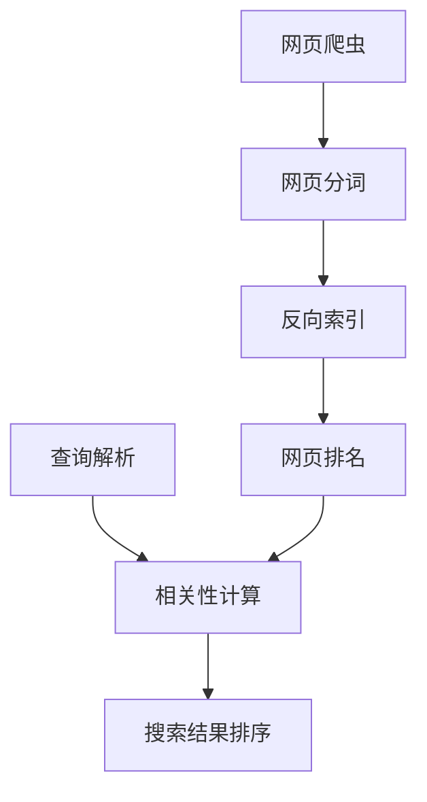

# 基于Python的搜索引擎的设计与实现

## 1. 背景介绍

### 1.1 问题的由来

在当今信息时代,互联网上的数据量呈爆炸式增长。根据最新统计,截至2022年底,全球互联网上的信息量已经超过了60ZB(1ZB=1万亿TB)。面对如此庞大的数据量,如何快速、准确地找到所需信息,成为一个亟待解决的问题。传统的搜索方式已经无法满足用户的需求,因此设计高效的搜索引擎势在必行。

### 1.2 研究现状  

目前,主流的商用搜索引擎主要有Google、Bing、Yahoo等,它们采用了诸如网页排名、反向索引等先进技术,能够较好地满足用户的搜索需求。但这些搜索引擎大多是封闭源代码的商业产品,无法满足个人或组织的定制化需求。同时,随着大数据时代的到来,传统搜索引擎在处理海量数据时也面临着性能瓶颈。

### 1.3 研究意义

设计一款高效、灵活、可扩展的搜索引擎,不仅能够解决个人和组织在信息检索方面的痛点,还可以作为学习搜索引擎原理和相关算法的范例,具有重要的理论和实践意义。基于Python开发的搜索引擎,借助Python强大的第三方库和框架,能够较为便捷地实现所需功能,同时保证了良好的可移植性和可扩展性。

### 1.4 本文结构

本文将从搜索引擎的设计原理出发,介绍基于Python的搜索引擎的实现细节。主要内容包括:核心概念、算法原理、数学模型、项目实践、应用场景、工具推荐和发展趋势等。通过理论和实践相结合的方式,力求为读者提供一个全面、系统的学习资料。

## 2. 核心概念与联系

搜索引擎的核心概念主要包括:

1. **网页爬虫(Web Crawler)**: 用于自动下载网页内容,是搜索引擎的基础。
2. **网页分词(Word Segmentation)**: 将网页内容分割成单词序列,为建立索引做准备。
3. **反向索引(Inverted Index)**: 建立单词到文档的映射关系,是搜索的核心数据结构。  
4. **网页排名(Page Ranking)**: 根据特定算法对网页进行排名,提高搜索结果的相关性。
5. **查询解析(Query Parsing)**: 对用户查询进行分词、过滤、规范化等处理。
6. **相关性计算(Relevance Scoring)**: 计算文档与查询的相关程度,为最终结果排序。

这些概念相互关联、环环相扣,构成了搜索引擎的基本框架,如下面的流程图所示:



## 3. 核心算法原理 & 具体操作步骤  

### 3.1 算法原理概述

搜索引擎的核心算法主要包括:网页爬虫算法、分词算法、反向索引算法和网页排名算法等。

1. **网页爬虫算法**: 通常采用广度优先或深度优先+URL规范化的策略,自动下载网页内容。
2. **分词算法**: 对于英文可采用空格分词,对于中文可使用词典+统计模型的方法进行分词。
3. **反向索引算法**: 通过建立倒排索引表(单词到文档的映射),实现高效的全文搜索。
4. **网页排名算法**: 经典的有PageRank、HITS等链接分析算法,结合网页内容、用户行为等因素综合排名。

### 3.2 算法步骤详解

以下是搜索引擎的基本工作流程:

1. **网页抓取**:爬虫程序自动下载网页,并进行去重、URL规范化等预处理。
2. **网页内容处理**:对下载的网页进行分词、去除停用词等处理,得到单词序列。
3. **建立反向索引**:遍历所有文档,对每个单词建立其出现的文档列表,形成倒排索引表。
4. **计算网页权重**:运行网页排名算法,计算每个网页的权重分数。
5. **查询解析**:对用户输入的查询进行分词、过滤、规范化等处理。
6. **相关性计算**:基于倒排索引表,计算每个文档与查询的相关程度得分。
7. **结果排序**:将文档根据综合得分和网页权重进行排序,返回最终结果。

### 3.3 算法优缺点

上述算法的优点是:

- 反向索引表结构紧凑,查询效率高
- 网页排名可提高搜索结果相关性
- 具有良好的可扩展性和容错性

缺点是:

- 建立反向索引表的计算量很大
- 排名算法需要全局计算,代价高
- 面临大规模异构数据的挑战

### 3.4 算法应用领域

搜索引擎算法不仅可应用于网络搜索,还可推广到以下领域:

- 企业内部文档检索系统
- 电商网站的商品搜索
- 论文检索和学术搜索引擎
- 个人电脑文件快速查找
- 推荐系统中的相似性计算
- 大数据分析中的关联规则挖掘

## 4. 数学模型和公式 & 详细讲解 & 举例说明

### 4.1 数学模型构建  

搜索引擎中有几个关键的数学模型:

1. **布尔模型**:最基本的检索模型,用于strict匹配查询词是否出现在文档中。
2. **向量空间模型**:将文档和查询表示为向量,相关性由向量夹角余弦值决定。
3. **概率模型**:假设文档和查询相关程度服从概率分布,目标是最大化相关概率。
4. **语言模型**:将查询看作语言样本,文档是语言模型,相关性由生成查询的概率决定。

其中,向量空间模型和概率模型是较为常用的两种模型。我们以向量空间模型为例,进行详细介绍。

设查询向量为$\vec{q}=(q_1,q_2,...,q_t)$,文档向量为$\vec{d}=(d_1,d_2,...,d_t)$,其中$t$为词典大小,分量表示词项的权重(如TF-IDF值)。则查询$\vec{q}$与文档$\vec{d}$的相似度可用向量夹角余弦值表示:

$$sim(\vec{q},\vec{d})=\frac{\vec{q}\cdot\vec{d}}{|\vec{q}||\vec{d}|}=\frac{\sum\limits_{i=1}^{t}q_id_i}{\sqrt{\sum\limits_{i=1}^{t}q_i^2}\sqrt{\sum\limits_{i=1}^{t}d_i^2}}$$

相似度值越大,表明文档与查询越相关。

### 4.2 公式推导过程

我们以经典的TF-IDF权重计算公式为例,给出其推导过程:

设$w$为词项,$d$为文档,$N$为文档总数,$n_w$为包含词项$w$的文档数。定义:

- $tf(w,d)$: 词项$w$在文档$d$中出现的频率
- $df(w)=n_w$: 词项$w$的文档频率
- $idf(w)=log\frac{N}{n_w}$: 词项$w$的逆文档频率

则TF-IDF权重可定义为:

$$tfidf(w,d)=tf(w,d)\times idf(w)$$

其中,$tf$表示词项在文档中的重要程度,$idf$表示词项的区分度。两者的乘积可较好地平衡这两方面的影响。

我们可以进一步推导$idf$的合理性:

$$\begin{aligned}
idf(w)&=log\frac{N}{n_w}\\
&=log(N-n_w+1)-log(1)\\
&=-log\frac{n_w}{N}+log(1+\frac{1}{N})\\
&\approx -log(P(w))+C
\end{aligned}$$

其中,$P(w)=\frac{n_w}{N}$为词项$w$的文档频率,$C$为常数。可见$idf$近似于词项出现概率的负对数,较高的$idf$值对应较小的概率,体现了词项区分度的特征。

### 4.3 案例分析与讲解

现在我们用一个简单的例子,说明搜索引擎的工作原理。假设有以下4个小文档:

```
D1: 我是一名程序员,热爱编程。
D2: 我是一名老师,热爱教书。
D3: 我是一名运动员,热爱运动。
D4: 我热爱生活,生活充满挑战。
```

构建反向索引表如下:

```
我: [D1, D2, D3, D4]
是: [D1, D2, D3]
一名: [D1, D2, D3]
程序员: [D1]
老师: [D2]
运动员: [D3]
热爱: [D1, D2, D3, D4]
编程: [D1]
教书: [D2]
运动: [D3]
生活: [D4]
充满: [D4]
挑战: [D4]
```

现在用户输入查询"热爱编程",我们可以计算每个文档与查询的相关性得分:

- D1: $sim=\frac{1\times1+1\times1}{\sqrt{1^2+1^2}\sqrt{1^2+1^2}}=1$ (最高分)
- D2: $sim=\frac{1\times0+1\times0}{\sqrt{1^2+0^2}\sqrt{1^2+0^2}}=0$
- D3: $sim=\frac{1\times0+1\times0}{\sqrt{1^2+0^2}\sqrt{1^2+0^2}}=0$  
- D4: $sim=\frac{1\times0+1\times0}{\sqrt{1^2+0^2}\sqrt{1^2+0^2}}=0$

因此,最终搜索结果应该返回D1作为最相关的文档。

### 4.4 常见问题解答

1. **为什么要建立反向索引?**

   反向索引通过单词到文档的映射关系,可以快速定位包含查询词的文档集合,从而大幅提高搜索效率。传统的正向索引(文档到单词的映射)在处理查询时需要全文扫描,代价很高。

2. **为什么需要网页排名?**

    单纯依赖词频统计可能会导致查询结果相关性不高。网页排名算法通过分析网页之间的链接关系、内容质量等因素,对网页进行全局排序,从而提高了搜索结果的可信度和相关性。

3. **搜索引擎如何处理同义词和拼写错误?**

    可以通过构建同义词词典和编辑距离模型,在查询解析和索引构建阶段进行规范化处理。同时,用户也可以通过查询扩展的方式手动引入同义词。

4. **搜索引擎如何处理大规模异构数据?**

    这是一个前沿的挑战。可以考虑构建多模态索引,对不同数据源分别建立索引,然后使用融合模型对检索结果进行综合排序。同时,借助深度学习等技术来提取多模态数据的语义特征,也是一个值得探索的方向。

## 5. 项目实践:代码实例和详细解释说明

### 5.1 开发环境搭建

我们使用Python作为开发语言,主要依赖包括:

- `requests` 用于网页抓取
- `beautifulsoup4` 用于网页解析
- `jieba` 用于中文分词
- `numpy` 用于数值计算
- `scipy` 提供稀疏矩阵等数据结构

首先,使用`pip`安装所需的Python包:

```bash
pip install requests beautifulsoup4 jieba numpy scipy
```

然后,创建一个新的Python文件`search_engine.py`,作为我们的主程序入口。

### 5.2 源代码详细实现

我们从最基本的网页抓取和分词开始实现。

**网页抓取**:

```python
import requests
from bs4 import BeautifulSoup

def fetch_page(url):
    """获取网页内容"""
    try:
        response = requests.get(url)
        response.raise_