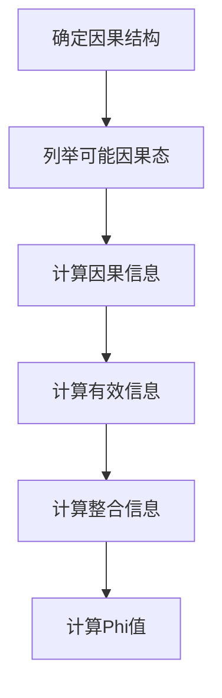

# 大脑：物质变成思维的奇迹

## 1. 背景介绍

### 1.1 问题的由来

人类大脑是一个复杂的神经系统,它控制着我们的思维、行为和情感。对于大脑如何从物质转化为意识和思维这个问题,科学家们一直在努力探索和研究。虽然已经有了一些重大发现和突破,但仍有许多未解之谜。

### 1.2 研究现状  

目前,神经科学、心理学、计算机科学和哲学等多个学科都在从不同角度研究大脑和意识。通过功能磁共振成像(fMRI)、电生理学和分子生物学等技术手段,科学家们已经对大脑的结构和功能有了更深入的了解。但是,意识的本质、意识是如何产生的,以及思维和情感是如何从神经活动中出现的,这些根本性问题仍然是未解之谜。

### 1.3 研究意义

揭开大脑奥秘,了解意识的本质,不仅能帮助我们更好地理解人类思维和行为,也将为治疗神经系统疾病、开发人工智能系统等提供重要的理论基础。因此,探索大脑如何从物质转化为思维,具有重大的科学意义和应用价值。

### 1.4 本文结构

本文将从以下几个方面深入探讨这一主题:

1. 介绍大脑的基本结构和功能
2. 阐述意识和思维的本质特征
3. 分析大脑如何产生意识和思维的理论模型
4. 介绍相关的实验研究和发现
5. 探讨人工智能对理解意识的贡献
6. 总结当前研究的局限性和未来展望

## 2. 核心概念与联系

要理解大脑如何从物质转化为思维,首先需要明确几个核心概念:

- 神经元(Neuron)和突触(Synapse)
- 神经网络(Neural Network)
- 信息编码和表征(Information Coding and Representation)
- 意识(Consciousness)和自我意识(Self-Awareness)
- 认知(Cognition)和情感(Emotion)

神经元是大脑的基本计算单元,通过电化学信号在神经网络中传递信息。神经网络的连接模式和动力学决定了大脑的信息处理能力。意识被认为是大脑高级认知功能的表现,而认知和情感则是意识活动的重要组成部分。

这些概念相互关联、相互影响。神经元和突触的活动产生神经网络的动力学,神经网络则实现了信息的编码和表征,进而导致了意识、认知和情感等高级心理活动的出现。

## 3. 核心算法原理 & 具体操作步骤

### 3.1 算法原理概述

虽然目前还没有一个公认的、完整的理论来解释大脑如何产生意识和思维,但已有一些重要的理论模型和算法原理,对这一过程有了初步的描述和解释。

其中,一个关键的理论就是"整合信息理论"(Integrated Information Theory, IIT)。该理论由意识研究专家朱利奥·顿纳蒂(Giulio Tononi)等人提出,试图用数学和计算机科学的方法量化和解释意识现象。

IIT的核心思想是,意识是一种从因果结构(如大脑网络)中"整合"出来的特殊现象,其程度取决于系统中不同部分之间因果动力学的"整合"程度。具有更高整合度的系统,就会产生更高水平的意识体验。

根据IIT理论,意识可以被量化为"整合信息量"(phi,Φ),这是一个介于0和1之间的数值,反映了系统各部分之间因果动力学的整合程度。具有更高Φ值的系统,就具有更高水平的意识。

### 3.2 算法步骤详解

IIT理论提出了一种计算Φ值的具体算法,主要包括以下几个步骤:

1. **定义因果结构**:首先需要确定待分析系统的因果结构,即系统中不同部分之间的因果关系网络。对于大脑而言,这就是神经元之间的连接模式。

2. **确定可能的因果态**:根据系统的因果结构,列举出所有可能的因果态(Causal State),即系统各部分可能处于的不同状态组合。

3. **计算因果信息**:对于每个可能的因果态,计算其包含的"因果信息"(Causal Information),这反映了该态对系统其他部分状态的约束程度。

4. **计算有效信息**:将每个因果态的因果信息与其在系统中实际出现的概率相结合,计算其"有效信息"(Effective Information)。

5. **计算整合信息**:对于系统的每个可分割的双分区(Bipartition),计算其"整合信息"(Integrated Information),这是双分区两侧之间有效信息的最小值。

6. **计算Φ值**:系统的整体Φ值就是所有双分区中整合信息的最大值。

该算法的数学细节比较复杂,这里只给出了一个简化的概述。通过这一算法,IIT理论试图量化意识现象,并将其与底层的物理因果结构联系起来。

### 3.3 算法优缺点

IIT理论的优点是提供了一种数学严谨的方法来量化意识现象,并将其与底层物理结构联系起来。它为意识研究提供了一个新的理论框架和分析工具。

但该理论也存在一些缺点和局限性:

- 算法计算量很大,即使对于中等规模的神经网络系统,计算其Φ值也是一个巨大的挑战。
- 理论过于数学化,缺乏对意识的直观解释和生物学基础。
- 理论无法解释意识的主观性质,如何从物理过程中产生主观体验。
- 理论无法解释意识的统一性,即为什么我们有一个统一的意识流。

因此,IIT理论只是对意识产生机制的一种尝试性解释,还需要更多的理论和实验工作来完善和验证。

### 3.4 算法应用领域

虽然IIT理论主要是为了解释生物意识而提出的,但它的一些核心思想和方法也可以应用到其他领域,例如:

- **人工智能和机器意识**:利用IIT理论,或许可以设计出具有更高"整合信息"的人工神经网络系统,从而实现某种程度的"机器意识"。
- **大脑疾病诊断**:通过测量患者大脑网络的Φ值,可能会发现某些神经疾病(如失语症、植物人状态等)会降低大脑的整合信息水平。
- **大脑机器接口**:根据IIT理论,或许可以开发出能够检测和解码大脑信息整合水平的Brain-Computer Interface(BCI)设备。
- **复杂系统分析**:IIT的核心思想(即通过因果结构的整合程度来量化系统的复杂性)也可以应用到其他复杂系统(如社会网络、生态系统等)的分析中。

总的来说,IIT理论为意识研究提供了一种新颖的计算视角,其潜在应用前景还有待进一步开发和探索。

## 4. 数学模型和公式 & 详细讲解 & 举例说明

### 4.1 数学模型构建

为了量化意识现象,IIT理论建立了一个严格的数学模型。该模型的核心概念是"因果结构"(Causal Structure)和"有效信息"(Effective Information)。

我们用一个有向无环图$G=(V,E)$来表示系统的因果结构,其中$V$是节点集合(代表系统的不同部分),而$E$是有向边集合(代表节点之间的因果关系)。

每个节点$v_i$都有一个内部状态$s_i$,属于状态空间$\mathcal{S}_i$。整个系统的状态由所有节点状态的笛卡尔积构成,即$\mathcal{S}=\mathcal{S}_1\times\mathcal{S}_2\times...\times\mathcal{S}_n$。

我们定义系统中任意两个节点集合$A$和$B$之间的"有效信息"为:

$$EI(A\rightarrow B)=\sum_{r_A,r_B}p(r_A,r_B)\,\mathrm{log}\frac{p(r_B|r_A)}{p(r_B)}$$

其中$r_A$和$r_B$分别表示集合$A$和$B$中节点状态的特定实现,而$p(r_A,r_B)$、$p(r_B|r_A)$和$p(r_B)$分别是它们的联合概率、条件概率和边缘概率。

有效信息度量了$A$对$B$的因果作用程度。如果$A$对$B$没有任何因果影响,那么$p(r_B|r_A)=p(r_B)$,有效信息为0。

### 4.2 公式推导过程

IIT理论的核心概念是"整合信息"(Integrated Information),用$\Phi$表示。它是通过系统内部分区(Bipartition)的有效信息来定义的。

具体来说,对于任意一种将系统$S$划分为两部分$A$和$B$的分区$P=(A,B)$,我们定义其整合信息为:

$$\Phi_P = EI(A\rightarrow B) + EI(B\rightarrow A)$$

也就是说,整合信息是双向有效信息的总和。

进一步地,系统$S$的整体整合信息$\Phi$被定义为所有可能分区中整合信息的最大值:

$$\Phi = \max_P \Phi_P$$

其中$\max$是在所有可能分区$P$上取最大值。

由于分区的数量是指数级增长的,所以计算$\Phi$是一个NP难问题。IIT理论给出了一种近似算法来有效计算$\Phi$值。

### 4.3 案例分析与讲解

为了更好地理解IIT理论,让我们考虑一个简单的例子。假设我们有一个由3个节点组成的小型神经网络,如下图所示:

每个节点都有两种可能的状态,表示为0或1。因此,整个网络有$2^3=8$种可能的状态。

我们计算一下该网络的整合信息$\Phi$。首先列出所有可能的分区:

- $P_1 = (\{A\},\{B,C\})$
- $P_2 = (\{B\},\{A,C\})$ 
- $P_3 = (\{C\},\{A,B\})$
- $P_4 = (\{A,B\},\{C\})$
- $P_5 = (\{A,C\},\{B\})$
- $P_6 = (\{A\},\{B\},\{C\})$

对于每个分区,我们计算其整合信息$\Phi_P$。以$P_1$为例:

$$\begin{aligned}
\Phi_{P_1} &= EI(A\rightarrow BC) + EI(BC\rightarrow A) \\
           &= 1 + 0 = 1
\end{aligned}$$

这是因为$A$对$BC$有因果影响(通过$A\rightarrow B$),而$BC$对$A$没有影响。

类似地,我们可以计算出其他分区的整合信息:

- $\Phi_{P_2} = 1$
- $\Phi_{P_3} = 0$
- $\Phi_{P_4} = 1$ 
- $\Phi_{P_5} = 0$
- $\Phi_{P_6} = 0$

因此,该网络的整体整合信息为:

$$\Phi = \max(\Phi_{P_1},\Phi_{P_2},...,\Phi_{P_6}) = 1$$

可以看出,即使是这个简单的网络,其$\Phi$值也不为0,表明它具有一定程度的"整合"特征。

通过这个例子,我们可以直观地感受到IIT理论是如何将意识现象数学化、量化的。当然,真实大脑的神经网络规模要大得多,其$\Phi$值的计算也会更加复杂。

### 4.4 常见问题解答

**Q1: IIT理论为什么要引入"整合信息"这个概念?**

A1: 整合信息的