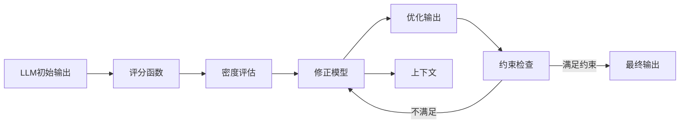

# 大语言模型应用指南：Chain-of-Density

## 1. 背景介绍

### 1.1 问题的由来

随着深度学习技术的不断发展,大型语言模型(Large Language Models, LLMs)已经成为自然语言处理领域的主导范式。这些模型通过在海量文本数据上进行预训练,学习到了丰富的语言知识,并展现出了令人惊叹的生成能力。然而,直接将这些模型应用于下游任务时,往往会遇到一些挑战:

1. **生成质量参差不齐**: LLMs生成的文本质量有时出色,但有时也会出现明显的不连贯、矛盾和事实错误等问题。
2. **缺乏控制能力**: LLMs生成的内容很难满足特定的约束条件,如主题一致性、风格统一、事实准确性等。
3. **推理能力有限**: LLMs虽然具备一定的推理能力,但在复杂的逻辑推理和多步骤问题解决等任务上表现仍然有限。

为了解决这些问题,研究人员提出了一种新的范式——Chain-of-Density(CoD)。该范式旨在通过对LLMs生成的内容进行精细控制和修正,从而提高生成质量、增强控制能力并扩展推理能力。

### 1.2 研究现状  

目前,CoD范式主要包括以下几种技术:

1. **生成-编辑-重评分(Generate-Edit-Rerank)**: 首先使用LLM生成多个候选输出,然后使用另一个模型对这些候选输出进行编辑和重新评分,选择最优的输出作为最终结果。
2. **生成-约束-重新生成(Generate-Constrain-Regenerate)**: 首先使用LLM生成初始输出,然后根据特定的约束条件(如主题、风格等)对输出进行修正,并使用修正后的输出作为上下文,重新生成新的输出。
3. **生成-分解-规划-执行(Generate-Decompose-Plan-Execute)**: 将复杂的任务分解为多个子任务,使用LLM生成每个子任务的初始解决方案,然后规划和执行这些子解决方案以得到最终结果。

这些技术已经在一些应用场景中取得了不错的效果,如文本生成、对话系统、问答系统等。但总的来说,CoD范式仍处于起步阶段,还有许多值得探索和改进的空间。

### 1.3 研究意义

CoD范式对于提升大型语言模型的应用能力具有重要意义:

1. **提高生成质量**: 通过对LLM生成的内容进行精细控制和修正,可以有效提高生成质量,减少不连贯、矛盾和事实错误等问题。
2. **增强控制能力**: CoD技术能够将特定的约束条件(如主题、风格等)融入生成过程,使得生成的内容更加符合预期。
3. **扩展推理能力**: 将复杂任务分解为子任务,并对子任务的解决方案进行规划和执行,可以扩展LLM的推理能力,应对更复杂的问题。
4. **提升可解释性**: CoD过程中的各个步骤都是可解释的,有助于理解模型的决策过程,提高模型的可解释性和可信度。

总之,CoD范式为充分发挥大型语言模型的潜力提供了一条有前景的途径,对于推动自然语言处理技术的发展具有重要意义。

### 1.4 本文结构

本文将全面介绍CoD范式的核心概念、算法原理、数学模型、实现细节和应用场景,内容安排如下:

1. 核心概念与联系
2. 核心算法原理及具体操作步骤
3. 数学模型和公式详细推导及案例分析
4. 项目实践:代码实例和详细解释说明  
5. 实际应用场景及未来展望
6. 工具和资源推荐
7. 总结:未来发展趋势与挑战
8. 附录:常见问题与解答

## 2. 核心概念与联系

Chain-of-Density(CoD)范式的核心思想是将大型语言模型(LLM)生成的原始输出作为起点,然后通过一系列的修正和优化步骤,最终得到满足特定约束条件的高质量输出。这个过程类似于一条"密度链",每一步都在提高输出的质量和约束满足度。

CoD范式中涉及到以下几个关键概念:

1. **密度(Density)**: 指输出满足约束条件的程度。密度越高,表示输出越符合预期。
2. **约束(Constraint)**: 指对输出内容的限制条件,如主题一致性、风格统一、事实准确性等。
3. **评分函数(Scoring Function)**: 用于评估输出密度的函数,通常由另一个模型(如语言模型、分类器等)实现。
4. **修正模型(Editing Model)**: 用于根据评分函数的反馈,对输出进行修正和优化的模型。
5. **上下文(Context)**: 指用于辅助生成和修正的额外信息,如任务描述、已有输出等。

这些概念之间的关系如下图所示:



整个过程可以概括为:首先使用LLM生成初始输出,然后通过评分函数对输出进行密度评估。如果密度不够高,则由修正模型根据评分函数的反馈对输出进行优化,同时利用上下文信息辅助修正。优化后的输出将再次进行密度评估,重复这个循环直到输出满足所有约束条件。最终得到的高密度输出即为所需结果。

通过这种"生成-评估-修正"的闭环过程,CoD范式能够充分利用LLM的生成能力,同时弥补其在质量控制和约束满足方面的不足,从而获得更好的输出。

## 3. 核心算法原理及具体操作步骤

### 3.1 算法原理概述

Chain-of-Density算法的核心原理可以概括为以下三个主要步骤:

1. **生成(Generation)**: 使用大型语言模型(LLM)生成初始输出。
2. **评估(Evaluation)**: 使用评分函数对输出进行密度评估,判断其是否满足约束条件。
3. **修正(Editing)**: 如果输出密度不够高,则由修正模型根据评分函数的反馈对输出进行优化,并利用上下文信息辅助修正。

这三个步骤形成一个闭环,重复执行直到输出满足所有约束条件。算法的伪代码如下:

```python
def chain_of_density(prompt, constraints, max_iterations):
    output = generate_initial_output(prompt)
    context = prompt
    for i in range(max_iterations):
        density = evaluate_density(output, constraints)
        if density >= threshold:
            return output
        output, context = edit_output(output, density, constraints, context)
    return output
```

其中:

- `generate_initial_output`使用LLM生成初始输出
- `evaluate_density`使用评分函数评估输出密度
- `edit_output`使用修正模型对输出进行优化,并更新上下文

在实际应用中,这三个步骤可以采用不同的具体实现方式,算法的效果很大程度上取决于各个模块的性能。接下来我们将详细介绍这三个步骤的实现细节。

### 3.2 算法步骤详解

#### 3.2.1 生成初始输出

生成初始输出的目标是使用大型语言模型(LLM)快速获得一个相对较好的起点,为后续的修正过程提供基础。常用的做法是将任务描述(prompt)输入到LLM中,让它生成一个初始版本的输出。

生成初始输出时,可以根据具体任务对LLM进行一些简单的指令调整,如控制输出长度、风格等,以获得更合适的初始输出。但由于LLM的局限性,这个阶段生成的输出通常无法完全满足所有约束条件,因此需要后续的修正步骤。

#### 3.2.2 评估输出密度

评估输出密度的目标是判断当前输出是否已经满足约束条件,如果满足则算法终止,否则需要进行修正。

评估密度的方法是使用一个评分函数(scoring function)对输出进行打分。评分函数可以是一个单独的模型(如语言模型、分类器等),也可以是多个模型的集成。它需要能够针对不同的约束条件给出相应的分数,分数越高表示输出越符合约束。

常见的评分函数包括:

- 语言模型评分:使用语言模型计算输出的概率,作为语言流畅性的评分。
- 分类器评分:使用分类器模型判断输出是否属于特定类别(如主题、风格等),作为相应约束的评分。
- 规则评分:根据一些手工定义的规则(如事实检查、词汇约束等)对输出进行评分。
- 组合评分:将上述多种评分函数的结果加权求和,作为综合评分。

评分函数的设计对算法的效果有很大影响。一个好的评分函数不仅需要能够正确判断输出是否满足约束,还需要给出连续的分数,为修正模型提供有意义的优化方向。

#### 3.2.3 修正输出

如果当前输出的密度评分不够高,则需要由修正模型(editing model)对输出进行优化和修正。

修正模型的输入包括:

1. 当前输出
2. 密度评分及各项约束评分
3. 任务描述(prompt)
4. 上下文信息(context)

修正模型的目标是生成一个新的输出,使其密度评分提高,更好地满足约束条件。

修正模型可以基于不同的技术实现,常见的有:

1. **序列到序列模型(Seq2Seq)**:将当前输出作为源序列,生成新的目标序列作为优化后的输出。
2. **编辑模型(Editing Model)**: 直接对当前输出进行编辑操作(插入、删除、替换等),生成修正后的新输出。
3. **条件生成模型(Conditional Generation)**: 将密度评分、约束信息等条件编码为prompt,在给定条件下重新生成新的输出。

除了当前输出,修正模型还需要利用上下文信息进行辅助,包括:

1. 任务描述(prompt):修正时需要参考原始任务目标
2. 历史输出:之前修正过程中生成的中间输出,有助于保持连贯性
3. 相关知识:与任务相关的背景知识,有助于提高输出质量

通过迭代的修正过程,输出的密度评分会不断提高,最终满足所有约束条件。

### 3.3 算法优缺点

Chain-of-Density算法的主要优点包括:

1. **生成质量提升**:通过密度评估和修正,可以有效提高输出的质量,减少不连贯、矛盾和事实错误等问题。
2. **约束满足能力增强**:将各种约束条件融入评分函数和修正模型,使得生成的输出更加符合预期。
3. **可解释性较好**:整个生成过程是可解释的,每一步的决策都有明确的依据,有助于提高模型的可信度。
4. **可扩展性强**:通过调整评分函数和修正模型,可以应对不同类型的约束条件,具有很好的灵活性和可扩展性。

算法的主要缺点和挑战包括:

1. **计算代价较高**:需要多次迭代修正,计算开销较大,对硬件资源要求较高。
2. **模型质量依赖大**:算法的效果很大程度上取决于评分函数和修正模型的质量,对模型训练提出了较高要求。
3. **约束设计复杂**:设计合理的约束条件并将其编码到评分函数中是一个挑战,需要专业知识和大量人工努力。
4. **收敛性不确定**:对于某些复杂任务,算法可能难以在有限步骤内收敛到满意的解,需要进一步优化。

### 3.4 算法应用领域

Chain-of-Density算法可以应用于多个自然语言处理领域,包括但不限于:

1. **文本生成