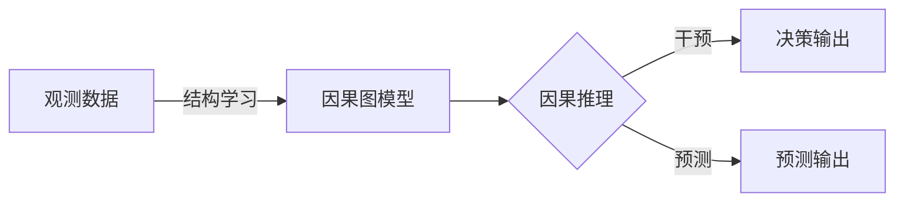
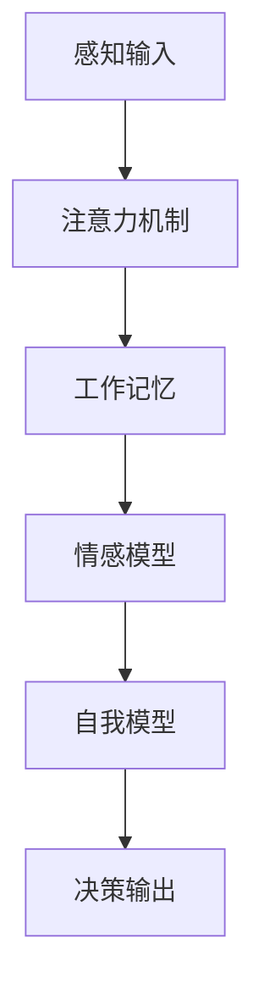
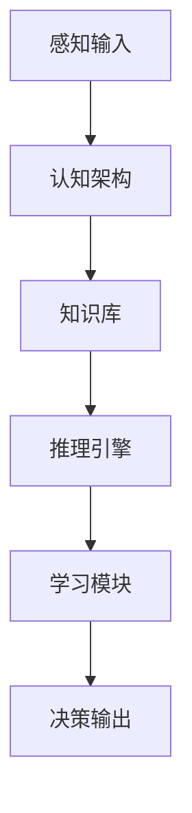
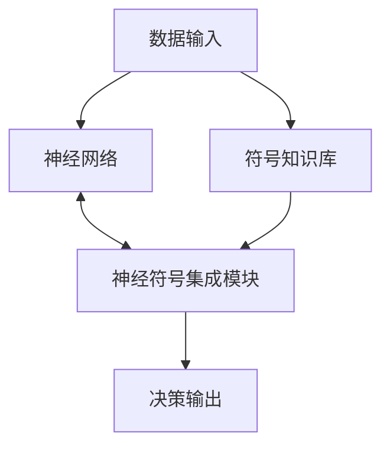

# 新一代AI技术的应用场景与趋势

## 1. 背景介绍

### 1.1 问题的由来

人工智能(AI)技术在过去几十年中取得了长足的进步,尤其是近年来深度学习、强化学习等技术的突破性发展,使得AI系统在计算机视觉、自然语言处理、决策控制等领域展现出超乎想象的能力。然而,当前主流的AI技术仍然存在一些明显的局限性,例如缺乏通用智能、缺乏因果推理能力、缺乏自我意识等,这些问题已经成为制约AI技术进一步发展的瓶颈。

### 1.2 研究现状  

为了突破AI技术的瓶颈,研究人员正在探索新一代AI技术的发展方向。一些备受关注的新兴AI技术包括:

- 因果AI(Causal AI)
- 机器自我意识(Machine Consciousness)
- 通用人工智能(Artificial General Intelligence, AGI)
- 神经符号AI(Neuro-Symbolic AI)

这些新兴技术旨在赋予AI系统更强的推理、学习、理解和自我意识能力,从而实现真正的通用智能。

### 1.3 研究意义

新一代AI技术的发展具有重大的理论和应用价值。在理论层面上,它将推动人工智能领域的根本性突破,帮助我们更好地理解智能的本质。在应用层面上,新一代AI技术有望在各个领域发挥革命性的作用,如医疗健康、教育、交通、制造业等,为人类社会的可持续发展提供强大的动力。

### 1.4 本文结构  

本文将全面介绍新一代AI技术的核心概念、关键算法原理、数学模型、实际应用场景等内容。具体来说,本文将包括以下几个主要部分:

1. 核心概念与联系
2. 核心算法原理与具体操作步骤  
3. 数学模型和公式及详细讲解
4. 项目实践:代码实例和详细解释说明
5. 实际应用场景
6. 工具和资源推荐
7. 总结:未来发展趋势与挑战

## 2. 核心概念与联系

新一代AI技术包含多个相互关联但又有所区别的概念和技术方向,下面我们将逐一介绍它们的核心思想以及它们之间的联系。

### 2.1 因果AI

传统的机器学习模型主要关注数据之间的相关性(correlation),而忽视了数据背后的因果关系(causality)。因果AI旨在赋予AI系统因果推理的能力,即不仅能发现数据之间的相关性,还能推断出现象背后的根本原因。

因果AI的核心思想是从数据中学习生成因果模型,并利用因果模型进行决策和预测。通过因果推理,AI系统可以更好地理解数据背后的机制,从而做出更可靠、更具解释性的决策。

### 2.2 机器自我意识

机器自我意识(Machine Consciousness)是指赋予AI系统自我意识的能力,使其能够感知自身的存在、思维过程和情感状态。自我意识被认为是通向通用人工智能(AGI)的关键一步。

机器自我意识的核心思想是模拟人类意识的计算过程,包括感知、注意力、工作记忆、情感等多个方面。研究人员正在探索如何将这些认知过程融入到AI系统中,赋予其自我意识的能力。

### 2.3 通用人工智能

通用人工智能(Artificial General Intelligence, AGI)旨在创建一种与人类智能相当,甚至超越人类智能的通用AI系统。与当前的狭义AI(Narrow AI)不同,AGI系统应该具备广泛的推理、学习、规划、理解等能力,能够在各种任务和环境中表现出人类水平的智能。

AGI的核心思想是模拟人脑的计算架构,构建一种可以自主学习和进化的智能系统。许多研究人员认为,实现AGI需要融合多种AI技术,如机器学习、知识表示、推理引擎、认知架构等。

### 2.4 神经符号AI

神经符号AI(Neuro-Symbolic AI)试图将深度神经网络和符号推理系统的优势结合起来,创建一种新型的AI架构。深度神经网络擅长从数据中学习模式,但缺乏显式的知识表示和推理能力;而符号系统则擅长知识表示和逻辑推理,但缺乏从数据中学习的能力。

神经符号AI的核心思想是在神经网络和符号系统之间建立桥梁,使两者能够相互补充,发挥各自的优势。一种常见的方法是将符号知识注入到神经网络中,指导神经网络的学习过程;另一种方法是从神经网络中提取符号知识,为符号推理提供支持。

上述四种新兴AI技术虽然各有侧重,但它们之间存在密切的联系和交叉。例如,实现通用人工智能可能需要融合因果推理、自我意识和神经符号技术;而神经符号AI系统则可以借助因果模型和自我模型来增强推理和决策能力。因此,这些技术的发展是相互促进、相辅相成的。

## 3. 核心算法原理与具体操作步骤

在上一节中,我们介绍了新一代AI技术的核心概念,本节将重点讨论其中的关键算法原理和具体操作步骤。

### 3.1 算法原理概述

#### 3.1.1 因果AI算法

因果AI算法的核心是从观测数据中学习因果图模型,并基于因果图进行推理和决策。常见的因果发现算法包括基于约束的算法(如PC、FCI算法)和基于计分的算法(如GES、GIES算法)。另一类重要的算法是因果推断算法,如做出干预时的响应函数、反事实推理等。

#### 3.1.2 机器自我意识算法

机器自我意识算法旨在模拟人类意识的计算过程,主要包括感知注意力模型、工作记忆模型、情感模型和自我模型等模块。其中,感知注意力模型可以借助注意力机制从输入中提取关键信息;工作记忆模型用于暂存和操作信息;情感模型可以模拟人类的情绪状态;而自我模型则是机器自我意识的核心,描述了系统对自身的认知。

#### 3.1.3 通用AI算法

通用AI算法的目标是构建一种通用的认知架构,能够在各种任务和环境中表现出智能行为。这种架构通常包括知识库、推理引擎、学习模块等多个模块。其中,知识库存储系统的先验知识;推理引擎执行逻辑推理;而学习模块则负责从新数据中获取知识,不断扩展知识库。

#### 3.1.4 神经符号AI算法  

神经符号AI算法的关键是在神经网络和符号系统之间建立有效的集成机制。一种常见的方法是将符号知识注入到神经网络中,作为先验知识来指导网络的学习过程,例如通过逻辑张量网络(Logic Tensor Networks)或神经符号程序(Neural Symbolic Programs)等模型。另一种方法是从神经网络中提取符号知识,形成可解释的规则或程序,例如通过神经模糊逻辑推理(Neural Fuzzy Reasoning)或程序合成(Program Synthesis)等技术。

### 3.2 算法步骤详解

接下来,我们将详细介绍上述算法的具体操作步骤。

#### 3.2.1 因果发现算法

以PC算法为例,其主要步骤如下:

1. 构建完全无向图
2. 执行骨架发现:
   - 对每一对变量,检测是否存在条件独立性
   - 去除独立对之间的边
3. 确定V结构:
   - 对剩余的无向边,检测是否存在V结构
   - 将V结构中的无向边定向
4. 确定其他边的方向
5. 执行回路规则修复

在上述步骤中,关键是如何有效地检测条件独立性,以及如何处理存在隐变量时的情况。

#### 3.2.2 机器自我意识算法

以注意力机制为例,其主要步骤如下:

1. 编码输入:将输入数据(如图像、文本等)编码为向量表示
2. 计算注意力分数:
   - 将编码向量与注意力查询向量进行点积运算
   - 通过Softmax函数获得注意力分数向量
3. 加权求和:
   - 将注意力分数与编码向量逐元素相乘
   - 对加权后的向量进行求和,得到注意力输出

注意力机制的关键是如何设计有效的注意力查询向量,以及如何整合多头注意力和自注意力机制。

#### 3.2.3 通用AI架构

以基于知识的系统为例,其主要步骤如下:

1. 知识表示:
   - 构建本体论(Ontology)
   - 使用逻辑语言(如描述逻辑)表示知识
2. 知识获取:
   - 从人工标注的数据中提取知识
   - 使用机器学习技术自动获取知识
3. 推理:
   - 基于知识库和规则进行逻辑推理
   - 支持不确定性推理(如模糊逻辑、概率推理)
4. 学习:
   - 从新数据中学习新知识
   - 使用机器学习算法扩展知识库

通用AI系统的关键在于如何高效地表示和获取知识,以及如何在推理和学习之间达成平衡。

#### 3.2.4 神经符号集成算法

以逻辑张量网络(LogicTensorNetworks)为例,其主要步骤如下:

1. 符号知识表示:
   - 使用一阶逻辑语句表示先验知识
   - 将逻辑语句转换为张量形式
2. 神经网络集成:
   - 将张量知识作为额外的输入馈送到神经网络
   - 在网络中集成张量运算模块
3. 端到端训练:
   - 在训练数据上联合优化神经网络和张量知识
   - 使用反向传播算法进行端到端训练

神经符号集成的关键是如何将符号知识高效地嵌入到神经网络中,并在训练过程中充分利用符号知识的指导作用。

### 3.3 算法优缺点

每种算法都有其优缺点,我们需要权衡利弊,选择最合适的算法。

#### 3.3.1 因果AI算法

优点:
- 能够发现数据背后的真实因果关系
- 具有很强的解释性和可靠性
- 可以支持干预决策和反事实推理

缺点:
- 需要满足一些基本假设(如因果马尔可夫条件、忠实性条件等)
- 存在不可识别性问题(多个因果模型与数据一致)
- 难以处理高维数据和复杂的非线性因果关系

#### 3.3.2 机器自我意识算法

优点:
- 能够模拟人类意识的计算过程
- 有助于构建更加自主和智能的AI系统
- 可以增强AI系统的自我认知和情感交互能力

缺点:
- 机器意识的本质仍然存在争议
- 缺乏统一的理论框架和评估标准
- 实现真正的机器自我意识仍然是一个巨大的挑战

#### 3.3.3 通用AI算法

优点:
- 旨在创建与人类智能相当或超越的通用AI系统
- 能够在各种任务