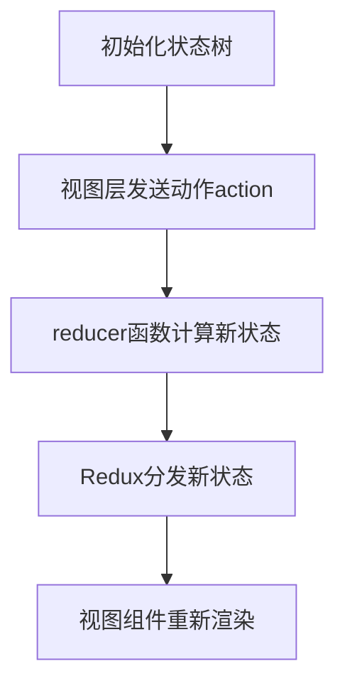

# 状态管理 原理与代码实例讲解

## 1. 背景介绍

### 1.1 问题的由来

在现代前端应用程序开发中,状态管理是一个非常重要的概念。随着应用程序复杂性的增加,有效地管理应用程序的状态变得越来越具有挑战性。传统的方式是将状态存储在组件的内部状态中,但这种方式在大型应用程序中会导致代码重复、难以维护和状态不一致等问题。

为了解决这些问题,状态管理模式应运而生。状态管理模式提供了一种集中式的方式来管理应用程序的状态,使得状态的变化可预测、可跟踪和可调试。它将应用程序的状态与组件解耦,使得状态可以在整个应用程序中共享和更新。

### 1.2 研究现状

目前,有多种流行的状态管理库和模式,如 Redux、MobX、Vuex 等。每种库或模式都有自己的设计理念和实现方式,但它们都遵循一些共同的原则,如单一数据源、不可变状态、纯函数更新等。

Redux 是最早也是最流行的状态管理库之一,它基于函数式编程的理念,使用单一的状态树和纯函数来管理状态。MobX 则采用了响应式编程的方式,通过观察者模式来自动更新相关组件。Vuex 是 Vue.js 官方推荐的状态管理库,它借鉴了 Redux 的设计理念,但做了一些简化和优化。

除了这些成熟的库,还有一些新兴的状态管理模式和库,如 React 的 Context API 和 React Hooks,它们提供了更简洁和灵活的状态管理方式。

### 1.3 研究意义

有效的状态管理对于构建大型、复杂的前端应用程序至关重要。它可以带来以下好处:

1. **可维护性**:将状态与组件解耦,使得代码更加模块化和可重用。
2. **可预测性**:状态的变化遵循严格的规则,使得应用程序的行为更加可预测和易于调试。
3. **可测试性**:由于状态的变化是纯函数,因此更容易编写单元测试。
4. **性能优化**:通过优化状态更新和组件渲染,可以提高应用程序的性能。
5. **团队协作**:统一的状态管理模式有利于团队成员之间的协作和代码共享。

### 1.4 本文结构

本文将全面介绍状态管理的原理和实践。首先,我们将探讨状态管理的核心概念和设计原则。然后,我们将深入研究一些流行的状态管理库和模式,如 Redux、MobX 和 React Hooks,并分析它们的算法原理和实现细节。接下来,我们将通过代码示例和实际项目实践,展示如何在实际应用程序中应用状态管理。最后,我们将讨论状态管理的未来发展趋势和挑战。

## 2. 核心概念与联系

在深入探讨状态管理的具体实现之前,我们需要先了解一些核心概念和设计原则。这些概念和原则是状态管理库和模式的基础,也是理解和应用状态管理的关键。

### 2.1 单一数据源

单一数据源(Single Source of Truth)是状态管理的一个重要原则。它意味着应用程序的整个状态应该存储在一个单一的、不可变的数据结构中,通常是一个对象树。这样做可以确保整个应用程序的状态始终保持一致,避免了状态不一致导致的错误和bug。

### 2.2 不可变状态

不可变状态(Immutable State)是指状态对象在更新时不会直接修改原有对象,而是创建一个新的对象来表示更新后的状态。这种做法可以避免意外的状态变化,同时也方便实现状态的时间旅行功能(如撤销/重做)。

### 2.3 纯函数更新

纯函数更新(Pure Function Updates)是指状态的更新必须通过纯函数来完成。纯函数是指相同的输入总是产生相同的输出,且没有任何副作用。使用纯函数可以确保状态的变化是可预测和可测试的。

### 2.4 单向数据流

单向数据流(Unidirectional Data Flow)是指数据在应用程序中的流动遵循一个单一的方向,通常是从状态管理器到视图层。这种单向数据流可以使应用程序的数据流更加清晰和可预测。

### 2.5 响应式编程

响应式编程(Reactive Programming)是一种编程范式,它允许我们以声明式的方式描述数据流和事件流,并自动响应数据或事件的变化。这种范式在状态管理中也有应用,例如 MobX 就采用了响应式编程的思想。

### 2.6 上下文 API 和 Hooks

上下文 API(Context API)和 Hooks 是 React 提供的一种新的状态管理方式。它们允许我们在组件树中共享状态,而无需通过手动的 prop drilling 来传递状态。这种方式更加简洁和灵活,但也有一些局限性和注意事项。

## 3. 核心算法原理 & 具体操作步骤

在了解了状态管理的核心概念之后,我们将深入探讨一些流行的状态管理库和模式的算法原理和具体实现步骤。

### 3.1 Redux 算法原理概述

Redux 是最流行的状态管理库之一,它基于函数式编程的理念,使用单一的状态树和纯函数来管理状态。Redux 的核心算法原理可以概括为以下几个方面:

1. **单一数据源**: Redux 使用一个单一的对象树来存储整个应用程序的状态。
2. **不可变状态**: Redux 要求状态对象是不可变的,每次状态更新都需要创建一个新的状态对象。
3. **纯函数更新**: Redux 使用纯函数(reducer)来更新状态,reducer 接收当前状态和一个动作(action)作为输入,并返回一个新的状态对象。
4. **单向数据流**: Redux 遵循单向数据流的模式,状态的更新是通过发送动作(action)来触发的,视图层无法直接修改状态。

Redux 的工作流程如下:

1. 初始化状态树。
2. 视图层通过发送动作(action)来描述需要进行的状态更新。
3. reducer 函数根据当前状态和动作计算出新的状态。
4. Redux 将新的状态树分发给订阅的视图组件。
5. 视图组件根据新的状态进行重新渲染。



### 3.2 Redux 算法步骤详解

Redux 算法的具体步骤如下:

1. **创建 Store**

   Store 是Redux中的核心概念,它用于存储应用程序的整个状态树。创建 Store 时需要提供一个reducer函数,用于处理状态更新。

   ```javascript
   import { createStore } from 'redux';
   import rootReducer from './reducers';

   const store = createStore(rootReducer);
   ```

2. **定义 Action**

   Action 是一个普通的 JavaScript 对象,用于描述需要进行的状态更新。Action 对象必须包含一个 `type` 属性,用于标识要执行的操作类型。

   ```javascript
   const addTodoAction = {
     type: 'ADD_TODO',
     payload: 'Buy groceries'
   };
   ```

3. **定义 Reducer**

   Reducer 是一个纯函数,它接收当前状态和一个 Action 作为输入,并返回一个新的状态对象。Reducer 必须是纯函数,不能产生任何副作用。

   ```javascript
   const initialState = [];

   function todoReducer(state = initialState, action) {
     switch (action.type) {
       case 'ADD_TODO':
         return [...state, action.payload];
       default:
         return state;
     }
   }
   ```

4. **分发 Action**

   要更新状态,需要通过 `store.dispatch()` 方法分发一个 Action。Redux 将调用相应的 Reducer 函数来计算新的状态。

   ```javascript
   store.dispatch(addTodoAction);
   ```

5. **订阅状态更新**

   可以使用 `store.subscribe()` 方法订阅状态更新。每当状态发生变化时,订阅的回调函数将被调用。

   ```javascript
   store.subscribe(() => {
     console.log('State updated:', store.getState());
   });
   ```

6. **获取状态**

   可以使用 `store.getState()` 方法获取当前的状态树。

   ```javascript
   const currentState = store.getState();
   ```

### 3.3 Redux 算法优缺点

**优点**:

- 遵循函数式编程原则,状态的变化是可预测和可测试的。
- 单一数据源和单向数据流使得应用程序的数据流更加清晰和易于理解。
- 良好的中间件生态系统,可以扩展 Redux 的功能。
- 时间旅行调试功能,可以方便地查看状态的变化历史。

**缺点**:

- 样板代码较多,需要编写大量的 Action 和 Reducer。
- 对于较小的应用程序,可能会增加不必要的复杂性。
- 不直观的状态更新方式,需要一定的学习成本。
- 对于复杂的状态更新场景,Reducer 函数可能会变得难以维护。

### 3.4 Redux 算法应用领域

Redux 适用于中大型前端应用程序,尤其是那些需要管理复杂状态的应用程序。它在以下领域有广泛的应用:

- 单页应用程序(SPA)
- 服务器端渲染(SSR)
- 原生应用程序(React Native、NativeScript 等)
- 游戏开发
- 实时数据应用程序

除了前端开发,Redux 的设计理念也可以应用于其他领域,如后端服务、桌面应用程序等。

## 4. 数学模型和公式 & 详细讲解 & 举例说明

虽然状态管理更多地涉及编程范式和设计模式,但也存在一些数学模型和公式可以帮助我们更好地理解和优化状态管理算法。

### 4.1 数学模型构建

我们可以将状态管理过程建模为一个有限状态机(Finite State Machine, FSM)。有限状态机是一种数学计算模型,它由一组有限的状态、一组输入事件(Action)和一组状态转移规则组成。

在状态管理的上下文中,我们可以将应用程序的状态看作是有限状态机的状态集合,而 Action 则是触发状态转移的输入事件。Reducer 函数就是定义了状态转移的规则。

形式上,我们可以将状态管理过程建模为一个五元组:

$$
M = (Q, \Sigma, \delta, q_0, F)
$$

其中:

- $Q$ 是有限的状态集合
- $\Sigma$ 是有限的输入事件(Action)集合
- $\delta: Q \times \Sigma \rightarrow Q$ 是状态转移函数(Reducer)
- $q_0 \in Q$ 是初始状态
- $F \subseteq Q$ 是终止状态集合(通常为空集)

在每个时间步长,有限状态机的状态由当前状态和输入事件(Action)共同决定,并通过状态转移函数(Reducer)计算得到新的状态。

### 4.2 公式推导过程

我们可以将状态管理过程建模为一个马尔可夫决策过程(Markov Decision Process, MDP)。MDP 是一种用于描述序列决策问题的数学框架,它由以下几个要素组成:

- 一组有限的状态集合 $S$
- 一组有限的动作集合 $A$
- 一个状态转移概率函数 $P(s' | s, a)$,表示在状态 $s$ 下执行动作 $a$ 后,转移到状态 $s'$ 的概率
- 一个奖励函数 $R(s, a, s')$,表示在状态 $s$ 下执行动作 $a$ 并转移到状态 $s'$ 时获得的奖励

在状态管理的上下文中,我们可以将应用程序的状态看作是 MDP 的状态集合,而 Action 则是动作集合。Reducer 函数就是定义了状态转移的规则,即状态转移概率函数 $P(s' | s, a)$。奖励函数 $R(s, a, s