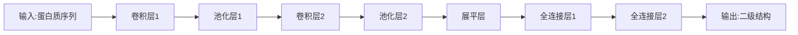

# 生物制药领域的AI创新体系

## 1. 背景介绍

### 1.1 问题的由来

生物制药行业是一个高度复杂、知识密集型的领域,涉及从基础研究到临床试验和上市销售的整个过程。传统的药物研发过程耗时耗力,成本高昂,面临诸多挑战。随着人工智能(AI)技术的不断发展和应用,AI正在为生物制药行业带来革命性的变革。

### 1.2 研究现状

近年来,AI在生物制药领域的应用日益广泛,包括药物发现、分子模拟、临床试验设计、医疗影像分析等多个环节。例如,深度学习算法可用于虚拟筛选潜在药物分子;机器学习模型可优化临床试验设计,提高试验效率;自然语言处理技术可加速文献挖掘和知识提取等。

### 1.3 研究意义

AI赋能生物制药行业具有重要意义:
1. 降低新药研发成本和周期
2. 提高药物发现和开发的成功率
3. 优化临床试验设计和患者招募
4. 加速知识发现和利用

构建完整的AI创新体系,将有助于充分释放AI在生物制药领域的巨大潜力。

### 1.4 本文结构

本文将全面探讨生物制药领域的AI创新体系,包括核心概念、算法原理、数学模型、实践案例、应用场景、发展趋势和挑战等,旨在为读者提供系统的理解和见解。

## 2. 核心概念与联系

生物制药AI创新体系的核心概念包括:

1. **机器学习(ML)**: 使用算法从数据中学习模式,用于药物发现筛选、分子模拟、临床预测等。
2. **深度学习(DL)**: 基于人工神经网络的ML技术,在虚拟药物筛选、生物分子活性预测等方面发挥重要作用。
3. **自然语言处理(NLP)**: 处理和理解自然语言数据,用于文献挖掘、电子病历分析等。
4. **计算机视觉(CV)**: 分析和理解图像和视频数据,在医学影像分析、蛋白质结构预测等领域应用广泛。

这些核心技术相互关联、相辅相成,共同构建了生物制药AI创新体系。例如,NLP可提取文献知识输入ML模型;CV可分析蛋白质结构为DL模型提供数据;ML和DL模型的输出又可应用于药物发现等环节。

## 3. 核心算法原理及具体操作步骤

### 3.1 算法原理概述  

生物制药AI创新体系中的核心算法主要包括:

1. **机器学习算法**:如支持向量机(SVM)、随机森林、梯度提升树等,用于建模和预测。
2. **深度学习算法**:如卷积神经网络(CNN)、循环神经网络(RNN)、生成对抗网络(GAN)等,用于特征提取、模式识别、分子生成等。
3. **自然语言处理算法**:如词嵌入、注意力机制、命名实体识别、关系提取等,用于文本数据处理和知识提取。

这些算法的工作原理大致可分为三个阶段:

1. **数据预处理**:清洗、标准化、特征提取等,将原始数据转换为算法可识别的格式。
2. **模型训练**:使用训练数据集,通过优化目标函数调整模型参数,使之学习到数据中的模式和规律。
3. **模型预测**:将训练好的模型应用于新的数据,对未知样本进行分类、回归或其他任务。

不同算法的具体细节有所差异,但总体上都遵循这一通用框架。

### 3.2 算法步骤详解

以深度学习算法为例,具体操作步骤如下:

1. **数据收集和预处理**
   - 收集分子结构、生物活性、医学影像等相关数据
   - 进行数据清洗、标准化、增强等预处理

2. **模型构建**
   - 选择适当的神经网络架构,如CNN用于分子指纹分析,RNN用于序列数据处理
   - 设计网络层数、神经元数量、激活函数等超参数

3. **模型训练**
   - 将预处理后的数据输入神经网络
   - 使用优化算法(如梯度下降)最小化损失函数,不断调整网络权重
   - 可采用数据增强、正则化等技术提高泛化能力

4. **模型评估**
   - 在保留的测试集上评估模型性能指标,如准确率、AUC等
   - 可视化学习曲线,分析过拟合/欠拟合情况

5. **模型微调**
   - 根据评估结果,调整超参数、网络结构等
   - 重复训练评估,直至达到满意性能

6. **模型部署**
   - 将训练完成的模型集成到生产环境中
   - 持续监控模型性能,根据新数据定期重训练模型

上述步骤是通用的,具体操作时需根据任务类型和数据特征进行调整和优化。

### 3.3 算法优缺点

生物制药AI算法的优缺点如下:

**优点**:

1. 高效处理海量数据,发现隐藏的模式和规律
2. 自动化建模,减少人工参与
3. 可解决复杂的非线性问题
4. 不断自我学习和优化

**缺点**:

1. 需要大量高质量数据进行训练
2. 模型可解释性较差,存在"黑箱"问题
3. 容易过拟合,泛化能力有限
4. 对噪声和异常值敏感
5. 训练计算开销大,需要强大硬件支持

总的来说,AI算法能够极大提高生物制药领域的研发效率,但也面临一些技术挑战有待解决。

### 3.4 算法应用领域

生物制药AI算法在以下领域有广泛应用:

1. **药物发现**
   - 虚拟筛选潜在药物分子
   - 预测分子的生物活性和理化性质
   - 设计和优化分子结构

2. **临床试验**
   - 优化试验设计,提高统计功效
   - 个性化给药,预测患者反应
   - 患者筛选和招募

3. **医学影像**
   - 辅助诊断,如癌症检测
   - 图像分割,如器官和肿瘤分割
   - 影像生成,如合成医学图像数据

4. **生物信息学**
   - 蛋白质结构预测
   - 基因调控网络构建
   - 生物分子相互作用预测

5. **文献挖掘**
   - 从大量文献中提取关键信息
   - 构建知识图谱,发现新知识
   - 加速研究者获取前沿进展

可见,AI已经渗透到生物制药从分子到医院的各个环节,大大提高了研发效率和质量。

## 4. 数学模型和公式及详细讲解

### 4.1 数学模型构建

生物制药AI算法通常基于以下数学模型:

1. **线性模型**
   - 形式: $y = w_1x_1 + w_2x_2 + ... + w_nx_n + b$
   - 应用: логист回归、线性判别分析等

2. **核方法**
   - 形式: $k(x_i, x_j) = \phi(x_i)^T\phi(x_j)$ 
   - 应用: 支持向量机、高斯过程等

3. **决策树**
   - 形式: 递归二分类或回归树
   - 应用: 随机森林、梯度提升树等

4. **神经网络** 
   - 形式: 多层非线性函数组合
   - 应用: 卷积神经网络、循环神经网络等

5. **概率图模型**
   - 形式: 有向/无向概率图
   - 应用: 隐马尔可夫模型、条件随机场等

不同模型适用于不同任务,需要根据具体问题选择合适的模型形式。

### 4.2 公式推导过程

以线性判别分析(LDA)为例,推导其数学公式:

已知数据 $X = \{x_1, x_2, ..., x_n\}$, 其中 $x_i \in \mathbb{R}^p$, 标记 $y_i \in \{0, 1\}$。

LDA试图找到一个超平面 $w^Tx + b = 0$, 将两类样本尽可能分开,即:

$$\max_{w,b}  \frac{|w^T(\mu_1 - \mu_0)|}{  \sqrt{ w^T\Sigma_1 w + w^T\Sigma_0 w  }  }$$

其中 $\mu_c, \Sigma_c$ 为类别 c 的均值向量和协方差矩阵。

通过拉格朗日乘数法,可得:

$$w^* = \Sigma^{-1}(\mu_1 - \mu_0)$$
$$b^* = -\frac{1}{2}(\mu_1 + \mu_0)^T\Sigma^{-1}(\mu_1 - \mu_0)$$

新样本 $x$ 的预测标记为:

$$\hat{y} = \begin{cases} 
      1 & w^{*T}x + b^* \geq 0 \\
      0 & w^{*T}x + b^* < 0
   \end{cases}$$

通过上述公式,LDA能够找到将两类样本最大程度分离的超平面,从而实现分类任务。

### 4.3 案例分析与讲解

**案例1: 使用CNN进行蛋白质二级结构预测**

蛋白质二级结构预测是生物信息学中的一个重要问题。研究人员构建了一个深度卷积神经网络模型,其网络结构如下:

该模型的关键点包括:

1. 使用一维卷积核捕获蛋白质序列模式
2. 最大池化层降低特征维度,提取主要特征
3. 全连接层整合全局信息进行预测

在大规模数据集上训练后,该模型取得了比传统方法更高的二级结构预测准确率,展现了深度学习在该任务上的优势。

**案例2: 使用SMILES语言模型生成新分子结构**

研究人员提出了一种基于SMILES的分子生成模型。SMILES是一种线性符号,可唯一表示分子结构。该模型将分子生成问题视为序列生成任务,使用RNN架构:

$$P(s) = \prod_{t=1}^{T}P(s_t|s_1,...,s_{t-1};\theta)$$

其中 $s$ 为SMILES序列, $\theta$ 为模型参数。

通过最大似然估计,可学习到参数 $\theta$,从而生成新的合法SMILES序列,对应新的分子结构。进一步地,可以引入各种约束(如环境友好度、合成可行性等),生成满足特定条件的分子。

该模型成功生成了多种具有潜在活性的新分子结构,为药物发现提供了新思路。

上述案例展示了深度学习模型在生物制药领域中的实际应用,体现了其强大的建模和预测能力。

### 4.4 常见问题解答  

1. **深度学习模型为什么需要大量数据?**

   深度神经网络具有大量可训练参数,需要足够的数据对这些参数进行有效估计,否则容易出现过拟合。此外,更多的数据也能帮助模型捕获更丰富的模式。

2. **为什么深度学习模型存在"黑箱"问题?**

   神经网络通过多层非线性变换对输入数据进行编码,使得内部特征表示难以解释。此外,网络决策依赖于大量参数的综合作用,缺乏单个参数的直观解释。

3. **如何提高深度学习模型的泛化能力?** 

   可采取的策略包括:数据增强、正则化(L1/L2、Dropout等)、提前终止、集成学习等。此外,合理设计网络结构、优化超参数也能提