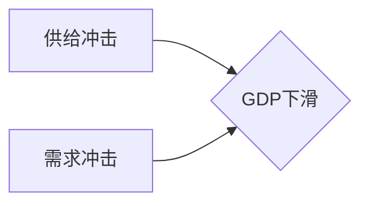
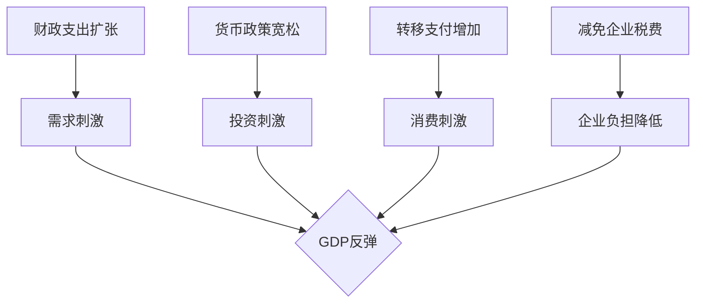

# 疫情冲击后的经济复苏挑战

## 1. 背景介绍

### 1.1 问题的由来

2020年初,新冠肺炎疫情突如其来,给全球经济带来了前所未有的冲击。为了遏制疫情蔓延,各国纷纷采取了封锁、隔离等严格防控措施,导致经济活动几乎陷入停顿。工厂停产、供应链中断、消费需求骤降,造成了大规模裁员和企业破产,整个世界经济遭受重创。

### 1.2 研究现状  

疫情发生两年多以来,各国政府和国际组织都在努力推动经济复苏,出台了大规模财政和货币政策刺激措施。但复苏之路却显得异常艰难,充满了诸多挑战和不确定性。

国际货币基金组织(IMF)在最新的《世界经济展望报告》中警告,2022年全球经济增长将放缓至3.6%,主要是因为俄乌冲突加剧了通胀压力,疫情持续扰乱供应链,以及中国经济放缓等因素。发达经济体和新兴市场经济体的复苏步伐参差不齐。

### 1.3 研究意义

探讨疫情后经济复苏的挑战,对于政策制定者把握经济走势、及时调整政策方向至关重要。对企业而言,也需要清晰认识面临的困难,及时调整经营策略,避免被动应对。同时,这也关乎亿万普通民众的生活质量和就业前景,事关民生福祉。

### 1.4 本文结构  

本文将从多个角度全面分析疫情后经济复苏所面临的主要挑战,包括持续的供给冲击、通胀压力、地缘政治风险、债务水平攀升等。并探讨各国政府、企业和个人应对这些挑战的对策和出路。最后对经济复苏的前景作出展望和判断。

## 2. 核心概念与联系

疫情导致的经济冲击是一场"完美风暴",供给、需求、金融等多个领域同时遭受重创。复苏过程也必将是一个系统工程,涉及宏观经济政策、产业结构调整、科技创新等多方面的综合施策。

概念一:供给冲击
- 封锁限制导致供应链中断
- 劳动力短缺造成生产能力下降
- 企业破产和投资减少加剧供给不足

概念二:需求冲击
- 居民收入下降,消费需求骤减
- 企业预期悲观,投资意愿降低
- 贸易和旅游等行业需求几乎枯竭

概念三:金融冲击
- 企业现金流断裂,债务风险加大
- 银行不良贷款增加,资本充足率下降
- 资产泡沫破裂,金融体系遭遇冲击

这些冲击相互叠加、相互影响,形成了一个复杂的恶性循环,加剧了经济下行压力。要实现全面复苏,需要在各个层面采取综合措施,打破这一恶性循环。

## 3. 核心算法原理 & 具体操作步骤  

### 3.1 算法原理概述

针对疫情冲击后的复杂经济形势,本文提出一种"三轮驱动"的复苏策略算法框架,包括:

1) 短期内实施总需求管理,通过财政和货币政策等手段刺激经济 
2) 中期内推动供给侧结构性改革,优化资源配置,增强经济潜在产出
3) 长期内加大创新投入,培育新动能,推动经济转型升级

该框架将宏观经济政策、供给侧改革和创新驱动三个层面的措施有机结合,形成政策组合拳,协同发力,实现经济平稳复苏。

### 3.2 算法步骤详解

#### 3.2.1 总需求管理

1) 实施积极的财政政策,加大基建等有效投资力度,扩大国内需求
2) 采取适度宽松的货币政策,维持充裕的流动性环境,降低企业融资成本
3) 加强社会保障,提高低收入群体的可支配收入,拉动消费需求
4) 出台减税降费等纾困措施,减轻企业负担,稳定就业岗位

#### 3.2.2 供给侧结构改革

1) 优化产业布局,培育新兴产业,发展现代服务业,提高经济发展质量
2) 深化"放管服"改革,优化营商环境,激发市场主体活力
3) 推进要素市场化配置,提高资源利用效率,增强经济内生动力
4) 加快新型基础设施建设,为产业数字化转型赋能

#### 3.2.3 创新驱动发展

1) 加大基础研究投入,突破关键核心技术,掌握产业发展主导权
2) 完善创新生态,营造有利于创新创业的良好环境
3) 加快新兴技术在传统产业的融合应用,推动产业转型升级
4) 培养创新人才,建设创新型国家和社会

这三个层面的措施环环相扣、相互促进,构成了一个闭环反馈系统,持续为经济复苏注入动力。

```mermaid
graph TB
    A[总需求管理] --> B[扩大有效投资]
    A --> C[维持适度货币宽松]
    A --> D[提高低收入群体收入]
    A --> E[减轻企业负担]
    F[供给侧结构改革] --> G[优化产业布局]
    F --> H[深化"放管服"改革]
    F --> I[推进要素市场化配置]
    F --> J[加快新基建建设]
    K[创新驱动发展] --> L[加大基础研究投入]
    K --> M[完善创新生态]
    K --> N[推动产业数字化转型]
    K --> O[培养创新人才]
    B & C & D & E --> P[需求扩张]
    G & H & I & J --> Q[供给提升]
    L & M & N & O --> R[创新赋能]
    P & Q & R --> S[经济复苏]
    S --> A & F & K
```

### 3.3 算法优缺点

#### 优点:

1) 政策工具组合富有弹性,可根据形势变化灵活调整
2) 着眼长远,注重培育内生增长动力,增强可持续性
3) 体现系统性和协同性,各项措施相互促进形成合力

#### 缺点:  

1) 政策执行的时间跨度较长,短期内效果可能不太明显
2) 需要各部门通力协作,政策协调的难度较大
3) 对政府治理能力要求较高,存在一定执行风险

### 3.4 算法应用领域

该算法框架可为各级政府部门制定经济复苏政策提供理论支撑和决策参考。同时也为企业制定发展战略提供了启示,如:

1) 抓住政策机遇,争取扶持资金,做好技术和产品储备
2) 顺应产业优化调整方向,主动进行战略转型
3) 加大研发投入,培育创新能力,提高核心竞争力

此外,该框架也可为其他遭受重大冲击的经济体提供借鉴,如自然灾害、战争等情况下的经济重建。

## 4. 数学模型和公式 & 详细讲解 & 举例说明

### 4.1 数学模型构建

为了量化分析各项政策对经济复苏的影响程度,我们构建了一个动态随机一般均衡(DSGE)模型。该模型包含家庭部门、企业部门、政府部门和外部部门四个主体,能够较为全面地刻画经济运行过程。

家庭部门的效用函数为:

$$U=E_0\sum_{t=0}^{\infty}\beta^t\left[\frac{(C_t^{1-\sigma})}{1-\sigma}-\chi\frac{(N_t^{1+\varphi})}{1+\varphi}\right]$$

其中,$C_t$为消费,$N_t$为劳动供给量,$\beta$为家庭的主观折现率,$\sigma$为相对风险厌恶系数,$\varphi$为劳动供给的弹性,$\chi$为劳动供给偏好参数。

企业部门生产函数为:

$$Y_t=A_tK_t^\alpha(N_t^d)^{1-\alpha}$$

其中,$Y_t$为产出,$K_t$为资本存量,$N_t^d$为劳动需求量,$A_t$为全要素生产率,$\alpha$为资本份额。

政府部门的财政支出和税收如下:

$$G_t=\tau_tY_t$$
$$T_t=\tau_tY_t+\phi_tB_t$$

其中,$G_t$为政府支出,$\tau_t$为产出税率,$T_t$为总税收,$B_t$为政府债务,$\phi_t$为债务税率。

外部部门的出口和进口函数为:

$$EX_t=\gamma_t(P_t^x/P_t^{*})^\eta Y_t^*$$
$$IM_t=\delta_tY_t$$

其中,$EX_t$为出口,$IM_t$为进口,$P_t^x$为出口品通胀率,$P_t^{*}$为国外通胀率,$\eta$为贸易弹性,$Y_t^*$为国外产出,$\gamma_t$和$\delta_t$分别为出口和进口需求冲击。

上述方程组通过一些恰当的参数设定和外生冲击,可以模拟出疫情对经济的冲击效应,以及各种政策工具对经济复苏的影响程度。

### 4.2 公式推导过程

我们以家庭部门的效用最大化问题为例,推导其消费和劳动供给的最优决策。

家庭面临的预算约束为:

$$C_t+B_{t+1}=W_tN_t+(1+r_t)B_t+\Pi_t$$

其中,$W_t$为实际工资,$r_t$为实际利率,$\Pi_t$为企业利润分红。

将预算约束代入效用函数,构建拉格朗日函数:

$$L=E_0\sum_{t=0}^{\infty}\beta^t\left[\frac{(C_t^{1-\sigma})}{1-\sigma}-\chi\frac{(N_t^{1+\varphi})}{1+\varphi}+\lambda_t(W_tN_t+(1+r_t)B_t+\Pi_t-C_t-B_{t+1})\right]$$

对$C_t,N_t,B_{t+1}$分别求导,得到一阶条件:

$$C_t^{-\sigma}=\lambda_t \qquad (1)$$
$$\chi N_t^\varphi=\lambda_tW_t \qquad (2)$$
$$\lambda_t=\beta E_t[(1+r_{t+1})\lambda_{t+1}] \qquad (3)$$

联立(1)和(2)可解得家庭的消费和劳动供给决策规则。

类似地,我们可以推导出其他主体的最优决策,以及均衡条件,最终得到模型的完整解。

### 4.3 案例分析与讲解

以中国为例,我们使用该DSGE模型对疫情冲击和各项政策措施的影响进行了模拟。

首先,我们设定了一个临时性的供给冲击和需求冲击,模拟了疫情对中国经济的冲击效应。如图所示,实际GDP在疫情初期出现了明显下滑。



为了应对疫情冲击,我们模拟了中国政府采取的一系列政策措施,包括:

1) 财政支出扩张,提高政府支出占GDP的比重
2) 降低存款准备金率和利率水平,实现货币宽松
3) 增加对低收入群体的转移支付,提高居民可支配收入
4) 减免企业社保费用和部分税费,减轻企业负担



模拟结果显示,上述政策组合措施能够有效对冲疫情带来的负面冲击,推动GDP在2021年开始反弹,2022年基本恢复至疫情前水平。

然而,