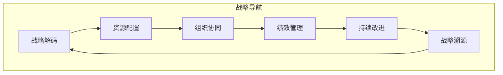

# 督促、跟踪和指导公司科技战略的执行，确保按照战略规划的方向前进，各项计划得到有效的落实

## 1. 背景介绍

### 1.1 问题的由来

在当今瞬息万变的商业环境中，科技已经成为推动企业发展的核心动力。企业必须制定清晰的科技战略,并有效执行,才能保持竞争优势。然而,制定战略规划固然重要,但真正的挑战在于如何确保战略计划得到全面有效的执行。

企业经常面临以下挑战:

- 战略目标过于笼统,缺乏可衡量的关键绩效指标(KPI)
- 各部门、团队之间缺乏协调,导致战略执行效率低下
- 缺乏持续的监控和调整机制,无法及时应对市场变化
- 资源分配不合理,优先级把控不当
- 员工缺乏战略执行的动力和责任心

这些问题如果不能很好地解决,将会严重影响企业的科技创新能力和市场竞争力。

### 1.2 研究现状  

目前,已有一些方法和工具被用于指导和监控企业战略执行,例如:

- 平衡计分卡(Balanced Scorecard)
- 关键绩效指标(KPI)管理
- 项目管理办公自动化(PM Office Automation)
- 企业架构管理(Enterprise Architecture Management)

然而,这些方法和工具大多局限于某些特定领域,缺乏整体的系统性方法论。另一方面,由于企业的业务复杂多变,单一的方法往往难以满足所有需求。

### 1.3 研究意义

建立一套系统的方法论和最佳实践,能够帮助企业高效地执行科技战略规划,具有重要的理论和实践意义:

- 理论意义
  - 系统梳理企业战略执行的关键要素和影响因素
  - 构建科学的分析模型和评估体系
  - 探索战略执行的新理论和新方法
- 实践意义
  - 提高企业战略执行的效率和质量
  - 促进企业加快科技创新步伐
  - 增强企业的竞争力和盈利能力

### 1.4 本文结构

本文将从以下几个方面系统阐述如何有效指导和监控企业科技战略的执行:

- 核心概念和理论基础
- 战略执行的关键环节和影响因素分析
- 构建战略执行的监控体系和评估模型
- 战略执行的实施路径和最佳实践
- 常见问题分析和应对措施
- 未来发展趋势和挑战

## 2. 核心概念与联系

战略执行是一个系统的过程,涉及多个关键概念,这些概念相互关联、环环相扣:

### 2.1 战略规划

战略规划是确定企业长期目标、制定行动计划的过程。科技战略规划是企业整体战略的重要组成部分,明确了企业在科技创新、研发投入、技术路线等方面的发展方向。

### 2.2 战略解码

将战略目标进行分解,转化为可操作的行动计划和项目任务,明确执行主体、资源需求、进度安排、绩效考核等,是战略执行的基础。

### 2.3 资源配置

根据战略重点,对企业的人力、财力、物力等资源进行合理分配,是确保战略执行的前提条件。

### 2.4 组织协同

战略执行需要各部门、团队的紧密协作,打破组织壁垒,形成合力,这对企业的组织架构、流程和文化提出了新的要求。

### 2.5 绩效管理

建立科学的绩效考核体系,设置关键绩效指标(KPI),跟踪监控执行进展,是战略执行的驱动力。

### 2.6 持续改进

根据内外部环境变化,及时调整优化战略执行计划,形成闭环管理,是保证战略执行质量的关键。

### 2.7 战略溯源

定期回顾战略执行情况,分析成功经验和失败教训,为下一轮战略规划提供反馈,实现战略的动态优化。

这些核心概念相互影响、相互作用,构成了战略执行的完整理论框架和生命周期。

## 3. 核心算法原理和具体操作步骤

为了系统地指导和监控企业科技战略的执行,我们提出了"战略导航"(Strategy Navigation)方法,它包括以下几个核心环节:

### 3.1 算法原理概述

"战略导航"方法的核心原理是:

1. 将企业战略目标分解为可执行的行动计划
2. 合理配置资源,明确执行主体和责任
3. 建立组织协同机制,形成合力
4. 设置关键绩效指标,持续监控执行进展
5. 根据反馈,及时优化调整执行计划
6. 总结经验教训,为下轮战略规划提供参考

通过这一闭环过程,企业可以有效推进战略执行,并根据内外部环境变化持续优化,确保战略目标的实现。

### 3.2 算法步骤详解

1. **战略解码**
   - 分解战略目标为可执行的行动计划
   - 制定项目任务书,明确执行主体、时间计划、资源需求等
   - 建立项目组织架构和管理机制

2. **资源配置**  
   - 根据战略重点,合理分配人力、财力、物力等资源
   - 制定资源使用计划和预算控制机制
   - 建立资源动态调配机制,提高资源利用效率

3. **组织协同**
   - 打破组织壁垒,建立跨部门协作机制
   - 明确各方职责分工,规范协作流程
   - 培养协同文化,提高协作意识和能力

4. **绩效管理**
   - 设置关键绩效指标(KPI),与战略目标相挂钩  
   - 建立绩效考核和激励机制
   - 持续跟踪监控执行进展,及时发现偏差

5. **持续改进**
   - 收集内外部反馈,分析执行过程中的问题
   - 及时调整优化执行计划
   - 建立经验知识库,持续总结改进

6. **战略溯源**
   - 定期回顾战略执行情况
   - 分析成功经验和失败教训
   - 为下一轮战略规划提供决策依据

### 3.3 算法优缺点

**优点**:

- 系统性强,覆盖战略执行全生命周期
- 注重组织协同,发挥整体合力
- 强调持续改进,动态优化执行计划
- 形成闭环反馈,促进战略与执行相互促进

**缺点**:  

- 实施复杂度较高,对企业管理能力要求较高
- 需要制定大量的制度流程,增加管理成本
- 短期内难以看到明显效果,需要持之以恒

### 3.4 算法应用领域

"战略导航"方法适用于各类企业推进科技战略的执行,尤其适合于以下情况:

- 企业处于快速发展阶段,战略目标较为宏大
- 涉及多个业务条线,需要多部门紧密协作
- 所处行业技术变革频繁,战略需要持续优化
- 企业内部组织结构复杂,资源整合难度较大

## 4. 数学模型和公式及详细讲解

为了对战略执行效果进行量化评估,我们构建了一个数学模型。该模型将影响战略执行的各个因素进行量化,并计算出一个综合评分,作为战略执行效果的评价指标。

### 4.1 数学模型构建

我们将影响战略执行效果的因素分为6个维度:

- 战略合理性(Strategy Rationality)
- 资源配置(Resource Allocation)  
- 组织协同(Organization Collaboration)
- 绩效管理(Performance Management)
- 持续改进(Continuous Improvement)
- 战略溯源(Strategy Retrospection)

每个维度包含若干具体指标,我们对每个指标进行打分(满分100分),最后计算加权平均分作为该维度的评分。

6个维度的加权平均分即为战略执行综合评分,计算公式如下:

$$
\begin{aligned}
\text{Strategy Execution Score} &= w_1 \times \overline{S} + w_2 \times \overline{R} + w_3 \times \overline{O} + w_4 \times \overline{P} \\
& \quad + w_5 \times \overline{I} + w_6 \times \overline{T}\\
\sum\limits_{i=1}^6 w_i &= 1
\end{aligned}
$$

其中:

- $\overline{S}$ 为战略合理性评分
- $\overline{R}$ 为资源配置评分  
- $\overline{O}$ 为组织协同评分
- $\overline{P}$ 为绩效管理评分
- $\overline{I}$ 为持续改进评分
- $\overline{T}$ 为战略溯源评分
- $w_i$ 为各维度权重,由企业根据实际情况确定

### 4.2 公式推导过程

我们从企业战略执行的关键影响因素出发,构建了一个多维度评价体系,具体推导过程如下:

1. 确定影响战略执行效果的6个关键维度
2. 对每个维度制定若干具体评价指标
3. 对每个指标进行量化打分(满分100分)
4. 计算每个维度的加权平均分
5. 将6个维度的加权平均分相加,得到战略执行综合评分

以战略合理性评分 $\overline{S}$ 为例,计算公式为:

$$
\overline{S} = \sum\limits_{j=1}^{n} w_j^S \cdot s_j
$$

其中:

- $n$ 为战略合理性维度下的指标个数
- $s_j$ 为第j个指标的打分
- $w_j^S$ 为第j个指标的权重,满足 $\sum\limits_{j=1}^{n} w_j^S = 1$

其他维度的评分 $\overline{R}$、$\overline{O}$、$\overline{P}$、$\overline{I}$、$\overline{T}$ 的计算方式类似。

### 4.3 案例分析与讲解  

以一家科技公司的云计算战略执行为例,我们对各个维度进行评分:

1. **战略合理性**
   - 指标1:战略目标的明确性(90分)
   - 指标2:战略目标与企业使命的一致性(85分)  
   - 指标3:战略制定过程的科学性(80分)
   - 权重: $w_1^S=0.4,w_2^S=0.3,w_3^S=0.3$
   - 战略合理性评分 $\overline{S} = 0.4 \times 90 + 0.3 \times 85 + 0.3 \times 80 = 86$

2. **资源配置**
   - ...

3. **组织协同**
   - ...
   
4. **绩效管理**
   - ...
   
5. **持续改进**  
   - ...
   
6. **战略溯源**
   - ...

假设各维度评分和权重如下:

- $\overline{S}=86, \overline{R}=78, \overline{O}=82, \overline{P}=90, \overline{I}=75, \overline{T}=88$
- $w_1=0.2, w_2=0.25, w_3=0.15, w_4=0.2, w_5=0.1, w_6=0.1$

则战略执行综合评分为:

$$
\begin{aligned}
\text{Strategy Execution Score} &= 0.2 \times 86 + 0.25 \times 78 + 0.15 \times 82 + 0.2 \times 90\\
                      &\quad + 0.1 \times 75 + 0.1 \times 88\\
                      &= 83.9
\end{aligned}
$$

根据这个分数,我们可以判断该公司的云计算战略执行效果较好,但在资源配置和持续改进方面还有提升空间。

### 4.4 常见问题解答

**1. 如何确定各维度和指标的权重?**

权重的设置需要结合企业的实际情况,