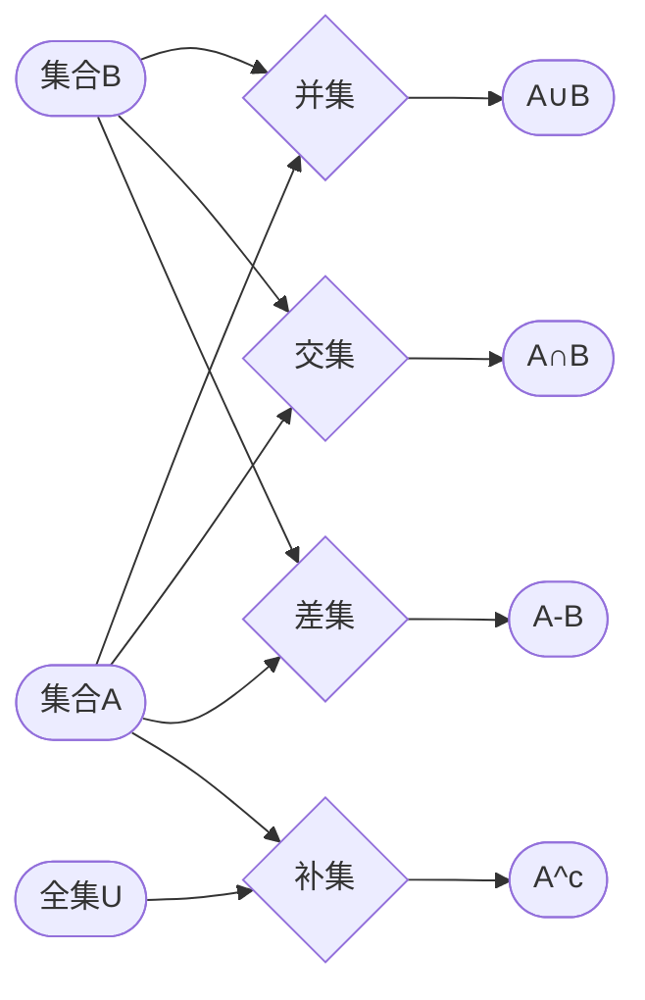

# 线性代数导引：集合论基础

## 1. 背景介绍

### 1.1 问题的由来

线性代数作为数学的一个重要分支，广泛应用于科学和工程的各个领域。从求解线性方程组到向量空间的分析，线性代数为我们提供了解决复杂问题强有力的工具。然而，在深入学习线性代数之前，透彻理解其基础至关重要，而集合论正是构成这一基础的基石。

集合论，顾名思义，是研究集合的数学分支。集合是数学中的一个基本概念，它指的是一些确定的、不同的对象的全体。这些对象可以是任何东西，例如数字、字母、人、动物等等。集合论为我们提供了一种精确的语言来描述和操作这些对象，从而为线性代数的学习奠定坚实的基础。

### 1.2 研究现状

集合论作为数学的基础理论，已经发展得非常成熟。从康托尔创立集合论至今，已经涌现出许多重要的概念和定理，例如集合的运算、映射、关系、基数、序数等等。这些概念和定理构成了现代数学的基石，被广泛应用于各个数学分支。

### 1.3 研究意义

学习集合论对于学习线性代数以及其他数学分支都具有重要的意义。具体来说，学习集合论可以帮助我们：

* **建立数学思维**: 集合论的学习可以帮助我们建立起严谨的数学思维，培养逻辑推理和抽象思维能力。
* **理解数学语言**: 集合论为我们提供了一种精确的数学语言，可以帮助我们更准确地理解和表达数学概念。
* **为学习其他数学分支奠定基础**: 集合论是许多数学分支的基础，例如代数、拓扑、分析等等。

### 1.4 本文结构

本文将从集合论的基本概念出发，逐步深入地介绍集合论的核心内容，并结合线性代数的例子，阐述集合论在其中的应用。本文主要内容包括：

* 集合的概念和表示
* 集合的运算
* 映射和函数
* 关系
* 基数

## 2. 核心概念与联系

### 2.1 集合的概念

**定义:**  一个集合是由一些确定的、不同的对象的全体构成的。

**例子:**

* 自然数集: N = {1, 2, 3, ...}
* 英文字母集: A = {a, b, c, ..., z}
* 空集: Ø = {}

**集合的表示方法:**

* 列举法:  将集合中的所有元素一一列举出来，用逗号隔开，并用大括号括起来。例如：A = {1, 2, 3}。
* 描述法:  用描述性的语言描述集合中元素的特征。例如：B = {x | x 是偶数}。

### 2.2 集合之间的关系

**子集:**  如果集合 A 的所有元素都是集合 B 的元素，则称 A 是 B 的子集，记作 A ⊆ B。

**真子集:**  如果 A ⊆ B，且 A ≠ B，则称 A 是 B 的真子集，记作 A ⊂ B。

**集合相等:**  如果集合 A 和集合 B 的元素完全相同，则称集合 A 与集合 B 相等，记作 A = B。

**并集:**  由所有属于集合 A 或属于集合 B 的元素所组成的集合，称为集合 A 与集合 B 的并集，记作 A ∪ B。

**交集:**  由所有既属于集合 A 又属于集合 B 的元素所组成的集合，称为集合 A 与集合 B 的交集，记作 A ∩ B。

**差集:**  由所有属于集合 A 但不属于集合 B 的元素所组成的集合，称为集合 A 与集合 B 的差集，记作 A - B。

**补集:**  设 U 为全集，A ⊆ U，则集合 U - A 称为集合 A 在全集 U 中的补集，记作 A^c。

### 2.3 映射和函数

**映射:**  设 A，B 是两个非空集合，如果按照某种对应法则 f，对于集合 A 中的每一个元素 x，在集合 B 中都有唯一的元素 y 与之对应，则称 f 是从 A 到 B 的一个映射，记作 f: A → B。

**函数:**  函数是一种特殊的映射，它要求对于集合 A 中的每一个元素 x，在集合 B 中都有唯一的元素 y 与之对应，并且这个 y 值只与 x 有关，而与其他的元素无关。

### 2.4 关系

**关系:**  设 A，B 是两个集合，A × B 的任意子集 R 称为从 A 到 B 的一个二元关系，简称关系。

**等价关系:**  如果关系 R 满足自反性、对称性和传递性，则称 R 为等价关系。

**偏序关系:**  如果关系 R 满足自反性、反对称性和传递性，则称 R 为偏序关系。

### 2.5 基数

**基数:**  集合中元素的个数称为集合的基数，记作 |A|。

**可数集:**  如果一个集合的元素可以与自然数集 N 建立一一对应关系，则称该集合为可数集。

**不可数集:**  如果一个集合不是可数集，则称该集合为不可数集。

## 3. 核心算法原理 & 具体操作步骤

### 3.1 集合运算的算法原理

集合的运算可以通过以下算法实现:

* **并集:**  遍历集合 A 和集合 B 中的所有元素，将所有不重复的元素添加到新的集合中。
* **交集:**  遍历集合 A 中的所有元素，判断该元素是否在集合 B 中，如果在，则将该元素添加到新的集合中。
* **差集:**  遍历集合 A 中的所有元素，判断该元素是否在集合 B 中，如果不在，则将该元素添加到新的集合中。
* **补集:**  遍历全集 U 中的所有元素，判断该元素是否在集合 A 中，如果不在，则将该元素添加到新的集合中。

### 3.2 集合运算的Mermaid流程图




### 3.3 算法优缺点

* 优点:  算法简单易懂，容易实现。
* 缺点:  当集合中元素数量较多时，算法效率较低。

### 3.4 算法应用领域

集合运算在计算机科学中有着广泛的应用，例如数据库查询、数据挖掘、人工智能等等。

## 4. 数学模型和公式 & 详细讲解 & 举例说明

### 4.1 集合的基数公式

* 对于有限集合 A，其基数 |A| 等于集合中元素的个数。
* 对于无限集合，其基数无法用有限的数来表示，需要用到超限数的概念。

### 4.2 集合运算的公式

* **并集:**  |A ∪ B| = |A| + |B| - |A ∩ B|
* **交集:**  |A ∩ B| = |A| + |B| - |A ∪ B|
* **差集:**  |A - B| = |A| - |A ∩ B|
* **补集:**  |A^c| = |U| - |A|

### 4.3 案例分析与讲解

**案例:**  设 A = {1, 2, 3}，B = {2, 3, 4}，求 A ∪ B，A ∩ B，A - B，A^c (U = {1, 2, 3, 4, 5})。

**解答:**

* A ∪ B = {1, 2, 3, 4}
* A ∩ B = {2, 3}
* A - B = {1}
* A^c = {4, 5}

**分析:**

* A ∪ B 包含了 A 和 B 中的所有元素，且不重复。
* A ∩ B 包含了 A 和 B 中的公共元素。
* A - B 包含了 A 中除去与 B 相同元素之外的元素。
* A^c 包含了全集 U 中除去 A 中元素之外的元素。

### 4.4 常见问题解答

**问题 1:**  空集的基数是多少？

**答案:**  空集的基数为 0，因为空集中没有元素。

**问题 2:**  如何判断两个集合是否相等？

**答案:**  如果两个集合的元素完全相同，则这两个集合相等。可以使用以下方法判断:

* 列举法:  将两个集合的元素一一列举出来，判断是否相同。
* 描述法:  判断两个集合的描述是否等价。

## 5. 项目实践：代码实例和详细解释说明

### 5.1 Python 集合操作

```python
# 创建集合
A = {1, 2, 3}
B = {2, 3, 4}

# 并集
C = A | B
print(f"A ∪ B = {C}")

# 交集
D = A & B
print(f"A ∩ B = {D}")

# 差集
E = A - B
print(f"A - B = {E}")

# 补集 (需要定义全集)
U = {1, 2, 3, 4, 5}
F = U - A
print(f"A^c = {F}")

# 判断子集
print(f"A 是否为 B 的子集: {A.issubset(B)}")
```

### 5.2 代码解读与分析

* Python 中使用大括号 `{}` 来表示集合。
* 使用 `|`  表示并集，`&` 表示交集，`-` 表示差集。
* 使用 `issubset()` 方法判断一个集合是否为另一个集合的子集。

### 5.3 运行结果展示

```
A ∪ B = {1, 2, 3, 4}
A ∩ B = {2, 3}
A - B = {1}
A^c = {4, 5}
A 是否为 B 的子集: False
```

## 6. 实际应用场景

### 6.1 数据库查询

在数据库中，可以使用集合运算来进行复杂的查询操作。例如，可以使用交集运算查询同时满足多个条件的记录。

### 6.2 数据挖掘

在数据挖掘中，可以使用集合运算来进行数据清洗、特征提取等操作。例如，可以使用并集运算合并多个数据源的数据。

### 6.3 人工智能

在人工智能中，可以使用集合运算来进行知识表示、推理等操作。例如，可以使用集合来表示概念之间的关系。

### 6.4 未来应用展望

随着大数据和人工智能的快速发展，集合论将在更多领域发挥重要作用。例如，在机器学习中，可以使用集合论来构建更加高效的算法。

## 7. 工具和资源推荐

### 7.1 学习资源推荐

* 《离散数学及其应用》 (Discrete Mathematics and Its Applications) by Kenneth H. Rosen
* 《集合论与逻辑》 (Set Theory and Logic) by Robert R. Stoll

### 7.2 开发工具推荐

* Python:  Python 是一种易于学习和使用的编程语言，拥有丰富的第三方库，可以方便地进行集合操作。
* Jupyter Notebook:  Jupyter Notebook 是一种交互式编程环境，可以方便地进行代码编写、调试和可视化。

### 7.3 相关论文推荐

* Cantor, G. (1874). Ueber eine Eigenschaft des Inbegriffes aller reellen algebraischen Zahlen. Journal für die reine und angewandte Mathematik, 77, 258-262.
* Zermelo, E. (1908). Untersuchungen über die Grundlagen der Mengenlehre I. Mathematische Annalen, 65(2), 261-281.

### 7.4 其他资源推荐

* Khan Academy:  Khan Academy 提供免费的在线课程，涵盖了从基础数学到高等数学的各个方面，其中包括集合论的课程。
* Wolfram MathWorld:  Wolfram MathWorld 是一个 comprehensive 的数学百科全书，其中包含了大量关于集合论的定义、定理和例子。

## 8. 总结：未来发展趋势与挑战

### 8.1 研究成果总结

本文介绍了集合论的基本概念、运算、映射、关系和基数，并结合线性代数的例子，阐述了集合论在其中的应用。

### 8.2 未来发展趋势

随着大数据和人工智能的快速发展，集合论将在更多领域发挥重要作用。例如，在机器学习中，可以使用集合论来构建更加高效的算法。

### 8.3 面临的挑战

* 如何将集合论应用于更加复杂的实际问题。
* 如何开发更加高效的集合运算算法。

### 8.4 研究展望

未来，集合论的研究将更加注重应用，并与其他学科进行交叉融合，例如计算机科学、人工智能、数据科学等等。

## 9. 附录：常见问题与解答

**问题 1:**  空集是任何集合的子集吗？

**答案:**  是的，空集是任何集合的子集。

**问题 2:**  如何证明一个集合是可数集？

**答案:**  要证明一个集合是可数集，需要找到一个从该集合到自然数集 N 的一一对应关系。

**问题 3:**  如何证明一个集合是不可数集？

**答案:**  可以使用反证法证明一个集合是不可数集。假设该集合是可数集，然后推导出矛盾。

## 作者：禅与计算机程序设计艺术 / Zen and the Art of Computer Programming 
