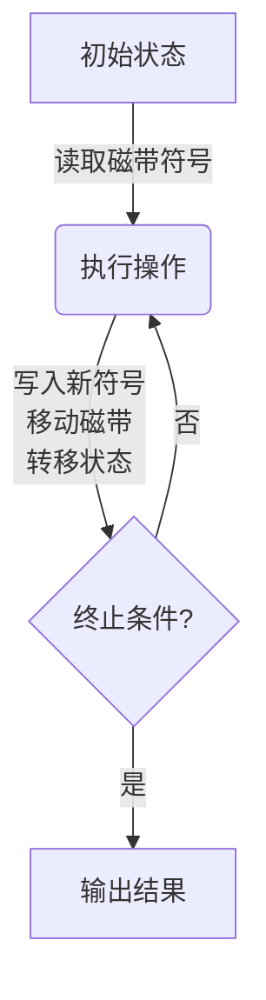

计算：第三部分 计算理论的形成 第8章 计算理论的诞生：图灵的可计算数 图灵的命运

## 1. 背景介绍

### 1.1 问题的由来
在20世纪初期,数学家和逻辑学家对于"什么是可计算的"这个问题产生了浓厚的兴趣。当时,人们已经意识到某些数学问题是无法被解决的,例如著名的"停机问题"。然而,没有一个明确的标准来判断一个给定的问题是否可计算。

### 1.2 研究现状 
在1930年代之前,数学家们提出了几种不同的方法来定义可计算性,例如递归函数理论和λ演算。然而,这些方法都存在一些缺陷和局限性,无法完全捕捉可计算性的本质。

### 1.3 研究意义
确立一个明确的可计算性定义对于理解计算机科学的基础至关重要。它不仅有助于区分可解决和不可解决的问题,还能为设计和分析算法提供理论基础。

### 1.4 本文结构
本文将首先介绍图灵机的概念及其与可计算性的关系。然后,我们将探讨图灵对可计算理论的贡献,以及他的著名论文"论可计算数"的内容和影响。最后,我们将讨论图灵的命运及其对计算机科学发展的影响。

## 2. 核心概念与联系

图灵机是一种抽象的计算模型,由阿伦·图灵在1936年提出。它由一个无限长的磁带和一个读写头组成,可以执行一系列预定义的规则来操作磁带上的符号。图灵证明了,任何可计算的函数都可以由图灵机计算出来,从而为可计算性提供了一个精确的数学定义。

图灵机的概念与可计算性密切相关。事实上,图灵机模型被认为是等价于其他可计算性定义,如递归函数理论和λ演算。这种等价性被称为"图灵机等价性论题",它为计算理论奠定了坚实的基础。

## 3. 核心算法原理 & 具体操作步骤

### 3.1 算法原理概述

图灵机的工作原理可以概括为以下几个步骤:

1. 初始状态:图灵机处于一个特定的初始状态,磁带上包含输入数据。
2. 读取和转移:根据当前状态和磁带上的符号,图灵机会执行一个预定义的操作,包括读取磁带上的符号、写入新的符号、移动磁带位置以及转移到新的状态。
3. 重复执行:图灵机会不断重复执行步骤2,直到达到某个特定的终止状态。
4. 输出结果:终止状态下,磁带上的内容即为计算结果。

### 3.2 算法步骤详解

1. **初始状态**

   在开始计算之前,图灵机处于一个特定的初始状态,磁带上包含输入数据。例如,如果我们要计算一个函数 $f(x) = x + 1$,初始状态可以设置为 $q_0$,磁带上的输入为一个二进制数 $x$。

2. **读取和转移**

   图灵机会根据当前状态和磁带上的符号执行一个预定义的操作。这个操作包括以下几个步骤:

   a. 读取磁带上的符号
   b. 根据当前状态和读取的符号,执行以下操作之一:
      - 写入一个新的符号到磁带上
      - 移动磁带位置(向左或向右)
      - 转移到一个新的状态
   
   这些操作由一个转移函数 $\delta$ 定义,它将当前状态和读取的符号映射到一个新的状态、写入的符号和磁带移动方向。

   $$\delta: Q \times \Gamma \rightarrow Q \times \Gamma \times \{L, R\}$$

   其中,
   - $Q$ 是图灵机的状态集合
   - $\Gamma$ 是磁带上的符号集合,包括输入符号和特殊的空白符号 $\square$
   - $L$ 表示向左移动磁带
   - $R$ 表示向右移动磁带

3. **重复执行**

   图灵机会不断重复执行步骤2,直到达到某个特定的终止状态。终止状态是一个特殊的状态,表示计算已经完成。

4. **输出结果**

   当图灵机达到终止状态时,磁带上的内容即为计算结果。例如,对于函数 $f(x) = x + 1$,如果输入是二进制数 $x = 101$,终止状态下磁带上的内容应该是 $110$,即 $x + 1$ 的结果。

### 3.3 算法优缺点

**优点:**

- 图灵机提供了一个精确的数学定义来描述可计算性,为计算理论奠定了坚实的基础。
- 图灵机模型简单而通用,能够模拟任何可计算的函数,包括最复杂的算法。
- 图灵机的概念直观且易于理解,有助于人们认识计算的本质。

**缺点:**

- 图灵机是一个理论模型,无法直接实现在实际的计算机系统中。
- 图灵机的计算过程可能需要无限长的磁带和无限的时间,这在实际应用中是不可行的。
- 图灵机只能处理离散的符号,无法直接处理连续的数据,如声音和图像。

### 3.4 算法应用领域

尽管图灵机本身是一个理论模型,但它的概念和原理在计算机科学的许多领域都有应用:

- **计算复杂性理论:** 图灵机模型为研究算法的时间和空间复杂度提供了理论基础。
- **形式语言和自动机理论:** 图灵机是最强大的自动机模型,可以识别和生成任何形式语言。
- **可计算性理论:** 图灵机定义了可计算性的边界,有助于区分可解决和不可解决的问题。
- **编程语言理论:** 图灵机的概念为设计和分析编程语言提供了指导。
- **密码学:** 图灵机模型可用于研究密码系统的安全性和可计算性。

## 4. 数学模型和公式 & 详细讲解 & 举例说明

### 4.1 数学模型构建

为了精确地描述图灵机的工作原理,我们需要构建一个数学模型。一个图灵机 $M$ 可以用一个七元组表示:

$$M = (Q, \Gamma, b, \Sigma, \delta, q_0, F)$$

其中:

- $Q$ 是一个有限的状态集合
- $\Gamma$ 是磁带上的符号集合,包括输入符号和特殊的空白符号 $\square$
- $b \in \Gamma - \Sigma$ 是磁带的空白符号
- $\Sigma \subseteq \Gamma$ 是输入符号的集合
- $\delta: Q \times \Gamma \rightarrow Q \times \Gamma \times \{L, R\}$ 是转移函数
- $q_0 \in Q$ 是初始状态
- $F \subseteq Q$ 是终止状态的集合

转移函数 $\delta$ 定义了图灵机在每一步的操作,它将当前状态和读取的符号映射到一个新的状态、写入的符号和磁带移动方向。

### 4.2 公式推导过程

我们可以用数学归纳法来证明图灵机的计算过程是确定的,即对于任何给定的输入,图灵机要么进入终止状态,要么进入循环状态。

假设在时间 $t=0$ 时,图灵机处于初始状态 $q_0$,磁带上的内容为输入字符串 $w$。我们定义 $C_t$ 为时间 $t$ 时图灵机的配置,即 $(q_t, \alpha_t, i_t, \beta_t)$,其中:

- $q_t \in Q$ 是当前状态
- $\alpha_t \in \Gamma^*$ 是磁带左侧的字符串
- $i_t \in \mathbb{N}$ 是读写头的位置
- $\beta_t \in \Gamma^*$ 是磁带右侧的字符串

那么,初始配置为 $C_0 = (q_0, \square, 0, w)$。

我们可以证明,对于任何时间 $t \geq 0$,如果 $C_t$ 是一个非终止配置,那么存在一个唯一的配置 $C_{t+1}$,使得 $\delta(C_t) = C_{t+1}$。

**基础步骤:** 对于 $t=0$,由于 $C_0$ 是初始配置,根据转移函数 $\delta$,存在一个唯一的配置 $C_1$,使得 $\delta(C_0) = C_1$。

**归纳步骤:** 假设对于某个时间 $t \geq 0$,如果 $C_t$ 是一个非终止配置,那么存在一个唯一的配置 $C_{t+1}$,使得 $\delta(C_t) = C_{t+1}$。

现在考虑时间 $t+1$,如果 $C_{t+1}$ 是一个非终止配置,那么根据转移函数 $\delta$,存在一个唯一的配置 $C_{t+2}$,使得 $\delta(C_{t+1}) = C_{t+2}$。

由归纳原理,对于任何时间 $t \geq 0$,如果 $C_t$ 是一个非终止配置,那么存在一个唯一的配置 $C_{t+1}$,使得 $\delta(C_t) = C_{t+1}$。

因此,图灵机的计算过程是确定的,要么进入终止状态,要么进入循环状态。

### 4.3 案例分析与讲解

为了更好地理解图灵机的工作原理,让我们来分析一个具体的例子。假设我们要计算函数 $f(x) = x + 1$,其中 $x$ 是一个二进制数。

我们可以构建一个图灵机 $M = (Q, \Gamma, b, \Sigma, \delta, q_0, F)$,其中:

- $Q = \{q_0, q_1, q_2, q_3, q_4\}$
- $\Gamma = \{0, 1, \square\}$
- $b = \square$
- $\Sigma = \{0, 1\}$
- $\delta$ 定义如下:
  - $\delta(q_0, 0) = (q_1, 0, R)$
  - $\delta(q_0, 1) = (q_1, 1, R)$
  - $\delta(q_1, \square) = (q_2, 1, L)$
  - $\delta(q_2, 0) = (q_2, 0, L)$
  - $\delta(q_2, 1) = (q_2, 1, L)$
  - $\delta(q_2, \square) = (q_3, \square, R)$
  - $\delta(q_3, 0) = (q_4, 0, R)$
  - $\delta(q_3, 1) = (q_4, 1, R)$
- $q_0$ 是初始状态
- $F = \{q_4\}$ 是终止状态的集合

现在,让我们来计算 $f(101) = 110$。初始配置为 $C_0 = (q_0, \square, 0, 101)$。

1. 从初始状态 $q_0$ 开始,读取第一个符号 $1$,转移到状态 $q_1$,写入 $1$,移动到右边。
   配置变为 $C_1 = (q_1, \square, 1, 01)$。

2. 在状态 $q_1$ 下,读取第二个符号 $0$,保持状态 $q_1$,写入 $0$,移动到右边。
   配置变为 $C_2 = (q_1, \square, 2, 1)$。

3. 在状态 $q_1$ 下,读取空白符号 $\square$,转移到状态 $q_2$,写入 $1$,移动到左边。
   配置变为 $C_3 = (q_2, \square, 1, 1)$。

4. 在状态 $q_2$ 下,读取第二个符号 $1$,保持状态 $q_2$,写入 $1$,移动到左边。
   配置变为 $C_4