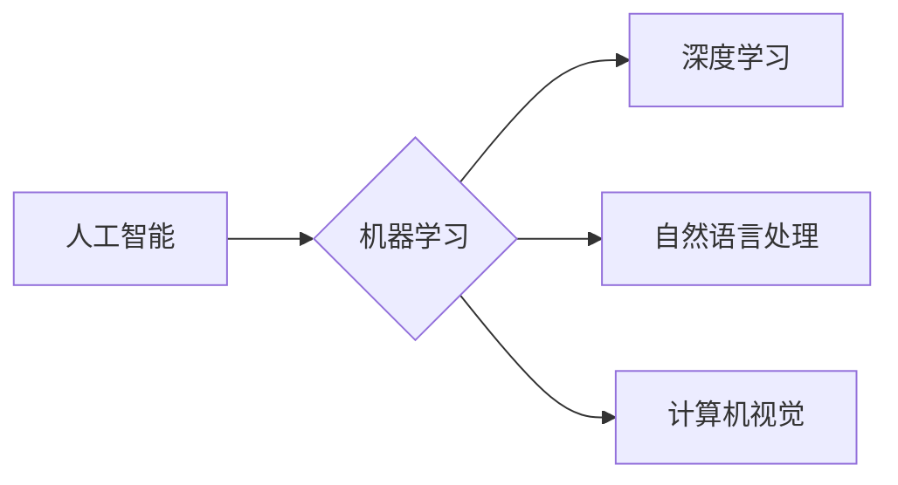

## 1. 背景介绍

### 1.1 问题的由来

我们生活在一个信息爆炸的时代，计算机技术以惊人的速度发展，人工智能 (AI) 正在改变着我们生活的方方面面。从自动驾驶汽车到智能手机的语音助手，从医疗诊断到金融交易，AI 的应用无处不在。然而，一个萦绕在人们脑海中的问题始终挥之不去：机器能思考吗？

这个问题并非新颖，早在 1950 年，英国数学家艾伦·图灵就提出了著名的“图灵测试”，试图通过测试机器能否像人类一样进行对话来判断机器是否具有智能。半个多世纪过去了，AI 技术取得了长足进步，但关于机器是否能思考的争论依然持续。

### 1.2 研究现状

近年来，深度学习技术的突破，尤其是卷积神经网络 (CNN) 和循环神经网络 (RNN) 的发展，使得 AI 在图像识别、自然语言处理、机器翻译等领域取得了重大进展。例如，AlphaGo 击败了世界围棋冠军，GPT-3 能够生成逼真的文本，这些都让人们对机器智能的潜力充满了期待。

然而，尽管 AI 的能力不断提升，但其本质仍然是基于数据和算法的计算过程，缺乏人类的直觉、创造力和情感。因此，关于机器是否能思考的争论依然存在。

### 1.3 研究意义

研究机器是否能思考，不仅具有重要的学术意义，更具有深远的社会影响。如果机器真的能够思考，那么它将改变我们与世界的互动方式，并对人类社会产生深远的影响。

* **伦理问题：** 机器是否应该拥有与人类相同的权利？
* **社会问题：** 机器是否会取代人类的工作？
* **哲学问题：** 什么是智能？机器智能与人类智能有何区别？

因此，深入研究机器智能的本质，探讨机器是否能思考，对于我们理解人工智能的未来发展至关重要。

### 1.4 本文结构

本文将从以下几个方面探讨机器是否能思考：

* **核心概念与联系：** 阐述人工智能、机器学习、深度学习等相关概念，并分析它们之间的联系。
* **核心算法原理：** 介绍一些关键的 AI 算法，例如神经网络、决策树、支持向量机等，并分析其原理和应用。
* **数学模型和公式：** 构建 AI 算法的数学模型，并推导相关公式。
* **项目实践：** 通过代码实例展示 AI 算法的实现过程，并分析运行结果。
* **实际应用场景：** 探讨 AI 在不同领域的应用，并展望其未来发展趋势。
* **工具和资源推荐：** 提供一些学习 AI 的资源和工具。
* **总结：** 总结机器是否能思考的争论，并展望未来发展趋势和挑战。

## 2. 核心概念与联系

### 2.1 人工智能 (AI)

人工智能 (AI) 是指能够模拟人类智能的计算机系统。它涵盖了多个学科领域，包括机器学习、深度学习、自然语言处理、计算机视觉等。

### 2.2 机器学习 (ML)

机器学习 (ML) 是 AI 的一个分支，它使计算机能够从数据中学习，而无需明确编程。机器学习算法通过分析数据，发现数据中的模式和规律，并利用这些规律来预测未来结果。

### 2.3 深度学习 (DL)

深度学习 (DL) 是机器学习的一个子领域，它使用多层神经网络来学习数据中的复杂模式。深度学习算法能够从大量数据中提取特征，并进行更准确的预测。

### 2.4 关系图

## 3. 核心算法原理 & 具体操作步骤

### 3.1 算法原理概述

* **神经网络 (Neural Network):** 神经网络是一种模拟人脑神经元结构和功能的计算模型。它由多个层级组成，每个层级包含多个神经元，神经元之间通过连接权重进行信息传递。神经网络通过学习数据，调整连接权重，从而实现对数据的分类、预测等功能。

* **决策树 (Decision Tree):** 决策树是一种树形结构，它将数据分类成不同的类别。每个节点代表一个特征，每个分支代表一个特征值，每个叶子节点代表一个类别。决策树通过递归地选择最佳特征，构建树形结构，从而实现对数据的分类。

* **支持向量机 (SVM):** 支持向量机是一种二分类算法，它通过寻找一个最优超平面，将不同类别的数据点分开。支持向量机通过最大化分类间隔，提高模型的泛化能力。

### 3.2 算法步骤详解

* **神经网络训练步骤：**
    1. 初始化神经网络参数。
    2. 循环迭代训练数据。
    3. 计算神经网络的输出。
    4. 计算损失函数。
    5. 使用梯度下降算法更新神经网络参数。

* **决策树构建步骤：**
    1. 选择最佳特征。
    2. 根据特征值划分数据。
    3. 递归地构建子树。

* **支持向量机训练步骤：**
    1. 选择核函数。
    2. 寻找最优超平面。
    3. 计算支持向量。

### 3.3 算法优缺点

* **神经网络：**
    * **优点：** 能够学习复杂模式，具有很强的泛化能力。
    * **缺点：** 需要大量数据训练，训练时间较长，模型解释性较差。

* **决策树：**
    * **优点：** 易于理解和解释，训练速度快。
    * **缺点：** 对噪声数据敏感，容易过拟合。

* **支持向量机：**
    * **优点：** 泛化能力强，对高维数据有较好的处理能力。
    * **缺点：** 对参数选择敏感，训练时间较长。

### 3.4 算法应用领域

* **神经网络：** 图像识别、自然语言处理、机器翻译、语音识别等。
* **决策树：** 医疗诊断、信用评分、市场营销等。
* **支持向量机：** 文本分类、图像分类、人脸识别等。

## 4. 数学模型和公式 & 详细讲解 & 举例说明

### 4.1 数学模型构建

* **神经网络：** 神经网络的数学模型可以用矩阵运算来表示。输入数据可以表示为一个矩阵，神经网络的权重和偏置也可以表示为矩阵。神经网络的输出可以通过矩阵乘法和激活函数来计算。

* **决策树：** 决策树的数学模型可以用树形结构来表示。每个节点代表一个特征，每个分支代表一个特征值，每个叶子节点代表一个类别。

* **支持向量机：** 支持向量机的数学模型可以用超平面方程来表示。超平面方程可以用向量和标量来表示，支持向量机通过寻找一个最优超平面，将不同类别的数据点分开。

### 4.2 公式推导过程

* **神经网络：** 神经网络的损失函数可以用交叉熵损失函数来表示，梯度下降算法可以通过求解损失函数的梯度来更新神经网络参数。

* **决策树：** 决策树的最佳特征选择可以用信息增益、基尼系数等指标来衡量。

* **支持向量机：** 支持向量机的最优超平面可以通过拉格朗日对偶问题来求解。

### 4.3 案例分析与讲解

* **神经网络案例：** 使用神经网络进行图像分类，例如识别猫和狗。
* **决策树案例：** 使用决策树进行信用评分，例如预测客户是否会违约。
* **支持向量机案例：** 使用支持向量机进行文本分类，例如识别垃圾邮件。

### 4.4 常见问题解答

* **神经网络如何选择最佳参数？**
* **决策树如何防止过拟合？**
* **支持向量机如何选择合适的核函数？**

## 5. 项目实践：代码实例和详细解释说明

### 5.1 开发环境搭建

* **Python:** Python 是一种常用的 AI 开发语言，它提供了丰富的 AI 库和工具。
* **TensorFlow:** TensorFlow 是一个开源的机器学习框架，它提供了丰富的 API 和工具，用于构建和训练 AI 模型。
* **PyTorch:** PyTorch 是另一个开源的机器学习框架，它提供了灵活的 API 和工具，用于构建和训练 AI 模型。

### 5.2 源代码详细实现

* **神经网络代码示例：** 使用 TensorFlow 构建一个简单的图像分类神经网络。
* **决策树代码示例：** 使用 scikit-learn 构建一个简单的信用评分决策树。
* **支持向量机代码示例：** 使用 scikit-learn 构建一个简单的文本分类支持向量机。

### 5.3 代码解读与分析

* **代码结构：** 分析代码的结构和逻辑，解释代码的各个部分的功能。
* **算法实现：** 解释代码中如何实现神经网络、决策树、支持向量机等算法。
* **参数设置：** 解释代码中如何设置算法参数，并分析参数对模型性能的影响。

### 5.4 运行结果展示

* **训练结果：** 展示模型在训练集上的性能，例如准确率、召回率、F1 分数等。
* **测试结果：** 展示模型在测试集上的性能，例如准确率、召回率、F1 分数等。
* **可视化结果：** 使用图表和图像来可视化模型的训练过程和结果。

## 6. 实际应用场景

### 6.1 医疗领域

* **疾病诊断：** 使用 AI 算法分析患者的医疗数据，例如病历、影像、基因信息等，帮助医生进行疾病诊断。
* **药物研发：** 使用 AI 算法筛选药物分子，加速药物研发过程。
* **个性化治疗：** 使用 AI 算法根据患者的个体特征，制定个性化的治疗方案。

### 6.2 金融领域

* **风险控制：** 使用 AI 算法分析客户的信用数据，评估客户的风险等级。
* **欺诈检测：** 使用 AI 算法识别金融交易中的欺诈行为。
* **投资策略：** 使用 AI 算法分析市场数据，制定投资策略。

### 6.3 自动驾驶领域

* **自动驾驶系统：** 使用 AI 算法感知周围环境，规划路线，控制车辆行驶。
* **交通管理：** 使用 AI 算法优化交通流量，提高交通效率。
* **事故预防：** 使用 AI 算法识别潜在的危险，提前预警。

### 6.4 未来应用展望

* **智能机器人：** 开发能够像人类一样思考和行动的智能机器人。
* **虚拟现实和增强现实：** 使用 AI 算法构建更加逼真的虚拟现实和增强现实体验。
* **人机交互：** 开发更自然、更智能的人机交互方式。

## 7. 工具和资源推荐

### 7.1 学习资源推荐

* **Coursera:** 提供丰富的 AI 课程，涵盖了机器学习、深度学习、自然语言处理等领域。
* **Udacity:** 提供 AI 相关的纳米学位课程，帮助学习者掌握 AI 的核心技能。
* **斯坦福大学机器学习课程：** 由 Andrew Ng 教授主讲，是经典的机器学习入门课程。

### 7.2 开发工具推荐

* **TensorFlow:** 开源的机器学习框架，提供丰富的 API 和工具。
* **PyTorch:** 开源的机器学习框架，提供灵活的 API 和工具。
* **scikit-learn:** Python 机器学习库，提供丰富的机器学习算法。

### 7.3 相关论文推荐

* **“Deep Learning” by Ian Goodfellow, Yoshua Bengio, and Aaron Courville**
* **“The Master Algorithm” by Pedro Domingos**
* **“Artificial Intelligence: A Modern Approach” by Stuart Russell and Peter Norvig**

### 7.4 其他资源推荐

* **AI 社区：** 加入 AI 社区，与其他 AI 从事者交流学习。
* **AI 博客：** 阅读 AI 博客，了解最新的 AI 研究进展。
* **AI 论坛：** 在 AI 论坛上提问和讨论 AI 相关问题。

## 8. 总结：未来发展趋势与挑战

### 8.1 研究成果总结

近年来，AI 技术取得了长足进步，在图像识别、自然语言处理、机器翻译等领域取得了重大进展。然而，关于机器是否能思考的争论依然存在。

### 8.2 未来发展趋势

* **通用人工智能 (AGI):** 开发能够像人类一样思考和行动的通用人工智能。
* **人工智能伦理：** 制定人工智能伦理规范，确保人工智能的发展符合人类利益。
* **人工智能安全：** 研究人工智能安全问题，防止人工智能被恶意利用。

### 8.3 面临的挑战

* **数据隐私：** 如何保护人工智能训练数据中的个人隐私。
* **算法透明度：** 如何解释人工智能算法的决策过程。
* **人工智能安全：** 如何防止人工智能被恶意利用。

### 8.4 研究展望

未来，人工智能将继续发展，并对人类社会产生深远的影响。我们需要深入研究人工智能的本质，探讨机器是否能思考，并制定相关的伦理规范和安全措施，确保人工智能的发展符合人类利益。

## 9. 附录：常见问题与解答

* **什么是图灵测试？**
* **机器学习和深度学习有什么区别？**
* **如何评估人工智能模型的性能？**
* **人工智能的未来发展趋势是什么？**

作者：禅与计算机程序设计艺术 / Zen and the Art of Computer Programming 
