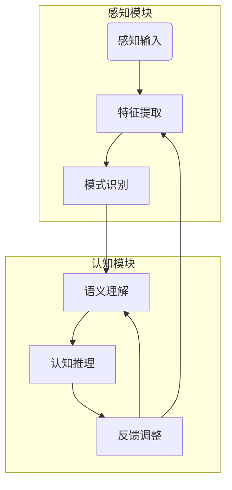

# 认知的形式化：感知是认知的源泉

## 1. 背景介绍

### 1.1 问题的由来

人类认知是一个复杂的过程,涉及感知、思维、记忆、学习、推理等多个方面。传统的人工智能系统主要关注符号推理,忽视了感知在认知中的重要作用。近年来,随着深度学习技术的发展,人工智能系统开始具备一定的感知能力,但仍然缺乏对感知和认知关系的深入理解。

### 1.2 研究现状  

目前,认知科学家和神经科学家对人类认知过程有了一些初步的理解,但仍存在诸多未解之谜。同时,人工智能领域也在不断探索感知与认知的关系,试图构建具有类似人类认知能力的智能系统。但由于认知过程的复杂性,这一领域的研究仍处于起步阶段。

### 1.3 研究意义

深入理解感知与认知的关系,对于构建真正的通用人工智能系统至关重要。只有充分认识到感知在认知中的核心作用,才能设计出更加人性化、更加智能的系统。同时,这一研究也将为认知科学和神经科学提供新的视角和启示。

### 1.4 本文结构

本文将从感知和认知的角度出发,探讨两者之间的内在联系。首先阐述感知和认知的核心概念,然后分析感知如何影响和推动认知过程。接下来介绍相关的算法原理和数学模型,并通过实例分析加以说明。最后,探讨该领域的实际应用场景,以及未来的发展趋势和挑战。

## 2. 核心概念与联系

感知(Perception)是指获取和解释来自五种感官的信息的过程,包括视觉、听觉、触觉、味觉和嗅觉。它是人类认知的基础,为大脑提供了外部世界的原始输入。

认知(Cognition)是指大脑对感知信息进行加工、理解和运用的高级心理过程,包括注意力、记忆、语言、推理、决策等。它是人类智力活动的核心。

感知和认知是一个相互依赖、相辅相成的过程。没有感知,认知就无从谈起;而认知又反过来影响和引导着感知。二者构成了一个闭环系统,共同推动着人类的智力活动。

## 3. 核心算法原理 & 具体操作步骤

### 3.1 算法原理概述

感知和认知的形式化过程可以概括为以下几个核心步骤:

1. 感知输入:通过传感器获取外部信息,如图像、声音、触觉等。
2. 特征提取:对原始感知数据进行预处理,提取出有意义的特征。
3. 模式识别:基于提取的特征,识别出感知对象所属的类别或模式。
4. 语义理解:将识别出的模式与已有知识相关联,赋予其语义含义。
5. 认知推理:基于语义理解,结合先验知识,进行复杂的推理和决策。
6. 反馈调整:将推理结果反馈到感知和语义理解环节,形成闭环调整。

这一过程可以用一个循环流程图来表示:

### 3.2 算法步骤详解

#### 3.2.1 感知输入

感知输入是整个过程的起点,通过各种传感器获取外部世界的原始信号,如图像、声音、触觉等。不同的感知模态对应不同的传感器和数据格式。

#### 3.2.2 特征提取

特征提取的目标是从原始感知数据中提取出对后续处理有意义的特征,抽象出感知对象的本质属性。常用的特征提取方法有:

- 对于图像,可以提取边缘、纹理、形状等视觉特征。
- 对于声音,可以提取频谱、音高、节奏等音频特征。
- 对于文本,可以提取词向量、语法结构等语义特征。

特征提取过程通常需要设计专门的算法,如卷积神经网络用于图像特征提取、循环神经网络用于序列特征提取等。

#### 3.2.3 模式识别

模式识别的目标是根据提取的特征,将感知对象归类到已知的模式或类别中。常用的模式识别算法有:

- 基于统计学习的分类算法,如支持向量机、决策树等。
- 基于深度学习的分类网络,如卷积神经网络、递归神经网络等。
- 基于相似性度量的聚类算法,如K-Means、谱聚类等。

模式识别的准确性直接影响到后续语义理解的质量。

#### 3.2.4 语义理解

语义理解的目标是将识别出的模式与已有知识相关联,赋予其语义含义。这一过程需要建立在大量的先验知识之上,包括:

- 领域本体:定义该领域中的概念、实体、关系等。
- 语义知识库:存储概念之间的语义联系。
- 推理规则:根据已知知识进行推理得出新知识。

语义理解的复杂程度取决于所处理的领域,一些领域如自然语言处理需要更加丰富和复杂的语义知识。

#### 3.2.5 认知推理

认知推理的目标是基于语义理解的结果,结合先验知识,进行更高层次的推理和决策。这一过程涉及复杂的逻辑推理、规划、决策等认知功能。常用的推理方法有:

- 符号推理:基于逻辑规则和公理进行形式化推理。
- 概率推理:基于贝叶斯网络等概率图模型进行不确定性推理。
- 启发式搜索:基于评估函数和搜索策略进行规划和决策。

认知推理的质量直接影响智能系统的整体表现。

#### 3.2.6 反馈调整

反馈调整的目标是将认知推理的结果反馈到前馈过程,对感知和语义理解进行调整和优化。这一环节实现了整个过程的闭环控制,提高了系统的适应性和鲁棒性。反馈调整可以发生在以下几个层面:

- 注意力调节:根据推理结果,调节对不同感知特征的注意力分配。
- 知识修正:根据推理结果,修正和完善语义知识库中的内容。
- 模型微调:根据推理结果,对特征提取和模式识别模型进行微调。

通过不断的反馈调整,系统可以持续学习和进化,不断提高感知和认知的能力。

### 3.3 算法优缺点

#### 3.3.1 优点

- 模块化设计:将复杂的感知认知过程分解为多个模块,有利于系统的构建和优化。
- 融合多模态:能够融合视觉、听觉、触觉等多种感知模态,模拟人类的多感官认知过程。
- 形成闭环:通过反馈调整机制形成闭环,提高系统的适应性和鲁棒性。
- 可解释性:基于显式的语义知识和推理规则,具有一定的可解释性。

#### 3.3.2 缺点

- 知识获取困难:构建高质量的语义知识库是一个巨大的挑战。
- 推理效率低下:符号推理和搜索算法往往效率较低,难以满足实时性要求。
- 模块耦合性强:各个模块之间存在强耦合,系统的可扩展性和可维护性受到影响。
- 缺乏情感认知:目前主要关注理性认知,缺乏对情感和意识的模拟。

### 3.4 算法应用领域

感知认知算法的应用领域非常广泛,包括但不限于:

- 计算机视觉:图像分类、目标检测、语义分割等。
- 自然语言处理:语音识别、机器翻译、问答系统等。
- 机器人技术:视觉导航、运动规划、人机交互等。
- 智能安防:人脸识别、行为分析、异常检测等。
- 智能医疗:医学影像分析、辅助诊断、智能护理等。
- 智能驾驶:环境感知、决策规划、人机交互等。

随着算法的不断改进和硬件的持续发展,感知认知技术必将在更多领域发挥重要作用。

## 4. 数学模型和公式 & 详细讲解 & 举例说明

### 4.1 数学模型构建

感知认知过程中涉及多个环节,每个环节都可以使用不同的数学模型进行描述和求解。

#### 4.1.1 特征提取模型

特征提取模型的目标是从原始数据中提取出对后续处理有意义的特征向量,通常可以表示为一个函数映射:

$$\boldsymbol{x} = f(\boldsymbol{s})$$

其中,$\boldsymbol{s}$表示原始感知数据,$\boldsymbol{x}$表示提取的特征向量,$f$是特征提取函数。

对于图像数据,常用的特征提取函数包括卷积神经网络、SIFT等;对于序列数据,常用的特征提取函数包括循环神经网络、N-gram等。

#### 4.1.2 模式识别模型

模式识别模型的目标是将提取的特征向量$\boldsymbol{x}$映射到预定义的类别或模式$y$,通常可以表示为一个判别函数:

$$y = g(\boldsymbol{x})$$

其中,$g$是模式识别函数,可以是监督学习或无监督学习得到的分类器或聚类器。

常用的监督学习模型包括支持向量机、决策树、逻辑回归等;常用的无监督学习模型包括K-Means聚类、高斯混合模型等。

#### 4.1.3 语义理解模型

语义理解模型的目标是将识别出的模式$y$与先验知识相关联,赋予其语义含义。这通常需要构建一个语义知识库$\mathcal{K}$,并定义一个语义映射函数:

$$z = h(y,\mathcal{K})$$

其中,$z$表示模式$y$对应的语义表示,$h$是语义映射函数,依赖于知识库$\mathcal{K}$中的本体和规则。

语义知识库可以使用不同的知识表示方法,如描述逻辑、概念图、本体网络等。语义映射函数通常需要符号推理或基于规则的推理方法。

#### 4.1.4 认知推理模型

认知推理模型的目标是基于语义表示$z$,结合先验知识$\mathcal{K}$,进行更高层次的推理和决策,得到最终的认知结果$\boldsymbol{a}$。这可以表示为一个推理函数:

$$\boldsymbol{a} = r(z,\mathcal{K})$$

其中,$r$是认知推理函数,可以是符号推理、概率推理或其他启发式搜索算法。

推理函数的具体形式取决于所处理的任务,如规划、决策、问答等,需要针对性地设计合适的推理模型。

### 4.2 公式推导过程

以监督学习的模式识别模型为例,给出其公式推导过程。

假设我们有一个二分类问题,样本集为$\mathcal{D} = \{(\boldsymbol{x}_i,y_i)\}_{i=1}^N$,其中$\boldsymbol{x}_i$是特征向量,$y_i \in \{0,1\}$是类别标记。我们希望学习一个判别函数$g$,使其能够很好地拟合训练数据,并具有良好的泛化能力。

一种常用的模型是线性logistic回归模型,其判别函数为:

$$g(\boldsymbol{x}) = \sigma(\boldsymbol{w}^T\boldsymbol{x} + b)$$

其中,$\sigma(z) = \frac{1}{1+e^{-z}}$是Sigmoid函数,$\boldsymbol{w}$和$b$是需要学习的模型参数。

为了学习最优参数$\boldsymbol{w}