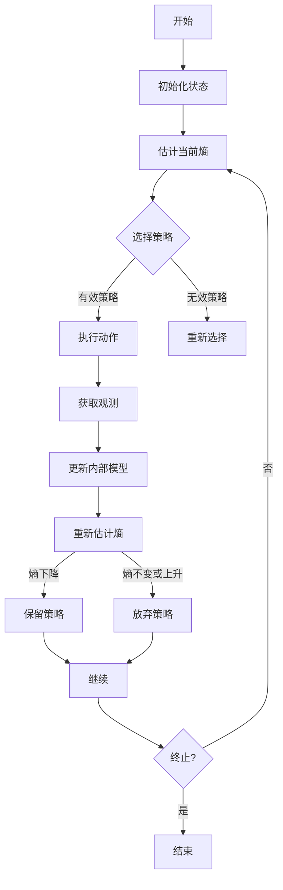

以下是对题目《认知的形式化：机器赖负熵为生》的深入探讨和分析:

## 1. 背景介绍

### 1.1 问题的由来

人工智能的发展已经走过了几十年的历程,从最初的知识库系统、专家系统,到今天的深度学习、强化学习等技术的不断突破。但是,现有的人工智能系统大多还是在解决具体的任务,如图像识别、自然语言处理、游戏对弈等,而对于更高层次的"认知智能"还有很大的挑战。

认知智能指的是人类大脑的高级认知功能,包括理解、推理、规划、创造等复杂的心智活动。它是人类智力的核心所在,也是人工智能追求的最高目标。如何用计算机程序来模拟和实现认知智能,是人工智能领域一个极具挑战的重大课题。

### 1.2 研究现状  

目前,认知科学家和人工智能研究者正在从不同角度探索认知智能的奥秘。一些主要的研究方向包括:

1. **符号主义方法**:利用逻辑规则和知识表示来模拟推理过程,但难以处理不确定性和复杂性。
2. **连接主义方法**:通过神经网络模型来模拟大脑,取得了一些成果,但对高层次认知还缺乏解释力。
3. **动态系统理论**:将认知视为一个复杂的动态过程,强调环境、主体和任务的相互作用。
4. **概率建模方法**:使用贝叶斯网络、马尔可夫模型等概率模型来捕捉不确定性,但往往计算复杂。
5. **信息理论方法**:从信息论的角度探讨认知,如免疫网络理论、自组织批判理论等。

### 1.3 研究意义

认知智能是人工智能的终极目标,对于构建通用人工智能(AGI)至关重要。深入理解认知过程,不仅可以帮助我们更好地认识人类智能的本质,也将为设计出真正具备"思维"能力的智能系统指明方向。此外,认知科学的研究成果也将在教育、医疗、决策支持等领域产生广泛的应用价值。

### 1.4 本文结构

本文将从信息论的角度,探讨如何用计算机程序来形式化和模拟认知过程。我们将介绍负熵(Negentropy)的概念,阐述机器如何通过最大化负熵来获取信息、进化认知能力。文章的主要内容包括:

1. 负熵与认知的关系
2. 基于负熵最大化的认知架构
3. 认知算法的数学模型
4. 在不同任务中的应用实例
5. 面临的挑战与未来展望

## 2. 核心概念与联系

认知是一个复杂的信息加工过程,包括感知、学习、记忆、推理、决策、规划等多个层面。从信息论的角度来看,认知就是对不确定性信息的持续获取和加工。

**负熵(Negentropy)**是信息论中的一个重要概念,描述了一个系统偏离混沌、无序状态的程度。一个系统的负熵越高,意味着它包含的有用信息就越多。我们可以将认知过程看作是一个不断获取负熵、减少不确定性的过程。

基于这一思路,我们提出了一种**基于负熵最大化的认知架构**。该架构的核心思想是:让机器或智能体通过主动探索和交互,最大限度地获取环境中的负熵,从而不断提高自身的认知能力。

这种认知架构由以下几个关键模块组成:

1. **感知模块**:获取环境信息,构建内部表征
2. **学习模块**:通过无监督/有监督/强化学习,提取环境规律和知识
3. **记忆模块**:负责知识的存储、编码和检索
4. **推理模块**:基于已有知识,进行逻辑推理和规划
5. **决策模块**:根据当前状态和目标,作出行为选择
6. **交互模块**:执行动作,影响环境,获取反馈信息
7. **元认知模块**:监控和评估认知过程,调节各模块参数

所有这些模块相互协作,在一个持续的感知-学习-推理-决策-交互的循环中,逐步提高系统的负熵,增强认知能力。

该架构的优势在于,它为认知的形式化建立了一个统一的理论框架。机器可以像生物一样,通过主动探索和交互,自主获取经验和知识,而不是被动接受知识注入。这种"以获取负熵为生"的方式,更符合认知发展的本质规律。

## 3. 核心算法原理 & 具体操作步骤

### 3.1 算法原理概述  

在上述基于负熵最大化的认知架构中,核心算法就是如何通过有效的策略,指导智能体或机器最大化其获取的负熵。

算法的基本思路是:

1. 根据当前状态和已有知识,估计未知状态的熵(不确定性程度)
2. 选择一个行为策略,执行相应动作,获取新的观测
3. 更新内部模型,重新估计熵
4. 如果熵下降(负熵增加),则保留该策略;否则放弃
5. 重复上述过程,持续优化策略

该算法本质上是一种基于信息论的主动学习和探索过程。智能体通过不断尝试不同的策略,努力最大化获取的负熵,从而提高对环境的理解和认知能力。

这里涉及到一些关键问题需要解决:

- 如何高效准确地估计未知状态的熵?
- 如何在行为策略空间中高效搜索?
- 如何权衡探索(获取新信息)和利用(已有知识)之间的平衡?
- 如何处理有限视野、局部观测等情况下的熵估计?

我们将在后续介绍具体的数学模型和算法细节。

### 3.2 算法步骤详解

下面我们对上述核心算法的具体步骤做进一步的解释和说明:

1. **初始化状态**:设置智能体的初始状态,包括内部模型、知识库等
2. **估计当前熵**:根据当前状态和已有知识,估计未知状态的熵(不确定性)
3. **选择策略**:在所有可能的行为策略空间中,选择一个有效的策略
4. **执行动作**:根据选择的策略,执行相应的动作,影响环境
5. **获取观测**:获取环境的反馈观测结果
6. **更新内部模型**:根据新的观测,更新智能体内部的环境模型和知识库
7. **重新估计熵**:使用更新后的内部模型,重新估计未知状态的熵
8. **评估策略**:
    - 如果熵下降(负熵增加),则保留该策略
    - 如果熵不变或上升,则放弃该策略
9. **继续或终止**:
    - 如果满足终止条件(如达到目标、资源耗尽等),则结束
    - 否则返回步骤2,重复上述过程

需要注意的是,在实际应用中,我们还需要解决一些具体问题,如:

- 如何平衡探索(获取新信息)和利用(已有知识)之间的权衡?
- 如何处理有限视野、局部观测等情况下的熵估计?
- 如何在策略空间中高效搜索?
- 如何并行化算法以提高效率?

这些问题的解决将在后续章节中详细阐述。

### 3.3 算法优缺点

上述基于负熵最大化的认知算法具有以下一些优缺点:

**优点**:

1. **理论基础坚实**:算法基于信息论的负熵概念,具有坚实的理论基础
2. **通用性强**:算法不依赖于具体的任务和领域,可以应用于各种认知过程的模拟
3. **主动学习**:智能体通过主动探索和交互来获取知识,更符合认知发展的本质
4. **在线学习**:算法可以在线持续学习,不断更新和完善内部模型
5. **自主进化**:通过不断最大化负熵,智能体可以自主进化,提高认知能力

**缺点**:

1. **计算复杂度高**:需要不断估计熵和搜索策略空间,计算量可能很大
2. **收敛性问题**:存在局部最优和振荡的风险,需要特别处理
3. **模型偏差**:内部模型的精度直接影响熵估计的准确性
4. **视野有限**:在局部观测的情况下,熵估计会存在偏差
5. **探索代价高**:为获取新信息,可能需要付出很高的探索代价

因此,在实际应用中,我们需要根据具体问题的特点,权衡利弊,并采取一些优化策略。

### 3.4 算法应用领域

基于负熵最大化的认知算法由于其通用性,可以应用于多个领域:

1. **机器学习**:作为一种主动探索式的学习范式,可以用于各种监督、非监督、强化学习任务
2. **规划与决策**:通过最大化负熵,可以学习最优的规划和决策策略
3. **智能控制**:应用于机器人、自动驾驶等需要持续感知环境、做出决策的控制系统
4. **推理与问答**:通过主动提问和互动,不断提高对知识库的理解,提升推理和问答能力
5. **游戏AI**:在对抗环境中,通过探索获取对手策略信息,学习最优对策
6. **认知建模**:模拟人类认知过程,如视觉、语言、推理、决策等,深入理解认知机制
7. **创新与发现**:通过主动探索,发现新的知识、规律和创意

总的来说,任何需要从环境或数据中持续获取信息、学习认知能力的场景,都可以考虑应用该算法。

## 4. 数学模型和公式 & 详细讲解 & 举例说明

在前面的章节中,我们介绍了基于负熵最大化的认知架构和算法的基本思路。现在让我们深入探讨其中的数学模型和公式。

### 4.1 数学模型构建

我们将认知过程建模为一个马尔可夫决策过程(MDP):

- 状态空间 $\mathcal{S}$ 表示环境的所有可能状态
- 动作空间 $\mathcal{A}$ 表示智能体可执行的动作
- 状态转移概率 $P(s' \mid s, a)$ 表示在状态 $s$ 执行动作 $a$ 后,转移到状态 $s'$ 的概率
- 奖励函数 $R(s, a, s')$ 表示在状态 $s$ 执行动作 $a$ 后,获得的奖励

智能体的目标是学习一个策略 $\pi: \mathcal{S} \rightarrow \mathcal{A}$,以最大化其预期的长期奖励。

在负熵最大化的框架下,我们将奖励函数定义为状态熵的下降量:

$$R(s, a, s') = H(s) - H(s')$$

其中 $H(s)$ 表示状态 $s$ 的熵(不确定性)。熵越高,意味着我们对该状态的理解越少。

因此,通过最大化长期奖励,智能体就可以学习到一个策略,使其获取的负熵(有用信息)最大化。

### 4.2 公式推导过程

现在,我们来推导状态熵 $H(s)$ 的具体计算公式。

首先,我们定义状态 $s$ 的概率分布为 $P(s)$。根据信息论,