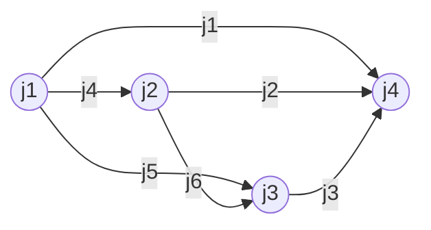

量子引力：广义相对论与量子力学的结合

## 1. 背景介绍

### 1.1 问题的由来

广义相对论和量子力学是20世纪初两项革命性的理论突破,它们分别描述了宇宙的大尺度和微观尺度的物理现象。然而,在极端条件下,如黑洞内部或大爆炸初期,这两个理论之间存在着根本的矛盾和冲突。因此,寻求一个能够统一这两个理论的框架,成为了理论物理学家多年来的终极目标之一。

### 1.2 研究现状

过去几十年中,科学家们提出了多种量子引力理论,试图将广义相对论和量子力学融合。其中最有影响力的是超弦理论和环量子引力。超弦理论将基本粒子描述为微小的振动弦,而环量子引力则以环形结构为基础。然而,这些理论都存在着数学上的困难和实验上的挑战,距离最终的统一理论仍有一定距离。

### 1.3 研究意义

量子引力理论的建立将极大地推进我们对宇宙本质的理解。它不仅有助于解释黑洞的奥秘和大爆炸的起源,还可能揭示出更高维度的存在,甚至连接量子力学和宇宙学。此外,量子引力理论可能会带来新的技术应用,如量子计算机和量子通信。

### 1.4 本文结构

本文将首先介绍量子引力的核心概念和它与广义相对论和量子力学之间的联系。接下来,我们将探讨量子引力的核心算法原理和数学模型。然后,我们将通过代码实例和应用场景来深入了解量子引力的实际应用。最后,我们将总结量子引力的发展趋势和面临的挑战,并提供相关的学习资源和工具推荐。

## 2. 核心概念与联系

量子引力试图将广义相对论中的时空几何和量子力学中的微观粒子统一起来。在广义相对论中,物质和能量决定了时空的曲率,而在量子力学中,粒子的行为受到不确定性原理的支配。

量子引力的核心思想是将时空几何量子化,将其视为由基本的量子单元组成。这些量子单元可能是环、弦或其他更基本的结构。通过量子化时空,我们可以解决广义相对论和量子力学之间的矛盾,并描述极端条件下的物理现象。

量子引力理论需要满足以下几个关键要求:

1. 在大尺度上还原为广义相对论
2. 在低能量下还原为量子力学
3. 解释黑洞的信息丢失悖论
4. 提供一致的量子重力效应描述

虽然目前还没有一个完全成功的量子引力理论,但一些理论,如环量子引力和超弦理论,已经取得了重大进展。

## 3. 核心算法原理 & 具体操作步骤

### 3.1 算法原理概述

量子引力的核心算法原理是将时空几何量子化,将其视为由基本的量子单元组成。这些量子单元可能是环、弦或其他更基本的结构。通过量子化时空,我们可以解决广义相对论和量子力学之间的矛盾,并描述极端条件下的物理现象。

量子引力算法的主要步骤包括:

1. 选择合适的基本量子单元(如环或弦)
2. 构建量子化时空的数学模型
3. 求解该模型的量子态和能量谱
4. 从量子态中导出经典时空几何和物质场
5. 检验该理论是否满足广义相对论和量子力学的极限情况

### 3.2 算法步骤详解

1. **选择基本量子单元**

   在环量子引力中,基本量子单元是一维的闭合环。在超弦理论中,基本量子单元是一维的开放或闭合弦。选择合适的基本量子单元是量子引力算法的第一步,它决定了后续的数学描述。

2. **构建量子化时空模型**

   一旦选定了基本量子单元,我们需要构建量子化时空的数学模型。这通常涉及到将时空离散化,将其描述为由基本量子单元组成的网格或泡沫状结构。

   在环量子引力中,时空被描述为由环组成的网格,每个环代表一个微小的时空区域。环之间通过某些规则相互作用,形成整个时空的量子态。

   在超弦理论中,时空被描述为由弦组成的高维流形。弦的振动模式对应着不同的基本粒子和场。

3. **求解量子态和能量谱**

   构建好量子化时空模型后,我们需要求解该模型的量子态和能量谱。这通常涉及到复杂的数学计算,如规范理论、微分几何和拓扑学等。

   在环量子引力中,我们需要求解环网格的所有可能的量子态,并计算每个态的能量。这通常通过对规范不变量进行路径积分来实现。

   在超弦理论中,我们需要求解弦的振动模式和相互作用,并计算出对应的粒子谱和相互作用强度。

4. **导出经典时空几何和物质场**

   求解出量子态和能量谱后,我们需要从中导出经典的时空几何和物质场。这通常涉及到一个称为"半经典极限"的过程。

   在该过程中,我们需要找到描述经典时空和物质的量子态,并研究它们在某些极限下的行为。例如,在环量子引力中,当环的大小趋于无穷大时,它们的行为就接近于经典的时空几何。

5. **检验理论的一致性**

   最后一步是检验所构建的量子引力理论是否满足广义相对论和量子力学的极限情况,以及是否能够解释一些未解之谜,如黑洞信息丢失悖论。

   如果该理论在适当的极限下还原为广义相对论和量子力学,并且能够解释一些奇异现象,那么它就可能是一个成功的量子引力理论。否则,我们需要继续修改和完善该理论。

### 3.3 算法优缺点

量子引力算法的主要优点是:

1. 提供了一个统一广义相对论和量子力学的框架
2. 能够描述极端条件下的物理现象,如黑洞和大爆炸
3. 有望揭示时空和物质的本质

然而,该算法也存在一些明显的缺点:

1. 数学计算极其复杂,目前还无法完全解决
2. 缺乏直接的实验验证
3. 可能需要引入额外的假设和新的物理概念

### 3.4 算法应用领域

虽然量子引力算法目前主要停留在理论层面,但它在未来可能会有广泛的应用:

1. **黑洞物理学**:量子引力可以解释黑洞的奥秘,如信息丢失悖论和虫洞等。
2. **早期宇宙学**:量子引力可以描述大爆炸初期的极端条件,揭示宇宙的起源。
3. **量子计算**:量子引力可能会启发新的量子计算模型和算法。
4. **新型能源**:量子引力可能会带来新的能源利用方式,如虫洞能量提取等。
5. **高维度物理**:量子引力可能会揭示出更高维度的存在和新的物理定律。

## 4. 数学模型和公式 & 详细讲解 & 举例说明

### 4.1 数学模型构建

量子引力的数学模型通常基于一些基本假设和原理,如:

1. **时空离散化**:时空被视为由基本的量子单元(如环或弦)组成的离散结构。
2. **规范不变性**:模型应该对某些基本变换(如坐标变换)保持不变性。
3. **背景独立性**:模型不应该依赖于任何预先假定的时空背景。

基于这些假设,我们可以构建出描述量子化时空的数学模型。以环量子引力为例,它的基本数学模型是**Spin Network**和**Spin Foam**。

**Spin Network**描述了一个给定时刻的量子化时空状态。它由一个无向图组成,顶点代表时空区域,边代表它们之间的连接。每个顶点和边都被赋予一个spin量子数,描述了该区域的几何和物质属性。

**Spin Foam**则描述了时空的演化过程。它由一系列的Spin Network组成,每个Spin Network代表一个时间切面。相邻的Spin Network通过一些规则相互作用,形成了整个时空的量子态。

在数学上,Spin Network和Spin Foam可以用代数和拓扑学的语言来精确描述。它们的演化规则可以通过路径积分的方式来求解,从而得到量子化时空的全部信息。

### 4.2 公式推导过程

在量子引力理论中,有许多关键的数学公式需要推导和计算。以下是一个简单的例子,推导出Spin Network的基本公式。

考虑一个由N个顶点和E条边组成的Spin Network,每个顶点i被赋予一个spin量子数$j_i$,每条边e被赋予一个spin量子数$j_e$。根据量子力学原理,该Spin Network的量子态可以表示为:

$$
|\Psi\rangle = \sum_{\{j_e\}} \prod_{v} A_v(j_1,j_2,\cdots) \prod_{e} \iota_{j_e} |j_1,j_2,\cdots,j_E\rangle
$$

其中:

- $\{j_e\}$是所有边的spin量子数的集合
- $A_v(j_1,j_2,\cdots)$是顶点v处的耦合系数,描述了相连边spin的耦合方式
- $\iota_{j_e}$是边e的spin投影算子,作用于相应的spin态
- $|j_1,j_2,\cdots,j_E\rangle$是所有边spin态的直积

为了计算该量子态的物理意义,我们需要求解耦合系数$A_v$。根据量子角动量理论,耦合系数满足一个递归关系式:

$$
A_v(j_1,j_2,\cdots,j_n) = \sum_{j'} \begin{Bmatrix}
j_1 & j_2 & j' \\
m_1 & m_2 & m'
\end{Bmatrix} A_v(j_3,\cdots,j_n,j')
$$

其中$\begin{Bmatrix}\cdots\\\cdots\end{Bmatrix}$是Wigner 3j符号,描述了三个角动量的耦合方式。通过递归计算这些耦合系数,我们就可以得到Spin Network整体的量子态。

进一步地,我们可以从这些量子态中导出经典的时空几何和物质场,并检验它们在某些极限下是否还原为广义相对论和量子力学。这需要进行复杂的数学计算和渐近分析。

### 4.3 案例分析与讲解

为了更好地理解量子引力的数学模型,让我们来分析一个简单的Spin Network案例。

考虑一个由4个顶点和6条边组成的Spin Network,如下图所示:

假设每个顶点的spin量子数分别为$j_1=1/2,j_2=1,j_3=3/2,j_4=2$,我们要计算该Spin Network的量子态。

根据公式(1),该量子态可以表示为:

$$
|\Psi\rangle = \sum_{\{j_e\}} A_A A_B A_C A_D \prod_{e} \iota_{j_e} |j_4,j_5,j_6,j_1,j_2,j_3\rangle
$$

其中$A_v$是每个顶点处的耦合系数。根据公式(2),我们可以递归计算出这些耦合系数:

$$
\begin{aligned}
A_A &= \begin{Bmatrix}
1/2 & 1/2 & j_4 \\
m_1 & m_2 & m_4
\end{Bmatrix} \begin{Bmatrix}
1/2 & 1/2 & j_5 \\
m_3 & m_4 & m_5
\end{Bmatrix} \\