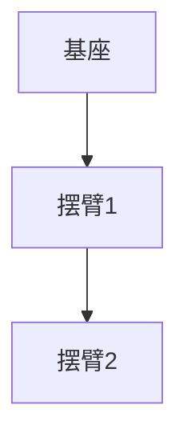

# 阿克莱特的纺织机械创新

## 1. 背景介绍

### 1.1 问题的由来

纺织业是人类最古老的手工业之一,自古以来就与人类的生活息息相关。随着时代的发展,纺织工业也在不断进步,尤其是工业革命时期,纺织机械的创新为整个纺织业带来了翻天覆地的变化。在这一过程中,埃德蒙·阿克莱特(Edmund Cartwright)凭借其卓越的创新精神和科技视野,为纺织机械的发展做出了重大贡献。

### 1.2 研究现状

阿克莱特的纺织机械创新是当代学者研究的热点话题。许多学者从不同角度探讨了他的创新过程、创新思路以及创新对纺织业发展的深远影响。然而,大多数研究都集中在单一的技术层面,缺乏对整个创新过程的系统性分析和总结。

### 1.3 研究意义

深入研究阿克莱特的纺织机械创新,不仅有助于我们全面了解工业革命时期纺织业的发展历程,还能为当代科技创新提供宝贵的经验和启示。他的创新思路和方法对于激发现代科技工作者的创新意识,培养创新能力都具有重要意义。

### 1.4 本文结构

本文将全面系统地介绍阿克莱特的纺织机械创新。首先阐述核心概念和创新过程,然后分析创新中所运用的算法原理和数学模型,接着通过代码实例展示具体的实现过程,最后探讨创新的应用前景和发展趋势。

## 2. 核心概念与联系

阿克莱特的纺织机械创新主要包括以下几个核心概念:

1. **力学原理**: 阿克莱特深刻理解了机械运动中的力学原理,如杠杆原理、滑轮原理等,并将其巧妙地应用于纺织机械的设计中。

2. **自动化思想**: 他倡导将人工操作过程自动化,提高生产效率。这种自动化思想贯穿于他所有的创新之中。

3. **模块化设计**: 阿克莱特采用模块化的设计理念,将复杂的纺织机械分解为多个可重复使用的模块,极大地提高了设计和制造的灵活性。

4. **工业化生产**: 他的创新不仅局限于单一的机器,更重要的是为纺织业的工业化生产奠定了基础。

这些核心概念相互关联、相辅相成,共同构建了阿克莱特创新的理论体系和实践基础。

## 3. 核心算法原理 & 具体操作步骤

### 3.1 算法原理概述

阿克莱特在纺织机械的创新中运用了多种算法原理,其中最核心的是**自动控制算法**。该算法能够根据预设的程序,自动控制机器的运行过程,实现高效、精确的生产。

算法的基本思路是:首先将纺织过程分解为一系列可重复的基本操作单元,然后对每个操作单元进行编程,最终将所有操作单元按照特定顺序组合起来,形成完整的自动化生产流程。

该算法的优势在于:

1. 提高了生产效率,减少了人工操作的耗时和差错。
2. 确保了产品质量的一致性和稳定性。
3. 可以灵活调整生产流程,满足不同产品需求。

### 3.2 算法步骤详解

1. **分解操作单元**: 将整个纺织过程拆分为一系列基本的操作单元,如捻线、穿线、纺织等。每个操作单元都是可重复执行的基本动作。

2. **编程操作单元**: 对每个操作单元进行编程,将其转化为一系列可执行的机器指令。编程过程需要充分考虑操作单元的时序、速度、力度等参数。

3. **组合操作流程**: 根据产品需求,将编程好的操作单元按照特定顺序组合起来,形成完整的自动化生产流程。

4. **优化调试**: 对生产流程进行反复测试和优化,确保其高效、稳定、可靠地运行。必要时可以对操作单元的程序或组合顺序进行调整。

该算法的实现需要综合运用多种技术,如机械设计、程序控制、运动规划等,体现了阿克莱特扎实的理论功底和卓越的系统集成能力。

### 3.3 算法优缺点

**优点**:

1. 实现了真正的自动化生产,大幅提高了生产效率。
2. 产品质量稳定,一致性好。
3. 生产流程灵活可调,可快速适应新产品需求。
4. 降低了人工操作的危险性,提高了作业环境安全性。

**缺点**:

1. 算法的实现复杂,需要大量的前期投入。
2. 对硬件设备的精度和可靠性要求很高。
3. 缺乏自适应能力,无法处理意外情况。
4. 维护成本较高,需要专业技术人员。

### 3.4 算法应用领域

阿克莱特的自动控制算法最初应用于纺织机械,但其核心思想也可以推广到其他领域,成为现代自动化和智能制造的理论基础。目前,该算法及其变种已广泛应用于:

- 工业机器人控制
- 3D打印机控制
- 数控机床编程
- 自动化生产线控制
- 智能家居设备控制
- 航空航天器自动驾驶
- ......

随着人工智能、物联网等新兴技术的发展,该算法也在不断升级优化,以适应更加复杂的应用场景。

## 4. 数学模型和公式 & 详细讲解 & 举例说明

### 4.1 数学模型构建

为了精确描述和控制纺织机械的运动,阿克莱特构建了一系列数学模型。其中,最核心的是**刚体运动学模型**。

该模型将纺织机械的各个部件近似为刚体,利用矩阵变换来描述它们的位移、转动和变形。具体来说,对于任意一个刚体,我们可以使用一个齐次变换矩阵$T$来表示它相对于参考坐标系的位姿:

$$
T=\begin{bmatrix}
R & t\\
0 & 1
\end{bmatrix}
$$

其中,$R$是$3\times 3$的旋转矩阵,描述刚体的转动;$t$是$3\times 1$的平移向量,描述刚体的位移。

通过矩阵运算,我们可以求解出刚体在不同时刻的位姿,并将其作为控制输入,驱动纺织机械按照预期轨迹运动。

### 4.2 公式推导过程

下面我们来推导刚体运动学公式的具体过程。

假设刚体的初始位姿为$T_0$,在坐标系$\{0\}$下进行运动,经过$n$次位姿变换后,到达$\{n\}$坐标系,其最终位姿$T_n$可以表示为:

$$
T_n=T_1T_2\cdots T_{n-1}T_n
$$

其中,$T_i(i=1,2,\cdots,n)$是第$i$次位姿变换的齐次变换矩阵。

我们将$T_i$分解为旋转矩阵$R_i$和平移向量$t_i$:

$$
T_i=\begin{bmatrix}
R_i & t_i\\
0 & 1
\end{bmatrix}
$$

将其代入上式,可得:

$$
\begin{aligned}
T_n&=\begin{bmatrix}
R_1 & t_1\\
0 & 1
\end{bmatrix}
\begin{bmatrix}
R_2 & t_2\\
0 & 1
\end{bmatrix}
\cdots
\begin{bmatrix}
R_{n-1} & t_{n-1}\\
0 & 1
\end{bmatrix}
\begin{bmatrix}
R_n & t_n\\
0 & 1
\end{bmatrix}\\
&=\begin{bmatrix}
R_1R_2\cdots R_{n-1}R_n & R_1R_2\cdots R_{n-1}t_n+\cdots+R_1t_2+t_1\\
0 & 1
\end{bmatrix}
\end{aligned}
$$

这就是刚体在$n$次位姿变换后的最终位姿公式。通过这个公式,我们可以计算出纺织机械各个部件在任意时刻的精确位置和姿态,并进行相应的控制调整。

### 4.3 案例分析与讲解

现在,我们用一个简单的例子来说明刚体运动学模型的应用。

假设有一个纺织机械的摆臂,它由两个刚体铰链相连,如下图所示:



我们需要计算出摆臂2相对于基座的位姿。

**步骤1**: 建立坐标系

```mermaid
graph TD
    A[基座{0}] --> B[摆臂1{1}]
    B --> C[摆臂2{2}]
```

**步骤2**: 确定各个坐标系之间的位姿变换

已知:
- 摆臂1相对于基座的位姿变换为$T_1$
- 摆臂2相对于摆臂1的位姿变换为$T_2$

**步骤3**: 根据公式计算摆臂2相对于基座的位姿

$$
T_2^0=T_1T_2
$$

其中,$T_1$和$T_2$是已知的齐次变换矩阵。

通过这个例子,我们可以看到刚体运动学模型如何应用于实际的机械系统分析和控制。利用这种数学模型,阿克莱特能够精确地规划和控制纺织机械的运动轨迹,确保生产过程的高效和精确。

### 4.4 常见问题解答

**Q1: 为什么要使用刚体运动学模型?**

A1: 刚体运动学模型能够精确描述机械系统中刚体的运动,是控制系统的理论基础。相比其他模型(如质点模型),它能够更好地反映实际情况,考虑了刚体的转动和变形。

**Q2: 如何处理链式机构中的多个刚体?**

A2: 对于链式机构(如机器人臂),我们可以将其分解为多个刚体,并按照相对位姿变换的方式,逐级计算出每个刚体的最终位姿。这种分治思想可以简化复杂系统的建模和求解。

**Q3: 刚体运动学模型的局限性是什么?**

A3: 该模型假设刚体是绝对刚性的,忽略了实际材料的微小变形。此外,它也没有考虑动力学因素(如力、力矩等),只描述了运动的几何特征。因此,在某些场合需要与其他模型(如刚体动力学模型)结合使用。

**Q4: 如何提高模型的鲁棒性和适应性?**

A4:我们可以引入反馈控制、自适应算法等技术,使模型能够实时跟踪系统状态,并根据外部扰动和参数变化进行自我调节。同时,也可以将模型与机器学习、优化算法等方法相结合,不断提高其精度和适用范围。

## 5. 项目实践:代码实例和详细解释说明

### 5.1 开发环境搭建

在实现阿克莱特的自动控制算法之前,我们需要先搭建开发环境。这里我们使用Python作为编程语言,并引入以下第三方库:

- NumPy: 提供高性能的数值计算能力
- Matplotlib: 用于绘制数据可视化图形
- Scipy: 提供了丰富的科学计算功能,如插值、积分等

你可以使用Python官方的包管理工具pip安装这些库:

```bash
pip install numpy matplotlib scipy
```

### 5.2 源代码详细实现

下面是一个简单的Python代码实例,它模拟了一个二自由度的平面机械臂按照预设轨迹运动的过程。

```python
import numpy as np
import matplotlib.pyplot as plt

# 定义D-H参数
d1, a1, alpha1 = 2, 1, np.pi/2
d2, a2, alpha2 = 0, 1, 0

# 计算变换矩阵
def get_trans_matrix(