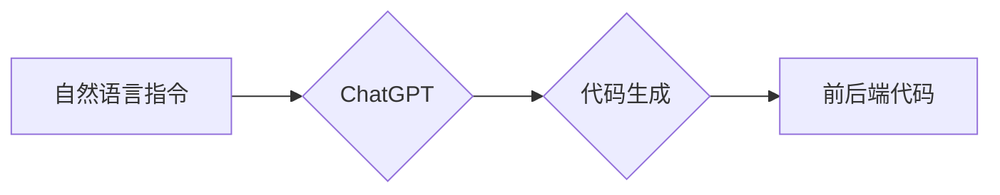

## AIGC从入门到实战：利用 ChatGPT 来生成前后端代码

> 关键词：AIGC, ChatGPT, 代码生成, 前后端开发, 自然语言处理, 编程自动化, 软件开发

## 1. 背景介绍

近年来，人工智能（AI）技术取得了飞速发展，其中，生成式人工智能（AIGC）作为其重要分支，展现出强大的潜力。AIGC能够根据输入的文本或代码指令，自动生成新的文本、代码、图像、音频等内容。

ChatGPT，作为一款基于Transformer架构的强大语言模型，在文本生成、对话系统、代码理解等领域表现出色。其强大的文本生成能力为AIGC在代码生成领域提供了新的可能性。利用ChatGPT，我们可以实现对前后端代码的自动生成，极大地提高开发效率，降低开发成本。

## 2. 核心概念与联系

### 2.1  AIGC

AIGC是指利用人工智能技术，自动生成各种创意内容的过程。它涵盖了文本生成、代码生成、图像生成、音频生成等多个领域。AIGC的核心是训练强大的机器学习模型，使其能够理解和生成人类语言和数据。

### 2.2  ChatGPT

ChatGPT是一个由OpenAI开发的开源大型语言模型，基于Transformer架构，拥有1750亿参数。它能够理解和生成人类语言，并具备以下特点：

* **强大的文本生成能力:** ChatGPT能够生成流畅、自然的文本，包括故事、诗歌、文章等。
* **代码理解和生成能力:** ChatGPT能够理解多种编程语言的代码，并能够根据自然语言指令生成相应的代码。
* **对话系统能力:** ChatGPT能够进行自然流畅的对话，并根据上下文理解用户意图。

### 2.3  代码生成

代码生成是指利用人工智能技术，根据自然语言指令或代码模板自动生成代码的过程。它可以应用于各种软件开发场景，例如：

* **快速原型开发:** 利用代码生成工具，可以快速生成软件的基本功能代码，节省开发时间。
* **代码复用:** 代码生成工具可以帮助开发者复用已有代码，提高开发效率。
* **代码自动化:** 代码生成可以自动化一些重复性的代码编写任务，例如生成数据结构、API接口等。

**Mermaid 流程图**



## 3. 核心算法原理 & 具体操作步骤

### 3.1  算法原理概述

ChatGPT的代码生成能力基于其强大的语言模型和训练数据。其训练过程主要包括以下步骤：

1. **数据收集:** 收集大量的代码和自然语言文本数据。
2. **数据预处理:** 对数据进行清洗、格式化和标记。
3. **模型训练:** 利用Transformer架构的深度学习模型，训练ChatGPT模型，使其能够理解代码结构和语义，并生成符合语法规则的代码。
4. **模型评估:** 使用测试数据评估模型的性能，并进行模型调优。

### 3.2  算法步骤详解

1. **用户输入自然语言指令:** 用户输入需要生成代码的自然语言描述，例如“生成一个简单的登录页面”。
2. **文本预处理:** ChatGPT将用户输入的指令进行预处理，例如分词、词性标注等，将其转换为模型可以理解的格式。
3. **编码:** ChatGPT将预处理后的指令编码成向量表示，并将其输入到模型中。
4. **解码:** 模型根据输入的向量表示，生成相应的代码序列。
5. **代码后处理:** ChatGPT对生成的代码进行语法检查、格式化等后处理，使其更加规范和易读。
6. **输出代码:** 最后，ChatGPT将生成的代码输出给用户。

### 3.3  算法优缺点

**优点:**

* **提高开发效率:** 自动生成代码可以大大减少代码编写时间，提高开发效率。
* **降低开发成本:** 代码生成可以减少人工成本，降低软件开发成本。
* **减少代码错误:** 代码生成工具可以帮助开发者避免一些常见的代码错误。

**缺点:**

* **代码质量:** 生成的代码可能需要人工进行修改和完善，以确保代码质量。
* **可解释性:** 代码生成过程的决策机制可能难以理解，这可能会导致代码难以维护和调试。
* **安全风险:** 如果代码生成工具的训练数据包含安全漏洞，生成的代码也可能存在安全风险。

### 3.4  算法应用领域

代码生成技术在软件开发领域有着广泛的应用场景，例如：

* **Web开发:** 自动生成HTML、CSS、JavaScript代码。
* **移动开发:** 自动生成Android、iOS代码。
* **数据科学:** 自动生成数据处理、分析代码。
* **游戏开发:** 自动生成游戏场景、角色代码。

## 4. 数学模型和公式 & 详细讲解 & 举例说明

### 4.1  数学模型构建

ChatGPT的数学模型基于Transformer架构，其核心是**自注意力机制**和**多头注意力机制**。

**自注意力机制**允许模型在处理文本序列时，关注不同位置的词语之间的关系，从而更好地理解上下文信息。

**多头注意力机制**则通过使用多个自注意力头，可以捕捉到不同层次的语义信息，提高模型的表达能力。

### 4.2  公式推导过程

由于篇幅限制，这里不再详细推导Transformer模型的数学公式。

### 4.3  案例分析与讲解

假设用户输入的指令是“生成一个简单的登录页面”。ChatGPT会首先将指令进行预处理，将其转换为模型可以理解的格式。然后，模型会利用自注意力机制和多头注意力机制，分析指令中的关键词和语义信息，例如“登录页面”，“简单”等。

根据分析结果，模型会生成相应的代码序列，例如HTML、CSS、JavaScript代码，构成一个简单的登录页面。

## 5. 项目实践：代码实例和详细解释说明

### 5.1  开发环境搭建

* 安装Python3.7或更高版本
* 安装必要的Python库，例如transformers、torch等
* 下载ChatGPT模型权重文件

### 5.2  源代码详细实现

```python
from transformers import AutoModelForCausalLM, AutoTokenizer

# 加载ChatGPT模型和分词器
model_name = "gpt2"
tokenizer = AutoTokenizer.from_pretrained(model_name)
model = AutoModelForCausalLM.from_pretrained(model_name)

# 用户输入指令
user_input = "生成一个简单的登录页面"

# 将指令转换为模型输入格式
input_ids = tokenizer.encode(user_input, return_tensors="pt")

# 使用模型生成代码
output = model.generate(input_ids, max_length=200)

# 将生成的代码解码
generated_code = tokenizer.decode(output[0], skip_special_tokens=True)

# 打印生成的代码
print(generated_code)
```

### 5.3  代码解读与分析

* 该代码首先加载了ChatGPT模型和分词器。
* 然后，用户输入指令“生成一个简单的登录页面”。
* 将指令转换为模型输入格式，并使用模型生成代码。
* 最后，将生成的代码解码并打印出来。

### 5.4  运行结果展示

运行该代码后，会输出一个简单的登录页面代码，例如：

```html
<!DOCTYPE html>
<html>
<head>
<title>登录页面</title>
</head>
<body>
<h1>登录</h1>
<form>
  <label for="username">用户名:</label>
  <input type="text" id="username" name="username"><br><br>
  <label for="password">密码:</label>
  <input type="password" id="password" name="password"><br><br>
  <input type="submit" value="登录">
</form>
</body>
</html>
```

## 6. 实际应用场景

### 6.1  快速原型开发

利用ChatGPT生成代码可以快速构建软件的原型，节省开发时间，并帮助开发者更快地验证想法。

### 6.2  代码复用

ChatGPT可以根据已有代码模板生成新的代码，帮助开发者复用已有代码，提高开发效率。

### 6.3  代码自动化

ChatGPT可以自动化一些重复性的代码编写任务，例如生成数据结构、API接口等，提高开发效率。

### 6.4  未来应用展望

随着AIGC技术的不断发展，ChatGPT在代码生成领域的应用场景将会更加广泛，例如：

* **智能代码补全:** 根据上下文自动补全代码，提高开发效率。
* **代码翻译:** 将代码从一种编程语言翻译成另一种编程语言。
* **代码安全分析:** 利用ChatGPT识别代码中的安全漏洞。

## 7. 工具和资源推荐

### 7.1  学习资源推荐

* **OpenAI官方文档:** https://openai.com/api/
* **HuggingFace Transformers库文档:** https://huggingface.co/docs/transformers/index

### 7.2  开发工具推荐

* **VS Code:** https://code.visualstudio.com/
* **PyCharm:** https://www.jetbrains.com/pycharm/

### 7.3  相关论文推荐

* **Attention Is All You Need:** https://arxiv.org/abs/1706.03762

## 8. 总结：未来发展趋势与挑战

### 8.1  研究成果总结

ChatGPT在代码生成领域取得了显著的成果，能够自动生成各种类型的代码，提高开发效率。

### 8.2  未来发展趋势

未来，代码生成技术将会更加智能化、自动化，并应用于更广泛的场景。

### 8.3  面临的挑战

代码生成技术还面临一些挑战，例如：

* **代码质量:** 生成的代码可能需要人工进行修改和完善，以确保代码质量。
* **可解释性:** 代码生成过程的决策机制可能难以理解，这可能会导致代码难以维护和调试。
* **安全风险:** 如果代码生成工具的训练数据包含安全漏洞，生成的代码也可能存在安全风险。

### 8.4  研究展望

未来研究方向包括：

* **提高代码生成质量:** 开发更强大的模型和算法，生成更高质量的代码。
* **增强代码可解释性:** 研究可解释的代码生成模型，使代码生成过程更加透明。
* **提升代码安全性:** 开发安全的代码生成工具，避免生成包含安全漏洞的代码。

## 9. 附录：常见问题与解答

### 9.1  ChatGPT可以生成所有类型的代码吗？

ChatGPT可以生成多种编程语言的代码，但并非所有类型的代码都能生成。例如，ChatGPT可能无法生成需要特定硬件支持的代码。

### 9.2  如何评估ChatGPT生成的代码质量？

ChatGPT生成的代码需要进行人工评估和测试，以确保代码质量。可以使用代码分析工具和测试用例来评估代码的正确性、安全性、可读性等方面。

### 9.3  如何避免ChatGPT生成包含安全漏洞的代码？

使用ChatGPT生成代码时，需要谨慎选择训练数据，避免使用包含安全漏洞的数据。此外，还需要对生成的代码进行安全分析，以确保代码安全。


作者：禅与计算机程序设计艺术 / Zen and the Art of Computer Programming 
