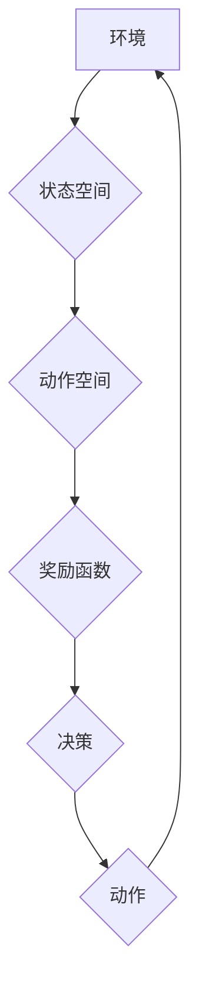

## AI人工智能 Agent：环境建模与模拟

> 关键词：人工智能 Agent, 环境建模, 模拟, 强化学习, 决策理论, 状态空间, 奖励函数, Markov决策过程

### 1. 背景介绍

人工智能 (AI) 领域近年来取得了飞速发展，其中，人工智能 Agent 在智能系统设计和应用中扮演着越来越重要的角色。AI Agent 是能够感知环境、做出决策并与环境交互的智能体。为了让 AI Agent 能够有效地学习和执行任务，环境建模与模拟成为至关重要的环节。

环境建模是指构建一个数学模型来描述环境的结构、行为和动态特性。模拟则是利用环境模型来生成虚拟环境，以便 AI Agent 在其中进行训练和测试。通过环境建模与模拟，我们可以：

* **提供安全的测试环境:** AI Agent 可以安全地探索和学习，无需担心对真实世界造成损害。
* **控制环境复杂度:** 可以根据需要调整环境的复杂度，以便更好地控制训练难度。
* **重复实验:** 可以重复执行相同的实验，以评估 AI Agent 的性能和稳定性。
* **探索不同策略:** 可以测试不同的策略，以找到最优的决策方案。

### 2. 核心概念与联系

**2.1 核心概念**

* **状态空间:** 环境的当前状态可以被表示为一个状态空间，其中每个状态都代表环境的一种可能的配置。
* **动作空间:** AI Agent 可以执行的一系列动作，例如移动、交互、选择等，构成了动作空间。
* **奖励函数:** 用于评估 AI Agent 在特定状态下执行特定动作的优劣，引导 AI Agent 朝着目标方向学习。
* **Markov决策过程 (MDP):**  MDP 是一个数学框架，用于描述 AI Agent 与环境交互的过程。它包含状态空间、动作空间、奖励函数和转移概率。

**2.2 架构流程图**



**2.3 联系**

环境建模与模拟与 AI Agent 的设计和训练密切相关。通过构建环境模型，我们可以将环境的复杂特性抽象化，并将其转化为 AI Agent 可以理解的数学形式。然后，我们可以利用环境模型进行模拟，为 AI Agent 提供一个安全的和可控的学习环境。

### 3. 核心算法原理 & 具体操作步骤

**3.1 算法原理概述**

强化学习 (RL) 是一种机器学习方法，它通过奖励机制来训练 AI Agent 学习最优的策略。在 RL 算法中，AI Agent 会与环境交互，并根据环境的反馈调整其策略，以最大化累积的奖励。

**3.2 算法步骤详解**

1. **初始化:**  设置初始状态、动作空间、奖励函数和学习率。
2. **环境交互:** AI Agent 从初始状态开始，选择一个动作并执行。
3. **状态转移:** 环境根据 AI Agent 的动作发生状态转移，并返回新的状态和奖励。
4. **策略更新:** AI Agent 使用学习算法更新其策略，以提高在未来状态下获得更高奖励的概率。
5. **重复步骤 2-4:**  重复上述步骤，直到 AI Agent 的策略收敛或达到预设的性能目标。

**3.3 算法优缺点**

* **优点:** 能够学习复杂的任务，无需人工标注数据。
* **缺点:** 训练过程可能很慢，需要大量的环境交互和数据。

**3.4 算法应用领域**

* **机器人控制:**  训练机器人执行复杂的任务，例如导航、抓取和组装。
* **游戏 AI:**  开发能够与人类玩家竞争的游戏 AI。
* **推荐系统:**  根据用户的历史行为推荐个性化的内容。
* **金融交易:**  开发能够自动交易的智能投资系统。

### 4. 数学模型和公式 & 详细讲解 & 举例说明

**4.1 数学模型构建**

MDP 可以用一个四元组 (S, A, R, P) 来表示，其中：

* S: 状态空间
* A: 动作空间
* R: 奖励函数
* P: 转移概率

**4.2 公式推导过程**

* **状态价值函数:**  V(s) 表示状态 s 的价值，即从状态 s 开始执行最优策略的累积奖励期望。
* **动作价值函数:** Q(s, a) 表示在状态 s 执行动作 a 的价值，即从状态 s 执行动作 a 后，按照最优策略执行的累积奖励期望。

**Bellman 方程:**

* V(s) = max_a Q(s, a)
* Q(s, a) = R(s, a) + γ max_a' V(s')

其中，γ 是折扣因子，用于权衡未来奖励的价值。

**4.3 案例分析与讲解**

假设有一个简单的环境，其中 AI Agent 可以选择向上、向下、向左、向右四个动作。每个状态的奖励函数为 0，除了目标状态，目标状态的奖励函数为 1。

我们可以使用 Bellman 方程来计算每个状态的价值函数。通过迭代更新价值函数，最终可以得到 AI Agent 最优的策略，即在每个状态下选择最优的动作。

### 5. 项目实践：代码实例和详细解释说明

**5.1 开发环境搭建**

可以使用 Python 和相关的库来实现环境建模和模拟。例如，OpenAI Gym 是一个流行的强化学习库，提供了一些标准的环境和工具。

**5.2 源代码详细实现**

```python
import gym

# 创建环境
env = gym.make('CartPole-v1')

# 初始化 AI Agent
agent =...

# 训练循环
for episode in range(num_episodes):
    state = env.reset()
    done = False
    while not done:
        # 选择动作
        action = agent.choose_action(state)
        
        # 执行动作
        next_state, reward, done, _ = env.step(action)
        
        # 更新 AI Agent
        agent.update(state, action, reward, next_state, done)
        
        state = next_state

# 测试 AI Agent
env.reset()
while True:
    state = env.reset()
    done = False
    while not done:
        action = agent.choose_action(state)
        state, reward, done, _ = env.step(action)
        env.render()
```

**5.3 代码解读与分析**

* `gym.make('CartPole-v1')`: 创建 CartPole 环境。
* `agent =...`: 初始化 AI Agent，例如使用 Q-learning 算法。
* `agent.choose_action(state)`: AI Agent 根据当前状态选择动作。
* `env.step(action)`: 执行动作，返回下一个状态、奖励、是否结束等信息。
* `agent.update(state, action, reward, next_state, done)`: 更新 AI Agent 的策略。
* `env.render()`: 显示环境状态。

**5.4 运行结果展示**

运行代码后，可以观察到 AI Agent 在 CartPole 环境中学习和执行任务的过程。

### 6. 实际应用场景

**6.1 智能机器人**

* **导航:**  训练机器人自主导航，避开障碍物，到达目标位置。
* **抓取:**  训练机器人抓取和移动物体，例如在仓库或制造业中使用。
* **组装:**  训练机器人完成复杂的产品组装任务。

**6.2 游戏 AI**

* **策略游戏:**  训练 AI 能够在策略游戏中与人类玩家竞争，例如围棋、象棋、Go。
* **动作游戏:**  训练 AI 能够在动作游戏中完成任务，例如玩游戏、打败对手。

**6.3 其他应用场景**

* **推荐系统:**  根据用户的历史行为推荐个性化的内容，例如电影、音乐、商品等。
* **金融交易:**  开发能够自动交易的智能投资系统，根据市场数据和策略进行交易决策。
* **医疗诊断:**  训练 AI 能够辅助医生进行疾病诊断，例如分析医学图像、预测患者病情。

**6.4 未来应用展望**

随着 AI 技术的不断发展，环境建模与模拟将在更多领域得到应用，例如自动驾驶、虚拟现实、增强现实等。

### 7. 工具和资源推荐

**7.1 学习资源推荐**

* **书籍:**
    * Reinforcement Learning: An Introduction by Richard S. Sutton and Andrew G. Barto
    * Deep Reinforcement Learning Hands-On by Maxim Lapan
* **在线课程:**
    * Coursera: Reinforcement Learning Specialization by David Silver
    * Udacity: Deep Reinforcement Learning Nanodegree

**7.2 开发工具推荐**

* **OpenAI Gym:**  一个流行的强化学习库，提供了一些标准的环境和工具。
* **TensorFlow:**  一个开源的机器学习框架，可以用于实现强化学习算法。
* **PyTorch:**  另一个开源的机器学习框架，也支持强化学习。

**7.3 相关论文推荐**

* Deep Q-Network (DQN)
* Proximal Policy Optimization (PPO)
* Trust Region Policy Optimization (TRPO)

### 8. 总结：未来发展趋势与挑战

**8.1 研究成果总结**

近年来，环境建模与模拟在 AI 研究中取得了显著进展，例如：

* **深度强化学习:**  利用深度神经网络提高 AI Agent 的学习能力。
* **模拟环境生成:**  使用生成对抗网络 (GAN) 等方法生成更加逼真的模拟环境。
* **迁移学习:**  训练在特定环境下学习的 AI Agent，并将其迁移到其他环境中。

**8.2 未来发展趋势**

* **更加逼真的模拟环境:**  开发更加复杂、更加逼真的模拟环境，以更好地模拟现实世界。
* **更有效的学习算法:**  设计更加高效、更加鲁棒的强化学习算法，以缩短 AI Agent 的训练时间。
* **多智能体强化学习:**  研究多个 AI Agent 在同一个环境中交互和合作学习的算法。

**8.3 面临的挑战**

* **环境建模的复杂性:**  现实世界非常复杂，构建一个能够准确地模拟现实世界的环境模型仍然是一个挑战。
* **数据获取和标注:**  训练强化学习算法需要大量的环境交互数据，获取和标注这些数据成本很高。
* **安全性和可靠性:**  在某些应用场景中，AI Agent 的决策需要具有很高的安全性，例如自动驾驶。

**8.4 研究展望**

环境建模与模拟是 AI 研究的重要方向，未来将继续取得新的进展，推动 AI 技术的进一步发展。


### 9. 附录：常见问题与解答

**9.1 如何选择合适的环境建模方法？**

选择合适的环境建模方法取决于具体的应用场景和环境特性。例如，对于连续状态空间的环境，可以使用神经网络进行建模；对于离散状态空间的环境，可以使用状态转移矩阵进行建模。

**9.2 如何评估环境模型的质量？**

可以使用各种指标来评估环境模型的质量，例如准确率、覆盖率、鲁棒性等。

**9.3 如何提高 AI Agent 的学习效率？**

可以使用一些技巧来提高 AI Agent 的学习效率，例如：

* 使用经验回放 (Experience Replay) 技术，将历史数据存储起来并随机采样。
* 使用目标网络 (Target Network) 技术，使用一个独立的网络来预测目标奖励，以减少训练过程中的震荡。
* 使用异步更新 (Asynchronous Updates) 技术，多个 Agent 可以同时更新其策略。


作者：禅与计算机程序设计艺术 / Zen and the Art of Computer Programming 
