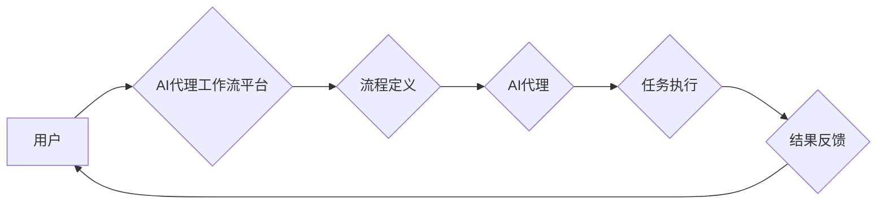

## AI人工智能代理工作流AI Agent WorkFlow：代理工作流的可视化与用户交互设计

> 关键词：人工智能代理、工作流自动化、可视化设计、用户交互、流程建模

## 1. 背景介绍

随着人工智能技术的飞速发展，自动化已经成为各行各业的热门话题。在工作流程管理领域，人工智能代理（AI Agent）的工作流自动化展现出巨大的潜力。AI代理能够理解和执行复杂的业务流程，并根据环境变化智能调整执行策略，从而提高工作效率、降低成本，并释放人力资源用于更具创造性和战略性的工作。

然而，传统的AI代理工作流设计往往依赖于复杂的代码和技术，难以被非技术人员理解和操作。这限制了AI代理工作流的普及和应用。为了解决这一问题，我们需要开发一种更加直观、易用、可视化的AI代理工作流设计平台，让非技术人员也能轻松构建和管理AI代理工作流。

## 2. 核心概念与联系

### 2.1 AI代理

AI代理是一种能够自主执行任务的软件实体，它具备以下特征：

* **自主性:** AI代理能够根据预设的目标和规则，独立完成任务，无需人工干预。
* **智能性:** AI代理能够利用机器学习、自然语言处理等人工智能技术，理解环境信息，并做出最优决策。
* **可交互性:** AI代理能够与用户、其他系统和设备进行交互，获取信息和反馈。

### 2.2 工作流自动化

工作流自动化是指利用软件工具自动执行一系列预定义的业务流程，提高工作效率和准确性。工作流通常由多个任务组成，每个任务之间存在一定的依赖关系。

### 2.3 可视化设计

可视化设计是指利用图形界面和图表等视觉元素，直观地展示和编辑复杂的信息和流程。可视化设计能够帮助用户更容易理解和操作复杂系统。

**AI代理工作流的架构**



## 3. 核心算法原理 & 具体操作步骤

### 3.1 算法原理概述

AI代理工作流的实现主要依赖于以下核心算法：

* **流程建模:** 将业务流程抽象成可视化的流程图，定义任务、条件和数据流。
* **任务调度:** 根据流程图和当前环境信息，智能调度AI代理执行任务。
* **状态管理:** 跟踪AI代理执行任务的状态，并根据状态变化调整执行策略。
* **决策引擎:** 利用机器学习算法，帮助AI代理根据环境信息做出最优决策。

### 3.2 算法步骤详解

1. **流程定义:** 用户通过可视化工具定义业务流程，包括任务、条件、数据流等。
2. **AI代理配置:** 用户配置AI代理的类型、能力和参数，例如数据处理能力、决策策略等。
3. **任务调度:** 平台根据流程图和当前环境信息，调度AI代理执行任务。
4. **任务执行:** AI代理执行任务，并根据任务结果更新状态。
5. **状态管理:** 平台跟踪AI代理执行任务的状态，并根据状态变化调整执行策略。
6. **决策引擎:** 当AI代理遇到决策点时，决策引擎会利用机器学习算法，根据环境信息和历史数据，帮助AI代理做出最优决策。
7. **结果反馈:** AI代理完成任务后，将结果反馈给平台，并更新流程状态。

### 3.3 算法优缺点

**优点:**

* **自动化程度高:** 可以自动执行复杂的业务流程，提高工作效率。
* **智能化程度高:** 可以根据环境变化智能调整执行策略，提高工作质量。
* **可扩展性强:** 可以根据需要添加新的任务和功能，满足不断变化的业务需求。

**缺点:**

* **开发成本高:** 需要专业的技术人员进行开发和维护。
* **部署难度高:** 需要部署和维护复杂的软件系统。
* **安全性问题:** AI代理需要访问和处理敏感数据，需要做好安全防护措施。

### 3.4 算法应用领域

AI代理工作流的应用领域非常广泛，例如：

* **金融行业:** 自动化贷款审批、理财咨询、风险管理等。
* **医疗行业:** 自动化病历录入、预约挂号、药品配送等。
* **制造业:** 自动化生产调度、质量控制、设备维护等。
* **电商行业:** 自动化订单处理、客服服务、商品推荐等。

## 4. 数学模型和公式 & 详细讲解 & 举例说明

### 4.1 数学模型构建

AI代理工作流可以抽象为一个状态机模型，其中每个状态代表一个任务或流程阶段，每个状态之间通过转移函数连接。转移函数根据当前状态和环境信息决定下一个状态。

**状态机模型:**

```
状态 = {状态1, 状态2,..., 状态n}
转移函数 = f(状态, 环境信息)
```

### 4.2 公式推导过程

**决策引擎:**

决策引擎通常使用机器学习算法，例如决策树、支持向量机、神经网络等，根据历史数据和当前环境信息预测最优决策。

**决策树算法:**

决策树算法通过构建一棵树状结构，将决策过程分解成一系列的判断条件。每个节点代表一个判断条件，每个分支代表一个可能的决策结果。

**公式:**

```
决策 = argmax(P(结果|状态, 环境信息))
```

其中，P(结果|状态, 环境信息)表示在给定状态和环境信息下，每个决策结果出现的概率。

### 4.3 案例分析与讲解

**案例:**

假设一个AI代理工作流用于自动处理客户投诉。

**状态机模型:**

* 状态1: 接收投诉
* 状态2: 识别投诉类型
* 状态3: 分配客服人员
* 状态4: 处理投诉
* 状态5: 关闭投诉

**决策引擎:**

决策引擎可以根据客户投诉的类型、历史数据和客服人员的技能，预测最合适的客服人员。

**公式:**

```
客服人员 = argmax(P(处理成功|投诉类型, 客服人员技能))
```

## 5. 项目实践：代码实例和详细解释说明

### 5.1 开发环境搭建

* 操作系统: Ubuntu 20.04
* 编程语言: Python 3.8
* 开发工具: VS Code
* 库依赖:

```
pip install flask
pip install numpy
pip install pandas
pip install scikit-learn
```

### 5.2 源代码详细实现

```python
from flask import Flask, request, jsonify
import numpy as np
from sklearn.tree import DecisionTreeClassifier

app = Flask(__name__)

# 加载训练数据
data = np.loadtxt("complaint_data.csv", delimiter=",")
X = data[:, :-1]
y = data[:, -1]

# 训练决策树模型
model = DecisionTreeClassifier()
model.fit(X, y)

@app.route('/predict', methods=['POST'])
def predict():
    # 获取客户投诉信息
    complaint_info = request.get_json()

    # 预测最合适的客服人员
    prediction = model.predict([complaint_info])

    # 返回预测结果
    return jsonify({'prediction': prediction[0]})

if __name__ == '__main__':
    app.run(debug=True)
```

### 5.3 代码解读与分析

* **数据加载:** 代码首先加载训练数据，并将其转换为NumPy数组。
* **模型训练:** 使用Scikit-learn库中的决策树算法训练模型。
* **API接口:** 定义一个`/predict`接口，接收客户投诉信息，并使用训练好的模型预测最合适的客服人员。
* **结果返回:** 返回预测结果作为JSON格式的数据。

### 5.4 运行结果展示

运行代码后，可以访问`http://127.0.0.1:5000/predict`接口，发送客户投诉信息，获取预测结果。

## 6. 实际应用场景

### 6.1 案例分析

**电商平台客服自动化:**

电商平台每天都会收到大量的客户咨询和投诉。使用AI代理工作流可以自动处理这些咨询和投诉，例如：

* 自动识别客户问题类型
* 自动匹配合适的客服人员
* 自动回复常见问题
* 自动转接人工客服

这可以大大提高客服效率，降低客户等待时间，提升客户满意度。

### 6.2 未来应用展望

AI代理工作流的应用场景非常广泛，未来将会在更多领域得到应用，例如：

* **智能家居:** 自动化家居设备控制、场景配置、故障诊断等。
* **自动驾驶:** 自动化驾驶决策、路径规划、障碍物避让等。
* **医疗诊断:** 自动化病历分析、辅助诊断、个性化治疗方案推荐等。

## 7. 工具和资源推荐

### 7.1 学习资源推荐

* **书籍:**

    * 《人工智能：一种现代方法》
    * 《机器学习》
    * 《深度学习》

* **在线课程:**

    * Coursera: 人工智能课程
    * edX: 机器学习课程
    * Udacity: 深度学习课程

### 7.2 开发工具推荐

* **流程建模工具:**

    * BPMN.io
    * Draw.io
    * Lucidchart

* **AI代理平台:**

    * Amazon Lex
    * Google Dialogflow
    * Microsoft Bot Framework

### 7.3 相关论文推荐

* **代理工作流:**

    * "A Survey of Agent Workflow Systems"
    * "Agent-Based Workflow Systems: A Survey"

* **AI代理:**

    * "Multi-Agent Systems: A Modern Approach to Distributed Artificial Intelligence"
    * "Intelligent Agents: Theory and Practice"

## 8. 总结：未来发展趋势与挑战

### 8.1 研究成果总结

AI代理工作流技术已经取得了显著的进展，能够有效地自动化复杂业务流程，提高工作效率和智能化程度。

### 8.2 未来发展趋势

* **更强大的AI能力:** 未来AI代理将拥有更强大的AI能力，例如更精准的决策、更自然的交互、更强的学习能力。
* **更广泛的应用场景:** AI代理工作流将应用于更多领域，例如智能家居、自动驾驶、医疗诊断等。
* **更易于使用的平台:** 未来AI代理工作流平台将更加易于使用，即使是普通用户也能轻松构建和管理AI代理工作流。

### 8.3 面临的挑战

* **数据安全:** AI代理需要访问和处理大量数据，数据安全是一个重要的挑战。
* **算法可解释性:** 许多AI算法是黑箱模型，难以解释其决策过程，这可能会导致信任问题。
* **伦理问题:** AI代理的决策可能会影响人类的利益，需要考虑伦理问题。

### 8.4 研究展望

未来研究方向包括：

* 开发更安全、更可靠、更可解释的AI算法。
* 研究AI代理与人类协作的新模式。
* 探索AI代理在社会和经济发展中的应用潜力。

## 9. 附录：常见问题与解答

**常见问题:**

* **AI代理工作流的开发成本高吗？**

答: AI代理工作流的开发成本取决于项目复杂度和规模。对于简单的项目，可以使用现成的平台和工具，降低开发成本。

* **AI代理工作流的安全性如何保证？**

答: AI代理工作流需要采取多种安全措施，例如数据加密、身份验证、访问控制等，确保数据安全和系统安全。

* **AI代理工作流的决策是否可靠？**

答: AI代理工作流的决策可靠性取决于训练数据的质量和算法的性能。需要不断收集和完善训练数据，并选择合适的算法，才能保证决策的准确性和可靠性。


作者：禅与