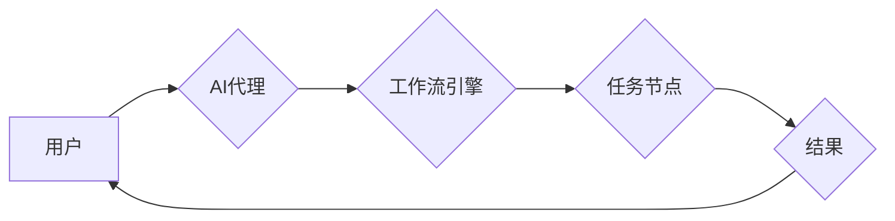

## AI人工智能代理工作流AI Agent WorkFlow：自主行为与规划策略在AI中的运用

> 关键词：人工智能代理、工作流、自主行为、规划策略、机器学习、强化学习、自然语言处理

## 1. 背景介绍

随着人工智能技术的飞速发展，智能代理在各个领域展现出巨大的潜力。智能代理是指能够感知环境、做出决策并执行行动的软件实体。它们可以自动执行任务、提供个性化服务、优化流程，甚至与人类进行交互。

传统的代理系统通常依赖于预先定义的规则和脚本，缺乏灵活性。而现代人工智能代理则通过机器学习、强化学习等技术，能够从数据中学习，不断优化行为策略，实现更智能、更自主的行动。

工作流管理是企业流程自动化和管理的重要手段。传统的基于规则的工作流系统难以应对复杂、动态变化的业务场景。而将人工智能代理融入工作流系统，可以赋予工作流更强的智能化和适应性。

## 2. 核心概念与联系

**2.1 智能代理**

智能代理是一个能够感知环境、做出决策并执行行动的软件实体。它通常具有以下特征：

* **自主性:** 代理能够独立地执行任务，无需人工干预。
* **目标导向:** 代理的行为旨在实现预定义的目标。
* **感知能力:** 代理能够感知环境中的信息，例如数据、事件等。
* **决策能力:** 代理能够根据感知到的信息做出决策。
* **行动能力:** 代理能够执行决策，改变环境状态。

**2.2 工作流**

工作流是一个描述业务流程的模型，它定义了任务的顺序、依赖关系和执行规则。工作流系统可以自动执行工作流，提高效率和准确性。

**2.3 AI代理工作流**

AI代理工作流是指将智能代理融入工作流系统，赋予工作流更强的智能化和适应性。AI代理可以自动执行工作流中的任务，根据环境变化调整执行策略，并与人类交互，提供更智能化的服务。

**2.4 架构图**



## 3. 核心算法原理 & 具体操作步骤

**3.1 算法原理概述**

AI代理工作流的核心算法通常基于机器学习和强化学习。

* **机器学习:** AI代理可以利用机器学习算法从历史数据中学习工作流执行策略，例如预测任务执行时间、识别任务依赖关系等。
* **强化学习:** AI代理可以利用强化学习算法在模拟环境中训练行为策略，通过奖励和惩罚机制不断优化执行策略，使其在实际工作流中更有效率。

**3.2 算法步骤详解**

1. **环境建模:** 建立工作流环境模型，包括任务节点、数据流、执行规则等。
2. **状态表示:** 将工作流状态表示为机器学习模型可以理解的格式，例如向量或图结构。
3. **策略学习:** 利用机器学习或强化学习算法训练AI代理的策略模型，使其能够根据当前状态做出最优决策。
4. **决策执行:** AI代理根据策略模型的预测，选择执行相应的任务节点。
5. **反馈收集:** 收集工作流执行结果作为反馈，用于更新策略模型。

**3.3 算法优缺点**

* **优点:**
    * 自动化执行工作流，提高效率和准确性。
    * 适应性强，能够根据环境变化调整执行策略。
    * 可学习和优化，不断提升执行效率。
* **缺点:**
    * 需要大量数据进行训练，训练成本较高。
    * 算法复杂度高，需要专业的技术人员进行开发和维护。
    * 存在黑盒问题，难以解释AI代理的决策过程。

**3.4 算法应用领域**

* **业务流程自动化:** 自动化审批流程、订单处理流程等。
* **客户服务:** 自动化客服机器人，提供智能化客户服务。
* **数据分析:** 自动化数据处理、分析和报告生成。
* **医疗保健:** 自动化病历分析、诊断辅助等。

## 4. 数学模型和公式 & 详细讲解 & 举例说明

**4.1 数学模型构建**

我们可以用马尔可夫决策过程 (MDP) 来建模AI代理工作流。

* **状态空间:** 工作流的当前状态，例如任务执行进度、数据流状态等。
* **动作空间:** AI代理可以执行的动作，例如执行任务节点、修改数据流等。
* **转移概率:** 从一个状态到另一个状态的概率，取决于执行的动作。
* **奖励函数:** 评估AI代理行为的好坏，例如完成任务的奖励、错误的惩罚等。

**4.2 公式推导过程**

MDP的目标是找到一个最优策略，使得AI代理在长期的交互过程中获得最大的总奖励。最优策略可以通过动态规划或强化学习算法来求解。

* **Bellman方程:** 描述了最优价值函数的递推关系。
* **Q-学习:** 一种强化学习算法，通过迭代更新Q值表来学习最优策略。

**4.3 案例分析与讲解**

假设一个简单的AI代理工作流，用于处理客户订单。

* **状态空间:** 订单状态 (未处理、处理中、已完成)。
* **动作空间:** 执行任务节点 (接收订单、检查库存、打包发货)。
* **转移概率:** 根据任务执行结果和系统规则确定。
* **奖励函数:** 完成订单获得奖励，错误操作惩罚。

通过Q-学习算法，AI代理可以学习到最优的执行策略，例如优先处理库存充足的订单，避免错误操作导致的惩罚。

## 5. 项目实践：代码实例和详细解释说明

**5.1 开发环境搭建**

* Python 3.x
* TensorFlow 或 PyTorch
* 其他必要的库，例如 NumPy、Pandas 等

**5.2 源代码详细实现**

```python
# 使用TensorFlow实现简单的Q-learning算法

import tensorflow as tf

# 定义状态空间和动作空间
state_size = 3
action_size = 3

# 定义Q网络
model = tf.keras.Sequential([
    tf.keras.layers.Dense(64, activation='relu', input_shape=(state_size,)),
    tf.keras.layers.Dense(action_size)
])

# 定义损失函数和优化器
optimizer = tf.keras.optimizers.Adam()
loss_fn = tf.keras.losses.MeanSquaredError()

# 训练循环
for episode in range(num_episodes):
    state = env.reset()
    done = False
    while not done:
        # 选择动作
        action = tf.argmax(model(tf.expand_dims(state, axis=0))).numpy()[0]

        # 执行动作并获取奖励和下一个状态
        next_state, reward, done, _ = env.step(action)

        # 更新Q值
        with tf.GradientTape() as tape:
            q_values = model(tf.expand_dims(state, axis=0))
            target_q_value = reward + gamma * tf.reduce_max(model(tf.expand_dims(next_state, axis=0)))
            loss = loss_fn(target_q_value, q_values[0, action])
        gradients = tape.gradient(loss, model.trainable_variables)
        optimizer.apply_gradients(zip(gradients, model.trainable_variables))

        state = next_state

# 保存训练好的模型
model.save('trained_model.h5')
```

**5.3 代码解读与分析**

* 代码使用TensorFlow框架实现了一个简单的Q-learning算法。
* 首先定义了状态空间和动作空间。
* 然后构建了一个Q网络，用于预测每个状态下每个动作的Q值。
* 使用Adam优化器和均方误差损失函数训练Q网络。
* 训练循环中，AI代理根据当前状态选择动作，执行动作并获取奖励和下一个状态，然后更新Q值。
* 最后保存训练好的模型。

**5.4 运行结果展示**

训练好的模型可以用于预测工作流中不同状态下不同动作的Q值，从而指导AI代理做出最优决策。

## 6. 实际应用场景

**6.1 业务流程自动化**

AI代理工作流可以自动执行各种业务流程，例如：

* **审批流程:** 自动审批申请，根据规则和历史数据判断审批结果。
* **订单处理流程:** 自动接收订单、检查库存、安排发货等。
* **合同管理流程:** 自动生成合同、跟踪合同执行情况等。

**6.2 客户服务**

AI代理工作流可以构建智能客服机器人，提供24小时在线服务，例如：

* **问答服务:** 回答客户常见问题，例如产品信息、订单状态等。
* **故障排查:** 根据客户描述，自动排查故障原因并提供解决方案。
* **预约服务:** 帮助客户预约服务，例如维修、咨询等。

**6.3 数据分析**

AI代理工作流可以自动执行数据分析任务，例如：

* **数据清洗:** 自动识别和处理数据中的错误和缺失值。
* **数据分析:** 自动执行数据分析，例如统计、聚类、预测等。
* **报告生成:** 自动生成数据分析报告，并进行可视化展示。

**6.4 未来应用展望**

随着人工智能技术的不断发展，AI代理工作流将在更多领域得到应用，例如：

* **医疗保健:** 自动化病历分析、诊断辅助、药物研发等。
* **教育:** 个性化学习辅导、自动批改作业等。
* **金融:** 风险评估、欺诈检测、投资决策等。

## 7. 工具和资源推荐

**7.1 学习资源推荐**

* **书籍:**
    * 《Reinforcement Learning: An Introduction》 by Sutton and Barto
    * 《Deep Learning》 by Goodfellow, Bengio, and Courville
* **在线课程:**
    * Coursera: Reinforcement Learning Specialization
    * Udacity: Deep Learning Nanodegree
* **博客和网站:**
    * OpenAI Blog
    * DeepMind Blog

**7.2 开发工具推荐**

* **TensorFlow:** 开源深度学习框架
* **PyTorch:** 开源深度学习框架
* **Keras:** 高级深度学习API
* **Gym:** 强化学习环境库

**7.3 相关论文推荐**

* **Deep Reinforcement Learning with Double Q-learning**
* **Proximal Policy Optimization Algorithms**
* **Asynchronous Methods for Deep Reinforcement Learning**

## 8. 总结：未来发展趋势与挑战

**8.1 研究成果总结**

AI代理工作流是一个新兴的研究领域，取得了显著的进展。

* **算法方面:** 强化学习算法在AI代理工作流中的应用取得了成功，例如Q-learning、SARSA、Deep Q-Network等。
* **应用方面:** AI代理工作流已在多个领域得到应用，例如业务流程自动化、客户服务、数据分析等。

**8.2 未来发展趋势**

* **更强大的算法:** 研究更强大的强化学习算法，例如基于模型的强化学习、多智能体强化学习等。
* **更复杂的场景:** 将AI代理工作流应用于更复杂的场景，例如多任务、多代理、动态环境等。
* **更强的解释性:** 研究更强的AI代理工作流解释性，使得人类能够更好地理解AI代理的行为决策。

**8.3 面临的挑战**

* **数据获取和标注:** 训练AI代理工作流需要大量数据，获取和标注数据成本较高。
* **算法复杂度:** 强化学习算法的复杂度较高，需要专业的技术人员进行开发和维护。
* **安全性和可靠性:** AI代理工作流需要保证安全性和可靠性，避免出现错误决策导致的负面影响。

**8.4 研究展望**

